> 导航：[总目录](../../../README.md) · [documentation](../../../_indexes/documentation.md) · [QuickTime File Format Specification](Introduction%20to%20QuickTime%20File%20Format%20Specification.md)


[Next](Metadata.md)[Previous](Overview%20of%20QTFF.md)

# Movie Atoms

This chapter provides a general introduction to QuickTime movie atoms, as well as specific details on the layout and usage of these atoms. Each atom type discussed in this chapter is shown with an accompanying illustration that contains offset information, followed by field descriptions.

This chapter is divided into the following major sections:

- [Overview of Movie Atoms](#apple-f4xwc4dqnrsv64tfmyxwi33df52wszbpkridimbqgaydsmzzfvbuqmrqgqwtknjsgy2q) discusses QuickTime movie atoms, which act as containers for information that describes a movie’s data. A conceptual illustration is provided that shows the organization of a simple, one-track QuickTime movie. Color table atoms and user data atoms are also discussed.
- [Track Atoms](#apple-f4xwc4dqnrsv64tfmyxwi33df52wszbpkridimbqgaydsmzzfvbuqmrqgqwtgmzshe4q) describes track atoms, which define a single track of a movie. Track user data atoms and hint tracks are also discussed.
- [Media Atoms](#apple-f4xwc4dqnrsv64tfmyxwi33df52wszbpkridimbqgaydsmzzfvbuqmrqgqwtgmztgazq) discusses media atoms, which define a track’s movie data, such as the media type and media time scale.
- [Sample Atoms](#apple-f4xwc4dqnrsv64tfmyxwi33df52wszbpkridimbqgaydsmzzfvbuqmrqgqwtgmztga3q) discusses sample table atoms, which specify where media samples are located, their duration, and so on. The section also includes examples of how you use these atoms.

  __Note:__ Media atoms and sample atoms do _not_ contain actual sample data, such as video frames or audio samples. They contain metadata used to locate and interpret such samples.
- [Compressed Movie Resources](#apple-f4xwc4dqnrsv64tfmyxwi33df52wszbpkridimbqgaydsmzzfvbuqmrqgqwtgmztgezq) discusses compressed movie resources, in which a lossless compression algorithm is used to compress the contents of the movie atom, including any track, media, or sample atoms. The contents must be decompressed before the movie atom can be parsed.
- [Reference Movies](#apple-f4xwc4dqnrsv64tfmyxwi33df52wszbpkridimbqgaydsmzzfvbuqmrqgqwtenjxgu3a) discusses movies that contain a reference movie atom (a list of references to alternate movies, as well as the criteria for selecting the correct movie from a list of alternates). Movie atoms that contain a reference movie atom do not necessarily contain track, media, or sample atoms.

## Overview of Movie Atoms

QuickTime movie atoms have an atom type of `'moov'`. These atoms act as a container for the information that describes a movie’s data. This information, or metadata, is stored in a number of different types of atoms. Generally speaking, only metadata is stored in a movie atom. Sample data for the movie, such as audio or video samples, are referenced in the movie atom, but are not contained in it.

The movie atom is essentially a container of other atoms. These atoms, taken together, describe the contents of a movie. At the highest level, movie atoms typically contain track atoms, which in turn contain media atoms. At the lowest level are the leaf atoms, which contain non-atom data, usually in the form of a table or a set of data elements. For example, a track atom contains an edit atom, which in turn contains an _edit list atom_, a leaf atom which contains data in the form of an edit list table. All of these atoms are discussed later in this document.

[Figure 2-1](#apple-f4xwc4dqnrsv64tfmyxwi33df52wszbpkridimbqgaydsmzzfvbuqmrqgqwtknjzgaya) provides a conceptual view of the organization of a simple, one-track QuickTime movie. Each nested box in the illustration represents an atom that belongs to its parent atom. The figure does not show the data regions of any of the atoms. These areas are described in the sections that follow.

Note that this figure shows the organization of a standard movie atom. It is possible to compress the movie metadata using a lossless compression algorithm. In such cases, the movie atom contains only a single child atom—the compressed movie atom (`'cmov'`). When this child atom is uncompressed, its contents conform to the structure shown in the following illustration. For details, see [Compressed Movie Resources](#apple-f4xwc4dqnrsv64tfmyxwi33df52wszbpkridimbqgaydsmzzfvbuqmrqgqwtgmztgezq)

It is also possible to create a reference movie, a movie that refers to other movies; in this case the movie atom may contain only a reference movie atom (`'rmra'`). For details, see “Reference Movies”. Ultimately, the chain must end in either a standard movie atom, such as the one in [Figure 2-1](#apple-f4xwc4dqnrsv64tfmyxwi33df52wszbpkridimbqgaydsmzzfvbuqmrqgqwtknjzgaya), or a compressed movie atom, which can be uncompressed to obtain the same structure.

__Figure 2-1__  Sample organization of a one-track video movie

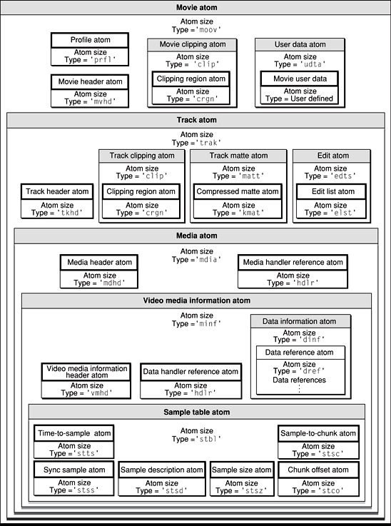

__Note:__ Additional atoms may be present in a one-track QuickTime movie file that do not appear in [Figure 2-1](#apple-f4xwc4dqnrsv64tfmyxwi33df52wszbpkridimbqgaydsmzzfvbuqmrqgqwtknjzgaya).

### The Movie Atom

You use movie atoms to specify the information that defines a movie—that is, the information that allows your application to interpret the sample data that is stored elsewhere. The movie atom usually contains a movie header atom, which defines the time scale and duration information for the entire movie, as well as its display characteristics. Existing movies may contain a movie profile atom, which summarizes the main features of the movie, such as the necessary codecs and maximum bit rate. In addition, the movie atom contains a track atom for each track in the movie.

The movie atom has an atom type of `'moov'`. It contains other types of atoms, including at least one of three possible atoms—the movie header atom (`'mvhd'`), the compressed movie atom (`'cmov'`), or a reference movie atom (`'rmra'`). An uncompressed movie atom can contain both a movie header atom and a reference movie atom, but it must contain at least one of the two. It can also contain several other atoms, such as a clipping atom (`'clip'`), one or more track atoms (`'trak'`), a color table atom (`'ctab'`), and a user data atom (`'udta'`).

Compressed movie atoms and reference movie atoms are discussed separately. This section describes normal uncompressed movie atoms.

[Figure 2-2](#apple-f4xwc4dqnrsv64tfmyxwi33df52wszbpkridimbqgaydsmzzfvbuqmrqgqwtgmrzgqzq) shows the layout of a typical movie atom.

__Note:__ As previously mentioned, leaf atoms are shown as white boxes, while container atoms are shown as gray boxes.

__Figure 2-2__  The layout of a movie atom

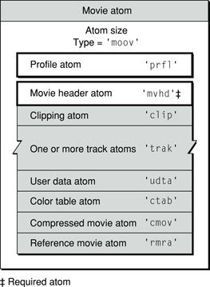

A movie atom may contain the following fields:

**Size**
: The number of bytes in this movie atom.

**Type**
: The type of this movie atom; this field must be set to `'moov'`.

**Profile atom**
: See [The Movie Profile Atom](#apple-f4xwc4dqnrsv64tfmyxwi33df52wszbpkridimbqgaydsmzzfvbuqmrqgqwtknbzgq4a) for more information.

**Movie header atom**
: See [Movie Header Atoms](#apple-f4xwc4dqnrsv64tfmyxwi33df52wszbpkridimbqgaydsmzzfvbuqmrqgqwtknrtgezq) for more information.

**Movie clipping atom**
: See [Clipping Atoms](#apple-f4xwc4dqnrsv64tfmyxwi33df52wszbpkridimbqgaydsmzzfvbuqmrqgqwtenjvgu3a) for more information.

**Track atoms**
: See [Track Atoms](#apple-f4xwc4dqnrsv64tfmyxwi33df52wszbpkridimbqgaydsmzzfvbuqmrqgqwtgmzshe4q) for details on track atoms and their associated atoms.

**User data atom**
: See [User Data Atoms](#apple-f4xwc4dqnrsv64tfmyxwi33df52wszbpkridimbqgaydsmzzfvbuqmrqgqwtenjvgm4a) for more information about user data atoms.

**Color table atom**
: See [Color Table Atoms](#apple-f4xwc4dqnrsv64tfmyxwi33df52wszbpkridimbqgaydsmzzfvbuqmrqgqwtenjvgmzq) for a discussion of the color table atom.

**Compressed movie atom**
: See [Compressed Movie Resources](#apple-f4xwc4dqnrsv64tfmyxwi33df52wszbpkridimbqgaydsmzzfvbuqmrqgqwtgmztgezq) for a discussion of compressed movie atoms.

**Reference movie atom**
: See [Reference Movies](#apple-f4xwc4dqnrsv64tfmyxwi33df52wszbpkridimbqgaydsmzzfvbuqmrqgqwtenjxgu3a) for a discussion of reference movie atoms.

### The Movie Profile Atom

__Note:__ Profile atoms are deprecated in the QuickTime file format. The information that follows is intended to document existing content containing profile atoms and should not be used for new development.

The movie profile atom summarizes the features and complexity of a movie, such as the required codecs and maximum bit rate, in order to help player applications or devices quickly determine whether they have the necessary resources to play the movie.

Features for a movie typically include the movie’s maximum video and audio bit rate, a list of audio and video codec types, the movie’s video dimensions, and any applicable MPEG-4 profiles and levels. This is all information that can also be obtained by examining the contents of the movie file in more detail. This summary is intended to allow applications or devices to quickly determine whether they can play the movie. It is not intended as a container for information that is not found elsewhere in the movie, and should not be used as one.

__Note:__ The fact that a feature does not appear in the profile atom does not mean it is not present in the movie. The profile atom itself may not be present, or may list only a subset of movie features. The features listed in the profile atom are all present, but the list is not necessarily complete.

When creating a profile atom, it is permissible to omit some features that are present in the movie, but it is required to fully specify any features that are included in the profile. For example, a movie containing video may or may not have a video codec type feature in the profile atom, but if any video codec type feature is included in the profile atom, every required video codec must be listed in the profile atom.

The movie profile atom is a profile atom (`'prfl'`) whose parent is a movie atom. This is distinct from the track profile atom, whose parent is a track atom. The structure of the profile atom is identical in both cases, but the contents of a movie profile atom describe the movie as a whole, while the contents of a track profile atom are specific to a particular track.

The profile atom contains a list of features. In a movie profile atom, these features summarize the movie as a whole. In a track profile atom, these features describe a particular track.

Each entry in the feature list consists of four 32-bit fields:

- The first field is reserved and must be set to zero.
- The second field is the part-ID, which defines the feature as being either brand-specific or universal. Brand-specific features are particular to a specific brand. Universal features are can be found in any file type that uses the profile atom. Universal features have a part-ID of four ASCII spaces (0x20202020). Brand-specific features have a part-ID that is one of the Compatible_Brand codes for that file type, as specified in the file type atom (`'ftyp'`). For example, the part-ID for QuickTime-specific features is `'qt  '`. All features described in this document, however, are universal.
- The third field is the feature code, or name, a 32-bit unsigned integer that is usually best interpreted as four ASCII characters. Example: the maximum video bit rate feature has a feature code or name of `'mvbr'`. It is permissible to use a feature code value of zero (0x00000000, _not_ four ASCII zero characters) as a placeholder in one or more name-value pairs. The reader should ignore feature codes of value zero.
- The fourth field is the value, which is also a 32-bit field. The value may be a signed or unsigned integer, or a fixed-point value, or contain subfields, or consist of a packed array; it can be interpreted only in relation to the specific feature.

For details on the structure and contents of profile atoms, see [Profile Atom Guidelines](Profile%20Atom%20Guidelines.md#apple-f4xwc4dqnrsv64tfmyxwi33df52wszbpkridimbqgaydsmzzfvbuqmrsgywvgvzr).

### Movie Header Atoms

You use the movie header atom to specify the characteristics of an entire QuickTime movie. The data contained in this atom defines characteristics of the entire QuickTime movie, such as time scale and duration. It has an atom type value of `'mvhd'`.

[Figure 2-3](#apple-f4xwc4dqnrsv64tfmyxwi33df52wszbpkridimbqgaydsmzzfvbuqmrqgqwtgmrzgq3q) shows the layout of the movie header atom. The movie header atom is a leaf atom.

__Figure 2-3__  The layout of a movie header atom

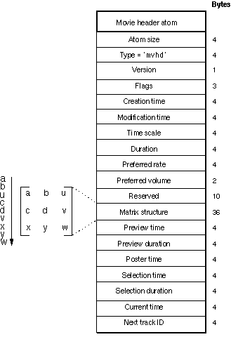

You define a movie header atom by specifying the following data elements.

**Size**
: A 32-bit integer that specifies the number of bytes in this movie header atom.

**Type**
: A 32-bit integer that identifies the atom type; must be set to `'mvhd'`.

**Version**
: A 1-byte specification of the version of this movie header atom.

**Flags**
: Three bytes of space for future movie header flags.

**Creation time**
: A 32-bit integer that specifies the calendar date and time (in seconds since midnight, January 1, 1904) when the movie atom was created. It is strongly recommended that this value should be specified using coordinated universal time (UTC).

**Modification time**
: A 32-bit integer that specifies the calendar date and time (in seconds since midnight, January 1, 1904) when the movie atom was changed. BooleanIt is strongly recommended that this value should be specified using coordinated universal time (UTC).

**Time scale**
: A time value that indicates the time scale for this movie—that is, the number of time units that pass per second in its time coordinate system. A time coordinate system that measures time in sixtieths of a second, for example, has a time scale of 60.

**Duration**
: A time value that indicates the duration of the movie in time scale units. Note that this property is derived from the movie’s tracks. The value of this field corresponds to the duration of the longest track in the movie.

**Preferred rate**
: A 32-bit fixed-point number that specifies the rate at which to play this movie. A value of 1.0 indicates normal rate.

**Preferred volume**
: A 16-bit fixed-point number that specifies how loud to play this movie’s sound. A value of 1.0 indicates full volume.

**Reserved**
: Ten bytes reserved for use by Apple. Set to 0.

**Matrix structure**
: The matrix structure associated with this movie. A matrix shows how to map points from one coordinate space into another. See [Matrices](Basic%20Data%20Types.md#apple-f4xwc4dqnrsv64tfmyxwi33df52wszbpkridimbqgaydsmzzfvbuqmrqgywtcobxgm3q) for a discussion of how display matrices are used in QuickTime.

**Preview time**
: The time value in the movie at which the preview begins.

**Preview duration**
: The duration of the movie preview in movie time scale units.

**Poster time**
: The time value of the time of the movie poster.

**Selection time**
: The time value for the start time of the current selection.

**Selection duration**
: The duration of the current selection in movie time scale units.

**Current time**
: The time value for current time position within the movie.

**Next track ID**
: A 32-bit integer that indicates a value to use for the track ID number of the next track added to this movie. Note that 0 is not a valid track ID value.

__Note:__ The creation and modification date should be set using coordinated universal time (UTC). In prior versions of the QuickTime file format, this was not specified, and these fields were commonly set to local time for the time zone where the movie was created.

### Color Table Atoms

Color table atoms define a list of preferred colors for displaying the movie on devices that support only 256 colors. The list may contain up to 256 colors. These optional atoms have a type value of `'ctab'`. The color table atom contains a Macintosh color table data structure.

[Figure 2-4](#apple-f4xwc4dqnrsv64tfmyxwi33df52wszbpkridimbqgaydsmzzfvbuqmrqgqwtgmrzguyq) shows the layout of the color table atom.

__Figure 2-4__  The layout of a color table atom

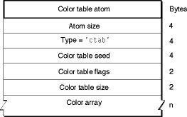

The color table atom contains the following data elements.

**Size**
: A 32-bit integer that specifies the number of bytes in this color table atom.

**Type**
: A 32-bit integer that identifies the atom type; this field must be set to `'ctab'`.

**Color table seed**
: A 32-bit integer that must be set to 0.

**Color table flags**
: A 16-bit integer that must be set to 0x8000.

**Color table size**
: A 16-bit integer that indicates the number of colors in the following color array. This is a zero-relative value; setting this field to 0 means that there is one color in the array.

**Color array**
: An array of colors. Each color is made of four unsigned 16-bit integers. The first integer must be set to 0, the second is the red value, the third is the green value, and the fourth is the blue value.

### User Data Atoms

User data atoms allow you to define and store data associated with a QuickTime object, such as a movie `'moov'`, track `'trak'`, or media `'mdia'`. This includes both information that QuickTime looks for, such as copyright information or whether a movie should loop, and arbitrary information—provided by and for your application—that QuickTime simply ignores.

A user data atom whose immediate parent is a movie atom contains data relevant to the movie as a whole. A user data atom whose parent is a track atom contains information relevant to that specific track. A QuickTime movie file may contain many user data atoms, but only one user data atom is allowed as the immediate child of any given movie atom or track atom.

The user data atom has an atom type of `'udta'`. Inside the user data atom is a list of atoms describing each piece of user data. User data provides a simple way to extend the information stored in a QuickTime movie. For example, user data atoms can store a movie’s window position, playback characteristics, or creation information.

This section describes the data atoms that QuickTime recognizes. You may create new data atom types that your own application recognizes. Applications should ignore any data atom types that they do not recognize.

[Figure 2-5](#apple-f4xwc4dqnrsv64tfmyxwi33df52wszbpkridimbqgaydsmzzfvbuqmrqgqwtgmrzgu2q) shows the layout of a user data atom.

__Figure 2-5__  The layout of a user data atom

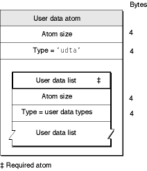

The user data atom contains the following data elements.

**Size**
: A 32-bit integer that specifies the number of bytes in this user data atom.

**Type**
: A 32-bit integer that identifies the atom type; this field must be set to `'udta'`.

**User data list**
: A user data list that is formatted as a series of atoms. Each data element in the user data list contains size and type information along with its payload data. For historical reasons, the data list is optionally terminated by a 32-bit integer set to 0. If you are writing a program to read user data atoms, you should allow for the terminating 0. However, if you are writing a program to create user data atoms, you can safely leave out the terminating 0.

[Table 2-1](#apple-f4xwc4dqnrsv64tfmyxwi33df52wszbpkridimbqgaydsmzzfvbuqmrqgqwtmmzygm4q) lists the currently defined list entry types.

__Table 2-1__  User data list entry types

| List entry type | Description | For Sorting |
| `'©arg'` | Name of arranger |  |
| `'©ark'` | Keywords for arranger | X |
| `'©cok'` | Keywords for composer | X |
| `'©com'` | Name of composer |  |
| `'©cpy'` | Copyright statement |  |
| `'©day'` | Date the movie content was created |  |
| `'©dir'` | Name of movie’s director |  |
| `'©ed1'` to `'©ed9'` | Edit dates and descriptions |  |
| `'©fmt'` | Indication of movie format (computer-generated, digitized, and so on) |  |
| `'©inf'` | Information about the movie |  |
| `'©isr'` | ISRC code |  |
| `'©lab'` | Name of record label |  |
| `'©lal'` | URL of record label |  |
| `'©mak'` | Name of file creator or maker |  |
| `'©mal'` | URL of file creator or maker |  |
| `'©nak'` | Title keywords of the content | X |
| `'©nam'` | Title of the content |  |
| `'©pdk'` | Keywords for producer | X |
| `'©phg'` | Recording copyright statement, normally preceded by the symbol ../art/phono_symbol.gif |  |
| `'©prd'` | Name of producer |  |
| `'©prf'` | Names of performers |  |
| `'©prk'` | Keywords of main artist and performer | X |
| `'©prl'` | URL of main artist and performer |  |
| `'©req'` | Special hardware and software requirements |  |
| `'©snk'` | Subtitle keywords of the content | X |
| `'©snm'` | Subtitle of content |  |
| `'©src'` | Credits for those who provided movie source content |  |
| `'©swf'` | Name of songwriter |  |
| `'©swk'` | Keywords for songwriter | X |
| `'©swr'` | Name and version number of the software (or hardware) that generated this movie |  |
| `'©wrt'` | Name of movie’s writer |  |
| `'AllF'` | Play all frames—byte indicating that all frames of video should be played, regardless of timing |  |
| `'hinf'` | Hint track information—statistical data for real-time streaming of a particular track. For more information, see [Hint Track User Data Atom](Media%20Data%20Atom%20Types.md#apple-f4xwc4dqnrsv64tfmyxwi33df52wszbpkridimbqgaydsmzzfvbuqmrqguwtknzzga3q). |  |
| `'hnti'` | Hint info atom—data used for real-time streaming of a movie or a track. For more information, see [Movie Hint Info Atom](Media%20Data%20Atom%20Types.md#apple-f4xwc4dqnrsv64tfmyxwi33df52wszbpkridimbqgaydsmzzfvbuqmrqguwtknzzgezq) and [Hint Track User Data Atom](Media%20Data%20Atom%20Types.md#apple-f4xwc4dqnrsv64tfmyxwi33df52wszbpkridimbqgaydsmzzfvbuqmrqguwtknzzga3q). |  |
| `'name'` | Name of object |  |
| `'tnam'` | Localized track name optionally present in Track user data. The payload is described in [Track Name](#apple-f4xwc4dqnrsv64tfmyxwi33df52wszbpkridimbqgaydsmzzfvbuqmrqgqwvgvzvga). |  |
| `'tagc'` | Media characteristic optionally present in Track user data—specialized text that describes something of interest about the track. For more information, see [Media Characteristic Tags](#apple-f4xwc4dqnrsv64tfmyxwi33df52wszbpkridimbqgaydsmzzfvbuqmrqgqwvgvztg4). |  |
| `'LOOP'` | Long integer indicating looping style. This atom is not present unless the movie is set to loop. Values are 0 for normal looping, 1 for palindromic looping. |  |
| `'ptv '` | Print to video—display movie in full screen mode. This atom contains a 16-byte structure, described in [Print to Video (Full Screen Mode)](#apple-f4xwc4dqnrsv64tfmyxwi33df52wszbpkridimbqgaydsmzzfvbuqmrqgqwtenjvgq2a). |  |
| `'SelO'` | Play selection only—byte indicating that only the selected area of the movie should be played |  |
| `'WLOC'` | Default window location for movie—two 16-bit values, {x,y} |  |

The user-data items labelled “keywords” and marked as “For Sorting” are for use when the display text does not have a pre-determined sorting order (for example, in oriental languages when the sorting depends on the contextual meaning). These keywords can be sorted algorithmically to place the corresponding items in correct order.

The window location, looping, play selection only, play all frames, and print to video atoms control the way QuickTime displays a movie. These atoms are interpreted _only_ if the user data atom’s immediate parent is a movie atom (`'moov'`). If they are included as part of a track atom’s user data, they are ignored.

#### User Data Text Strings and Language Codes

All user data list entries whose type begins with the © character (ASCII 169) are defined to be international text. These list entries must contain a list of text strings with associated language codes. By storing multiple versions of the same text, a single user data text item can contain translations for different languages.

The list of text strings uses a small integer atom format, which is identical to the QuickTime atom format except that it uses 16-bit values for size and type instead of 32-bit values. The first value is the size of the string, including the size and type, and the second value is the language code for the string.

User data text strings may use either Macintosh text encoding or Unicode text encoding. The format of the language code determines the text encoding format. Macintosh language codes are followed by Macintosh-encoded text. If the language code is specified using the ISO language codes listed in specification ISO 639-2/T, the text uses Unicode text encoding. When Unicode is used, the text is in UTF-8 unless it starts with a byte-order-mark (BOM, 0xFEFF), in which case the text is in UTF-16. Both the BOM and the UTF-16 text should be big-endian. Multiple versions of the same text may use different encoding schemes.

__Important:__
Language code values less than 0x400 are Macintosh language codes. Language code values greater than or equal to 0x400 are ISO language codes. The exception to this rule is language code 0x7FFF, which indicates an unspecified Macintosh language.

ISO language codes are three-character codes. In order to fit inside a 16-bit field, the characters must be packed into three 5-bit subfields. This packing is described in [“ISO Language Codes”](Basic%20Data%20Types.md#apple-f4xwc4dqnrsv64tfmyxwi33df52wszbpkridimbqgaydsmzzfvbuqmrqgywtgnjrgazq).

#### Media Characteristic Tags

A track (`'trak'`) atom’s user data atom may contain zero or more media characteristic tag atoms (`'tagc'`) .

The media characteristic tag atom’s payload data is a tag that indicates something of interest about the track. This is a specialized string consisting of a subset of US-ASCII (7 bits plus a clear high bit) characters and conforming to the structure described in the following paragraphs. This is not a C string; there is no terminating null, so the number of characters is determined from the atom’s size. Legal characters are alphabetic (A-Z, a-z), digits (0-9), dash (-), period (.), underscore (_), and tilde (~).

Any track of a QuickTime file can be associated with one or more tags that indicate the media’s characteristics. Tags indicate something of interest about a track. For example, a tag could indicate the purpose of the track (it is commentary), an abstract characteristic of the track (it requires hardware decoding), or an indication that the track includes legible text ( a chapter track and subtitle track both can be read by the user).

Comparison of tags is case sensitive; two tags match if the bytes of the strings match exactly. Two tag strings differing only by case should not be used to avoid possible confusion for developers or content creators.

Duplicate tags in a single track are allowed but are discouraged. Duplication has no special meaning.

Tag strings are not localized and are meant to be machine interpreted; however, mnemonic strings are encouraged.

A tag is either public or private:

- Public tags allow shared semantics to be deployed widely. Public tags are currently defined by Apple.
- Private tags can be defined for private use.

Tag strings have the following structure:

- A public tag starts with the prefix “public.”, which is followed by one or more segments separated by periods. Examples (not defined) might be public.subtitle or public.commentary.director.

  __Note:__ Public tags are public because they are documented in this specification or are available in Apple APIs. Other definitions of tags with the "public." prefix are prohibited; use private tags instead.
- A private tag starts with the private entity’s domain using a reverse DNS naming convention. For example, apple.com becomes com.apple. This is followed by one or more segments separated by periods. Examples (not defined) might be com.apple.this-is-a-tag, com.apple.video.includes-sign-language, and org.w3c.html5.referenced-video.
- The only allowed prefixes are “public.” and reversed domains. All other prefixes are reserved for future use.

__Note:__ Generic top-level domains other than “public" (if it were to be assigned) are supported. The string “public" is reserved to signal public media characteristic tags.

This specification defines the following public media characteristic tags. Other public and private tags could be defined outside the specification; unrecognized tags should be ignored.

- public.auxiliary-content (valid for all media types)

  Indicates that the track’s content has been marked by the content author as auxiliary to the presentation of the media file. For example, a commentary audio or subtitle track might be marked with this tag, because it is not program content. If this tag is not present, a track can still be inferred to be tagged with this characteristic if the track is a member of an alternate group and the track is excluded from autoselection using the Track Exclude From Autoselection atom; see [Track Exclude From Autoselection Atoms](#apple-f4xwc4dqnrsv64tfmyxwi33df52wszbpkridimbqgaydsmzzfvbuqmrqgqwvgvzug4).
- public.accessibility.transcribes-spoken-dialog (valid for legible media)

  Indicates that the track includes legible content in the language of the track’s locale that transcribes spoken dialogue.
- public.accessibility.describes-music-and-sound (valid for legible media)

  Indicates that the track includes legible content in the language of the track’s locale that describes music and sound effects occurring in program audio.
- public.accessibility.describes-video (valid for audible media)

  Indicates that the track includes audible content that describes the visual portion of the presentation.
- public.easy-to-read (valid for legible media)

  Indicates that a track provides legible content in the language of its specified locale that has been edited for ease of reading.

#### Track Name

A movie atom’s user data atom may contain a track name atom (`'tnam'`).

The track name atom’s payload data consists of the following data.

- Reserved: 32-bit integer that must be set to zero.
- Language: 16-bit integer holding a packed ISO 639-2/T code as described in [User Data Text Strings and Language Codes](#apple-f4xwc4dqnrsv64tfmyxwi33df52wszbpkridimbqgaydsmzzfvbuqmrqgqwtkobuhe4q).
- Name: Null-terminated UTF-8 or UTF-16 string holding the track name. If this is a UTF-16 string, the string must start with a byte-order mark (0xFEFF).

A track can have multiple `'tnam'` atoms with different language codes. Normally it is sufficient for each track to have a single `'tnam'` atom in the same language as the track content. Alternate tracks might also have `'tnam'` atoms; their presence implies only that the name is a good user-readable label for the track.

#### Print to Video (Full Screen Mode)

A movie atom’s user data atom may contain a print to video atom (`'ptv '`). Note that the fourth character is an ASCII blank (0x20). If a print to video atom is present, QuickTime plays the movie in full-screen mode, with no window and no visible controller. Any portion of the screen not occupied by the movie is cleared to black. The user must press the Esc (Escape) key to exit full-screen mode.

This atom is often added and removed transiently to control the display mode of a movie for a single presentation, but it can also be stored as part of the permanent movie file.

The print to video atom’s payload data consists of the following.

**Display size**
: A 16-bit _little-endian_ integer indicating the display size for the movie: 0 indicates that the movie should be played at its normal size; 1 indicates that the movie should be played at double size; 2 indicates that the movie should be played at half size; 3 indicates that the movie should be scaled to fill the screen; 4 indicates that the movie should be played at its current size (this last value is normally used when the print to video atom is inserted transiently and the movie has been temporarily resized).

**Reserved1**
: A 16-bit integer whose value should be 0.

**Reserved2**
: A 16-bit integer whose value should be 0.

**Slide show**
: An 8-bit Boolean whose value is 1 for a slide show. In slide show mode, the movie advances one frame each time the Right Arrow key is pressed. Audio is muted.

**Play on open**
: An 8-bit Boolean whose value is normally 1, indicating that the movie should play when opened. Since there is no visible controller in full-screen mode, applications should always set this field to 1 to prevent user confusion.

## Track Atoms

Track atoms define a single track of a movie. A movie may consist of one or more tracks. Each track is independent of the other tracks in the movie and carries its own temporal and spatial information. Each track atom contains its associated media atom.

Tracks are used specifically for the following purposes:

- To contain media data references and descriptions (media tracks).
- To contain modifier tracks (tweens, and so forth).
- To contain packetization information for streaming protocols (hint tracks). Hint tracks may contain references to media sample data or copies of media sample data. For more information about hint tracks, refer to [Hint Media](Media%20Data%20Atom%20Types.md#apple-f4xwc4dqnrsv64tfmyxwi33df52wszbpkridimbqgaydsmzzfvbuqmrqguwtmojyg4yq).

__Note:__ A QuickTime movie cannot consist solely of hint tracks or modifier tracks; there must be at least one media track. Furthermore, media tracks cannot be deleted from a hinted movie, even if the hint tracks contain copies of the media sample data—in addition to the hint tracks, the entire unhinted movie must remain.

[Figure 2-6](#apple-f4xwc4dqnrsv64tfmyxwi33df52wszbpkridimbqgaydsmzzfvbuqmrqgqwtgmrzgu4q) shows the layout of a track atom. Track atoms have an atom type value of `'trak'`. The track atom requires a track header atom (`'tkhd'`) and a media atom (`'mdia'`). Other child atoms are optional, and may include a track clipping atom (`'clip'`), a track matte atom (`'matt'`), an edit atom (`'edts'`), a track reference atom (`'tref'`), a track load settings atom (`'load'`), a track input map atom (`'imap'`), and a user data atom (`'udta'`).

__Note:__ [Figure 2-6](#apple-f4xwc4dqnrsv64tfmyxwi33df52wszbpkridimbqgaydsmzzfvbuqmrqgqwtgmrzgu4q) contains an optional track profile atom `‘prfl’`. Track profile atoms are deprecated in the current version of QuickTime but may be present in existing QuickTime files. The inclusion here is intended to document existing content containing profile atoms, they should not be used for new development.

__Figure 2-6__  The layout of a track atom

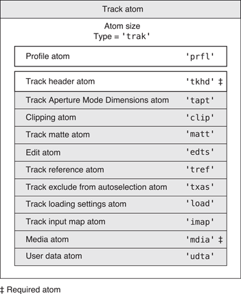

Track atoms contain the following data elements.

**Size**
: A 32-bit integer that specifies the number of bytes in this track atom.

**Type**
: A 32-bit integer that identifies the atom type; this field must be set to `'trak'`.

**Track profile atom**
: See [Track Profile Atom](#apple-f4xwc4dqnrsv64tfmyxwi33df52wszbpkridimbqgaydsmzzfvbuqmrqgqwtkobxgyzq) for details.

**Track header atom**
: See [Track Header Atoms](#apple-f4xwc4dqnrsv64tfmyxwi33df52wszbpkridimbqgaydsmzzfvbuqmrqgqwtenjvguya) for details.

**Track aperture mode dimensions atom**
: See [Track Aperture Mode Dimension Atoms](#apple-f4xwc4dqnrsv64tfmyxwi33df52wszbpkridimbqgaydsmzzfvbuqmrqgqwvgvzrgu) for details.

**Clipping atom**
: See [Clipping Atoms](#apple-f4xwc4dqnrsv64tfmyxwi33df52wszbpkridimbqgaydsmzzfvbuqmrqgqwtenjvgu3a) for more information.

**Track matte atom**
: See [Track Matte Atoms](#apple-f4xwc4dqnrsv64tfmyxwi33df52wszbpkridimbqgaydsmzzfvbuqmrqgqwtenjvgy3q) for more information.

**Edit atom**
: See [Edit Atoms](#apple-f4xwc4dqnrsv64tfmyxwi33df52wszbpkridimbqgaydsmzzfvbuqmrqgqwtenjvg44q) for details.

**Track reference atom**
: See [Track Reference Atoms](#apple-f4xwc4dqnrsv64tfmyxwi33df52wszbpkridimbqgaydsmzzfvbuqmrqgqwtenjwga2a)” for details.

**Track exclude from autoselection atom**
: See [Track Exclude From Autoselection Atoms](#apple-f4xwc4dqnrsv64tfmyxwi33df52wszbpkridimbqgaydsmzzfvbuqmrqgqwvgvzug4) for details.

**Track load settings atom**
: See [Track Load Settings Atoms](#apple-f4xwc4dqnrsv64tfmyxwi33df52wszbpkridimbqgaydsmzzfvbuqmrqgqwtenjvhe4a) for details.

**Track input map atom**
: See [Track Input Map Atoms](#apple-f4xwc4dqnrsv64tfmyxwi33df52wszbpkridimbqgaydsmzzfvbuqmrqgqwtenjwgeya)” for details.

**Media atom**
: See [Media Atoms](#apple-f4xwc4dqnrsv64tfmyxwi33df52wszbpkridimbqgaydsmzzfvbuqmrqgqwtgmztgazq) for details.

**User-defined data atom**
: See [User Data Atoms](#apple-f4xwc4dqnrsv64tfmyxwi33df52wszbpkridimbqgaydsmzzfvbuqmrqgqwtenjvgm4a) for more information.

### Track Profile Atom

__Note:__ Profile atoms are deprecated in the QuickTime file format. The information that follows is intended to document existing content containing profile atoms and should not be used for new development.

Profile atoms can be children of movie atoms or track atoms. For details on profile atoms, see [The Movie Profile Atom](#apple-f4xwc4dqnrsv64tfmyxwi33df52wszbpkridimbqgaydsmzzfvbuqmrqgqwtknbzgq4a).

### Track Header Atoms

The track header atom specifies the characteristics of a single track within a movie. A track header atom contains a size field that specifies the number of bytes and a type field that indicates the format of the data (defined by the atom type `'tkhd'`).

[Figure 2-7](#apple-f4xwc4dqnrsv64tfmyxwi33df52wszbpkridimbqgaydsmzzfvbuqmrqgqwtgmrzgyzq) shows the structure of the track header atom.

__Figure 2-7__  The layout of a track header atom

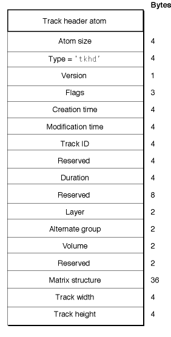

The track header atom contains the track characteristics for the track, including temporal, spatial, and volume information.

Track header atoms contain the following data elements.

**Size**
: A 32-bit integer that specifies the number of bytes in this track header atom.

**Type**
: A 32-bit integer that identifies the atom type; this field must be set to `'tkhd'`.

**Version**
: A 1-byte specification of the version of this track header.

**Flags**
: Three bytes that are reserved for the track header flags. These flags indicate how the track is used in the movie. The following flags are valid (all flags are enabled when set to 1).

**Track enabled**
: Indicates that the track is enabled. Flag value is 0x0001.

**Track in movie**
: Indicates that the track is used in the movie. Flag value is 0x0002.

**Track in preview**
: Indicates that the track is used in the movie’s preview. Flag value is 0x0004.

**Track in poster**
: Indicates that the track is used in the movie’s poster. Flag value is 0x0008.

**Creation time**
: A 32-bit integer that indicates the calendar date and time (expressed in seconds since midnight, January 1, 1904) when the track header was created. It is strongly recommended that this value should be specified using coordinated universal time (UTC).

**Modification time**
: A 32-bit integer that indicates the calendar date and time (expressed in seconds since midnight, January 1, 1904) when the track header was changed. It is strongly recommended that this value should be specified using coordinated universal time (UTC).

**Track ID**
: A 32-bit integer that uniquely identifies the track. The value 0 cannot be used.

**Reserved**
: A 32-bit integer that is reserved for use by Apple. Set this field to 0.

**Duration**
: A time value that indicates the duration of this track (in the movie’s time coordinate system). Note that this property is derived from the track’s edits. The value of this field is equal to the sum of the durations of all of the track’s edits. If there is no edit list, then the duration is the sum of the sample durations, converted into the movie timescale.

**Reserved**
: An 8-byte value that is reserved for use by Apple. Set this field to 0.

**Layer**
: A 16-bit integer that indicates this track’s spatial priority in its movie. The QuickTime Movie Toolbox uses this value to determine how tracks overlay one another. Tracks with lower layer values are displayed in front of tracks with higher layer values.

**Alternate group**
: A 16-bit integer that identifies a collection of movie tracks that contain alternate data for one another. This same identifier appears in each `'tkhd'` atom of the other tracks in the group. QuickTime chooses one track from the group to be used when the movie is played. The choice may be based on such considerations as playback quality, language, or the capabilities of the computer.

A value of zero indicates that the track is not in an alternate track group.

The most common reason for having alternate tracks is to provide versions of the same track in different languages. [Figure 2-8](#apple-f4xwc4dqnrsv64tfmyxwi33df52wszbpkridimbqgaydsmzzfvbuqmrqgqwvgvzuhe) shows an example of several tracks. The video track’s Alternate Group ID is 0, which means that it is not in an alternate group (and its language codes are empty; normally, video tracks should have the appropriate language tags). The three sound tracks have the same Group ID, so they form one alternate group, and the subtitle tracks have a different Group ID, so they form another alternate group. The tracks would not be adjacent in an actual QuickTime file; this is just a list of example track field values.

__Figure 2-8__  Example of alternate tracks in two alternate groups

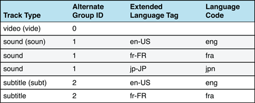

**Volume**
: A 16-bit fixed-point value that indicates how loudly this track’s sound is to be played. A value of 1.0 indicates normal volume.

**Reserved**
: A 16-bit integer that is reserved for use by Apple. Set this field to 0.

**Matrix structure**
: The matrix structure associated with this track. See [Figure 2-3](#apple-f4xwc4dqnrsv64tfmyxwi33df52wszbpkridimbqgaydsmzzfvbuqmrqgqwtgmrzgq3q) for an illustration of a matrix structure.

**Track width**
: A 32-bit fixed-point number that specifies the width of this track in pixels.

**Track height**
: A 32-bit fixed-point number that indicates the height of this track in pixels.

### Track Exclude From Autoselection Atoms

Some alternate tracks contain something other than a direct translation (or untranslated written form) of the primary content. Commentary tracks are one example. These tracks should not be automatically selected. The presence of the Track Exclude From Autoselection atom in a track indicates that this track should not be automatically selected.

Such tracks should have user-readable names that help users to identify the purpose of the track. These names are stored in one or more track name (`'tnam'`) atoms, each translated into a different language, within a user data (`'udta'`) atom within the `'trak'` atom.

The type of the Track Exclude From Autoselection atom is `'txas'`. This atom, if used, must be somewhere after the `'tkhd'` atom.

Track exclude from autoselection atoms contain the following data elements.

**Size**
: A 32-bit integer that specifies the number of bytes in the track exclude from autoselection atom. This must be 8, as this atom must contain no data.

**Type**
: A 32-bit integer that identifies the atom type; this field must be set to `'txas'`.

### Track Aperture Mode Dimension Atoms

A video track in a QuickTime Movie can signal clean aperture and pixel aspect ratio information through image description extensions. The clean aperture defines the part of the encoded pixels to be displayed. The pixel aspect ratio is the aspect ratio of the encoded pixels. Conceptually the encoded pixels are decompressed, stretched (or shrunk) based on the pixel aspect ratio, and extra pixels are cropped off according to the clean aperture.

__Note:__ QuickTime tracks define simple dimensions for their content in the track header dimensions. In the absence of a track aperture mode dimensions atom, the dimensions in the track header are used for all modes.

Considering this context, the dimensions recorded in the image description define the dimensions of the encoded pixels (encoded dimensions). What's actually displayed is a result of applying the pixel aspect ratio and the clean aperture (display dimensions).

Although the result of applying the clean aperture and the pixel aspect ratio is what is intended for final display, there are cases where it is useful to display all the pixels that exist in the content for various different purposes. Readers parsing QuickTime movies require information allowing these different display modes in order to provide this flexibility:

**Clean Mode**
: In this mode both the clean aperture and the pixel aspect ratio are applied. The dimensions of the track become equal to the clean dimensions which are equal to the display dimensions (with conformed contents).

**Production Mode**
: This mode applies the pixel aspect ratio but not the clean aperture. The image is presented in the correct aspect ratio, but the extra pixels outside of the image that exists in the source material will be presented. The track dimensions are equal to the result of applying the pixel aspect ratio.

**Classic Mode**
: This mode displays the image without applying either the pixel aspect ratio or the clean aperture. The image is displayed using the track header dimensions, meaning the decompressed picture is scaled into the track header dimensions if the encoded dimensions are different.

**Encoded Pixels**
: The encoded pixels are displayed intact in this mode. Under this mode the track dimensions are equal to the encoded dimensions. No scaling or transformation takes place.

The information needed for each of these presentation modes are represented in the optional track aperture mode dimensions atoms.

__Note:__ Older applications built prior to QuickTime 7 will continue to use the dimension values stored in the track header.

#### Track Aperture Mode Dimensions Atom

A container atom that stores information for video correction in the form of three required atoms. This atom is optionally included in the track atom. The type of the track aperture mode dimensions atom is `‘tapt’`.

[Figure 2-9](#apple-f4xwc4dqnrsv64tfmyxwi33df52wszbpkridimbqgaydsmzzfvbuqmrqgqwvgvztga) shows the layout of the track aperture mode dimensions atom.

__Figure 2-9__  The layout of a track aperture mode dimensions atom

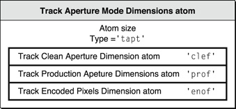

**Size**
: A 32-bit integer that specifies the number of bytes in the track aperture mode dimensions atom.

**Type**
: A 32-bit integer that identifies the atom type; this field must be set to `‘tapt’`.

**Track Clean Aperture Dimensions atom**
: See [Track Clean Aperture Dimensions Atom](#apple-f4xwc4dqnrsv64tfmyxwi33df52wszbpkridimbqgaydsmzzfvbuqmrqgqwvgvzt)

**Track Production Aperture Dimensions atom**
: See [Track Production Aperture Dimensions Atom](#apple-f4xwc4dqnrsv64tfmyxwi33df52wszbpkridimbqgaydsmzzfvbuqmrqgqwvgvzrgm)

**Track Encoded Pixels Dimensions atom**
: See [Track Encoded Pixels Dimensions Atom](#apple-f4xwc4dqnrsv64tfmyxwi33df52wszbpkridimbqgaydsmzzfvbuqmrqgqwvgvzrgq)

#### Track Clean Aperture Dimensions Atom

This atom carries the pixel dimensions of the track’s clean aperture. The type of the track clean aperture dimensions atom is `‘clef’`.

[Figure 2-10](#apple-f4xwc4dqnrsv64tfmyxwi33df52wszbpkridimbqgaydsmzzfvbuqmrqgqwvgvztge) shows the layout of the track clean aperture dimensions atom.

__Figure 2-10__  The layout of a track clean aperture dimensions atom

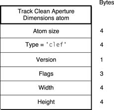

**Size**
: A 32-bit integer that specifies the number of bytes in the track aperture mode dimensions atom.

**Type**
: A 32-bit integer that identifies the atom type; this field must be set to `‘clef’`.

**Version**
: A 1-byte specification of the version of this atom.

**Flags**
: Three bytes that are reserved for the atom flags.

**Width**
: A 32-bit fixed-point number that specifies the width of the track clean aperture in pixels.

**Height**
: A 32-bit fixed-point number that specifies the height of the track clean aperture in pixels.

#### Track Production Aperture Dimensions Atom

This atom carries the pixel dimensions of the track’s production aperture. The type of the track production aperture dimensions atom is `‘prof’`.

[Figure 2-11](#apple-f4xwc4dqnrsv64tfmyxwi33df52wszbpkridimbqgaydsmzzfvbuqmrqgqwvgvztgi) shows the layout of the track production aperture dimensions atom.

__Figure 2-11__  The layout of a track production aperture dimensions atom

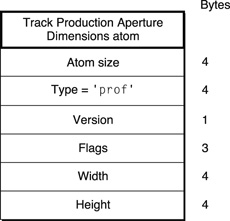

**Size**
: A 32-bit integer that specifies the number of bytes in the track aperture mode dimensions atom.

**Type**
: A 32-bit integer that identifies the atom type; this field must be set to `‘prof’`.

**Version**
: A 1-byte specification of the version of this atom.

**Flags**
: Three bytes that are reserved for the atom flags.

**Width**
: A 32-bit fixed-point number that specifies the width of the track production aperture in pixels.

**Height**
: A 32-bit fixed-point number that specifies the height of the track production aperture in pixels.

#### Track Encoded Pixels Dimensions Atom

This atom carries the pixel dimensions of the track’s encoded pixels. The type of the track encoded pixels dimensions atom is `‘enof’`.

[Figure 2-12](#apple-f4xwc4dqnrsv64tfmyxwi33df52wszbpkridimbqgaydsmzzfvbuqmrqgqwvgvztgm) shows the layout of this atom.

__Figure 2-12__  The layout of a track encoded pixels dimensions atom


**Size**
: A 32-bit integer that specifies the number of bytes in the track aperture mode dimensions atom.

**Type**
: A 32-bit integer that identifies the atom type; this field must be set to `‘enof’`.

**Version**
: A 1-byte specification of the version of this atom.

**Flags**
: Three bytes that are reserved for the atom flags.

**Width**
: A 32-bit fixed-point number that specifies the width of the track encoded pixels dimensions in pixels.

**Height**
: A 32-bit fixed-point number that specifies the height of the track encoded pixels dimensions in pixels.

### Clipping Atoms

Clipping atoms specify the clipping regions for movies and for tracks. The clipping atom has an atom type value of `'clip'`.

[Figure 2-13](#apple-f4xwc4dqnrsv64tfmyxwi33df52wszbpkridimbqgaydsmzzfvbuqmrqgqwtgmrzgy3q) shows the layout of this atom.

__Figure 2-13__  The layout of a clipping atom

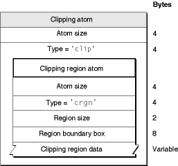

Clipping atoms contain the following data elements.

**Size**
: A 32-bit integer that specifies the number of bytes in this clipping atom.

**Type**
: A 32-bit integer that identifies the atom type; this field must be set to `'clip'`.

**Clipping region atom**
: See [Clipping Region Atoms](#apple-f4xwc4dqnrsv64tfmyxwi33df52wszbpkridimbqgaydsmzzfvbuqmrqgqwtenjvgyyq).

### Clipping Region Atoms

The clipping region atom contains the data that specifies the clipping region, including its size, bounding box, and region. Clipping region atoms have an atom type value of `'crgn'`.

The layout of the clipping region atom is shown in [Figure 2-13](#apple-f4xwc4dqnrsv64tfmyxwi33df52wszbpkridimbqgaydsmzzfvbuqmrqgqwtgmrzgy3q).

Clipping region atoms contain the following data elements.

**Size**
: A 32-bit integer that specifies the number of bytes in this clipping region atom.

**Type**
: A 32-bit integer that identifies the atom type; this field must be set to `'crgn'`.

**Region size**
: The region size, region boundary box, and clipping region data fields constitute a QuickDraw region.

**Region boundary box**
: The region size, region boundary box, and clipping region data fields constitute a QuickDraw region.

**Clipping region data**
: The region size, region boundary box, and clipping region data fields constitute a QuickDraw region.

### Track Matte Atoms

Track matte atoms are used to visually blend the track’s image when it is displayed.

Track matte atoms have an atom type value of `'matt'`.

[Figure 2-14](#apple-f4xwc4dqnrsv64tfmyxwi33df52wszbpkridimbqgaydsmzzfvbuqmrqgqwtgmrzg4yq) shows the layout of track matte atoms.

__Figure 2-14__  The layout of a track matte atom

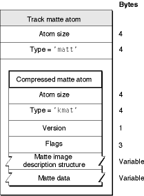

Track matte atoms contain the following data elements.

**Size**
: A 32-bit integer that specifies the number of bytes in this track matte atom.

**Type**
: A 32-bit integer that identifies the atom type; this field must be set to `'matt'`.

**Compressed matte atom**
: The actual matte data.

See [Compressed Matte Atoms](#apple-f4xwc4dqnrsv64tfmyxwi33df52wszbpkridimbqgaydsmzzfvbuqmrqgqwtenjvg4zq) for details.

### Compressed Matte Atoms

The compressed matte atom specifies the image description structure and the matte data associated with a particular matte atom. Compressed matte atoms have an atom type value of `'kmat'`.

The layout of the compressed matte atom is shown in [Figure 2-14](#apple-f4xwc4dqnrsv64tfmyxwi33df52wszbpkridimbqgaydsmzzfvbuqmrqgqwtgmrzg4yq).

Compressed matte atoms contain the following data elements.

**Size**
: A 32-bit integer that specifies the number of bytes in this compressed matte atom.

**Type**
: A 32-bit integer that identifies the atom type; this field must be set to `'kmat'`.

**Version**
: A 1-byte specification of the version of this compressed matte atom.

**Flags**
: Three bytes of space for flags. Set this field to 0.

**Matte image description structure**
: An image description structure associated with this matte data. The image description contains detailed information that governs how the matte data is used. See [Video Sample Description](Media%20Data%20Atom%20Types.md#apple-f4xwc4dqnrsv64tfmyxwi33df52wszbpkridimbqgaydsmzzfvbuqmrqguwtonbvguya) for more information about image descriptions.

**Matte data**
: The compressed matte data, which is of variable length.

### Edit Atoms

You use edit atoms to define the portions of the media that are to be used to build up a track for a movie. The edits themselves are contained in an edit list table, which consists of time offset and duration values for each segment. Edit atoms have an atom type value of `'edts'.`

[Figure 2-15](#apple-f4xwc4dqnrsv64tfmyxwi33df52wszbpkridimbqgaydsmzzfvbuqmrqgqwtgmrzg42q) shows the layout of an edit atom.

In the absence of an edit list, the presentation of a track starts immediately. An empty edit is used to offset the start time of a track.

__Note:__ If the edit atom or the edit list atom is missing, you can assume that the entire media is used by the track.

__Figure 2-15__  The layout of an edit atom

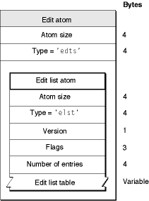

Edit atoms contain the following data elements.

**Size**
: A 32-bit integer that specifies the number of bytes in this edit atom.

**Type**
: A 32-bit integer that identifies the atom type; this field must be set to `'edts'`.

**Edit list atom**
: See [Edit List Atoms](#apple-f4xwc4dqnrsv64tfmyxwi33df52wszbpkridimbqgaydsmzzfvbuqmrqgqwtenjvheza).

### Edit List Atoms

You use the edit list atom, also shown in [Figure 2-15](#apple-f4xwc4dqnrsv64tfmyxwi33df52wszbpkridimbqgaydsmzzfvbuqmrqgqwtgmrzg42q), to map from a time in a movie to a time in a media, and ultimately to media data. This information is in the form of entries in an edit list table, shown in [Figure 2-16](#apple-f4xwc4dqnrsv64tfmyxwi33df52wszbpkridimbqgaydsmzzfvbuqmrqgqwtgmrzg44q). Edit list atoms have an atom type value of `'elst'`.

Edit list atoms contain the following data elements.

**Size**
: A 32-bit integer that specifies the number of bytes in this edit list atom.

**Type**
: A 32-bit integer that identifies the atom type; this field must be set to `'elst'`.

**Version**
: A 1-byte specification of the version of this edit list atom.

**Flags**
: Three bytes of space for flags. Set this field to 0.

**Number of entries**
: A 32-bit integer that specifies the number of entries in the edit list atom that follows.

**Edit list table**
: An array of 32-bit values, grouped into entries containing 3 values each. [Figure 2-16](#apple-f4xwc4dqnrsv64tfmyxwi33df52wszbpkridimbqgaydsmzzfvbuqmrqgqwtgmrzg44q) shows the layout of the entries in this table.

__Figure 2-16__  The layout of an edit list table entry

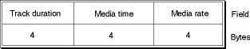

An edit list table entry contains the following elements.

**Track duration**
: A 32-bit integer that specifies the duration of this edit segment in units of the movie’s time scale.

**Media time**
: A 32-bit integer containing the starting time within the media of this edit segment (in media timescale units). If this field is set to –1, it is an empty edit. The last edit in a track should never be an empty edit. Any difference between the movie’s duration and the track’s duration is expressed as an implicit empty edit.

**Media rate**
: A 32-bit fixed-point number that specifies the relative rate at which to play the media corresponding to this edit segment. This rate value cannot be 0 or negative.

### Track Load Settings Atoms

Track load settings atoms contain information that indicates how the track is to be used in its movie. Applications that read QuickTime files can use this information to process the movie data more efficiently. Track load settings atoms have an atom type value of `'load'`.

[Figure 2-17](#apple-f4xwc4dqnrsv64tfmyxwi33df52wszbpkridimbqgaydsmzzfvbuqmrqgqwtgmrzhazq) shows the layout of this atom.

__Figure 2-17__  The layout of a track load settings atom

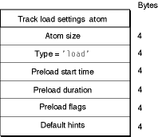

Track load settings atoms contain the following data elements.

**Size**
: A 32-bit integer that specifies the number of bytes in this track load settings atom.

**Type**
: A 32-bit integer that identifies the atom type; this field must be set to `'load'`.

**Preload start time**
: A 32-bit integer specifying the starting time, in the movie’s time coordinate system, of a segment of the track that is to be preloaded. Used in conjunction with the preload duration.

**Preload duration**
: A 32-bit integer specifying the duration, in the movie’s time coordinate system, of a segment of the track that is to be preloaded. If the duration is set to –1, it means that the preload segment extends from the preload start time to the end of the track. All media data in the segment of the track defined by the preload start time and preload duration values should be loaded into memory when the movie is to be played.

**Preload flags**
: A 32-bit integer containing flags governing the preload operation. Only two flags are defined, and they are mutually exclusive. If this flag is set to 1, the track is to be preloaded regardless of whether it is enabled. If this flag is set to 2, the track is to be preloaded only if it is enabled.

**Default hints**
: A 32-bit integer containing playback hints. More than one flag may be enabled. Flags are enabled by setting them to 1. The following flags are defined.

**Double buffer**
: This flag indicates that the track should be played using double-buffered I/O. This flag’s value is 0x0020.

**High quality**
: This flag indicates that the track should be displayed at highest possible quality, without regard to real-time performance considerations. This flag’s value is 0x0100.

### Track Reference Atoms

Track reference atoms define relationships between tracks. Track reference atoms allow one track to specify how it is related to other tracks. For example, if a movie has three video tracks and three sound tracks, track references allow you to identify the related sound and video tracks. Track reference atoms have an atom type value of `'tref'`.

Track references are unidirectional and point from the recipient track to the source track. For example, a video track may reference a time code track to indicate where its time code is stored, but the time code track would not reference the video track. The time code track is the source of time information for the video track.

A single track may reference multiple tracks. For example, a video track could reference a sound track to indicate that the two are synchronized and a time code track to indicate where its time code is stored.

A single track may also be referenced by multiple tracks. For example, both a sound and video track could reference the same time code track if they share the same timing information.

If this atom is not present, the track is not referencing any other track in any way. Note that the array of track reference type atoms is sized to fill the track reference atom. Track references with a reference index of 0 are permitted. This indicates no reference.

For more information about Track References, see [Track References](Media%20Data%20Atom%20Types.md#apple-f4xwc4dqnrsv64tfmyxwi33df52wszbpkridimbqgaydsmzzfvbuqmrqguwtmojyhe2a).

[Figure 2-18](#apple-f4xwc4dqnrsv64tfmyxwi33df52wszbpkridimbqgaydsmzzfvbuqmrqgqwtgmrzha3q) shows the layout of a track reference atom.

__Figure 2-18__  The layout of a track reference atom

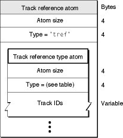

A track reference atom contains the following data elements.

**Size**
: A 32-bit integer that specifies the number of bytes in this track reference atom.

**Type**
: A 32-bit integer that identifies the atom type; this field must be set to `'tref'`.

**Track reference type atoms**
: A list of track reference type atoms containing the track reference information. These atoms are described next.

Each track reference atom defines relationships with tracks of a specific type. The reference type implies a track type. [Table 2-2](#apple-f4xwc4dqnrsv64tfmyxwi33df52wszbpkridimbqgaydsmzzfvbuqmrqgqwtgobugq4q) shows the track reference types and their descriptions.

__Table 2-2__  Track reference types

| Reference type | Description |
| `'cdsc'` | The track reference is contained in a timed metadata track (see [Timed Metadata Media](Media%20Data%20Atom%20Types.md#apple-f4xwc4dqnrsv64tfmyxwi33df52wszbpkridimbqgaydsmzzfvbuqmrqguwvgvzugy) for more detail) and provides links to the tracks for which it contains descriptive characteristics.  Note: If the timed metadata track describes characteristics of the entire movie, there will be no track reference of type `‘cdsc’` between it and another track. |
| `'chap'` | Chapter or scene list. Usually references a text track. |
| `'clcp'` | Closed caption. In any track, this identifies a closed captioning track that contains text that is appropriate for the referring track. See [Closed Captioning Media](Media%20Data%20Atom%20Types.md#apple-f4xwc4dqnrsv64tfmyxwi33df52wszbpkridimbqgaydsmzzfvbuqmrqguwvgvzyg4) for more information. |
| `'fall'` | In a sound track, this references a track in a different format but with identical content, if one exists; for example, an AC3 track might reference an AAC track with identical content. See [Alternate Sound Tracks](Some%20Useful%20Examples%20and%20Scenarios.md#apple-f4xwc4dqnrsv64tfmyxwi33df52wszbpkridimbqgaydsmzzfvbuqmrqg4wvgvzy). |
| `'folw'` | In a sound track, this references a subtitle track that is to be used as the sound track’s default subtitle track. If the subtitle track is part of a subtitle track pair, this should reference the the forced subtitle track of the pair. This is needed only if language tagging cannot be used. See [Relationships Across Alternate Groups](Some%20Useful%20Examples%20and%20Scenarios.md#apple-f4xwc4dqnrsv64tfmyxwi33df52wszbpkridimbqgaydsmzzfvbuqmrqg4wvgvzz). |
| `'forc'` | Forced subtitle track. In the regular track of a subtitle track pair, this references the forced track. See [Subtitle Sample Data](Media%20Data%20Atom%20Types.md#apple-f4xwc4dqnrsv64tfmyxwi33df52wszbpkridimbqgaydsmzzfvbuqmrqguwvgvzygi) for more information. |
| `'hint'` | The referenced tracks contain the original media for this hint track. |
| `'scpt'` | Transcript. Usually references a text track. |
| `'ssrc'` | Non-primary source. Indicates that the referenced track should send its data to this track, rather than presenting it. The referencing track will use the data to modify how it presents its data. See [Track Input Map Atoms](#apple-f4xwc4dqnrsv64tfmyxwi33df52wszbpkridimbqgaydsmzzfvbuqmrqgqwtenjwgeya) for more information. |
| `'sync'` | Synchronization. Usually between a video and sound track. Indicates that the two tracks are synchronized. The reference can be from either track to the other, or there may be two references. |
| `'tmcd'` | Time code. Usually references a time code track. |

Each track reference type atom contains the following data elements.

**Size**
: A 32-bit integer that specifies the number of bytes in this track reference type atom.

**Type**
: A 32-bit integer that identifies the atom type; this field must be set to one of the values shown in [Table 2-2](#apple-f4xwc4dqnrsv64tfmyxwi33df52wszbpkridimbqgaydsmzzfvbuqmrqgqwtgobugq4q).

**Track IDs**
: A list of track ID values (32-bit integers) specifying the related tracks. Note that this is one case where track ID values can be set to 0. Unused entries in the atom may have a track ID value of 0. Setting the track ID to 0 may be more convenient than deleting the reference.

You can determine the number of track references stored in a track reference type atom by subtracting its header size from its overall size and then dividing by the size, in bytes, of a track ID.

### Track Input Map Atoms

Track input map atoms define how data being sent to this track from its nonprimary sources is to be interpreted. Track references of type `'ssrc'` define a track’s secondary data sources. These sources provide additional data that is to be used when processing the track. Track input map atoms have an atom type value of `'imap'`.

[Figure 2-19](#apple-f4xwc4dqnrsv64tfmyxwi33df52wszbpkridimbqgaydsmzzfvbuqmrqgqwtgmrzheyq) shows the layout of a track input atom. This atom contains one or more track input atoms. Note that the track input map atom is a QT atom structure.

__Figure 2-19__  The layout of a track input map atom

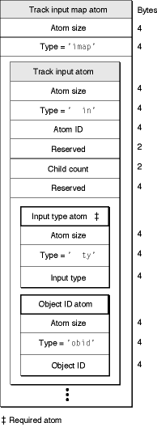

Each track input map atom contains the following data elements.

**Size**
: A 32-bit integer that specifies the number of bytes in this track input map atom.

**Type**
: A 32-bit integer that identifies the atom type; this field must be set to `'imap'`.

**Track input atoms**
: A list of track input atoms specifying how to use the input data.

The input map defines all of the track’s secondary inputs. Each secondary input is defined using a separate track input atom.

Each track input atom contains the following data elements.

**Size**
: A 32-bit integer that specifies the number of bytes in this track input atom.

**Type**
: A 32-bit integer that identifies the atom type; this field must be set to `' in'` (note that the two leading bytes must be set to 0x00).

**Atom ID**
: A 32-bit integer relating this track input atom to its secondary input. The value of this field corresponds to the index of the secondary input in the track reference atom. That is, the first secondary input corresponds to the track input atom with an atom ID value of 1; the second to the track input atom with an atom ID of 2, and so on.

**Reserved**
: A 16-bit integer that must be set to 0.

**Child count**
: A 16-bit integer specifying the number of child atoms in this atom.

**Reserved**
: A 32-bit integer that must be set to 0.

The track input atom, in turn, may contain two other types of atoms: input type atoms and object ID atoms. The input type atom is required; it specifies how the data is to be interpreted.

The input type atom contains the following data elements.

**Size**
: A 32-bit integer that specifies the number of bytes in this input type atom.

**Type**
: A 32-bit integer that identifies the atom type; this field must be set to `' ty'` (note that the two leading bytes must be set to 0x00).

**Input type**
: A 32-bit integer that specifies the type of data that is to be received from the secondary data source. [Table 2-3](#apple-f4xwc4dqnrsv64tfmyxwi33df52wszbpkridimbqgaydsmzzfvbuqmrqgqwtinzrg4yq) lists valid values for this field.

__Table 2-3__  Input types

| Input identifier | Value | Description |
| `kTrackModifierTypeMatrix` | 1 | A 3 × 3 transformation matrix to transform the track’s location, scaling, and so on. |
| `kTrackModifierTypeClip` | 2 | A QuickDraw clipping region to change the track’s shape. |
| `kTrackModifierTypeVolume` | 3 | An 8.8 fixed-point value indicating the relative sound volume. This is used for fading the volume. |
| `kTrackModifierTypeBalance` | 4 | A 16-bit integer indicating the sound balance level. This is used for panning the sound location. |
| `kTrackModifierTypeGraphicsMode` | 5 | A graphics mode record (32-bit integer indicating graphics mode, followed by an RGB color) to modify the track’s graphics mode for visual fades. |
| `kTrackModifierObjectMatrix` | 6 | A 3 × 3 transformation matrix to transform an object within the track’s location, scaling, and so on. |
| `kTrackModifierObjectGraphicsMode` | 7 | A graphics mode record (32-bit integer indicating graphics mode, followed by an RGB color) to modify an object within the track’s graphics mode for visual fades. |
| `kTrackModifierTypeImage` | `'vide’` | Compressed image data for an object within the track. Note that this was `kTrackModifierTypeSpriteImage`. |

If the input is operating on an object within the track (for example, a sprite within a sprite track), an object ID atom must be included in the track input atom to identify the object.

The object ID atom contains the following data elements.

**Size**
: A 32-bit integer that specifies the number of bytes in this object ID atom.

**Type**
: A 32-bit integer that identifies the atom type; this field must be set to `'obid'`.

**Object ID**
: A 32-bit integer identifying the object.

## Media Atoms

Media atoms describe and define a track’s media type and sample data. The media atom contains information that specifies:

- The media type, such as sound, video or timed metadata
- The media handler component used to interpret the sample data
- The media timescale and track duration
- Media-and-track-specific information, such as sound volume or graphics mode
- The media data references, which typically specify the file where the sample data is stored
- The sample table atoms, which, for each media sample, specify the sample description, duration, and byte offset from the data reference

The media atom has an atom type of `'mdia'`. It must contain a media header atom (`'mdhd'`), and it can contain a handler reference (`'hdlr'`) atom, media information (`'minf'`) atom, and user data (`'udta'`) atom.

__Note:__ Do not confuse the media atom (`'mdia'`) with the media _data_ atom (`'mdat'`). The media atom contains only _references_ to media data; the media data atom contains the actual media samples.

[Figure 2-20](#apple-f4xwc4dqnrsv64tfmyxwi33df52wszbpkridimbqgaydsmzzfvbuqmrqgqwtgmrzhe2q) shows the layout of a media atom.

__Figure 2-20__  The layout of a media atom

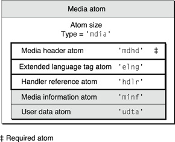

Media atoms contain the following data elements.

**Size**
: A 32-bit integer that specifies the number of bytes in this media atom.

**Type**
: A 32-bit integer that identifies the atom type; this field must be set to `'mdia'`.

**Media header atom**
: This atom contains the standard media information. See [Media Header Atoms](#apple-f4xwc4dqnrsv64tfmyxwi33df52wszbpkridimbqgaydsmzzfvbuqmrqgqwtenjwge2q).

**Extended language tag atom**
: This atom contains the extended language tag describing the media language. See [Extended Language Tag Atom](#apple-f4xwc4dqnrsv64tfmyxwi33df52wszbpkridimbqgaydsmzzfvbuqmrqgqwvgvzrgy).

**Handler reference atom**
: This atom identifies the media handler component that is to be used to interpret the media data. See [Handler Reference Atoms](#apple-f4xwc4dqnrsv64tfmyxwi33df52wszbpkridimbqgaydsmzzfvbuqmrqgqwtenjwgiyq) for more information.

Note that the handler reference atom tells you the kind of media this media atom contains—for example, video or sound. The layout of the media information atom is specific to the media handler that is to interpret the media. [Media Information Atoms](#apple-f4xwc4dqnrsv64tfmyxwi33df52wszbpkridimbqgaydsmzzfvbuqmrqgqwtenjwgi3a) discusses how data may be stored in a media, using the video media format defined by Apple as an example.

**Media information atom**
: This atom contains data specific to the media type for use by the media handler component. See [Media Information Atoms](#apple-f4xwc4dqnrsv64tfmyxwi33df52wszbpkridimbqgaydsmzzfvbuqmrqgqwtenjwgi3a).

**User data atom**
: See [User Data Atoms](#apple-f4xwc4dqnrsv64tfmyxwi33df52wszbpkridimbqgaydsmzzfvbuqmrqgqwtenjvgm4a).

### Media Header Atoms

The media header atom specifies the characteristics of a media, including time scale and duration. The media header atom has an atom type of `'mdhd'`.

[Figure 2-21](#apple-f4xwc4dqnrsv64tfmyxwi33df52wszbpkridimbqgaydsmzzfvbuqmrqgqwtgmrzhe4q) shows the layout of the media header atom.

__Figure 2-21__  The layout of a media header atom

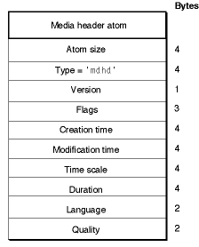

Media header atoms contain the following data elements.

**Size**
: A 32-bit integer that specifies the number of bytes in this media header atom.

**Type**
: A 32-bit integer that identifies the atom type; this field must be set to `'mdhd'`.

**Version**
: One byte that specifies the version of this header atom.

**Flags**
: Three bytes of space for media header flags. Set this field to 0.

**Creation time**
: A 32-bit integer that specifies (in seconds since midnight, January 1, 1904) when the media atom was created. It is strongly recommended that this value should be specified using coordinated universal time (UTC).

**Modification time**
: A 32-bit integer that specifies (in seconds since midnight, January 1, 1904) when the media atom was changed. It is strongly recommended that this value should be specified using coordinated universal time (UTC).

**Time scale**
: A time value that indicates the time scale for this media—that is, the number of time units that pass per second in its time coordinate system.

**Duration**
: The duration of this media in units of its time scale.

**Language**
: A 16-bit integer that specifies the language code for this media. See [Language Code Values](Basic%20Data%20Types.md#apple-f4xwc4dqnrsv64tfmyxwi33df52wszbpkridimbqgaydsmzzfvbuqmrqgywtenzqga2q) for valid language codes. Also see [Extended Language Tag Atom](#apple-f4xwc4dqnrsv64tfmyxwi33df52wszbpkridimbqgaydsmzzfvbuqmrqgqwvgvzrgy) for the preferred code to use here if an extended language tag is also included in the media atom.

**Quality**
: A 16-bit integer that specifies the media’s playback quality—that is, its suitability for playback in a given environment.

### Extended Language Tag Atom

The extended language tag atom represents media language information based on the RFC 4646 (Best Common Practices (BCP) #47) industry standard. It is an optional peer of the media header atom and should follow the definition of the media header atom in a QuickTime movie. There is at most one extended language tag atom per media atom and, in turn, per track. The extended language tag atom has an atom type of `'elng'`.

Until the introduction of this atom type, QuickTime had support for languages via codes based on either ISO 639 or the classic [Macintosh Language Codes](Basic%20Data%20Types.md#apple-f4xwc4dqnrsv64tfmyxwi33df52wszbpkridimbqgaydsmzzfvbuqmrqgywtgnbtgiya). These language codes are associated to a media (per track) in a QuickTime movie and are referred to as the _media language_.

To distinguish the extended language support from the old system, it is referred to as the _extended language tag_ as opposed to _language code_. The major advantage of the extended language tag is that it includes additional information such as region, script, variation, and so on, as parts (or subtags). For instance, this additional information allows distinguishing content in French as spoken in Canada from content in French as spoken in France.

[Figure 2-22](#apple-f4xwc4dqnrsv64tfmyxwi33df52wszbpkridimbqgaydsmzzfvbuqmrqgqwvgvztgy) shows the layout of this atom.

__Figure 2-22__  The layout of an extended language tag atom

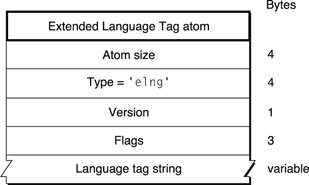

Extended language tag atoms contain the following data elements.

**Size**
: A 32-bit integer that specifies the number of bytes in this media header atom.

**Type**
: A 32-bit integer that identifies the atom type; this field must be set to `'elng'`.

**Version**
: One byte that specifies the version of this header atom.

**Flags**
: Three bytes of space for media header flags. Set this field to 0.

**Language tag string**
: A NULL-terminated C string containing an RFC 4646 (BCP 47) compliant language tag string in ASCII encoding, such as "en-US", "fr-FR", or "zh-CN".

Additional notes:

- The extended language tag overrides the media language if they are not consistent.
- The extended language tag atom is optional, and if it is absent the media language should be used.
- No validation of the language tag string is performed. Applications parsing QuickTime movies need to be prepared for an invalid language tag, and are expected to behave as if no information is found.
- For best compatibility with earlier players, if an extended language tag is specified, the most compatible language code should be specified in the language field of the 'mdhd' atom (for example, "eng" if the extended language tag is "en-AU"). If there is no reasonably compatible tag, the packed form of 'und' can be specified in the language code of the 'mdhd' atom.

### Handler Reference Atoms

The handler reference atom specifies the media handler component that is to be used to interpret the media’s data. The handler reference atom has an atom type value of `'hdlr'`.

Historically, the handler reference atom was also used for data references. However, this use is no longer current and may now be safely ignored.

The handler atom within a media atom declares the process by which the media data in the stream may be presented, and thus, the nature of the media in a stream. For example, a video handler would handle a video track.

[Figure 2-23](#apple-f4xwc4dqnrsv64tfmyxwi33df52wszbpkridimbqgaydsmzzfvbuqmrqgqwtgmzqga2a) shows the layout of a handler reference atom.

__Figure 2-23__  The layout of a handler reference atom

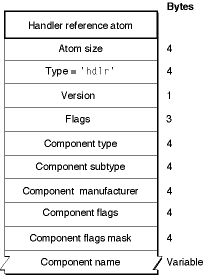

Handler reference atoms contain the following data elements.

**Size**
: A 32-bit integer that specifies the number of bytes in this handler reference atom.

**Type**
: A 32-bit integer that identifies the atom type; this field must be set to `'hdlr'`.

**Version**
: A 1-byte specification of the version of this handler information.

**Flags**
: A 3-byte space for handler information flags. Set this field to 0.

**Component type**
: A four-character code that identifies the type of the handler. Only two values are valid for this field: `'mhlr'` for media handlers and `'dhlr'` for data handlers.

**Component subtype**
: A four-character code that identifies the type of the media handler or data handler. For media handlers, this field defines the type of data—for example, `'vide'` for video data, `'soun'` for sound data or `‘subt’` for subtitles. See [Media Data Atom Types](Media%20Data%20Atom%20Types.md#apple-f4xwc4dqnrsv64tfmyxwi33df52wszbpkridimbqgaydsmzzfvbuqmrqguwvgvzr) for information about defined media data types.

For data handlers, this field defines the data reference type; for example, a component subtype value of `'alis'` identifies a file alias.

**Component manufacturer**
: Reserved. Set to 0.

**Component flags**
: Reserved. Set to 0.

**Component flags mask**
: Reserved. Set to 0.

**Component name**
: A (counted) string that specifies the name of the component—that is, the media handler used when this media was created. This field may contain a zero-length (empty) string.

### Media Information Atoms

Media information atoms (defined by the `'minf'` atom type) store handler-specific information for a track’s media data. The media handler uses this information to map from media time to media data and to process the media data.

These atoms contain information that is specific to the type of data defined by the media. Further, the format and content of media information atoms are dictated by the media handler that is responsible for interpreting the media data stream. Another media handler would not know how to interpret this information.

This section describes the atoms that store media information for the video (`'vmhd'`), sound (`'smhd'`), and base (`'gmhd'`) portions of QuickTime movies.

__Note:__ [Using Sample Atoms](#apple-f4xwc4dqnrsv64tfmyxwi33df52wszbpkridimbqgaydsmzzfvbuqmrqgqwtenjxgi3a)  discusses how the video media handler locates samples in a video media.

### Video Media Information Atoms

Video media information atoms are the highest-level atoms in video media. These atoms contain a number of other atoms that define specific characteristics of the video media data. [Figure 2-24](#apple-f4xwc4dqnrsv64tfmyxwi33df52wszbpkridimbqgaydsmzzfvbuqmrqgqwtgmzqga4a) shows the layout of a video media information atom.

__Figure 2-24__  The layout of a media information atom for video

（原归档配图未能恢复：`qt_l_035.jpg`）

The video media information atom contains the following data elements.

**Size**
: A 32-bit integer that specifies the number of bytes in this video media information atom.

**Type**
: A 32-bit integer that identifies the atom type; this field must be set to `'minf'`.

**Video media information atom**
: See [Video Media Information Header Atoms](#apple-f4xwc4dqnrsv64tfmyxwi33df52wszbpkridimbqgaydsmzzfvbuqmrqgqwtenjwgqza).

**Handler reference atom**
: See [Handler Reference Atoms](#apple-f4xwc4dqnrsv64tfmyxwi33df52wszbpkridimbqgaydsmzzfvbuqmrqgqwtenjwgiyq).

**Data information atom**
: See [Data Information Atoms](#apple-f4xwc4dqnrsv64tfmyxwi33df52wszbpkridimbqgaydsmzzfvbuqmrqgqwtenjwg42q).

**Sample table atom**
: See [Sample Table Atoms](#apple-f4xwc4dqnrsv64tfmyxwi33df52wszbpkridimbqgaydsmzzfvbuqmrqgqwtenjwha2q).

### Video Media Information Header Atoms

Video media information header atoms define specific color and graphics mode information.

[Figure 2-25](#apple-f4xwc4dqnrsv64tfmyxwi33df52wszbpkridimbqgaydsmzzfvbuqmrqgqwtgmzqgeza) shows the structure of a video media information header atom.

__Figure 2-25__  The layout of a media information header atom for video

（原归档配图未能恢复：`qt_l_101.gif`）

The video media information header atom contains the following data elements.

**Size**
: A 32-bit integer that specifies the number of bytes in this video media information header atom.

**Type**
: A 32-bit integer that identifies the atom type; this field must be set to `'vmhd'`.

**Version**
: A 1-byte specification of the version of this video media information header atom.

**Flags**
: A 3-byte space for video media information flags. There is one defined flag.

**No lean ahead**
: This is a compatibility flag that allows QuickTime to distinguish between movies created with QuickTime 1.0 and newer movies. You should always set this flag to 1, unless you are creating a movie intended for playback using version 1.0 of QuickTime. This flag’s value is 0x0001.

**Graphics mode**
: A 16-bit integer that specifies the transfer mode. The transfer mode specifies which Boolean operation QuickDraw should perform when drawing or transferring an image from one location to another. See [Graphics Modes](Basic%20Data%20Types.md#apple-f4xwc4dqnrsv64tfmyxwi33df52wszbpkridimbqgaydsmzzfvbuqmrqgywtcobxgqyq) for a list of graphics modes supported by QuickTime.

**Opcolor**
: Three 16-bit values that specify the red, green, and blue colors for the transfer mode operation indicated in the graphics mode field.

### Sound Media Information Atoms

Sound media information atoms are the highest-level atoms in sound media. These atoms contain a number of other atoms that define specific characteristics of the sound media data. [Figure 2-26](#apple-f4xwc4dqnrsv64tfmyxwi33df52wszbpkridimbqgaydsmzzfvbuqmrqgqwtgmzqge3a) shows the layout of a sound media information atom.

__Figure 2-26__  The layout of a media information atom for sound

（原归档配图未能恢复：`qt_l_104.gif`）

The sound media information atom contains the following data elements.

**Size**
: A 32-bit integer that specifies the number of bytes in this sound media information atom.

**Type**
: A 32-bit integer that identifies the atom type; this field must be set to `'minf'`.

**Sound media information header atom**
: See [Sound Media Information Header Atoms](#apple-f4xwc4dqnrsv64tfmyxwi33df52wszbpkridimbqgaydsmzzfvbuqmrqgqwtenjwguza).

**Handler reference atom**
: See [Handler Reference Atoms](#apple-f4xwc4dqnrsv64tfmyxwi33df52wszbpkridimbqgaydsmzzfvbuqmrqgqwtenjwgiyq).

**Data information atom**
: See [Data Information Atoms](#apple-f4xwc4dqnrsv64tfmyxwi33df52wszbpkridimbqgaydsmzzfvbuqmrqgqwtenjwg42q).

**Sample table atom**
: See [Sample Table Atoms](#apple-f4xwc4dqnrsv64tfmyxwi33df52wszbpkridimbqgaydsmzzfvbuqmrqgqwtenjwha2q).

### Sound Media Information Header Atoms

The sound media information header atom stores the sound media’s control information, such as balance.

[Figure 2-27](#apple-f4xwc4dqnrsv64tfmyxwi33df52wszbpkridimbqgaydsmzzfvbuqmrqgqwtgmzqgiya) shows the layout of this atom.

__Figure 2-27__  The layout of a sound media information header atom

（原归档配图未能恢复：`qt_l_105.gif`）

The sound media information header atom contains the following data elements.

**Size**
: A 32-bit integer that specifies the number of bytes in this sound media information header atom.

**Type**
: A 32-bit integer that identifies the atom type; this field must be set to `'smhd'`.

**Version**
: A 1-byte specification of the version of this sound media information header atom.

**Flags**
: A 3-byte space for sound media information flags. Set this field to 0.

**Balance**
: A 16-bit integer that specifies the sound balance of this sound media. Sound balance is the setting that controls the mix of sound between the two speakers of a computer. This field is normally set to 0. See [Balance](Basic%20Data%20Types.md#apple-f4xwc4dqnrsv64tfmyxwi33df52wszbpkridimbqgaydsmzzfvbuqmrqgywtcobxgq4q) for more information about balance values.

**Reserved**
: Reserved for use by Apple. Set this field to 0.

### Base Media Information Atoms

The base media information atom (shown in [Figure 2-28](#apple-f4xwc4dqnrsv64tfmyxwi33df52wszbpkridimbqgaydsmzzfvbuqmrqgqwtgmzqgi2a)) stores the media information for media types such as timed metadata, text, MPEG, time code, and music.

Media types that are derived from the base media handler may add other atoms within the base media information atom, as appropriate. At present, the only media type that defines additional atoms is timecode media. See [Timed Metadata Media](Media%20Data%20Atom%20Types.md#apple-f4xwc4dqnrsv64tfmyxwi33df52wszbpkridimbqgaydsmzzfvbuqmrqguwvgvzugy) and [Timecode Media](Media%20Data%20Atom%20Types.md#apple-f4xwc4dqnrsv64tfmyxwi33df52wszbpkridimbqgaydsmzzfvbuqmrqguwtmojygmyq) for more information about this media types.

__Figure 2-28__  The layout of a base media information atom

（原归档配图未能恢复：`qt_l_206.png`）

The base media information atom contains the following data elements.

**Size**
: A 32-bit integer that specifies the number of bytes in this base media information atom.

**Type**
: A 32-bit integer that identifies the atom type; this field must be set to `'minf'`.

**Base media information header atom**
: See [Base Media Information Header Atoms](#apple-f4xwc4dqnrsv64tfmyxwi33df52wszbpkridimbqgaydsmzzfvbuqmrqgqwtenjwgyzq).

### Base Media Information Header Atoms

The base media information header atom indicates that this media information atom pertains to a base media.

[Figure 2-29](#apple-f4xwc4dqnrsv64tfmyxwi33df52wszbpkridimbqgaydsmzzfvbuqmrqgqwvgvzvgi) shows the layout of this atom.

__Figure 2-29__  The layout of a base media information header atom

（原归档配图未能恢复：`qt_l_208.png`）

The base media information header atom contains the following data elements.

**Size**
: A 32-bit integer that specifies the number of bytes in this base media information header atom.

**Type**
: A 32-bit integer that identifies the atom type; this field must be set to `'gmhd'`.

**Base media info atom**
: See [Base Media Info Atoms](#apple-f4xwc4dqnrsv64tfmyxwi33df52wszbpkridimbqgaydsmzzfvbuqmrqgqwtenjwgy4q).

**Text media information atom**
: See [Text Media Information Atom](Media%20Data%20Atom%20Types.md#apple-f4xwc4dqnrsv64tfmyxwi33df52wszbpkridimbqgaydsmzzfvbuqmrqguwvgvzzga).

### Base Media Info Atoms

The base media info atom, contained in the base media information header atom (`'gmhd'`), defines the media’s control information, including graphics mode and balance information.

[Figure 2-30](#apple-f4xwc4dqnrsv64tfmyxwi33df52wszbpkridimbqgaydsmzzfvbuqmrqgqwtgmzqgi4a) shows the layout of the base media info atom.

__Figure 2-30__  The layout of a base media info atom

（原归档配图未能恢复：`qt_l_207.gif`）

The base media info atom contains the following data elements.

**Size**
: A 32-bit integer that specifies the number of bytes in this base media info atom.

**Type**
: A 32-bit integer that identifies the atom type; this field must be set to `'gmin'`.

**Version**
: A 1-byte specification of the version of this base media information header atom.

**Flags**
: A 3-byte space for base media information flags. Set this field to 0.

**Graphics mode**
: A 16-bit integer that specifies the transfer mode. The transfer mode specifies which Boolean operation QuickDraw should perform when drawing or transferring an image from one location to another. See [Graphics Modes](Basic%20Data%20Types.md#apple-f4xwc4dqnrsv64tfmyxwi33df52wszbpkridimbqgaydsmzzfvbuqmrqgywtcobxgqyq) for more information about graphics modes supported by QuickTime.

**Opcolor**
: Three 16-bit values that specify the red, green, and blue colors for the transfer mode operation indicated in the graphics mode field.

**Balance**
: A 16-bit integer that specifies the sound balance of this media. Sound balance is the setting that controls the mix of sound between the two speakers of a computer. This field is normally set to 0. See [Balance](Basic%20Data%20Types.md#apple-f4xwc4dqnrsv64tfmyxwi33df52wszbpkridimbqgaydsmzzfvbuqmrqgywtcobxgq4q) for more information about balance values.

**Reserved**
: Reserved for use by Apple. Set this field to 0.

### Data Information Atoms

The handler reference atom (described in [Handler Reference Atoms](#apple-f4xwc4dqnrsv64tfmyxwi33df52wszbpkridimbqgaydsmzzfvbuqmrqgqwtenjwgiyq)) contains information specifying the data handler component that provides access to the media data. The data handler component uses the data information atom to interpret the media’s data. Data information atoms have an atom type value of `'dinf'`.

[Figure 2-31](#apple-f4xwc4dqnrsv64tfmyxwi33df52wszbpkridimbqgaydsmzzfvbuqmrqgqwtgmzqgmza) shows the layout of the data information atom.

__Figure 2-31__  The layout of a data information atom

（原归档配图未能恢复：`qt_l_036.gif`）

The data information atom contains the following data elements.

**Size**
: A 32-bit integer that specifies the number of bytes in this data information atom.

**Type**
: A 32-bit integer that identifies the atom type; this field must be set to `'dinf'`.

**Data reference atom**
: See [Data Reference Atoms](#apple-f4xwc4dqnrsv64tfmyxwi33df52wszbpkridimbqgaydsmzzfvbuqmrqgqwtenjwhaya).

### Data Reference Atoms

Data reference atoms contain tabular data that instructs the data handler component how to access the media’s data. [Figure 2-31](#apple-f4xwc4dqnrsv64tfmyxwi33df52wszbpkridimbqgaydsmzzfvbuqmrqgqwtgmzqgmza) shows the data reference atom.

The data reference atom contains the following data elements.

**Size**
: A 32-bit integer that specifies the number of bytes in this data reference atom.

**Type**
: A 32-bit integer that identifies the atom type; this field must be set to `'dref'`.

**Version**
: A 1-byte specification of the version of this data reference atom.

**Flags**
: A 3-byte space for data reference flags. Set this field to 0.

**Number of entries**
: A 32-bit integer containing the count of data references that follow.

**Data references**
: An array of data references.

Each data reference is formatted like an atom and contains the following data elements.

**Size**
: A 32-bit integer that specifies the number of bytes in the data reference.

**Type**
: A 32-bit integer that specifies the type of the data in the data reference. [Table 2-4](#apple-f4xwc4dqnrsv64tfmyxwi33df52wszbpkridimbqgaydsmzzfvbuqmrqgqwtgobygqya) lists valid type values.

**Version**
: A 1-byte specification of the version of the data reference.

**Flags**
: A 3-byte space for data reference flags. There is one defined flag.

**Self reference**
: This flag indicates that the media’s data is in the same file as the movie atom. On the Macintosh, and other file systems with multi-fork files, set this flag to 1 even if the data resides in a different fork from the movie atom. This flag’s value is 0x0001.

**Data**
: The data reference information.

[Table 2-4](#apple-f4xwc4dqnrsv64tfmyxwi33df52wszbpkridimbqgaydsmzzfvbuqmrqgqwtgobygqya) shows the currently defined data reference types that can be stored in a header atom.

__Table 2-4__  Data reference types

| Data reference type | Description |
| `'alis'` | Data reference is a Macintosh alias. An alias contains information about the file it refers to, including its full path name. |
| `'rsrc'` | Data reference is a Macintosh alias. Appended to the end of the alias is the resource type (stored as a 32-bit integer) and ID (stored as a 16-bit signed integer) to use within the specified file. This data reference type is deprecated in the QuickTime file format. This information is intended to document existing content containing 'rsrc’ data references and should not be used for new development. |
| `'url '` | A C string that specifies a URL. There may be additional data after the C string. |

## Sample Atoms

QuickTime stores media data in samples. A sample is a single element in a sequence of time-ordered data. Samples are stored in the media, and they may have varying durations.

Samples are stored in a series of chunks in a media. Chunks are a collection of data samples in a media that allow optimized data access. A chunk may contain one or more samples. Chunks in a media may have different sizes, and the individual samples within a chunk may have different sizes from one another, as shown in [Figure 2-32](#apple-f4xwc4dqnrsv64tfmyxwi33df52wszbpkridimbqgaydsmzzfvbuqmrqgqwtgmzqgm3a).

__Figure 2-32__  Samples in a media

（原归档配图未能恢复：`qt_l_037.gif`）

One way to describe a sample is to use a sample table atom. The sample table atom acts as a storehouse of information about the samples and contains a number of different types of atoms. The various atoms contain information that allows the media handler to parse the samples in the proper order. This approach enforces an ordering of the samples without requiring that the sample data be stored sequentially with respect to movie time in the actual data stream.

The next section discusses the sample table atom. Subsequent sections discuss each of the atoms that may reside in a sample table atom.

### Sample Table Atoms

The sample table atom contains information for converting from media time to sample number to sample location. This atom also indicates how to interpret the sample (for example, whether to decompress the video data and, if so, how). This section describes the format and content of the sample table atom.

The sample table atom has an atom type of `'stbl'`. It can contain the sample description atom, the time-to-sample atom, the sync sample atom, the sample-to-chunk atom, the sample size atom, the chunk offset atom, and the shadow sync atom. Recent additions to the list of atom types that a sample table atom can contain are the optional sample group description and sample-to-group atoms included in Appendix G: [Audio Priming - Handling Encoder Delay in AAC](Audio%20Priming%20-%20Handling%20Encoder%20Delay%20in%20AAC.md#apple-f4xwc4dqnrsv64tfmyxwi33df52wszbpkridimbqgaydsmzzfvbuqmrnknltc).

The sample table atom contains all the time and data indexing of the media samples in a track. Using tables, it is possible to locate samples in time, determine their type, and determine their size, container, and offset into that container.

If the track that contains the sample table atom references no data, then the sample table atom does not need to contain any child atoms (not a very useful media track).

If the track that the sample table atom is contained in does reference data, then the following child atoms are required: sample description, sample size, sample to chunk, and chunk offset. All of the subtables of the sample table use the same total sample count.

The sample description atom must contain at least one entry. A sample description atom is required because it contains the data reference index field that indicates which data reference atom to use to retrieve the media samples. Without the sample description, it is not possible to determine where the media samples are stored. The sync sample atom is optional. If the sync sample atom is not present, all samples are implicitly sync samples.

[Figure 2-33](#apple-f4xwc4dqnrsv64tfmyxwi33df52wszbpkridimbqgaydsmzzfvbuqmrqgqwtgmzqgqya) shows the layout of the sample table atom.

__Figure 2-33__  The layout of a sample table atom

（原归档配图未能恢复：`qt_l_038-G.jpg`）

The sample table atom contains the following data elements.

**Size**
: A 32-bit integer that specifies the number of bytes in this sample table atom.

**Type**
: A 32-bit integer that identifies the atom type; this field must be set to `'stbl'`.

**Sample description atom**
: See [Sample Description Atoms](#apple-f4xwc4dqnrsv64tfmyxwi33df52wszbpkridimbqgaydsmzzfvbuqmrqgqwtenjwheyq).

**Time-to-sample atom**
: See [Time-to-Sample Atoms](#apple-f4xwc4dqnrsv64tfmyxwi33df52wszbpkridimbqgaydsmzzfvbuqmrqgqwtenjwhe3a).

**Composition offset atom**
: See  [Composition Offset Atom](#apple-f4xwc4dqnrsv64tfmyxwi33df52wszbpkridimbqgaydsmzzfvbuqmrqgqwvgvzrhe).

**Composition Shift Least Greatest atom**
: See [Composition Shift Least Greatest Atom](#apple-f4xwc4dqnrsv64tfmyxwi33df52wszbpkridimbqgaydsmzzfvbuqmrqgqwvgvzsga).

**Sync sample atom**
: See [Sync Sample Atoms](#apple-f4xwc4dqnrsv64tfmyxwi33df52wszbpkridimbqgaydsmzzfvbuqmrqgqwtenjxgayq).

**Partial sync sample atom**
: See [Partial Sync Sample Atom](#apple-f4xwc4dqnrsv64tfmyxwi33df52wszbpkridimbqgaydsmzzfvbuqmrqgqwvgvzsge).

**Sample-to-chunk atom**
: See [Sample-to-Chunk Atoms](#apple-f4xwc4dqnrsv64tfmyxwi33df52wszbpkridimbqgaydsmzzfvbuqmrqgqwtenjxga3a).

**Sample size atom**
: See [Sample Size Atoms](#apple-f4xwc4dqnrsv64tfmyxwi33df52wszbpkridimbqgaydsmzzfvbuqmrqgqwtenjxgeya).

**Chunk offset atom**
: See [Chunk Offset Atoms](#apple-f4xwc4dqnrsv64tfmyxwi33df52wszbpkridimbqgaydsmzzfvbuqmrqgqwtenjxge2q).

**Sample Dependency Flags atom**
: See [Sample Dependency Flags Atom](#apple-f4xwc4dqnrsv64tfmyxwi33df52wszbpkridimbqgaydsmzzfvbuqmrqgqwvgvzsgi).

**Shadow sync atom**
: Reserved for future use.

### Sample Description Atoms

The sample description atom stores information that allows you to decode samples in the media. The data stored in the sample description varies, depending on the media type. For example, in the case of video media, the sample descriptions are image description structures. The sample description information for each media type is explained in [Media Data Atom Types](Media%20Data%20Atom%20Types.md#apple-f4xwc4dqnrsv64tfmyxwi33df52wszbpkridimbqgaydsmzzfvbuqmrqguwvgvzr)

[Figure 2-34](#apple-f4xwc4dqnrsv64tfmyxwi33df52wszbpkridimbqgaydsmzzfvbuqmrqgqwtgmzqgq2a) shows the layout of the sample description atom.

__Figure 2-34__  The layout of a sample description atom

（原归档配图未能恢复：`qt_l_109.gif`）

The sample description atom has an atom type of `'stsd'`. The sample description atom contains a table of sample descriptions. A media may have one or more sample descriptions, depending upon the number of different encoding schemes used in the media and on the number of files used to store the data. The sample-to-chunk atom identifies the sample description for each sample in the media by specifying the index into this table for the appropriate description (see [Sample-to-Chunk Atoms](#apple-f4xwc4dqnrsv64tfmyxwi33df52wszbpkridimbqgaydsmzzfvbuqmrqgqwtenjxga3a)).

The sample description atom contains the following data elements.

**Size**
: A 32-bit integer that specifies the number of bytes in this sample description atom.

**Type**
: A 32-bit integer that identifies the atom type; this field must be set to `'stsd'`.

**Version**
: A 1-byte specification of the version of this sample description atom.

**Flags**
: A 3-byte space for sample description flags. Set this field to 0.

**Number of entries**
: A 32-bit integer containing the number of sample descriptions that follow.

**Sample description table**
: An array of sample descriptions. For details, see [General Structure of a Sample Description](#apple-f4xwc4dqnrsv64tfmyxwi33df52wszbpkridimbqgaydsmzzfvbuqmrqgqwtmmjrgeza).

#### General Structure of a Sample Description

While the exact format of the sample description varies by media type, the first four fields of every sample description are the same.

**Sample description size**
: A 32-bit integer indicating the number of bytes in the sample description.

__Important:__ When parsing sample descriptions in the `‘stsd’` atom, be aware of the sample description size value in order to read each table entry correctly. Some sample descriptions terminate with four zero bytes that are not otherwise indicated.

**Data format**
: A 32-bit integer indicating the format of the stored data. This depends on the media type, but is usually either the compression format or the media type.

**Reserved**
: Six bytes that must be set to 0.

**Data reference index**
: A 16-bit integer that contains the index of the data reference to use to retrieve data associated with samples that use this sample description. Data references are stored in data reference atoms.

These four fields may be followed by additional data specific to the media type and data format. See [Media Data Atom Types](Media%20Data%20Atom%20Types.md#apple-f4xwc4dqnrsv64tfmyxwi33df52wszbpkridimbqgaydsmzzfvbuqmrqguwvgvzr) for additional details regarding specific media types and media formats.

### Time-to-Sample Atoms

Time-to-sample atoms store duration information for a media’s samples, providing a mapping from a time in a media to the corresponding data sample. The time-to-sample atom has an atom type of `'stts'`.

You can determine the appropriate sample for any time in a media by examining the time-to-sample atom table, which is contained in the time-to-sample atom.

The atom contains a compact version of a table that allows indexing from time to sample number. Other tables provide sample sizes and pointers from the sample number. Each entry in the table gives the number of consecutive samples with the same time delta, and the delta of those samples. By adding the deltas, a complete time-to-sample map can be built.

The atom contains time deltas: `DT(n+1)
= DT(n) + STTS(n)` where `STTS(n)` is the (uncompressed) table entry for sample n and DT is the display time for sample (n). The sample entries are ordered by time stamps; therefore, the deltas are all nonnegative. The DT axis has a zero origin; `DT(i) = SUM (`for `j=0` to `i-1` of `delta(j)`), and the sum of all deltas gives the length of the media in the track (not mapped to the overall time scale, and not considering any edit list). The edit list atom provides the initial DT value if it is nonempty (nonzero).

[Figure 2-35](#apple-f4xwc4dqnrsv64tfmyxwi33df52wszbpkridimbqgaydsmzzfvbuqmrqgqwtgmzqgq4a) shows the layout of the time-to-sample atom.

__Figure 2-35__  The layout of a time-to-sample atom

（原归档配图未能恢复：`qt_l_106.gif`）

The time-to-sample atom contains the following data elements.

**Size**
: A 32-bit integer that specifies the number of bytes in this time-to-sample atom.

**Type**
: A 32-bit integer that identifies the atom type; this field must be set to `'stts'`.

**Version**
: A 1-byte specification of the version of this time-to-sample atom.

**Flags**
: A 3-byte space for time-to-sample flags. Set this field to 0.

**Number of entries**
: A 32-bit integer containing the count of entries in the time-to-sample table.

**Time-to-sample table**
: A table that defines the duration of each sample in the media. Each table entry contains a count field and a duration field. The structure of the time-to-sample table is shown in [Figure 2-36](#apple-f4xwc4dqnrsv64tfmyxwi33df52wszbpkridimbqgaydsmzzfvbuqmrqgqwtgmzqguza).

__Figure 2-36__  The layout of a time-to-sample table entry

（原归档配图未能恢复：`qt_l_113.gif`）

You define a time-to-sample table entry by specifying these fields:

**Sample count**
: A 32-bit integer that specifies the number of consecutive samples that have the same duration.

**Sample duration**
: A 32-bit integer that specifies the duration of each sample.

Entries in the table describe samples according to their order in the media and their duration. If consecutive samples have the same duration, a single table entry can be used to define more than one sample. In these cases, the count field indicates the number of consecutive samples that have the same duration. For example, if a video media has a constant frame rate, this table would have one entry and the count would be equal to the number of samples.

[Figure 2-37](#apple-f4xwc4dqnrsv64tfmyxwi33df52wszbpkridimbqgaydsmzzfvbuqmrqgqwtgmzqgu3a) presents an example of a time-to-sample table that is based on the chunked media data shown in [Figure 2-32](#apple-f4xwc4dqnrsv64tfmyxwi33df52wszbpkridimbqgaydsmzzfvbuqmrqgqwtgmzqgm3a). That data stream contains a total of nine samples that correspond in count and duration to the entries of the table shown here. Even though samples 4, 5, and 6 are in the same chunk, sample 4 has a duration of 3, and samples 5 and 6 have a duration of 2.

__Figure 2-37__  An example of a time-to-sample table

（原归档配图未能恢复：`qt_l_039.gif`）

### Composition Offset Atom

Video samples in encoded formats have a decode order and a presentation order (also called _composition order_ or _display order_). The composition offset atom is used when there are out-of-order video samples.

- If the decode and presentation orders are the same, no composition offset atom will be present. The time-to-sample atom provides both the decode and presentation ordering of the video stream, and allows calculation of the start and end times.
- If video samples are stored out of presentation order, the time-to-sample atom provides the decode order and the composition offset atom provides the time of presentation for the decoded samples expressed as a delta on a sample-by-sample basis.

__Note:__ Decode time does not directly imply presentation time when working with out of order video samples. The ordering is significant.

The composition offset atom contains a sample-by-sample mapping of the decode-to-presentation time. Each entry in the composition offset table is a time delta from decode to presentation time: CT(n) = DT(n) + CTTS(n) where CTTS(n) is the (uncompressed) table entry for sample n DT is the decode time and CT is the composition (or display) time. The delta expressed in the composition offset table can be positive or negative.

When the time-to-sample atom and the composition offset atom are present, a reader parsing out-of-order video samples has all the information necessary to calculate the start and end times, as well as the minimum and maximum offsets between decode time and presentation time. The sample tables are scanned to obtain these values.

__Note:__ At the last displayed frame, the decode duration is used as presentation duration.

The type of the composition offset atom is `‘ctts’`.

[Figure 2-38](#apple-f4xwc4dqnrsv64tfmyxwi33df52wszbpkridimbqgaydsmzzfvbuqmrqgqwvgvzuga) shows the layout of this atom.

__Figure 2-38__  The layout of a composition offset atom

（原归档配图未能恢复：`qtff-ctts_atom.jpg`）

**Size**
: A 32-bit integer that specifies the number of bytes in the composition offset atom.

**Type**
: A 32-bit integer that identifies the atom type; this field must be set to `‘ctts’`.

**Version**
: A 1-byte specification of the version of this atom.

**Flags**
: A 3-byte space reserved for offset flags. Set this field to 0.

**Entry count**
: A 32-bit unsigned integer that specifies the number of sample numbers in the array that follows.

Following the entry count is a composition-offset table, shown in [Figure 2-39](#apple-f4xwc4dqnrsv64tfmyxwi33df52wszbpkridimbqgaydsmzzfvbuqmrqgqwvgvzuge).

__Figure 2-39__  The layout of a composition-offset table entry

（原归档配图未能恢复：`qtff-ctts_atom_table.jpg`）

**sampleCount**
: A 32-bit unsigned integer that provides the number of consecutive samples with the calculated composition offset in the field.

**compositionOffset**
: A 32-bit signed integer indicating the value of the calculated compositionOffset.

### Composition Shift Least Greatest Atom

The optional composition shift least greatest atom summarizes the calculated minimum and maximum offsets between decode and composition time, as well as the start and end times, for all samples. This allows a reader to determine the minimum required time for decode to obtain proper presentation order without needing to scan the sample table for the range of offsets. The type of the composition shift least greatest atom is `‘cslg’`.

[Figure 2-40](#apple-f4xwc4dqnrsv64tfmyxwi33df52wszbpkridimbqgaydsmzzfvbuqmrqgqwvgvzugi) shows the layout of this atom.

__Figure 2-40__  The layout of a composition shift least greatest atom

（原归档配图未能恢复：`qtff-cslg_atom.jpg`）

**Size**
: A 32-bit integer that specifies the number of bytes in the composition shift least greatest atom atom.

**Type**
: A 32-bit integer that identifies the atom type; this field must be set to `‘cslg’`.

**Version**
: A 1-byte specification of the version of this atom.

**Flags**
: A 3-byte space reserved for flags. Set this field to 0.

**compositionOffsetToDisplayOffsetShift**
: A 32-bit unsigned integer that specifies the calculated value.

**leastDisplayOffset**
: A 32-bit signed integer that specifies the calculated value.

**greatestDisplayOffset**
: A 32-bit signed integer that specifies the calculated value.

**displayStartTime**
: A 32-bit signed integer that specifies the calculated value.

**displayEndTime**
: A 32-bit signed integer that specifies the calculated value.

### Using Composition Offset and Composition Shift Least Greatest Atoms

When storing an out of order video stream’s sample table, the offset shift should be calculated.

```
leastDisplayOffset = min { display offsets of all samples }   greatestDisplayOffset = max { display offsets of all samples }   if( leastDisplayOffset < 0 )     compositionOffsetToDisplayOffsetShift = leastDisplayOffset;   else     compositionOffsetToDisplayOffsetShift = 0;
```

These values are stored in a composition shift least greatest atom within the sample table atom.

Then a composition offset table atom should be written that stores the display offsets, adjusting each offset by subtracting compositionOffsetToDisplayOffsetShift:

```
compositionOffset[n] = displayOffset[n] - compositionOffsetToDisplayOffsetShift;
```

__Note:__ If a composition shift least greatest atom is not present, a reader must assume `compositionOffsetToDisplayOffsetShift = 0`. The sample tables will need to be scanned to find the least and greatest offsets, as well as the presentation start and end times, to determine the decode time offset required for presentation.

### Sync Sample Atoms

The sync sample atom identifies the key frames in the media. In a media that contains compressed data, key frames define starting points for portions of a temporally compressed sequence. The key frame is self-contained—that is, it is independent of preceding frames. Subsequent frames may depend on the key frame.

The sync sample atom provides a compact marking of the random access points within a stream. The table is arranged in strictly increasing order of sample number. If this table is not present, every sample is implicitly a random access point.

Sync sample atoms have an atom type of `'stss'`. The sync sample atom contains a table of sample numbers. Each entry in the table identifies a sample that is a key frame for the media. If no sync sample atom exists, then all the samples are key frames.

[Figure 2-41](#apple-f4xwc4dqnrsv64tfmyxwi33df52wszbpkridimbqgaydsmzzfvbuqmrqgqwtgmzqgyya) shows the layout of a sync sample atom.

__Figure 2-41__  The layout of a sync sample atom

（原归档配图获取待重试：`qt_l_111.gif`）

The sync sample atom contains the following data elements.

**Size**
: A 32-bit integer that specifies the number of bytes in this sync sample atom.

**Type**
: A 32-bit integer that identifies the atom type; this field must be set to `'stss'`.

**Version**
: A 1-byte specification of the version of this sync sample atom.

**Flags**
: A 3-byte space for sync sample flags. Set this field to 0.

**Number of entries**
: A 32-bit integer containing the count of entries in the sync sample table.

**Sync sample table**
: A table of sample numbers; each sample number corresponds to a key frame. [Figure 2-42](#apple-f4xwc4dqnrsv64tfmyxwi33df52wszbpkridimbqgaydsmzzfvbuqmrqgqwtgmzqgy2a) shows the layout of the sync sample table.

__Figure 2-42__  The layout of a sync sample table

（原归档配图获取待重试：`qt_l_115.gif`）

### Partial Sync Sample Atom

This atom lists the partial sync samples. Since such samples are not full sync samples, they should not also be listed in the sync sample atom.

The type of the partial sync sample atom is `‘stps’`.

[Figure 2-43](#apple-f4xwc4dqnrsv64tfmyxwi33df52wszbpkridimbqgaydsmzzfvbuqmrqgqwvgvzugu) shows the layout of this atom.

__Figure 2-43__  The layout of a partial sync sample atom

（原归档配图获取待重试：`qtff-stps_atom.jpg`）

**Size**
: A 32-bit integer that specifies the number of bytes in the partial sync sample atom.

**Type**
: A 32-bit integer that identifies the atom type; this field must be set to `‘stps’`.

**Version**
: A 1-byte specification of the version of this atom.

**Flags**
: A 3-byte space reserved for flags. Set this field to 0.

**Entry count**
: A 32-bit unsigned integer that specifies the number of sample numbers in the array that follows.

**Partial sync sample table**
: A table of sample numbers. [Figure 2-44](#apple-f4xwc4dqnrsv64tfmyxwi33df52wszbpkridimbqgaydsmzzfvbuqmrqgqwvgvzrg4) shows the layout of the partial sync sample table.

__Figure 2-44__  The layout of a partial sync sample table

（原归档配图获取待重试：`qt_l_115a.gif`）

### Sample-to-Chunk Atoms

As samples are added to a media, they are collected into chunks that allow optimized data access. A chunk contains one or more samples. Chunks in a media may have different sizes, and the samples within a chunk may have different sizes. The sample-to-chunk atom stores chunk information for the samples in a media.

Sample-to-chunk atoms have an atom type of `'stsc'`. The sample-to-chunk atom contains a table that maps samples to chunks in the media data stream. By examining the sample-to-chunk atom, you can determine the chunk that contains a specific sample.

[Figure 2-45](#apple-f4xwc4dqnrsv64tfmyxwi33df52wszbpkridimbqgaydsmzzfvbuqmrqgqwtgmzqgy4a) shows the layout of the sample-to-chunk atom.

__Figure 2-45__  The layout of a sample-to-chunk atom

（原归档配图获取待重试：`qt_l_107.gif`）

The sample-to-chunk atom contains the following data elements.

**Size**
: A 32-bit integer that specifies the number of bytes in this sample-to-chunk atom.

**Type**
: A 32-bit integer that identifies the atom type; this field must be set to `'stsc'`.

**Version**
: A 1-byte specification of the version of this sample-to-chunk atom.

**Flags**
: A 3-byte space for sample-to-chunk flags. Set this field to 0.

**Number of entries**
: A 32-bit integer containing the count of entries in the sample-to-chunk table.

**Sample-to-chunk table**
: A table that maps samples to chunks. [Figure 2-46](#apple-f4xwc4dqnrsv64tfmyxwi33df52wszbpkridimbqgaydsmzzfvbuqmrqgqwtgmzqg4za) shows the structure of an entry in a sample-to-chunk table. Each sample-to-chunk atom contains such a table, which identifies the chunk for each sample in a media. Each entry in the table contains a first chunk field, a samples per chunk field, and a sample description ID field. From this information, you can ascertain where samples reside in the media data.

__Figure 2-46__  The layout of a sample-to-chunk table entry

（原归档配图获取待重试：`qt_l_114.gif`）

You define a sample-to-chunk table entry by specifying the following data elements.

**First chunk**
: The first chunk number using this table entry.

**Samples per chunk**
: The number of samples in each chunk.

**Sample description ID**
: The identification number associated with the sample description for the sample. For details on sample description atoms, see [Sample Description Atoms](#apple-f4xwc4dqnrsv64tfmyxwi33df52wszbpkridimbqgaydsmzzfvbuqmrqgqwtenjwheyq).

[Figure 2-47](#apple-f4xwc4dqnrsv64tfmyxwi33df52wszbpkridimbqgaydsmzzfvbuqmrqgqwtgobzgyya) shows an example of a sample-to-chunk table that is based on the data stream shown in [Figure 2-32](#apple-f4xwc4dqnrsv64tfmyxwi33df52wszbpkridimbqgaydsmzzfvbuqmrqgqwtgmzqgm3a).

__Figure 2-47__  An example of a sample-to-chunk table

（原归档配图获取待重试：`qt_l_040.gif`）

Each table entry corresponds to a set of consecutive chunks, each of which contains the same number of samples. Furthermore, each of the samples in these chunks must use the same sample description. Whenever the number of samples per chunk or the sample description changes, you must create a new table entry. If all the chunks have the same number of samples per chunk and use the same sample description, this table has one entry.

### Sample Size Atoms

You use sample size atoms to specify the size of each sample in the media. Sample size atoms have an atom type of `'stsz'`.

The sample size atom contains the sample count and a table giving the size of each sample. This allows the media data itself to be unframed. The total number of samples in the media is always indicated in the sample count. If the default size is indicated, then no table follows.

[Figure 2-48](#apple-f4xwc4dqnrsv64tfmyxwi33df52wszbpkridimbqgaydsmzzfvbuqmrqgqwtgmzqhaya) shows the layout of the sample size atom.

__Figure 2-48__  The layout of a sample size atom

（原归档配图获取待重试：`qt_l_108.gif`）

The sample size atom contains the following data elements.

**Size**
: A 32-bit integer that specifies the number of bytes in this sample size atom.

**Type**
: A 32-bit integer that identifies the atom type; this field must be set to `'stsz'`.

**Version**
: A 1-byte specification of the version of this sample size atom.

**Flags**
: A 3-byte space for sample size flags. Set this field to 0.

**Sample size**
: A 32-bit integer specifying the sample size. If all the samples are the same size, this field contains that size value. If this field is set to 0, then the samples have different sizes, and those sizes are stored in the sample size table.

**Number of entries**
: A 32-bit integer containing the count of entries in the sample size table.

**Sample size table**
: A table containing the sample size information. The sample size table contains an entry for every sample in the media’s data stream. Each table entry contains a size field. The size field contains the size, in bytes, of the sample in question. The table is indexed by sample number—the first entry corresponds to the first sample, the second entry is for the second sample, and so on.

[Figure 2-49](#apple-f4xwc4dqnrsv64tfmyxwi33df52wszbpkridimbqgaydsmzzfvbuqmrqgqwtgmzqha2a) shows the layout of an arbitrary sample size table.

__Figure 2-49__  An example of a sample size table

（原归档配图获取待重试：`qt_l_042.gif`）

### Chunk Offset Atoms

Chunk offset atoms identify the location of each chunk of data in the media’s data stream. Chunk offset atoms have an atom type of `'stco'`.

The chunk-offset table gives the index of each chunk into the containing file. There are two variants, permitting the use of 32-bit or 64-bit offsets. The latter is useful when managing very large movies. Only one of these variants occurs in any single instance of a sample table atom.

Note that offsets are file offsets, not the offset into any atom within the file (for example, a `'mdat'` atom). This permits referring to media data in files without any atom structure. However, be careful when constructing a self-contained QuickTime file with its metadata (movie atom) at the front because the size of the movie atom affects the chunk offsets to the media data.

__Note:__ The sample table atom can contain a 64-bit chunk offset atom (`STChunkOffset64AID
= 'co64'`). When this atom appears, it is used in place of the original chunk offset atom, which can contain only 32-bit offsets. When QuickTime writes movie files, it uses the 64-bit chunk offset atom only if there are chunks that use the high 32-bits of the chunk offset. Otherwise, the original 32-bit chunk offset atom is used to ensure compatibility with previous versions of QuickTime.

[Figure 2-50](#apple-f4xwc4dqnrsv64tfmyxwi33df52wszbpkridimbqgaydsmzzfvbuqmrqgqwtgmzqha4a) shows the layout of a chunk offset atom.

__Figure 2-50__  The layout of a chunk offset atom

（原归档配图获取待重试：`qt_l_112.gif`）

The chunk offset atom contains the following data elements.

**Size**
: A 32-bit integer that specifies the number of bytes in this chunk offset atom.

**Type**
: A 32-bit integer that identifies the atom type; this field must be set to `'stco'`.

**Version**
: A 1-byte specification of the version of this chunk offset atom.

**Flags**
: A 3-byte space for chunk offset flags. Set this field to 0.

**Number of entries**
: A 32-bit integer containing the count of entries in the chunk offset table.

**Chunk offset table**
: A chunk offset table consisting of an array of offset values. There is one table entry for each chunk in the media. The offset contains the byte offset from the beginning of the data stream to the chunk. The table is indexed by chunk number—the first table entry corresponds to the first chunk, the second table entry is for the second chunk, and so on.

[Figure 2-51](#apple-f4xwc4dqnrsv64tfmyxwi33df52wszbpkridimbqgaydsmzzfvbuqmrqgqwtgmzqheza) shows the layout of an arbitrary chunk offset table.

__Figure 2-51__  An example of a chunk offset table

（原归档配图获取待重试：`qt_l_041.gif`）

### Sample Dependency Flags Atom

The sample dependency flags atom uses one byte per sample as a bit field that describes dependency information. The sample dependency flags atom has a type of `'sdtp'`.

[Figure 2-52](#apple-f4xwc4dqnrsv64tfmyxwi33df52wszbpkridimbqgaydsmzzfvbuqmrqgqwvgvzugy) shows the layout of this atom.

__Figure 2-52__  The layout of a sample dependency flags atom

（原归档配图获取待重试：`qtff-sdtp_atom.jpg`）

**Size**
: A 32-bit integer that specifies the number of bytes in the sample dependency flags atom.

**Type**
: A 32-bit integer that identifies the atom type; this field must be set to `‘sdtp’`.

**Version**
: A 1-byte specification of the version of this atom.

**Flags**
: A 3-byte space reserved for flags. Set this field to 0.

**Sample dependency flags table**
: A table of 8-bit values indicating the sample flag settings. The number of entries in the table is obtained from the associated sample size atom’s number of samples field. [Figure 2-53](#apple-f4xwc4dqnrsv64tfmyxwi33df52wszbpkridimbqgaydsmzzfvbuqmrqgqwvgvzrha) shows the layout of an arbitrary sample dependency flags table.

__Figure 2-53__  An example of a sample dependency flags table

（原归档配图获取待重试：`qtff_sample_dependency_flags_tbl.jpg`）

Flag values are specified as follows:

```
enum {
// bit 0x80 is reserved; bit combinations 0x30, 0xC0 and 0x03 are reserved
kQTSampleDependency_EarlierDisplayTimesAllowed = 1<<6, // mediaSampleEarlierDisplayTimesAllowed
kQTSampleDependency_SampleDoesNotDependOnOthers = 1<<5, // ie: an I picture
kQTSampleDependency_SampleDependsOnOthers = 1<<4, // ie: not an I picture
kQTSampleDependency_NoOtherSampleDependsOnThisSample = 1<<3,  // mediaSampleDroppable
kQTSampleDependency_OtherSamplesDependOnThisSample = 1<<2,
kQTSampleDependency_ThereIsNoRedundantCodingInThisSample = 1<<1,
kQTSampleDependency_ThereIsRedundantCodingInThisSample = 1<<0
};
```

### Using Sample Atoms

This section presents examples using the atoms just described. These examples are intended to help you understand the relationships between these atoms.

The first section, [Finding a Sample](#apple-f4xwc4dqnrsv64tfmyxwi33df52wszbpkridimbqgaydsmzzfvbuqmrqgqwtenjxgmzq), describes the steps that the video media handler uses to find the sample that contains the media data for a particular time in a media. The second section, [Finding a Key Frame](#apple-f4xwc4dqnrsv64tfmyxwi33df52wszbpkridimbqgaydsmzzfvbuqmrqgqwtenjxgm4q), describes the steps that the video media handler uses to find an appropriate key frame for a specific time in a movie.

#### Finding a Sample

When QuickTime displays a movie or track, it directs the appropriate media handler to access the media data for a particular time. The media handler must correctly interpret the data stream to retrieve the requested data. In the case of video media, the media handler traverses several atoms to find the location and size of a sample for a given media time.

The media handler performs the following steps:

1. Determines the time in the media time coordinate system.
2. Examines the time-to-sample atom to determine the sample number that contains the data for the specified time.
3. Scans the sample-to-chunk atom to discover which chunk contains the sample in question.
4. Extracts the offset to the chunk from the chunk offset atom.
5. Finds the offset within the chunk and the sample’s size by using the sample size atom.

#### Finding a Key Frame

Finding a key frame for a specified time in a movie is slightly more complicated than finding a sample for a specified time. The media handler must use the sync sample atom and the time-to-sample atom together in order to find a key frame.

The media handler performs the following steps:

1. Examines the time-to-sample atom to determine the sample number that contains the data for the specified time.
2. Scans the sync sample atom to find the key frame that precedes the sample number chosen in step 1.
3. Scans the sample-to-chunk atom to discover which chunk contains the key frame.
4. Extracts the offset to the chunk from the chunk offset atom.
5. Finds the offset within the chunk and the sample’s size by using the sample size atom.

## Compressed Movie Resources

Most QuickTime movies have metadata in addition to their media data. Media data can be compressed using a variety of video and sound compression algorithms. Beginning with QuickTime 3, it also became possible to compress the metadata—more commonly known as the movie resource. However, the movie resource cannot be compressed by means of a lossy compression algorithm because it contains critical information, such as the video and audio compression types used, individual frame offsets, and timing information. To compress the movie resource, therefore, lossless data compression algorithms must be used.

Compressing movie resources using data compression typically reduces the size of the movie resource by 50% or more. For QuickTime movies that are streamed over the Internet, this can substantially reduce the startup latency of the movie, and therefore has a number of distinct advantages.

### Allowing QuickTime to Compress the Movie Resource

Most application developers won’t need to know the details of how movie resources are compressed. The Movie Toolbox `FlattenMovie` and `FlattenMovieData` functions compress the movie resource if so requested by the application. To accomplish this, applications only need to set the `flattenCompressMovieResource` flag when calling either function. The QuickTime movie export component also provides users with the option of compressing the movie resource when exporting or creating a new movie through export.

### Structure of a Compressed Movie Resource

A compressed movie resource, similar to an uncompressed movie resource, is made up of a group of QuickTime atoms arranged in a hierarchy.

Like an uncompressed movie resource, the outermost atom is a movie atom. Within the movie atom, there is a single compressed movie atom, which contains all other required atoms. The compressed movie atom has two sub atoms. The first is a data compression atom, which contains a single 32-bit integer that identifies what lossless data compression algorithm was used to compress the movie resource. The second child atom is the compressed movie data, which contains the compressed movie resource itself. The first 32-bit integer in the compressed movie data atom indicates the uncompressed size of the movie resource, and then the compressed movie resource data follows.

The contents of a complete compressed movie are shown in [Table 2-5](#apple-f4xwc4dqnrsv64tfmyxwi33df52wszbpkridimbqgaydsmzzfvbuqmrqgqwtgojqha3a). The constants that define the atom types are defined in `MoviesFormat.h`. The four-character codes for each atom type are also shown.

__Table 2-5__  Contents of complete compressed movie

| Atom type | Four-character code |
| Movie | `'moov'` |
| Compressed movie | `'cmov'` |
| Data compression atom | `'dcom'` |
| Compressed movie data | `'cmvd'` |
| 32-bit integer | Uncompressed size |

## Reference Movies

A QuickTime movie can act as a container for a set of alternate movies that should be displayed under specified conditions. One of these movies may be contained within the same file; any others are included by reference.

For example, a QuickTime movie can contain a list of references to movies having different data rates, allowing an application to choose the best-looking movie that can play smoothly as it downloads over the Internet, based on the user’s connection speed.

A movie that contains references to alternate movies is called a reference movie.

A reference movie contains a reference movie atom (`'rmra'`) at the top level of the movie atom as shown in [Figure 2-54](#apple-f4xwc4dqnrsv64tfmyxwi33df52wszbpkridimbqgaydsmzzfvbuqmrqgqwtgmzqhe3a). The movie atom may also contain a movie header atom, or it may contain the reference movie atom alone.

__Figure 2-54__  A movie atom containing a `'rmra'` atom instead of a `'mvhd'` atom

（原归档配图获取待重试：`qt_l_028a.gif`）

The reference movie atom contains one or more reference movie descriptor atoms, each of which describes an alternate movie.

Each reference movie descriptor atom contains a data reference atom, which specifies the location of a movie.

__Note:__ Movie locations are specified using QuickTime data references. QuickTime supports multiple types of data reference, but alternate movies are generally specified using data reference types of either url (`'url
'`) or file alias (`'alis'`).

A reference movie descriptor atom may contain other atoms that specify the movie’s system requirements and the movie quality. If so, there will be an atom of an appropriate type for each requirement that must be met for the movie to play, and there may be a quality atom as well.

Applications should play the highest-quality movie whose requirements are met by the user’s system. If the data reference to the selected movie cannot be resolved—because the file cannot be found, for example—the application should recursively attempt to play the next-highest-quality movie until it succeeds or has exhausted the list of movies whose requirements are met.

If a movie contains both a reference movie atom and a movie header atom, applications should play the appropriate movie indicated by the reference movie atom.

If the user’s system does not meet any of the alternate movies’ criteria, or none of the qualifying data references can be resolved, applications should play the movie defined in the movie header atom. (The movie defined in the movie header atom can also be indicated by one of the alternate movie references.)

The movie header atom is sometimes used to provide a fallback movie for applications that can play older QuickTime movies but do not understand reference movies.

When parsing a reference movie, the reader should treat the URL or file reference in the reference movie atom as a new starting point, making no assumptions that the reference is a valid URL, or an existing file, or a well-formed and playable QuickTime movie.

### Reference Movie Atom

A reference movie atom contains references to one or more movies as shown in [Figure 2-55](#apple-f4xwc4dqnrsv64tfmyxwi33df52wszbpkridimbqgaydsmzzfvbuqmrqgqwtgmzrgazq). It can optionally contain a list of system requirements in order for each movie to play, and a quality rating for each movie. It is typically used to specify a list of alternate movies to be played under different conditions.

A reference movie atom’s parent is always a movie atom (`'moov'`). Only one reference movie atom is allowed in a given movie atom.

__Figure 2-55__  A `'rmra'` atom with multiple `'rmda'` atoms

（原归档配图获取待重试：`qt_l_028b.jpg`）

A reference movie atom may contain the following fields:

**Size**
: The number of bytes in this reference movie atom.

**Type**
: The type of this atom; this field must be set to `'rmra'`.

**Reference movie descriptor atom**
: A reference movie atom must contain at least one reference movie descriptor atom, and typically contains more than one. See [Reference Movie Descriptor Atom](#apple-f4xwc4dqnrsv64tfmyxwi33df52wszbpkridimbqgaydsmzzfvbuqmrqgqwtenjxg43a) for more information.

### Reference Movie Descriptor Atom

Each reference movie descriptor atom contains other atoms that describe where a particular movie can be found, and optionally what the system requirements are to play that movie, as well as an optional quality rating for that movie.

A reference movie descriptor atom’s parent is always a movie reference atom (`'rmra'`). Multiple reference movie descriptor atoms are allowed in a given movie reference atom, and more than one is usually present.

[Figure 2-56](#apple-f4xwc4dqnrsv64tfmyxwi33df52wszbpkridimbqgaydsmzzfvbuqmrqgqwtgmzrgeya) shows the layout of this atom.

__Figure 2-56__  Reference movie descriptor atom

（原归档配图获取待重试：`qt_l_028c.jpg`）

A reference movie descriptor atom may contain the following fields:

**Size**
: The number of bytes in this reference movie descriptor atom.

**Type**
: The type of this atom; this field must be set to `'rmda'`.

**Data reference atom**
: Each reference movie atom must contain exactly one data reference atom. See [Data Reference Atoms](#apple-f4xwc4dqnrsv64tfmyxwi33df52wszbpkridimbqgaydsmzzfvbuqmrqgqwtenjwhaya) for more information.

**Data rate atom**
: A reference movie atom may contain an optional data rate atom. Only one data rate atom can be present. See [Data Rate Atom](#apple-f4xwc4dqnrsv64tfmyxwi33df52wszbpkridimbqgaydsmzzfvbuqmrqgqwtenjxha3a) for more information.

**CPU speed atom**
: A reference movie atom may contain an optional CPU speed atom. Only one CPU speed atom can be present. See [CPU Speed Atom](#apple-f4xwc4dqnrsv64tfmyxwi33df52wszbpkridimbqgaydsmzzfvbuqmrqgqwtenjxheza) for more information.

**Version check atom**
: A reference movie atom may contain an optional version check atom. Multiple version check atoms can be present. See [Version Check Atom](#apple-f4xwc4dqnrsv64tfmyxwi33df52wszbpkridimbqgaydsmzzfvbuqmrqgqwtenjyga2a) for more information.

**Component detect atom**
: A reference movie atom may contain an optional component detect atom. Multiple component detect atoms can be present. See [Component Detect Atom](#apple-f4xwc4dqnrsv64tfmyxwi33df52wszbpkridimbqgaydsmzzfvbuqmrqgqwtenjygeya) for more information.

**Quality atom**
: A reference movie atom may contain an optional quality atom. Only one quality atom can be present. See [Quality Atom](#apple-f4xwc4dqnrsv64tfmyxwi33df52wszbpkridimbqgaydsmzzfvbuqmrqgqwtenjygiza) for more information.

### Data Reference Atom

A data reference atom contains the information necessary to locate a movie, or a stream or file that QuickTime can play, typically in the form of a URL or a file alias.

Only one data reference atom is allowed in a given movie reference descriptor atom.

A data reference atom may contain the following fields:

**Size**
: The number of bytes in this data reference atom.

**Type**
: The type of this atom; this field must be set to `'rdrf'`.

**Flags**
: A 32-bit integer containing flags. One flag is currently defined.

**Movie is self-contained**
: If the least-significant bit is set to 1, the movie is self-contained. This requires that the parent movie contain a movie header atom as well as a reference movie atom. In other words, the current `'moov'` atom must contain both a `'rmra'` atom and a `'mvhd'` atom. To resolve this data reference, an application uses the movie defined in the movie header atom, ignoring the remainder of the fields in this data reference atom, which are used only to specify external movies.

**Data reference type**
: The data reference type. A value of `'alis'` indicates a file system alias record. A value of `'url
'` indicates a string containing a uniform resource locator. Note that the fourth character in `'url
'` is an ASCII blank (0x20).

**Data reference size**
: The size of the data reference in bytes, expressed as a 32-bit integer.

**Data reference**
: A data reference to a QuickTime movie, or to a stream or file that QuickTime can play. If the reference type is `'alis'` this field contains the contents of an `AliasHandle`. If the reference type is `'url '` this field contains a NULL-terminated string that can be interpreted as a URL. The URL can be absolute or relative, and can specify any protocol that QuickTime supports, including `http://`, `ftp://`, `rtsp://`, `file:///`, and `data:`.

### Data Rate Atom

A data rate atom specifies the minimum data rate required to play a movie. This is normally compared to the connection speed setting in the user’s QuickTime Settings control panel. Applications should play the movie with the highest data rate less than or equal to the user’s connection speed. If the connection speed is slower than any movie’s data rate, applications should play the movie with the lowest data rate. The movie with the highest data rate is assumed to have the highest quality.

Only one data rate atom is allowed in a given reference movie descriptor atom.

A data rate atom may contain the following fields:

**Size**
: The number of bytes in this data rate atom.

**Type**
: The type of this atom; this field must be set to `'rmdr'`.

**Flags**
: A 32-bit integer that is currently always 0.

**Data rate**
: The required data rate in bits per second, expressed as a 32-bit integer.

### CPU Speed Atom

A CPU speed atom specifies the minimum computing power needed to display a movie. QuickTime performs an internal test to determine the speed of the user’s computer.

This is not a simple measurement of clock speed—it is a measurement of performance for QuickTime-related operations. Speed is expressed as a relative value between 100 and 2^31, in multiples of 100.

Applications should play the movie with the highest specified CPU speed that is less than or equal to the user’s speed. If the user’s speed is lower than any movie’s CPU speed, applications should play the movie with the lowest CPU speed requirement. The movie with the highest CPU speed is assumed to be the highest quality.

Only one CPU speed atom is allowed in a given reference movie descriptor atom.

A CPU speed atom may contain the following fields:

**Size**
: The number of bytes in this CPU speed atom.

**Type**
: The type of this atom; this field must be set to `'rmcs'`.

**Flags**
: A 32-bit integer that is currently always 0.

**CPU speed**
: A relative ranking of required computer speed, expressed as a 32-bit integer divisible by 100, with larger numbers indicating higher speed.

### Version Check Atom

A version check atom specifies a software package, such as QuickTime or QuickTime VR, and the version of that package needed to display a movie. The package is specified using a Macintosh Gestalt type, such a `'qtim'` for QuickTime (QuickTime provides support for these Gestalt tests in the Windows computing environment).

You can specify a minimum required version to be returned by the Gestalt check, or you can require that a specific value be returned after performing a binary `AND` operation on the Gestalt bitfield and a mask.

Multiple version check atoms are allowed within a given reference movie descriptor atom. Applications should not attempt to play a movie unless all version checks are successful.

A version check atom may contain the following fields:

**Size**
: The number of bytes in this version check atom.

**Type**
: The type of this atom; this field must be set to `'rmvc'`.

**Flags**
: A 32-bit integer that is currently always 0.

**Software package**
: A 32-bit Gestalt type, such as `'qtim'`, specifying the software package to check for.

**Version**
: An unsigned 32-bit integer containing either the minimum required version or the required value after a binary `AND` operation.

**Mask**
: The mask for a binary `AND` operation on the Gestalt bitfield.

**Check type**
: The type of check to perform, expressed as 16-bit integer. Set to 0 for a minimum version check, set to 1 for a required value after a binary `AND` of the Gestalt bitfield and the mask.

### Component Detect Atom

A component detect atom specifies a QuickTime component, such as a particular video decompressor, required to play the movie. The component type, subtype, and other required attributes can be specified, as well as a minimum version.

Multiple component detect atoms are allowed within a given reference movie descriptor atom. Applications should not attempt to play a movie unless at least the minimum versions of all required components are present.

A component detect atom may contain the following fields:

**Size**
: The number of bytes in this component detect atom.

**Type**
: The type of this atom; this field must be set to `'rmcd'`.

**Flags**
: A 32-bit integer that is currently always 0.

**Component description**
: A component description record. For details, see [Component Description Record](#apple-f4xwc4dqnrsv64tfmyxwi33df52wszbpkridimbqgaydsmzzfvbuqmrqgqwtenjyge3a).

**Minimum version**
: An unsigned 32-bit integer containing the minimum required version of the specified component.

#### Component Description Record

Describes a class of components by their attributes. Fields that are set to 0 are treated as “don’t care.”

```swift
struct ComponentDescription {
OSType           componentType;
OSType           componentSubType;
OSType           componentManufacturer;
unsigned long    componentFlags;
unsigned long    componentFlagsMask;
};
```

**`componentType`**
: A four-character code that identifies the type of component.

**`componentSubType`**
: A four-character code that identifies the subtype of the component. For example, the subtype of an image compressor component indicates the compression algorithm employed by the compressor. A value of 0 matches any subtype.

**`componentManufacturer`**
: A four-character code that identifies the manufacturer of the component. Components provided by Apple have a manufacturer value of `'appl'`. A value of 0 matches any manufacturer.

**`componentFlags`**
: A 32-bit field that contains flags describing required component capabilities. The high-order 8 bits should be set to 0. The low-order 24 bits are specific to each component type. These flags can be used to indicate the presence of features or capabilities in a given component.

**`componentFlagsMask`**
: A 32-bit field that indicates which flags in the `componentFlags` field are relevant to this operation. For each flag in the `componentFlags` field that is to be considered as a search criterion, set the corresponding bit in this field to 1. To ignore a flag, set the bit to 0.

### Movie Importer Component Flags

**`canMovieImportInPlace`**
: Set this bit if a movie import component must be able to create a movie from a file without having to write to a separate disk file. Examples include MPEG and AIFF import components.

**`movieImportSubTypeIsFileExtension`**
: Set this bit if the component's subtype is a file extension instead of a Macintosh file type. For example, if you require an import component that opens files with an extension of `.doc`, set this flag and set your component subtype to `'DOC
'`.

**`canMovieImportFiles`**
: Set this bit if a movie import component must import files.

### Quality Atom

A quality atom describes the relative quality of a movie. This acts as a tiebreaker if more than one movie meets the specified requirements, and it is not otherwise obvious which movie should be played.

This would be the case if two qualified movies have the same data rate and CPU speed requirements, for example, or if one movie requires a higher data rate and another requires a higher CPU speed, but both can be played on the current system. In these cases, applications should play the movie with the highest quality, as specified in the quality atom.

Only one quality atom is allowed in a given reference movie descriptor atom.

A quality atom may contain the following fields:

**Size**
: The number of bytes in this quality atom.

**Type**
: The type of this atom; this field must be set to `'rmqu'`.

**Quality**
: The relative quality of the movie, expressed as a 32-bit integer. A larger number indicates higher quality. A unique value should be given to each movie.

[Next](Metadata.md)[Previous](Overview%20of%20QTFF.md)
