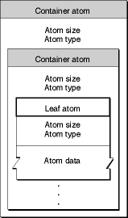
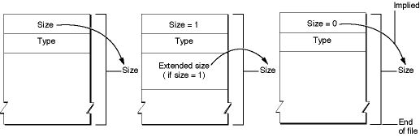
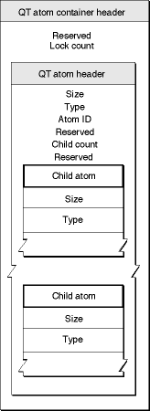
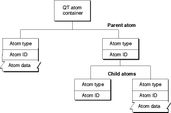
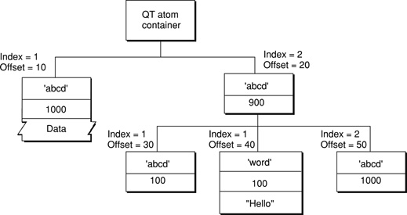
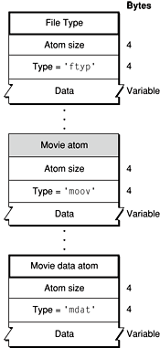
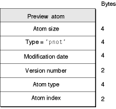

> 导航：[总目录](../../../README.md) · [documentation](../../../_indexes/documentation.md) · [QuickTime File Format Specification](Introduction%20to%20QuickTime%20File%20Format%20Specification.md)

[Next](Movie%20Atoms.md)[Previous](Introduction%20to%20QuickTime%20File%20Format%20Specification.md)

# Overview of QTFF

QuickTime movies are stored on disk, using two basic structures for storing information: _atoms_ (also known as _simple atoms_ or _classic atoms_) and _QT atoms_. To understand how QuickTime movies are stored, you need to understand the basic atom structures described in this chapter. Most atoms that you encounter in the QuickTime File Format are simple or classic atoms. Both simple atoms and QT atoms, however, allow you to construct arbitrarily complex hierarchical data structures. Both also allow your application to ignore data that they don’t understand.

## Media Description

A QuickTime file stores the description of its media separately from the media data.

The description is called the _movie resource_, _movie atom_, or simply _the movie_, and contains information such as the number of tracks, the video compression format, and timing information. The movie resource also contains an index describing where all the media data is stored.

The media data is the actual sample data, such as video frames and audio samples, used in the movie. The media data may be stored in the same file as the QuickTime movie, in a separate file, in multiple files, in alternate sources such as databases or real-time streams, or in some combination of these.

## Atoms

The basic data unit in a QuickTime file is the atom. Each atom contains size and type fields that precede any other data. The size field indicates the total number of bytes in the atom, including the size and type fields. The type field specifies the type of data stored in the atom and, by implication, the format of that data. In some cases, the size and type fields are followed by a version field and a flags field. An atom with these version and flags fields is sometimes called a _full atom_.

__Note:__ An _atom_, as described in this document, is functionally identical to a _box_, as described in the ISO specifications for MPEG-4 and Motion JPEG-2000. An atom that includes version and flags fields is functionally identical to a _full box_ as defined in those specifications.

Atom types are specified by a 32-bit unsigned integer, typically interpreted as a four-character ASCII code. Apple, Inc. reserves all four-character codes consisting entirely of lowercase letters. Unless otherwise stated, all data in a QuickTime movie is stored in big-endian byte ordering, also known as network byte ordering, in which the most significant bytes are stored and transmitted first.

Atoms are hierarchical in nature. That is, one atom can contain other atoms, which can contain still others, and so on. This hierarchy is sometimes described in terms of a parent, children, siblings, grandchildren, and so on. An atom that contains other atoms is called a _container atom_. The _parent atom_ is the container atom exactly one level above a given atom in the hierarchy.

For example, a movie atom contains several different kinds of atoms, including one track atom for each track in the movie. The track atoms, in turn, contain one media atom each, along with other atoms that define other track characteristics. The movie atom is the parent atom of the track atoms. The track atoms are siblings. The track atoms are parent atoms of the media atoms. The movie atom is _not_ the parent of the media atoms, because it is more than one layer above them in the hierarchy.

An atom that does not contain other atoms is called a _leaf atom_, and typically contains data as one or more fields or tables. Some leaf atoms act as flags or placeholders, however, and contain no data beyond their size and type fields.

The format of the data stored within a given atom cannot always be determined by the type field of the atom alone; the type of the parent atom may also be significant. In other words, a given atom type can contain different kinds of information depending on its parent atom. For example, the profile atom inside a movie atom contains information about the movie, while the profile atom inside a track atom contains information about the track. This means that all QuickTime file readers must take into consideration not only the atom type, but also the atom’s containment hierarchy.

### Atom Layout

[Figure 1-1](#apple-f4xwc4dqnrsv64tfmyxwi33df52wszbpkridimbqgaydsmzzfvbuqmrqgmwtgobzgq3a) shows the layout of a sample atom. Each atom carries its own size and type information as well as its data. Throughout this document, the name of a container atom (an atom that contains other atoms, including other container atoms) is printed in a gray box, and the name of a leaf atom (an atom that contains no other atoms) is printed in a white box. Leaf atoms contain data, usually in the form of tables.

__Figure 1-1__  A sample atom

A leaf atom, as shown in [Figure 1-1](#apple-f4xwc4dqnrsv64tfmyxwi33df52wszbpkridimbqgaydsmzzfvbuqmrqgmwtgobzgq3a), simply contains a series of data fields accessible by offsets.

Atoms within container atoms do not generally have to be in any particular order, unless such an order is specifically called out in this document. One such example is the handler description atom, which must come before the data being handled. For example, a media handler description atom must come before a media information atom, and a data handler description atom must come before a data information atom.

### Atom Structure

Atoms consist of a header, followed by atom data. The header contains the atom’s size and type fields, giving the size of the atom in bytes and its type. It may also contain an extended size field, giving the size of a large atom as a 64-bit integer. If an extended size field is present, the size field is set to 1. The actual size of an atom cannot be less than 8 bytes (the minimum size of the type and size fields).

Some atoms also contain version and flags fields. These are sometimes called full atoms. The flag and version fields are not treated as part of the atom header in this document; they are treated as data fields specific to each atom type that contains them. Such fields must always be set to zero, unless otherwise specified.

An atom header consists of the following fields:

**Atom size**
: A 32-bit integer that indicates the size of the atom, including both the atom header and the atom’s contents, including any contained atoms. Normally, the `size` field contains the actual size of the atom, in bytes, expressed as a 32-bit unsigned integer. However, the `size` field can contain special values that indicate an alternate method of determining the atom size. (These special values are normally used only for media data (`'mdat'`) atoms.)

Two special values are valid for the `size` field:

- 0, which is allowed only for a top-level atom, designates the last atom in the file and indicates that the atom extends to the end of the file.
- 1, which means that the actual size is given in the `extended size` field, an optional 64-bit field that follows the `type` field.

  This accommodates media data atoms that contain more than 2^32 bytes.

[Figure 1-2](#apple-f4xwc4dqnrsv64tfmyxwi33df52wszbpkridimbqgaydsmzzfvbuqmrqgmwtgobzguya) shows how to calculate the size of an atom.

**Type**
: A 32-bit integer that contains the type of the atom. This can often be usefully treated as a four-character field with a mnemonic value, such as `'moov' (0x6D6F6F76)` for a movie atom, or `'trak' (0x7472616B)` for a track atom, but non-ASCII values (such as `0x00000001`) are also used.

Knowing an atom's type allows you to interpret its data. An atom's data can be arranged as any arbitrary collection of fields, tables, or other atoms. The data structure is specific to the atom type. An atom of a given type has a defined data structure.

If your application encounters an atom of an unknown type, it should not attempt to interpret the atom's data. Use the atom's `size` field to skip this atom and all of its contents. This allows a degree of forward compatibility with extensions to the QuickTime file format.

__Warning__
The internal structure of a given type of atom can change when a new version is introduced. Always check the version field, if one exists. Never attempt to interpret data that falls outside of the atom, as defined by the Size or Extended Size fields.

**Extended Size**
: If the `size` field of an atom is set to 1, the `type` field is followed by a 64-bit `extended size` field, which contains the actual size of the atom as a 64-bit unsigned integer. This is used when the size of a media data atom exceeds 2^32 bytes.

When the `size` field contains the actual size of the atom, the `extended size` field is not present. This means that when a QuickTime atom is modified by adding data, and its size crosses the 2^32 byte limit, there is no `extended size` field in which to record the new atom size. Consequently, it is not always possible to enlarge an atom beyond 2^32 bytes without copying its contents to a new atom.

To prevent this inconvenience, media data atoms are typically created with a 64-bit placeholder atom immediately preceding them in the movie file. The placeholder atom has a type of `kWideAtomPlaceholderType` (`'wide'`).

Much like a `'free'` or `'skip'` atom, the `'wide'` atom is reserved space, but in this case the space is reserved for a specific purpose. If a `'wide'` atom immediately precedes a second atom, the second atom can be extended from a 32-bit size to a 64-bit size simply by starting the atom header 8 bytes earlier (overwriting the `'wide'` atom), setting the `size` field to 1, and adding an `extended size` field. This way the offsets for sample data do not need to be recalculated.

The `'wide'` atom is exactly 8 bytes in size, and consists solely of its `size` and `type` fields. It contains no other data.

__Note:__ A common error is thinking that the `'wide'` atom contains the extended size. The `'wide'` atom is merely a placeholder that can be overwritten if necessary, by an atom header containing an `extended size` field.

__Figure 1-2__  Calculating atom sizes

## QT Atoms and Atom Containers

QT atoms are an enhanced data structure that provide a more general-purpose storage format and remove some of the ambiguities that arise when using simple atoms. A QT atom has an expanded header; the size and type fields are followed by fields for an atom ID and a count of child atoms.

This allows multiple child atoms of the same type to be specified through identification numbers. It also makes it possible to parse the contents of a QT atom of unknown type, by walking the tree of its child atoms.

QT atoms are normally wrapped in an _atom container_, a data structure with a header containing a lock count. Each atom container contains exactly one _root_ atom, which is the QT atom. Atom containers are not atoms, and are not found in the hierarchy of atoms that makes up a QuickTime movie file. Atom containers may be found as data structures inside some atoms, however. Examples include media input maps and media property atoms.

__Important:__
An _atom container_ is _not_ the same as a _container atom_. An atom container is a _container_, not an atom.

[Figure 1-3](#apple-f4xwc4dqnrsv64tfmyxwi33df52wszbpkridimbqgaydsmzzfvbuqmrqgmwtgobzgu3a) depicts the layout of a QT atom. Each QT atom starts with a QT atom container header, followed by the root atom. The root atom’s type is the QT atom’s type. The root atom contains any other atoms that are part of the structure.

Each container atom starts with a QT atom header followed by the atom’s contents. The contents are either child atoms or data, but never both. If an atom contains children, it also contains all of its children’s data and descendants. The root atom is always present and never has any siblings.

__Figure 1-3__  QT atom layout

A QT atom container header contains the following data:

**Reserved**
: A 10-byte element that must be set to 0.

**Lock count**
: A 16-bit integer that must be set to 0.

Each QT atom header contains the following data:

**Size**
: A 32-bit integer that indicates the size of the atom in bytes, including both the QT atom header and the atom’s contents. If the atom is a leaf atom, then this field contains the size of the single atom. The size of container atoms includes all of the contained atoms. You can walk the atom tree using the size and child count fields.

**Type**
: A 32-bit integer that contains the type of the atom. If this is the root atom, the type value is set to `'sean'`.

**Atom ID**
: A 32-bit integer that contains the atom’s ID value. This value must be unique among its siblings. The root atom always has an atom ID value of 1.

**Reserved**
: A 16-bit integer that must be set to 0.

**Child count**
: A 16-bit integer that specifies the number of child atoms that an atom contains. This count includes only immediate children. If this field is set to 0, the atom is a leaf atom and contains only data.

**Reserved**
: A 32-bit integer that must be set to 0.

### QT Atom Containers

A QuickTime atom container is a basic structure for storing information in QuickTime. An atom container is a tree-structured hierarchy of QT atoms. You can think of a newly created QT atom container as the root of a tree structure that contains no children.

An atom container is a container, not an atom. It has a reserved field and a lock count in its header, not a size field and type field. Atom containers are not found in the atom hierarchy of a QuickTime movie file, because they are not atoms. They may be found as data inside some atoms, however, such as in media input maps, media property atoms, video effects sample data, and tween sample data.

A QT atom container contains QT atoms, as shown in [Figure 1-4](#apple-f4xwc4dqnrsv64tfmyxwi33df52wszbpkridimbqgaydsmzzfvbuqmrqgmwtknrrgazq). Each QT atom contains either data or other atoms. If a QT atom contains other atoms, it is a parent atom and the atoms it contains are its child atoms. Each parent’s child atom is uniquely identified by its atom type and atom ID. A QT atom that contains data is called a leaf atom.

__Figure 1-4__  QT atom container with parent and
child atoms

Each QT atom has an offset that describes the atom’s position within the QT atom container. In addition, each QT atom has a type and an ID. The atom type describes the kind of information the atom represents. The atom ID is used to differentiate child atoms of the same type with the same parent; an atom’s ID must be unique for a given parent and type. In addition to the atom ID, each atom has a 1-based index that describes its order relative to other child atoms of the same parent with the same atom type. You can uniquely identify a QT atom in one of three ways:

- By its offset within its QT atom container
- By its parent atom, type, and index
- By its parent atom, type, and ID

You can store and retrieve atoms in a QT atom container by index, ID, or both. For example, to use a QT atom container as a dynamic array or tree structure, you can store and retrieve atoms by index. To use a QT atom container as a database, you can store and retrieve atoms by ID. You can also create, store, and retrieve atoms using both ID and index to create an arbitrarily complex, extensible data structure.

__Warning:__
Since QT atoms are offsets into a data structure, they can be changed during editing operations on QT atom containers, such as inserting or deleting atoms. For a given atom, editing child atoms is safe, but editing sibling or parent atoms invalidates that atom’s offset.

__Note:__ For cross-platform purposes, all data in a QT atom is expected to be in big-endian format. However, leaf data can be little-endian if it is custom to an application.

[Figure 1-5](#apple-f4xwc4dqnrsv64tfmyxwi33df52wszbpkridimbqgaydsmzzfvbuqmrqgmwtknrrhe3a) shows a QT atom container that has two child atoms. The first child atom (offset = 10) is a leaf atom that has an atom type of `'abcd'`, an ID of 1000, and an index of 1. The second child atom (offset = 20) has an atom type of `'abcd'`, an ID of 900, and an index of 2. Because the two child atoms have the same type, they must have different IDs. The second child atom is also a parent atom of three atoms.

__Figure 1-5__  A QT atom container with two child atoms

The first child atom (offset = 30) has an atom type of `'abcd'`, an ID of 100, and an index of 1. It does not have any children, nor does it have data. The second child atom (offset = 40) has an atom type of `'word'`, an ID of 100, and an index of 1. The atom has data, so it is a leaf atom. The second atom (offset = 40) has the same ID as the first atom (offset = 30), but a different atom type. The third child atom (offset = 50) has an atom type of `'abcd'`, an ID of 1000, and an index of 2. Its atom type and ID are the same as that of another atom (offset = 10) with a different parent.

__Note:__ If you are working with the QuickTime API, you do not need to parse QT atoms. Instead, the QT atom functions can be used to create atom containers, add atoms to and remove atoms from atom containers, search for atoms in atom containers, and retrieve data from atoms in atom containers.

Most QT atom functions take two parameters to specify a particular atom: the atom container that contains the atom, and the offset of the atom in the atom container data structure. You obtain an atom’s offset by calling either `QTFindChildByID` or `QTFindChildByIndex`. An atom’s offset may be invalidated if the QT atom container that contains it is modified.

When calling any QT atom function for which you specify a parent atom as a parameter, you can pass the constant `kParentAtomIsContainer` as an atom offset to indicate that the specified parent atom is the atom container itself. For example, you would call the `QTFindChildByIndex` function and pass `kParentAtomIsContainer` constant for the parent atom parameter to indicate that the requested child atom is a child of the atom container itself.

## QuickTime Movie Files

The QuickTime file format describes the characteristics of QuickTime movie files. A QuickTime movie file contains a QuickTime movie resource, or else points to one or more external sources using movie references. The media samples used by the movie (such as video frames or groups of audio samples) may be included in the movie file, or may be external to the movie file in one or more files, streams, or other sources.

A QuickTime movie is not limited to video and audio; it may use any subset or combination of media types that QuickTime supports, including video, sound, still images, text, Flash, 3D models, and virtual reality panoramas. It supports both time-based and nonlinear interactive media.

In file systems that support filename extensions, QuickTime movie files should have an extension of `.mov`. On the Macintosh platform, QuickTime files have a Mac OS file type of `'MooV'`. QuickTime movie files should always be associated with the MIME type `"video/quicktime"`, whether or not the movie contains video.

__Note:__ The use of resource forks for the storage of QuickTime media is deprecated in the QuickTime file format. The information below is intended to document existing content and should not be used for new development.

In file systems that support both a resource fork and a data fork, the movie resource may be contained in the resource fork. The default, however, is for the movie resource to be contained in the data fork for all file systems. If media sample data is included in the movie file, it is always in the data fork.

A QuickTime movie file is structured as a collection of atoms that together identify the file as a QuickTime movie, describe the structure of the movie, and may contain the sample data needed to play the movie. Not all atoms are required.

The file format is extensible, and from time to time new atom types are introduced. If your application encounters an unknown atom type in a QuickTime file, it should simply ignore it. This allows the file format to be extended without breaking existing applications, and provides a measure of forward compatibility. Because the first field in any atom contains its size, including any contained atoms, it is easy to skip to the end of an unknown atom type and continue parsing the file.

__Important:__ Generally speaking, atoms can be present in any order. Do not conclude that a particular atom is not present until you have parsed all the atoms in the file.

An exception is the file type atom, which typically identifies the file as a QuickTime movie. If present, this atom precedes any movie atom, movie data, preview, or free space atoms. If you encounter one of these other atom types prior to finding a file type atom, you may assume the file type atom is not present. (This atom is introduced in the _QuickTime File Format Specification_ for 2004, and is not present in QuickTime movie files created prior to 2004).

While other atoms can be in any order, unless specified in this document, for practical reasons there is a recommended order that you should use when creating a QuickTime movie file. For example, the atom containing the movie resource should precede any atoms containing the movie's sample data. If you follow this recommended atom order, it is possible to play a movie over a network while the movie file is in the process of downloading.

A QuickTime movie file must contain a movie atom, which contains either the movie structure or a reference to one or more alternate movie sources external to the file. Generally speaking, these alternate sources will be QuickTime movie files that contain movie structures.

A QuickTime movie file typically contains one or more movie data atoms, which contain media sample data such as video frames and groups of audio samples. There may be no movie data atoms in the file, however, as the movie may depend on sample data external to the movie file, such as external data files or live streams on the Internet. A single movie data atom may contain sample data for a variety of different media. Generally speaking, it is possible to contain all the media samples used by a movie in a single movie data atom. Movie data atoms can be quite large, and sometimes exceed 2^32 bytes.

[Figure 1-6](#apple-f4xwc4dqnrsv64tfmyxwi33df52wszbpkridimbqgaydsmzzfvbuqmrqgmwtgobzgy4a) shows the essential atom types in a QuickTime movie file within which other atoms are stored. In addition, the file may contain free space atoms, preview atoms, and other atoms not enumerated in this file format specification. Unknown atom types should be ignored.

__Figure 1-6__  The structure of a QuickTime movie file

[Table 1-1](#apple-f4xwc4dqnrsv64tfmyxwi33df52wszbpkridimbqgaydsmzzfvbuqmrqgmwtimryhe3q) lists the basic atom types.

__Table 1-1__  Basic atom types of a QuickTime file

| Atom type | Use |
| `'ftyp'` | File type compatibility—identifies the file type and differentiates it from similar file types, such as MPEG-4 files and JPEG-2000 files. |
| `'moov'` | Movie resource metadata about the movie (number and type of tracks, location of sample data, and so on). Describes where the movie data can be found and how to interpret it. |
| `'mdat'` | Movie sample data—media samples such as video frames and groups of audio samples. Usually this data can be interpreted only by using the movie resource. |
| `'free'` | Unused space available in file. |
| `'skip'` | Unused space available in file. |
| `'wide'` | Reserved space—can be overwritten by an extended size field if the following atom exceeds 2^32 bytes, without displacing the contents of the following atom. |
| `'pnot'` | Reference to movie preview data. |

The following sections describe these basic atom types (except for the movie atom) in more detail, including descriptions of other atoms that each basic atom may contain. The movie atom is described separately in [Movie Atoms](Movie%20Atoms.md#apple-f4xwc4dqnrsv64tfmyxwi33df52wszbpkridimbqgaydsmzzfvbuqmrqgqwvgvzr)

### The File Type Compatibility Atom

The file type compatibility atom, also called the file type atom, allows the reader to determine whether this is a type of file that the reader understands. Specifically, the file type atom identifies the file type specifications with which the file is compatible. This allows the reader to distinguish among closely related file types, such as QuickTime movie files, MPEG-4, and JPEG-2000 files (all of which may contain file type atoms, movie atoms, and movie data atoms).

When a file is compatible with more than one specification, the file type atom lists all the compatible types and indicates the preferred brand, or best use, among the compatible types. For example, a music player using a QuickTime-compatible file format might identify a file’s best use as a music file for that player but also identify it as a QuickTime movie.

The file type atom serves a further purpose of distinguishing among different versions or specifications of the same file type, allowing it to convey more information than the file extension or MIME type alone. The file type atom also has the advantage of being internal to the file, where it is less subject to accidental alteration than a file extension or MIME type.

__Note:__ The file type atom described here is functionally identical to the file type box defined in the ISO specifications for MPEG-4 and JPEG-2000.

The file type atom is optional, but strongly recommended. If present, it must be the first significant atom in the file, preceding the movie atom (and any free space atoms, preview atom, or movie data atoms).

The file type atom has an atom type value of `'ftyp'` and contains the following fields:

**Size**
: A 32-bit unsigned integer that specifies the number of bytes in this atom.

**Type**
: A 32-bit unsigned integer that identifies the atom type, typically represented as a four-character code; this field must be set to `'ftyp'`.

**Major_Brand**
: A 32-bit unsigned integer that should be set to `'qt  '` (note the two trailing ASCII space characters) for QuickTime movie files. If a file is compatible with multiple brands, all such brands are listed in the _Compatible_Brands_ fields, and the _Major_Brand_ identifies the preferred brand or best use.

**Minor_Version**
: A 32-bit field that indicates the file format specification version. For QuickTime movie files, this takes the form of four binary-coded decimal values, indicating the century, year, and month of the _QuickTime File Format Specification_, followed by a binary coded decimal zero. For example, for the June 2004 minor version, this field is set to the BCD values `20 04 06 00`.

**Compatible_Brands[ ]**
: A series of unsigned 32-bit integers listing compatible file formats. The major brand must appear in the list of compatible brands. One or more “placeholder” entries with value zero are permitted; such entries should be ignored.

If none of the Compatible_Brands fields is set to `'qt  '`, then the file is not a QuickTime movie file and is not compatible with this specification. Applications should return an error and close the file, or else invoke a file importer appropriate to one of the specified brands, preferably the major brand. QuickTime currently returns an error when attempting to open a file whose file type, file extension, or MIME type identifies it as a QuickTime movie, but whose file type atom does not include the `'qt  '` brand.

__Note:__ A common source of this error is an MPEG-4 file incorrectly named with the `.mov` file extension or with the MIME type incorrectly set to “video/quicktime”. MPEG-4 files are automatically imported by QuickTime only when they are correctly identified as MPEG-4 files using the Mac OS file type, file extension, or MIME type.

If you are creating a file type that is fully compatible with the QuickTime file format, one of the Compatible_Brand fields must be set to `'qt  '`; otherwise QuickTime will not recognize the file as a QuickTime movie.

__Warning:__
Use of the QuickTime file format in this manner is subject to license from Apple, Inc.

### Free Space Atoms

Both `free` and `skip` atoms designate unused space in the movie data file. These atoms consist of only an atom header (size and type fields), followed by the appropriate number of bytes of free space. When reading a QuickTime movie, your application may safely skip these atoms. When writing or updating a movie, you may reuse the space associated with these atom types.

A `wide` atom typically precedes a movie data atom. The `wide` atom consists only of a type and size field. This occupies 8 bytes—enough space to add an extended size field to the header of the atom that follows, without displacing the contents of that atom. If an atom grows to exceed 2^32 bytes in size, and it is preceded by a `wide` atom, you may create a new atom header containing an extended size field by overwriting the existing atom header and the preceding `wide` atom.

### Movie Data Atoms

As with the free and skip atoms, the movie data atom is structured quite simply. It consists of an atom header (atom size and type fields), followed by the movie’s media data. Your application can understand the data in this atom only by using the metadata stored in the movie atom. This atom can be quite large, and may exceed 2^32 bytes, in which case the size field will be set to 1, and the header will contain a 64-bit extended size field.

### Preview Atoms

The preview atom contains information that allows you to find the preview image associated with a QuickTime movie. The preview image, or poster, is a representative image suitable for display to the user in, for example, Open dialog boxes. [Figure 1-7](#apple-f4xwc4dqnrsv64tfmyxwi33df52wszbpkridimbqgaydsmzzfvbuqmrqgmwtgobzg4za) depicts the layout of the preview atom.

__Figure 1-7__  The layout of a preview atom

The preview atom has an atom type value of `'pnot'` and, following its atom header, contains the following fields:

**Size**
: A 32-bit integer that specifies the number of bytes in this preview atom.

**Type**
: A 32-bit integer that identifies the atom type; this field must be set to `'pnot'`.

**Modification date**
: A 32-bit unsigned integer containing a date that indicates when the preview was last updated. The data is in standard Macintosh format.

**Version number**
: A 16-bit integer that must be set to 0.

**Atom type**
: A 32-bit integer that indicates the type of atom that contains the preview data. Typically, this is set to `'PICT'` to indicate a QuickDraw picture.

**Atom index**
: A 16-bit integer that identifies which atom of the specified type is to be used as the preview. Typically, this field is set to 1 to indicate that you should use the first atom of the type specified in the atom type field.

__Note:__ This specification defines the preview atom primarily for backward compatibility. Current practice is normally to define movie previews by placing information in the movie header atom. See [Movie Header Atoms](Movie%20Atoms.md#apple-f4xwc4dqnrsv64tfmyxwi33df52wszbpkridimbqgaydsmzzfvbuqmrqgqwtknrtgezq).

[Next](Movie%20Atoms.md)[Previous](Introduction%20to%20QuickTime%20File%20Format%20Specification.md)
