> 导航：[总目录](../../../README.md) · [documentation](../../../_indexes/documentation.md) · [QuickTime Kit Programming Guide](Introduction%20to%20QuickTime%20Kit%20Programming%20Guide.md)


[Next](Document%20Revision%20History.md)[Previous](Extending%20the%20QTKitPlayer%20To%20Stream%20Audio%20and%20Video.md)

# Adding Multimedia Playback Capability

In this chapter, you’ll add multimedia playback to your QTKitPlayer, working with the tools available to you in Interface Builder and Xcode 2.0. The goal is, as in previous chapters, to build on the code you’ve written and the interface you’ve constructed, so that you can enhance the capabilities of the QTKitPlayer—with a minimum of programming effort.

When completed, the results will be dramatic and visually exciting: a multimedia playback engine capable of simultaneously playing in real time as many as six different QuickTime movies, QuickTime VR panoramas and object movies, streaming audio and video, animation and wired sprite movies, and other content that QuickTime can import and display. The user experience will be enhanced and require some degree of interactivity with the multimedia content that is displayed. Just controlling multichannel sound or interactive VR movies will alter the user experience.

In the completed project, you’ll add a new menu title, Studio, to the QTKitPlayer and a menu item, Present Movies. You’ll also add code to open and display all six QuickTime movies in a window, with multiple—and resizable—views of each movie.

Clicking a button in the Play Multimedia Content window will open a dialog box from which users will be able to select any movie or media type of their choice (Figure 6-1). After each movie is chosen, a new dialog box appears, prompting the user for another selection until the user has populated the window with all six QuickTime movies, as shown in Figure 6-2.

__Figure 6-1__  Opening six QuickTime movies of the user’s choosing for display in the multimedia content window of the QTKitPlayer application

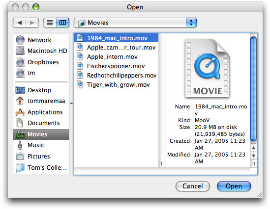

The window in which the movies are displayed can be resized to full screen for maximum visual impact and the toolbar at the top can be collapsed for a kiosk-like effect. The three movies displayed at the top of window contain an NSSplitView, while an NSTabView is provided for two movies and a text view below, and an NSScrollView with a movie appears in the right corner of the window.

The intended effect is for some degree of user interactivity with one or all of the QuickTime movies displayed, either by splitting the views and tabbing through them, or starting and stopping the playback of each movie. If all six movies are different QuickTime VR panoramas or object movies, for example, the user will be able to point and click through a variety of landscapes or hotspots from different points of view. The result is a heightened user experience.

__Figure 6-2__  All six movies selected by the user playing in different views

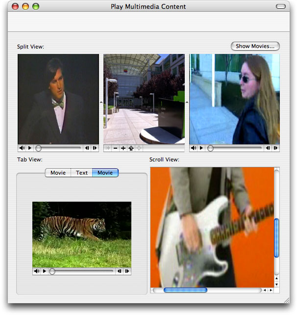

Users may interact as they would with a multimedia kiosk or presentation, playing each movie at a different rate using the playback commands available in the QTKitPlayer.

At the programming level, each movie is simply a QTMovieView object and is intended to interact with other standard Cocoa views. The Show Movies button in the Play Multimedia Content window will launch each of the six dialogs that enable the user to choose a movie for display and playback. Users can then control the playback of each movie using the commands available in the QTKitPlayer to start, stop, go to the beginning, go to the end, show poster frame, step forward and step backward. Movies can also be controlled by toggling the spacebar to start and stop playback. Movie editing, however, is not enabled for any movie being displayed.

If you’ve worked through the examples in the previous chapters, you’ll be ready to move ahead with constructing and coding the multimedia playback enhancement for your QTKitPlayer.

The tasks you want to accomplish in adding this new functionality to your QTKitPlayer application are less complex than those in the previous chapter. You’ll build on the existing QTKitPlayer, using the tools available to you in Interface Builder 2.5 and Xcode 2.0. The code you’ll need to add to the project in order to make it work will be surprisingly simple—but powerful. You’ll do this:

1. Add a View Tests Window to your MainMenu.nib in Interface Builder and populate that window with the QTMovieView objects you need to display QuickTime movies, as indicated in Figure 6-3.
2. Specify the attributes of the View Tests Window you’ve added to the nib.
3. Subclass NSObject with a `ViewTestsController` class in your MainMenu.nib and wire it up with outlets and actions to handle the opening and display of movies in the View Tests Window.
4. Add to your Xcode project a new `ViewTestsController.h` declaration file in which you define the instance variables and actions for your `ViewTestsController` class.
5. Add an `ViewTestsController.m` implementation file to your QTKitPlayer project in which you handle getting and setting the movies you want to play, notifications, stopping and clearing the movies that are playing, and adding a toolbar which can be shown or not shown.
6. Add a new menu title to the QTKitPlayer and a menu item to open the window
7. Connect the Show Movies button to the ViewTestsController object.

   __Figure 6-3__  The layout of the objects in the content window with the Present Movies menu item selected

   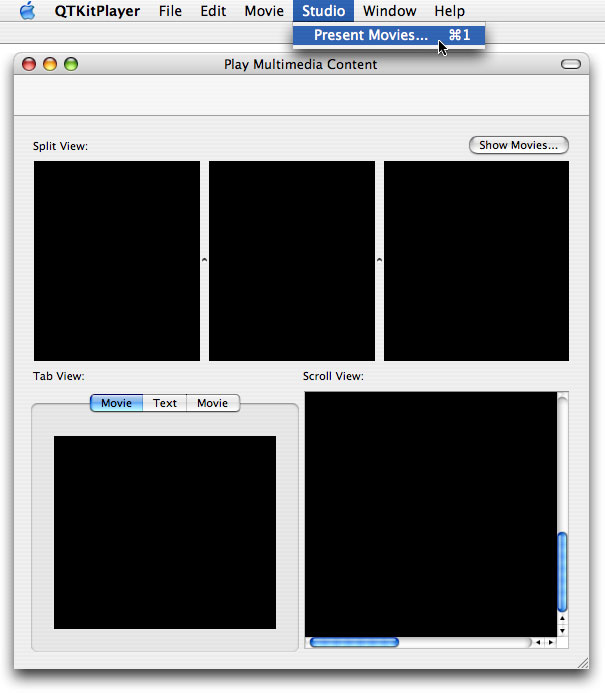

Each task is outlined in the next sections of this chapter. You’ll start as you have before with Interface Builder and then move on to add the code you need in two separate Xcode files.

By now you should be familiar with how to work with Interface Builder and its various palettes, icons, and objects. For purposes of simplicity and to move things forward a bit faster, this means combining a few basic steps in constructing your multimedia playback engine with all the different QTMovieView objects in view. To start:

1. Drag a window object from the Cocoa-Windows palette in Interface Builder into your MainMenu.nib and name it View Tests Window.
2. Command-1 to open the NSWindow info panel and set the attributes for the window object, as shown in Figure 6-4. Enter the window title Play Multimedia Content.

   __Figure 6-4__  The attributes pane for the View Tests Window object

   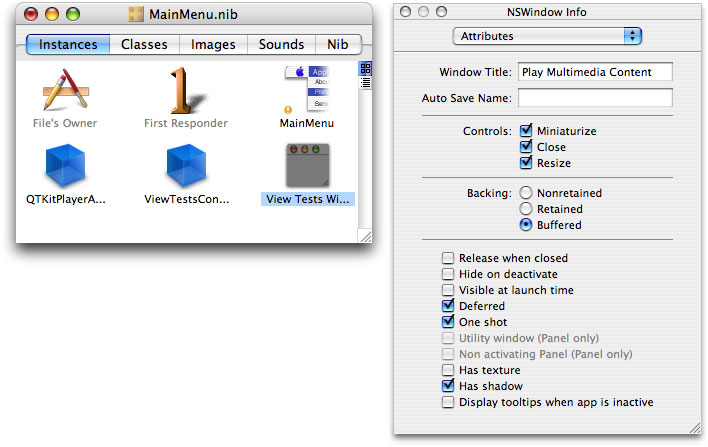
3. Press Command-3 to open the Size of the View Tests Window and set the size and springs, as shown in Figure 6-5.

   __Figure 6-5__  The size of the View Tests Window with the springs set

   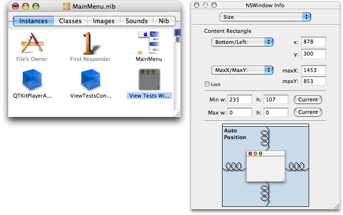
4. Now you want to construct your Play Multimedia Content window, as shown completed in Figure 6-6. Drag CustomView objects into the window and subclass them as QTMovieView objects. (In the Info window, use the Custom Class pop-up to subclass the objects.)
5. Figure 6-6 shows a lot of steps that may not be obvious. To simplify, do this: Drag the TabView object into the window from the palette. Drag three CustomView objects into the window, select all three by shift-clicking, and choose Layout > Make Subviews Of > Split View. Repeat this for the ScrollView. This is the preferred way of working with these objects in your window.
6. Now you want to drag CustomView objects onto the TabView, SplitView, and ScrollView objects. Subclass them as QTMovieView objects.
7. Add textfields for Split View:, Tab View:, and Scroll View. Also, you want to add buttons in Tab View for Movie, Text, and Movie, as shown in Figure 6-6.

   __Figure 6-6__  The layout of QTMovieView objects with textfields added for different views

   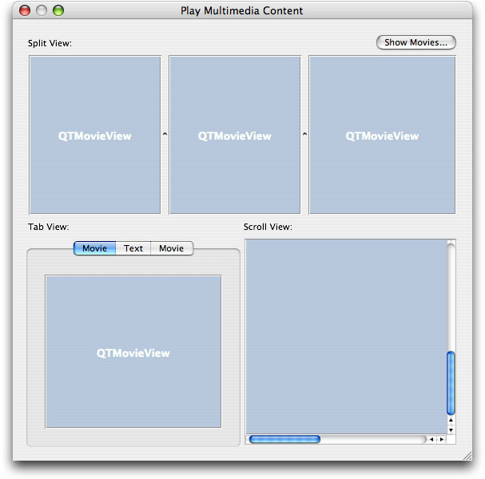
8. Drag a button from the Cocoa-Controls palette into the upper right corner of the window. Name the button Show Movies and specify its attributes, as shown in Figure 6-7.

   __Figure 6-7__  Button attributes

   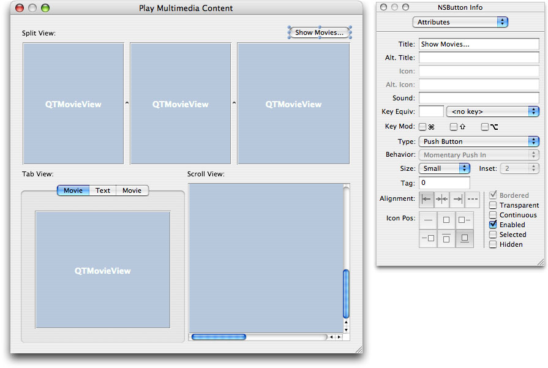
9. Create an action `doSetMovies:` for the Show Movies button in the upper right hand corner of the window. Double-click the ViewTestsController object. Click the actions pane. Click the Add button to add an action `doSetMovies:`.
10. Wire the Show Movies button to the doSetMovies: action. Click t he Show Movies button and press the Control key. Click-drag from the button to the ViewTestsController object. In the Info window for the ViewTestsController object, click the Connect button.
11. Now you want to specify the window attributes for the Split View, shown in Figure 6-8.

    __Figure 6-8__  Split View attributes specified

    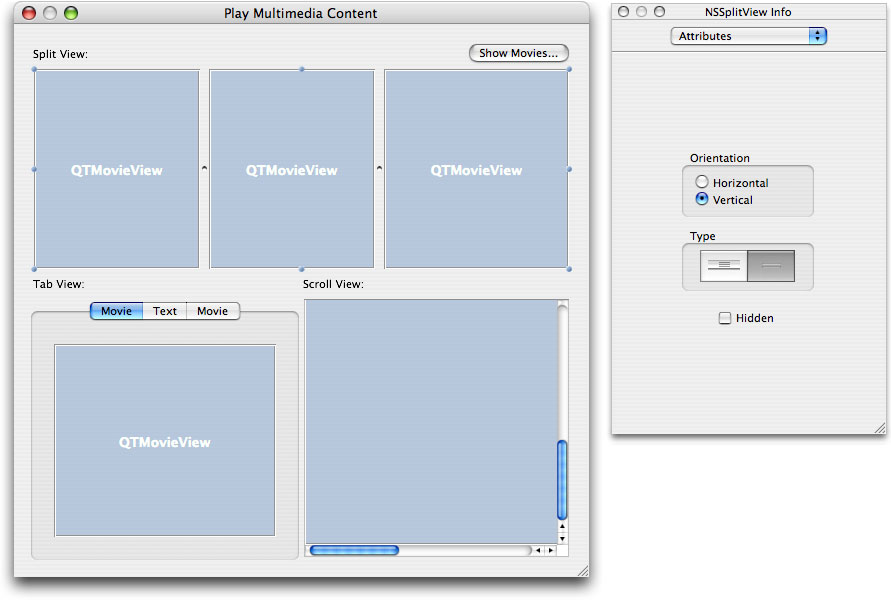
12. Specify the window attributes for the Tab View. Note the number of items in the TabView object, as shown in Figure 6-9.

    __Figure 6-9__  Tab view attributes specified

    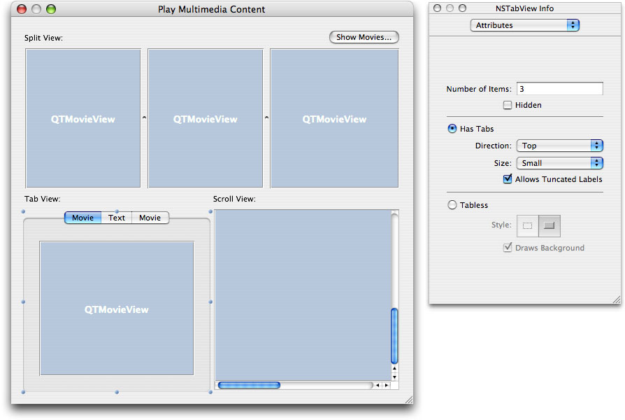
13. Specify the attributes in the Text TabViewItem, as shown in Figure 6-10. The user will be able to enter text into this window.

    __Figure 6-10__  Text attribute specified

    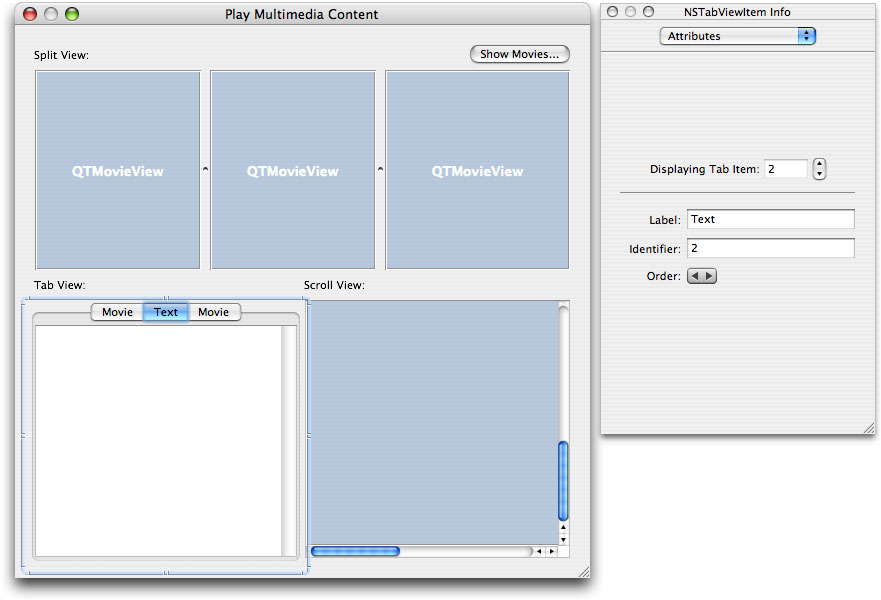
14. Specify the attributes of the Scroll View object, with border style, and vertical and horizontal scroller checked, as shown in Figure 6-11.

    __Figure 6-11__  Scroll View attributes specified

    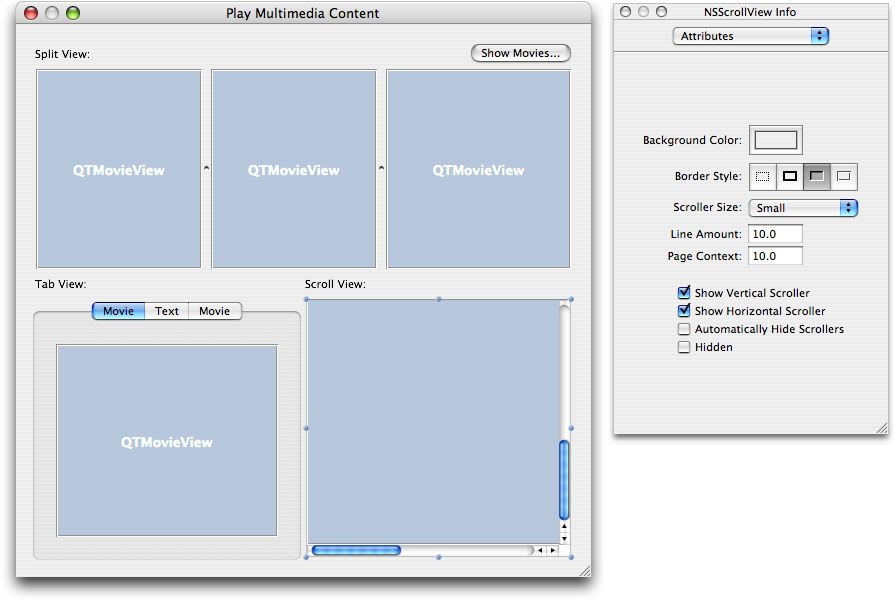
15. To make the controller, subclass NSObject, and name the controller ViewTestsController.
16. Add outlets to ViewTestsController. Double-click the ViewTestsController object. In the Info window, click the Add button to add the following outlets: `mScrollViewMovieView`, `mSplitViewMovieView1`, `mSplitViewMovieView2`, `mSplitViewMovieView3`, `mTabViewMovieView1`, `mTabViewMovieView2`, and `mViewTestsWindow`, as shown in Figure 6-12.

    __Figure 6-12__  Outlet connections for the ViewTestsController

    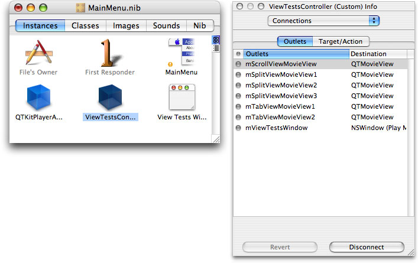
17. Now you want to wire up the connections from the various QTMovieView objects in the window to their respective outlets. Control-drag from the ViewTestController object to the ScrollView, TabView, and SplitView objects in the window and click the Connect button, as shown in Figure 6-13.

    __Figure 6-13__  Connecting the ViewTestsController to an outlet

    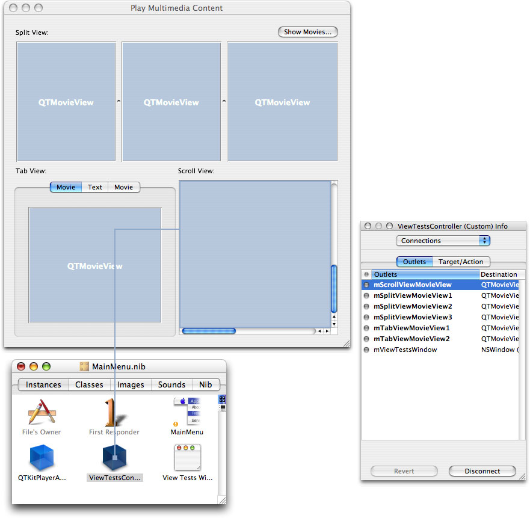
18. Add another menu to the MainMenu.nib - MainMenu in Interface Builder with the title Studio, and add a menu item entitled Present Movies with a Command-1 keystroke equivalent.
19. Add an action `doShowViewTestsWindow:` to ViewTestsController. Double-click the ViewTestsController icon. In the Info window, click the Actions pane. Click the Add button to add an action `doShowViewTestsWindow:`.
20. Connect the Present Movies menu item by pressing the Control key and drag-connecting the wire to the `ViewTestsController` object. Make the connection to the `doShowViewTestsWindow` target, as shown in Figure 6-14.

    __Figure 6-14__  The present movie connection to the ViewTestsController and target

    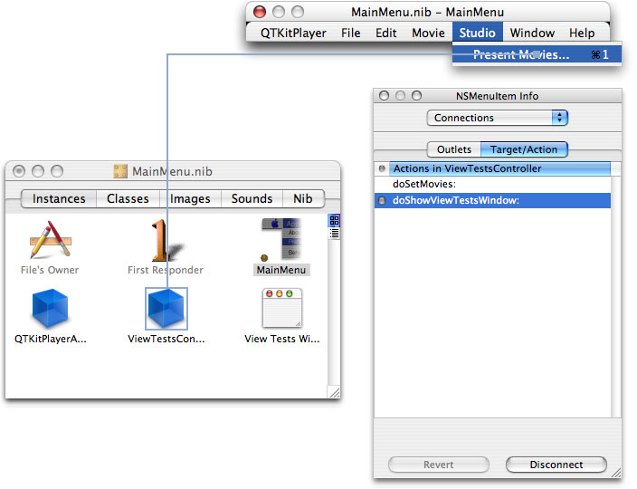
21. Connect the Show Movies button to the ViewTestsController object, as shown in Figure 6-15.

    __Figure 6-15__  Connecting the Show Movies button to the ViewTestsController with its target

    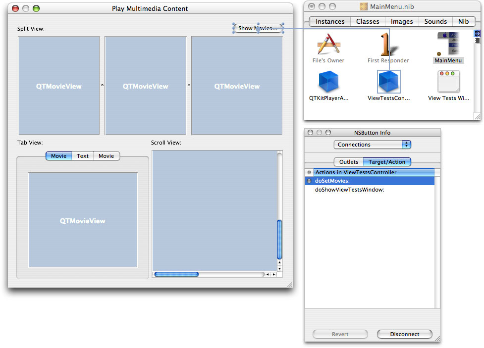

This completes the steps you need to follow in Interface Builder. You’re now ready to add the code to make the project work.

In this section, you’ll add two new files to your Xcode project, including a `ViewTestsController.h` declaration file and an `ViewTestsController.m` implementation file. Figure 6-16 shows the class model for the `ViewTestsController` class with its properties and their connections listed

__Figure 6-16__  The class model in Xcode 2.0 of the ViewTestsController class

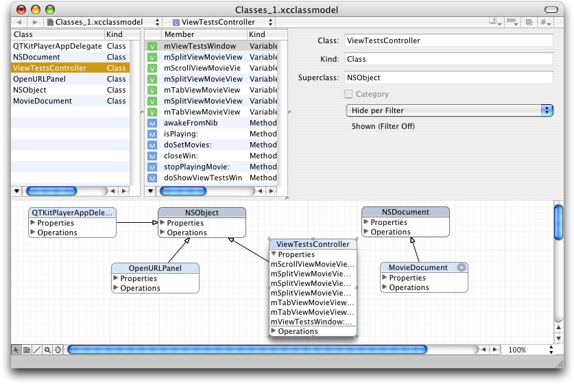

In this next sequence of steps, you’ll be adding a small amount of code to your `ViewTestsController.h` class interface file.

To begin, in your QTKitPlayer project, choose File > New File. In the Assistant window for your new file in Xcode 2.0, select Cocoa > Objective-C class and in the window that opens enter the title `ViewTestsController.h` . Now follow these steps:

1. Insert the following import code at the beginning of your file:

```objc
#import <Cocoa/Cocoa.h>
#import <QTKit/QTKit.h>
```
2. Add this line of code:

```
@class QTMovieView;
```
3. Add the following block of code declaring the instance variables that belong to your `ViewTestsController` class:

```objc
@interface ViewTestsController : NSObject
{
    IBOutlet NSWindow    *mViewTestsWindow;
    IBOutlet QTMovieView *mSplitViewMovieView1;
    IBOutlet QTMovieView *mSplitViewMovieView2;
    IBOutlet QTMovieView *mSplitViewMovieView3;
    IBOutlet QTMovieView *mTabViewMovieView1;
    IBOutlet QTMovieView *mTabViewMovieView2;
    IBOutlet QTMovieView *mScrollViewMovieView;
 }
```
4. Define the actions you need before the `@end` directive in order to show movies in your window and to show the window itself:

```objc
- (IBAction)doSetMovies:(id)sender;
- (IBAction)doShowViewTestsWindow:(id)sender;
```

That’s it. Save your `ViewTestsController.h` file.

In this next sequence of steps, you’ll be adding a larger chunk of code to your `ViewTestsController.m` implementation file.

To begin, in your QTKitPlayer project, choose File > New File. In the Assistant window for your new file in Xcode 2.0, select Cocoa > Objective-C class and in the window that opens enter the title `ViewTestsController.m` . Now follow these steps

1. Insert the following import line at the beginning of your file:

```objc
#import "ViewTestsController.h"
```
2. Following your import statement, you want to add this line:

```objc
@implementation ViewTestsController
```
3. You want to be notified when the window is closing so you can do a cleanup. Insert these lines of code:

```objc
-(void)awakeFromNib
{
 [ [NSNotificationCenter defaultCenter]
    addObserver:self selector:@selector(closeWin:)
 name:NSWindowWillCloseNotification object:mViewTestsWindow ];
}
```
4. Add this next block to specify if the movie is playing or not. If the movie is currently playing, it returns `YES`. If not, it returns `NO`.

```objc
-(BOOL)isPlaying:(QTMovie *)aMovie
{
 if ([aMovie rate] == 0)
 {
return NO;
}
return YES:
}
```
5. Next, you need to add code to stop the movie from playing. Add these lines:

```objc
-(void)stopPlayingMovie:(QTMovie *)aMovie
{
    if ([self isPlaying:aMovie] == YES)
    {
        [aMovie stop];
    }
}
```
6. Insert the following code to handle stopping of any currently playing movies and to clear the movies that were previously set for each view:

```objc
- (void)closeWin:(void *)userInfo
{
    // stop any currently playing movies
    [self stopPlayingMovie:[mSplitViewMovieView1 movie]];
    [self stopPlayingMovie:[mSplitViewMovieView2 movie]];
    [self stopPlayingMovie:[mSplitViewMovieView3 movie]];
    [self stopPlayingMovie:[mTabViewMovieView1 movie]];
    [self stopPlayingMovie:[mTabViewMovieView2 movie]];
    [self stopPlayingMovie:[mScrollViewMovieView movie]];

    // clear the movies that were previously set for each view
    [mSplitViewMovieView1 setMovie:NULL];
    [mSplitViewMovieView2 setMovie:NULL];
    [mSplitViewMovieView3 setMovie:NULL];
    [mTabViewMovieView1 setMovie:NULL];
    [mTabViewMovieView2 setMovie:NULL];
    [mScrollViewMovieView setMovie:NULL];

}
```
7. To get the movies you want to play and open the panel so the user can choose, insert this chunk of code:

```objc
- (QTMovie *)getAMovieFile
{
    NSOpenPanel *openPanel;
 openPanel = [NSOpenPanel openPanel];
    [openPanel setCanChooseDirectories:NO];

    if ([openPanel runModalForTypes:[QTMovie movieUnfilteredFileTypes]] == NSOKButton)
    {
        return [QTMovie movieWithFile:[openPanel filename] error:NULL];
    }

    return nil;
```
8. To set the movies, add this chunk of code:

```objc
- (IBAction)doSetMovies:(id)sender
    // set the movies
 [mSplitViewMovieView1 setMovie:[self getAMovieFile]];
    [mSplitViewMovieView2 setMovie:[self getAMovieFile]];
    [mSplitViewMovieView3 setMovie:[self getAMovieFile]];
    [mTabViewMovieView1 setMovie:[self getAMovieFile]];
    [mTabViewMovieView2 setMovie:[self getAMovieFile]];
    [mScrollViewMovieView setMovie:[self getAMovieFile]];
}
```
9. To add a toolbar and to show the window, add the following code:

```objc
- (IBAction)doShowViewTestsWindow:(id)sender
{
    // add a toolbar
    if ([mViewTestsWindow toolbar] == nil)
        [mViewTestsWindow setToolbar:[[[NSToolbar alloc] initWithIdentifier:@"QTKitPlayer"] autorelease]];

    // show the window
    [mViewTestsWindow makeKeyAndOrderFront:nil];
}

@end
```

This completes the steps for adding code to your `ViewTestsController.m` implementation file. You can build and compile your QTKitPlayer application for multimedia playback.

If you’ve worked through the steps outlined in this chapter, you’ll have extended your knowledge of how to build a media player that is capable of displaying and playing back up to six QuickTime movies. You can modify the code to meet your own needs, if, for example, you want to set up the QTKitPlayer so that it only displays movies that are pre-selected. This is possible with a minimum amount of code tweaking.

The goal is to expand the possibilities that are available to you with the new QTKit framework.

The effect of multimedia playback can be dramatic, indeed, when the user is able to view all six movies at full screen on their computer and even resize each movie to meet their viewing needs. In the illustration shown in Figure 6-17, the QuickTime VR movie in the lower left portion of the playback window is stretched out for improved VR viewing and navigation.

__Figure 6-17__  Full screen multimedia playback with resizing of the QuickTime VR movie in the lower left portion of the window

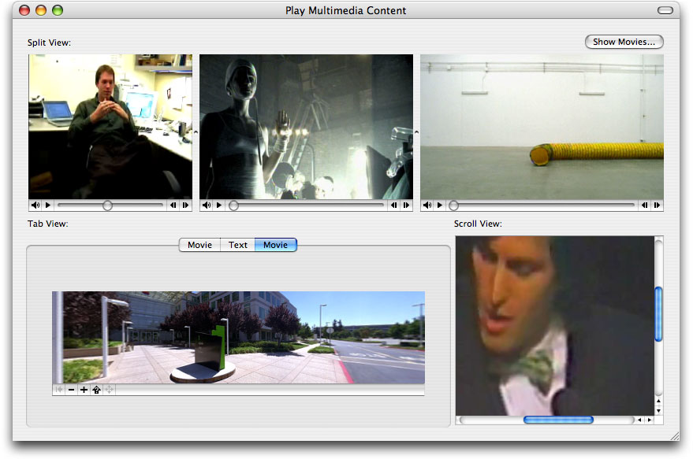

[Next](Document%20Revision%20History.md)[Previous](Extending%20the%20QTKitPlayer%20To%20Stream%20Audio%20and%20Video.md)

