> 导航：[总目录](../../../README.md) · [documentation](../../../_indexes/documentation.md) · [QuickTime Kit Programming Guide](Introduction%20to%20QuickTime%20Kit%20Programming%20Guide.md)


[Next](Extending%20the%20QTKitPlayer%20To%20Stream%20Audio%20and%20Video.md)[Previous](Extending%20the%20QTKitPlayer%20Application.md)

# Adding New Capabilities to the QTKitPlayer Application

In this chapter, you’ll extend the QTKitPlayer application beyond what you have constructed in the previous chapter. You’ll add an NSDrawer object to the QTMovieView window, which toggles open and close with the click of a mouse. The drawer will also have new, enhanced functionality, including the capability of displaying a movie’s current time and duration, its normal and current size, and its source.

Notably, as you work through the steps outlined in this chapter and add new chunks of code to your Xcode project, you’ll implement a callback mechanism from the QuickTime C API.

When you’ve completed your Xcode project, you’ll be able to choose File > New in your extended QTKitPlayer and an untitled QuickTime movie with a black screen will open for you. If you click the button in the middle of the frame to the right, as shown in Figure 4-1, a Cocoa drawer pops open.

__Figure 4-1__  An untitled QuickTime movie with an open Cocoa drawer

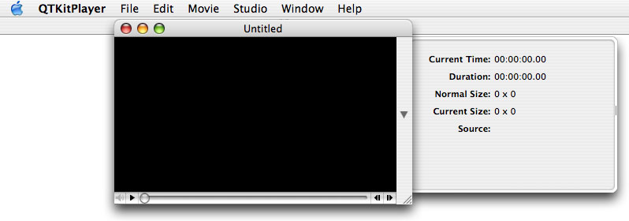

The button in the movie frame lets you toggle the drawer open and closed, with fields of useful information about the movie being displayed. The information displayed, however, is not static.

By implementing a callback mechanism from the QuickTime C API, your QTKitPlayer will be able to synchronize the current time to the playback of the movie itself.

When a QuickTime movie plays, for example, the current time field is updated synchronously with the movie, as illustrated in Figure 4-2.

__Figure 4-2__  An mp4 QuickTime movie playing with the current time, duration, movie size, and movie displayed in the open Cocoa drawer

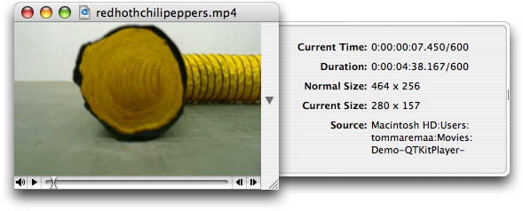

Building on the existing functionality of your QTKitPlayer application, you’ll add new text fields to your NSDrawer object that provide information about the size of the movie playing, its source path on the user’s computer, as well as the time and duration of play. These new fields may serve to enhance the user’s ability, for example, to edit a QuickTime movie with a specific timeline, or to resize a movie to a particular pixel ratio. The location of the source movie may also be useful.

Because you are adding to the existing QTKitPlayer application, all the functionality of the player is still intact. All the controls for movie playback are available for starting and stopping, showing and hiding the controller, stepping forward and backward frame by frame, and so on.

This chapter depends on your having worked through the construction of the QTKitPlayer application in the previous chapter. If you haven’t studied the steps described in that chapter, or simply skimmed over them, it might be a good idea to go back there first and refresh your memory before proceeding.

In this, as well as in the following chapters, you’ll break down the tasks you need to accomplish into a series of discrete steps. The goal is to work as efficiently as possible by first laying the foundation for your enhanced player application in Interface Builder, and then adding the code you need to make it work.

The tasks you want to accomplish in adding new functionality to your QTKitPlayer application are straightforward enough if you have already developed projects with Cocoa and Xcode. You’ll do this:

1. Add a new Cocoa NSDrawer object to your project, using the tools available to you in Interface Builder and Xcode 2.0. The goal is for the user to be able to toggle the drawer open and closed, and for the drawer object to have the necessary logic to display and synchronously update the movie content as it plays.
2. Add a small chunk of code to the `MovieDocument.h` class interface to specify the movie attributes of the drawer.
3. Add a larger chunk of code to your `MovieDocument.m` implementation file. This will involve working with a callback mechanism from the QuickTime C API. The goal is to learn how you can tap into the rich library of the QuickTime C API, when you want to add specific functionality to your Cocoa project that may not be available, for whatever reason, in the Cocoa API.

The complexity of the project comes with the addition of a callback mechanism from the QuickTime C API.

Basically, as the movie is playing, you need a mechanism to update the timer field in the drawer. The movie controller component calls your action filter function each time the component receives an action for its movie controller. In your action filter, you will use the idle action (`mcActionIdle`) to update your time display. The idle action is sent continuously while the movie is being serviced.

You could do a similar thing with an `NSTimer`, but the action filter technique is a bit easier to implement.

The function prototype for the QuickTime C callback mechanism is defined as follows:

```
Boolean MyMCActionFilterWithRefConProc
        (   MovieController      mc,
            short               action,
            void                *params,
            long                refCon );
```

The `MyMCActionFilterWithRefConProc` function responds to the actions of a movie controller with a reference constant. The parameters specify the movie controller (_mc_) for the operation, the movie controller action (_action_), a pointer to a structure that passes information to the callback, and a reference constant (_refCon_) that your code supplies to your callback. Your QTKitPlayer application can invoke these actions by calling `MCDoAction`. An action filter function will receive any of the controller actions sent to it.

You’ll add this callback to the code in your `MovieDocument.m` implementation file. The way to accomplish this is explained in detail in the section [Adding Code To Make the Drawer Work](#apple-f4xwc4dqnrsv64tfmyxwi33df52wszbpkridimbqgaytenbvfvbuqmrqg4wviucykjcummjsg4).

When you’ve completed all these tasks, you’ll see the class model of your QTKitPlayer code in Xcode 2.0, as shown in Figure 4-3. The class model includes a list of the MovieDocument instance variables you’ll add to your QTKitPlayer project and a visualization of their connections and inheritance paths.

__Figure 4-3__  A class model of the MovieDocument class with a list of properties

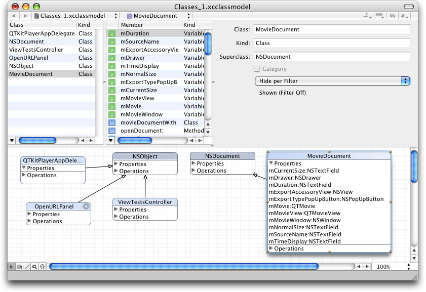

Note that this class model diagram is only available using Xcode 2.0. As illustrated in Figure 4-3, it also lists the classes you’ll work with in subsequent chapters of this programming tutorial. Just ignore these for the moment, as you focus on the properties you’ll add to the MovieDocument class.

In this sequence of steps, you’ll add a Cocoa drawer to the QTKitPlayer. Adding drawers to a window is relatively easy to accomplish using Interface Builder.

To extend your QTKitPlayer, follow these steps:

1. Launch Interface Builder 2.5 and open your MovieDocument.nib.
2. Drag the drawer object from your Cocoa-Windows palette into your nib, shown in Figure 4-4. The drawer object becomes an NSDrawer in your nib.

   __Figure 4-4__  The Cocoa-Windows and the NSDrawer object added in MovieDocument.nib

   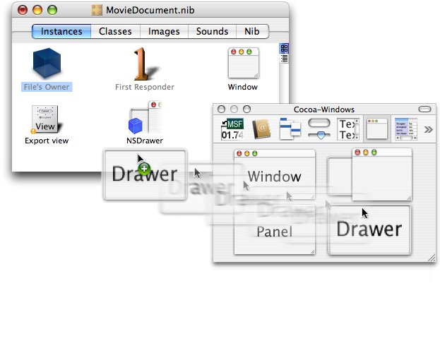
3. To add the drawer content view, drag a CustomView object from the Cocoa-Containers palette into the nib. Double-click the icon and rename it as “Drawer ContentView”. That gives you the content view, as shown in Figure 4-5.

   __Figure 4-5__  The CustomView object in the Cocoa-Containers palette and in the MovieDocument.nib as Drawer ContentView

   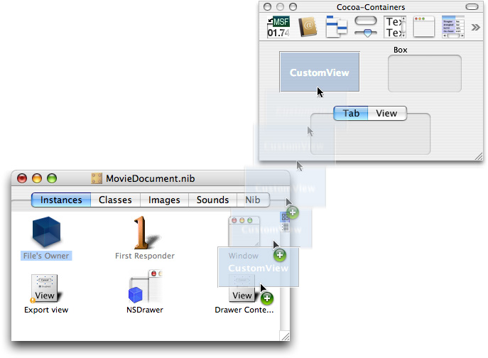
4. Add the `mDrawer` outlet to File’s Owner. Double-click the File’s Owner icon. This brings up the Attributes pane for the MovieDocument Info window. Click Add to add an `mDrawer` outlet.
5. Wire up the connection from the File’s Owner to the `mDrawer` outlet. Click File’s Owner, press the Control key, and drag wire to the NSDrawer icon in the MovieDocument.nib. Click connect.
6. Now you want to select the NSDrawer object in your nib and press Command-2 to open the NSDrawer Info pane. Select the NSDrawer icon and press the Control key. Now Control-drag to the Drawer Content View icon and press the Connect button in the NSDrawerInfo window, as shown in Figure 4-6. You want to wire up your connections from the NSDrawer object to the Drawer Content View object.

   __Figure 4-6__  The NSDrawer wired up and connected to the contentView outlet

   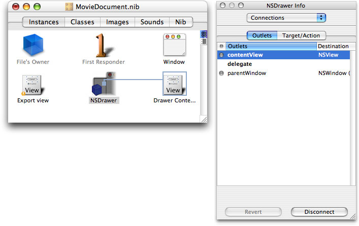
7. Similarly, select the NSDrawer icon and press the Control key. Now control-drag to the window icon to wire up your connections from the NSDrawer object to its parent window.
8. In the MovieDocument.nib, double-click the window icon to select the QTMovieView window object. You want to leave a portion of the window available for the button that will toggle your NSDrawer object open and closed.
9. Select the Cocoa-Controls palette and drag an NSButton object from the collections of control object to the right portion of your window.
10. Press Command-1 to open the Attributes pane, as shown in Figure 4-7.

    __Figure 4-7__  The NSButton info pane with attributes and the type specified as disclosure

    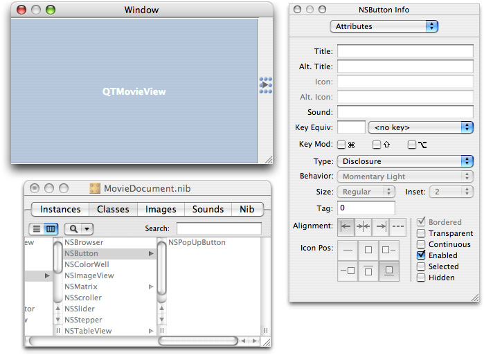
11. Specify the Type as Disclosure in the attributes pane of NSButton Info (Figure 4-7). This enables the button to toggle. The toggle option is available in Cocoa by enabling disclosure.
12. Set the springs for the disclosure button.
13. Click the NSDrawer icon, then set the Size attributes in the NSDrawer Info pane, as shown in Figure 4-8.

    __Figure 4-8__  Size attributes added to the Drawer Content View

    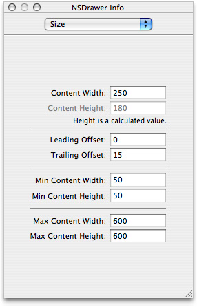
14. Now you want to set the springs in the Size attribute pane so that when the user resizes the drawer, the toggle button is not crunched. Set the springs for autosizing, as shown in Figure 4-9.

    __Figure 4-9__  The Size settings for autosizing of springs in the Drawer Contents object

    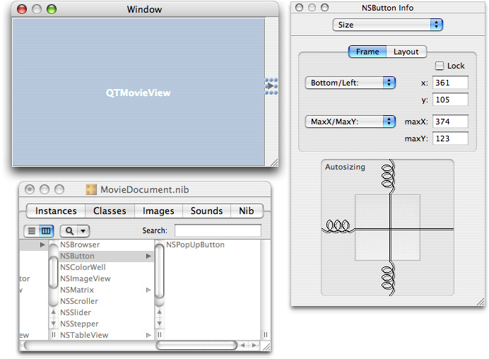
15. Add NSTextField objects corresponding to “Current Time,” “Duration,” “Normal Size,” “Current Size,” and “Source” (all static text), as shown in Figure 4-10. In the attributes pane of each text field, specify the title, color, alignment, text border, and other information.

    __Figure 4-10__  Text fields and their attributes added to the Drawer Content View

    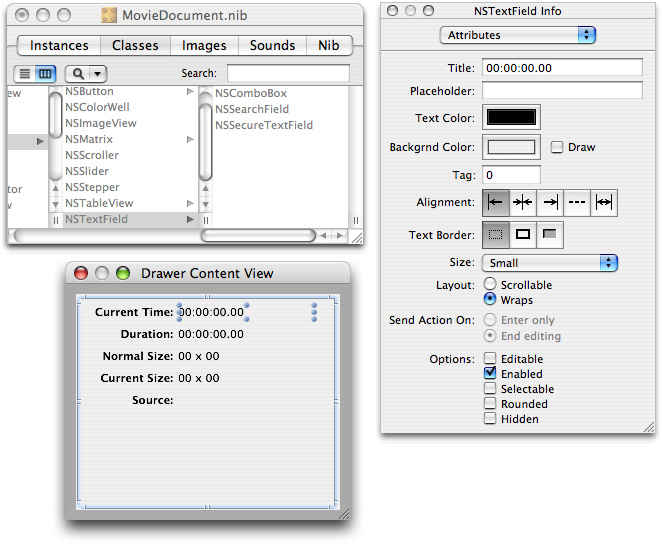
16. You want to be sure that you specify in the NSTextfield Info panes for Current Time and Duration by entering the Title attribute as 00:00:00:00, as shown in Figure 4-10.
17. Now add the outlets to your document subclass. Double-click the File’s Owner icon. This brings up the Info window attributes pane for the MovieDocument class. Use the Add button and add the following outlets: `mCurrentSize`, `mDuration`, `mNormalSize`, `mSourceSize`, and `mTimeDisplay`.
18. Now you are ready to hook up the File’s Owner to the various textfields that you have specified in the Drawer Content View. Select the File’s Owner icon and press the Control key. Connect the wire to each textfield in the Drawer Content View, as shown in Figure 4-11 and click Connect for each outlet.

    __Figure 4-11__  Hooking up the textfields and adding outlets

    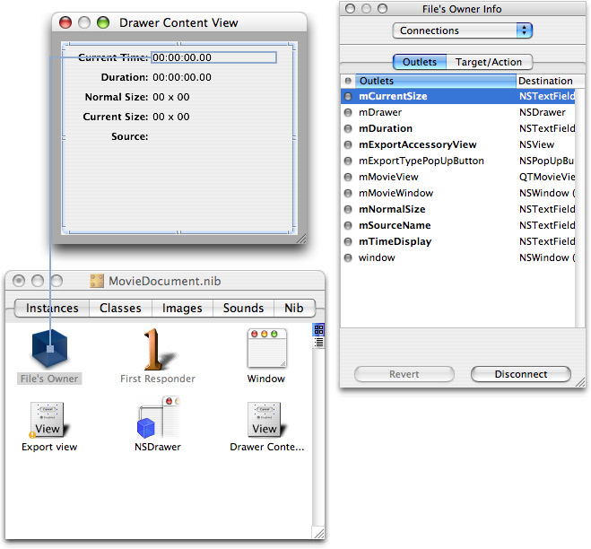
19. Add toggle drawer action to the MovieDocument class. Double-click File’s Owner, and in the Attributes pane of the Info window for the MovieDocument, click the “O Actions” pane. Now click the Add button, and add a `toggleDrawer` action.
20. Wire up the disclosure button to the `toggleDrawer` action. Click the disclosure button in the MovieDocument window. Press the Control key, then drag the wire to the File Owner’s icon. In the Connections pane of the Info window for NSButton, click the Target/Action pane. Select the `toggleDrawer` action and click the Connect button, as shown in Figure 4-12.

    __Figure 4-12__  Wiring up the toggle drawer target and action in the MovieDocument.nib

    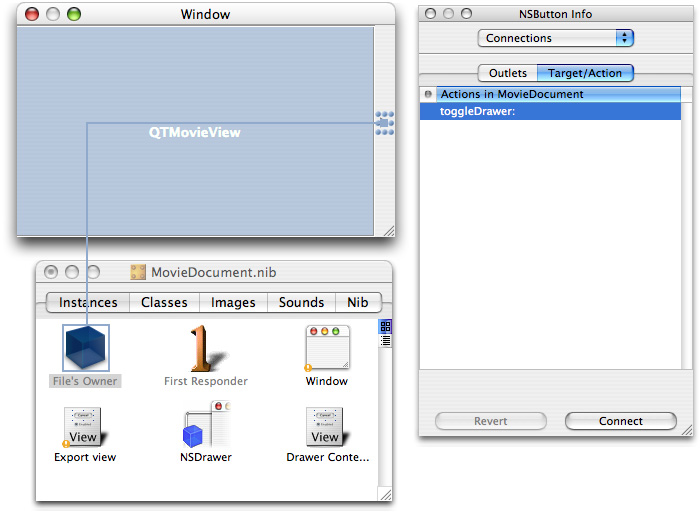

This completes the steps you need to follow in order to construct the Cocoa drawer and hook up the outlets and actions in Interface Builder.

In this section, you’ll add less than one hundred lines of code to your QTKitPlayer project by modifying your `MovieDocument.h` and `MovieDocument.m` class files.

In this next sequence of steps, you’ll be adding a small amount of code to your `MovieDocument.h` class interface file. You want to declare the instance variables that you have specified as your outlets and target actions in Interface Builder. You also want to define in code the methods that will enable you to set these variables.

To begin, open the `MovieDocument.h` declaration file in your Xcode project. Follow these steps to add to your existing code in the file:

1. Insert the following line of code in the `@interface` directive block after your export outlet declarations. This enables you to specify the movie attributes for your NSDrawer object:

```
IBOutlet NSDrawer  *mDrawer;
```
2. Add the following code (also in the `@interface` block) to specify the drawer elements for your movie attributes:

```
 IBOutlet NSTextField *mCurrentSize;
    IBOutlet NSTextField *mDuration;
    IBOutlet NSTextField *mNormalSize;
    IBOutlet NSTextField *mSourceName;
    IBOutlet NSTextField *mTimeDisplay;
```
3. Define a getter for your drawer with the following line of code:

```objc
- (id)drawer;
```
4. Add to your IBActions to toggle the drawer open and closed, with the following line of code:

```objc
- (IBAction)toggleDrawer:(id)sender;
```
5. Insert the following methods before the `@end` directive in the file:

```objc
- (void)setDurationDisplay;
- (void)setNormalSizeDisplay;
- (void)setCurrentSizeDisplay;
- (void)setSource:(NSString *)name;
- (void)setTimeDisplay;
```
6. Add these two methods to install and remove the movie callback before the `@end` directive in the file:

```objc
-(void)removeMovieIdleCallback;
-(void)installMovieIdleCallback;
```


In this next sequence of steps, you’ll be adding a larger chunk of code to your `MovieDocument.m` implementation file.

To begin, open the `MovieDocument.m` file in your Xcode project. You’ll add the following blocks of code to your file. Just follow these steps:

1. After your import and `#define` statements, add this line of C code to set your timer display. You pass your movie document in the `refcon` parameter and that gives you a way to call the `setTimeDisplay:` method. This is the function prototype you add:

```
pascal Boolean MyActionFilter (MovieController mc, short action, void* params, long refCon);
```

   As the movie is being serviced by QuickTime, the movie controller component calls your action filter procedure each time the component receives an action for its movie controller. You use the idle action in your filter procedure to update your timer display.
2. Next, you want to add these initializations for your movie drawer items. Insert these lines:

```objc
-(void)awakeFromNib
{
    // initialize movie drawer items
    [self setDurationDisplay];
    [self setNormalSizeDisplay];
    [self setCurrentSizeDisplay];
    [self setSource:[self fileName]];
}
```
3. You want to return the `mDrawer` instance variable. Insert these lines before you add your setters, in a block identified as Getters:

```objc
- (id)drawer
{
    return mDrawer;
}
```
4. Now you want to add the following block of code, which enables you to read the movie. This is also where you install the movie action callback. Add these lines:

```objc
- (BOOL)readFromFile:(NSString *)fileName ofType:(NSString *)type
{
    BOOLsuccess = NO;

    // read the movie
    if ([QTMovie canInitWithFile:fileName])
    {
        if ([type isEqualTo:@"MovieDocumentData"])
        {
            NSData*data = [NSData dataWithContentsOfFile:fileName];
            [self setMovie:[QTMovie movieWithData:data error:nil]];
        }
        else
        {
            [self setMovie:((QTMovie *)[QTMovie movieWithFile:fileName error:nil])];
        }

        success = (mMovie != nil);

        if (success)
        {
            [self installMovieIdleCallback];
        }

    }

    return success;
}
```
5. Next, you need to install a movie controller action filter. If the movie is successfully created, the callback is installed. To get the controller from the movie and set the movie control filter, add this block of code:

```objc
-(void)installMovieIdleCallback
{
    ComponentResult cr = noErr;

    MovieController mc = [mMovie quickTimeMovieController];
    if (!mc) goto bail;

    MCActionFilterWithRefConUPP upp = NewMCActionFilterWithRefConUPP(MyActionFilter);
    if (!upp) goto bail;

    cr = MCSetActionFilterWithRefCon(mc, upp, (long)self);
    DisposeMCActionFilterWithRefConUPP(upp);

bail:
    return;
}
```
6. When the movie is closed, you remove the existing callback by passing `NIL` for the callback parameter. Add these lines of code:

```objc
-(void)removeMovieIdleCallback
{
    [MCSetActionFilterWithRefCon([mMovie quickTimeMovieController],
                                nil,
                                (long)self);
}
```
7. Insert the following code to toggle the drawer state:

```objc
- (IBAction)toggleDrawer:(id)sender
{
    [mDrawer toggle:sender];
```
8. In the next sequence of steps (8-12), you add these chunks of code to the fields in the drawer. To set the current time text field, insert this chunk of code:

```objc
- (void)setTimeDisplay
{
    if (mMovie)
    {
        QTTime currentPlayTime = [[mMovie attributeForKey:QTMovieCurrentTimeAttribute] QTTimeValue];
        [mTimeDisplay setStringValue:QTStringFromTime(currentPlayTime)];
    }
}
```
9. To set the duration text field, insert this chunk of code:

```objc
- (void)setDurationDisplay
{
    if (mMovie)
    {
        [mDuration setStringValue:QTStringFromTime([mMovie duration])];
    }
}
```
10. To set the normal size text field, add this:

```objc
- (void)setNormalSizeDisplay
{
    NSMutableString *sizeString = [NSMutableString string];
    NSSize movSize = NSMakeSize(0,0);
    movSize = [[mMovie attributeForKey:QTMovieNaturalSizeAttribute] sizeValue];

    [sizeString appendFormat:@"%.0f", movSize.width];
    [sizeString appendString:@" x "];
    [sizeString appendFormat:@"%.0f", movSize.height];

    [mNormalSize setStringValue:sizeString];
}
```
11. To set the current size text field, add:

```objc
- (void)setCurrentSizeDisplay
{
    NSSize movCurrentSize = NSMakeSize(0,0);
    movCurrentSize = [[mMovie attributeForKey:QTMovieCurrentSizeAttribute] sizeValue];
    NSMutableString *sizeString = [NSMutableString string];

    if (mMovie && [mMovieView isControllerVisible])
        movCurrentSize.height -= [mMovieView controllerBarHeight];

    [sizeString appendFormat:@"%.0f", movCurrentSize.width];
    [sizeString appendString:@" x "];
    [sizeString appendFormat:@"%.0f", movCurrentSize.height];

    [mCurrentSize setStringValue:sizeString];
}
```
12. To set the source text field, add:

```objc
- (void)setSource:(NSString *)name
{
    NSArray *pathComponents = [[NSFileManager defaultManager] componentsToDisplayForPath:name];
    NSEnumerator *pathEnumerator = [pathComponents objectEnumerator];
    NSString *component = [pathEnumerator nextObject];
    NSMutableString *displayablePath = [NSMutableString string];

    while (component != nil) {
        if ([component length] > 0) {
            [displayablePath appendString:component];

            component = [pathEnumerator nextObject];
            if (component != nil)
                [displayablePath appendString:@":"];
        } else {
            component = [pathEnumerator nextObject];
        }
    }

    [mSourceName setStringValue:displayablePath];
}
```
13. After the `@end directive`, you add this chunk of code to intercept some actions for the movie controller and to update the current time display in the drawer. Note that the `refCon` parameter is a document `id`:

```
pascal Boolean MyActionFilter (MovieController mc, short action, void* params, long refCon)
{
    MovieDocument *doc = (MovieDocument *)refCon;

    switch (action)
    {
        // handle idle events
        case mcActionIdle:
            // update the current time display in the info drawer
            if ([[doc drawer] state] != NSDrawerClosedState)
                [doc setTimeDisplay];
            break;
    }

    return false;
}
```

This wraps up the additions to the code you need to make in your MovieDocument implementation file. You’re now ready to build and compile your Xcode project.

If you’ve followed the steps outlined in this chapter, you’ll have successfully extended the QTKitPlayer application with a Cocoa drawer you can toggle open and closed. The drawer will display and update the time of any QuickTime movie you want to play.

You can control movie playback as you have before, with QTKitPlayer functionality still in place for movie control, as shown in Figure 4-13.

__Figure 4-13__  Open drawer with movie Show Controller selected

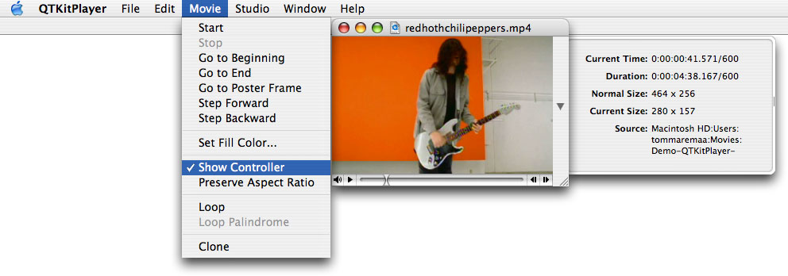

In a short series of steps, you’ve significantly extended the capabilities of your QTKitKPlayer application. Now you’re ready to enhance the media player by adding the capability to stream audio and video. That’s explained in the next chapter.

[Next](Extending%20the%20QTKitPlayer%20To%20Stream%20Audio%20and%20Video.md)[Previous](Extending%20the%20QTKitPlayer%20Application.md)

