> 导航：[总目录](../../../README.md) · [documentation](../../../_indexes/documentation.md) · [QuickTime Kit Programming Guide](Introduction%20to%20QuickTime%20Kit%20Programming%20Guide.md)

[Next](Extending%20the%20QTKitPlayer%20Application.md)[Previous](The%20QuickTime%20Kit%20API.md)

# Building a Simple QTKitPlayer Application

In this chapter, you’ll build QTKitPlayer, a simple application that demonstrates some of the power and flexibility of the QuickTime Kit framework. When completed, your QTKitKPlayer application will allow you to open and play QuickTime movies, as shown in Figure 2-1. Amazingly, you won’t have to write a single line of code to implement this media player.

Using Xcode as your integrated development environment (IDE), you’ll see how easy it is to work with the QuickTime Kit framework. In this example, you’ll use the new QTKit palette provided in the Interface Builder collection of palettes. The QTKit palette will do a lot of the work for you in constructing this application.

__Figure 2-1__  The completed QTKitPlayer application

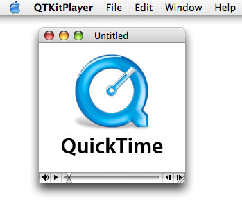

Using the QTKit palette and Xcode, you’ll be able to build a functioning media player application that displays and controls the playback of QuickTime movies, including QuickTime movies that support sprites, QuickTime VR, Flash, and 3GPP, among other file types. You’ll even be able to add a contextual menu that includes editing commands, as shown in Figure 2-2––again, without writing a single line of code.

__Figure 2-2__  The completed QTKitPlayer application with a contextual menu

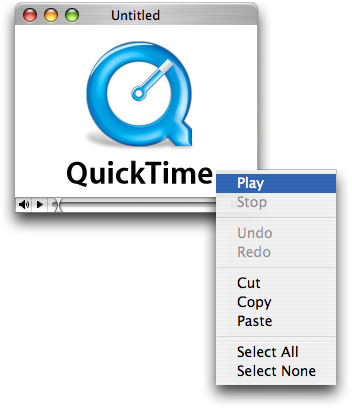

If you’ve worked with Cocoa and Xcode before, you know that every Cocoa application starts out as a project. A project is simply a repository for all the elements that go into the application, such as source code files, frameworks, libraries, the application’s user interface, sounds, and images. You use Xcode to create and manage your project.

The QTKitPlayer application is a good learning example for developers who may be new to Cocoa and QuickTime. If you already know Cocoa, you probably won’t be surprised at how quickly and effortlessly you can build this media player application.

To create the project, follow these steps:

1. Launch Xcode and choose File > New Project.
2. When the new project window appears, select Cocoa Document-based Application, as shown in Figure 2-3. Click Next.

   __Figure 2-3__  The Cocoa New Project Assistant window with the Cocoa Document-based Application option selected

   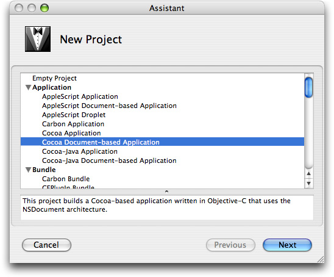
3. Name the project `QTKitPlayer` and place it in the directory of your choice.
4. The Xcode project window appears as show in Figure 2-4. Verify the files shown are in your project. Note this illustration includes the QuickTime Kit framework, which you won’t see until you add it in the next step.

   __Figure 2-4__  The QTKitPlayer application in Xcode

   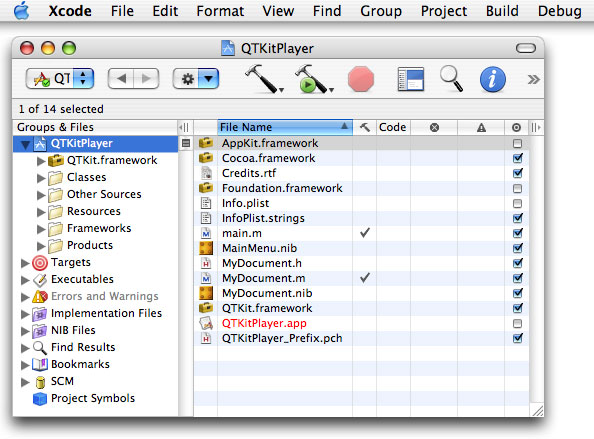
5. Next, you need to add the QuickTime Kit framework to your QTKitPlayer project. Choose Project > Add to Project.
6. The QuickTime Kit framework resides in the `System/Library/Frameworks` directory. Select the framework, shown in Figure 2-5, and click Add to add it to your QTKitPlayer project.

   __Figure 2-5__  The QuickTime Kit framework in the Frameworks directory

   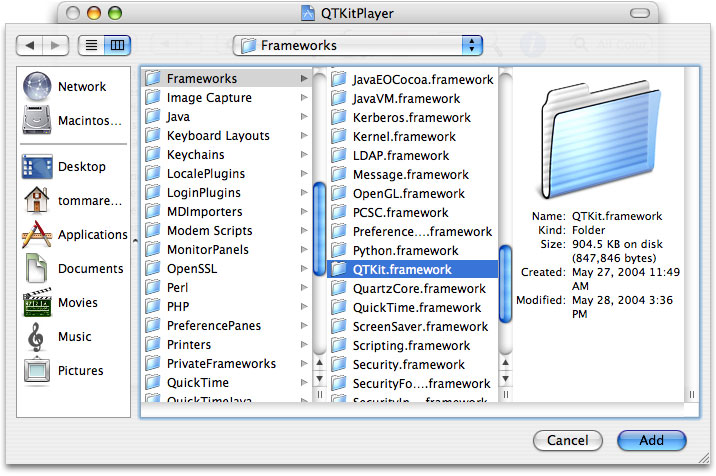
7. Another sheet opens, as shown in Figure 2-6. You don’t need to change any of the settings, so just click Add to add the framework to the QTKitPlayer Target.

   __Figure 2-6__  Adding QTKit.framework to the QTKitPlayer target

   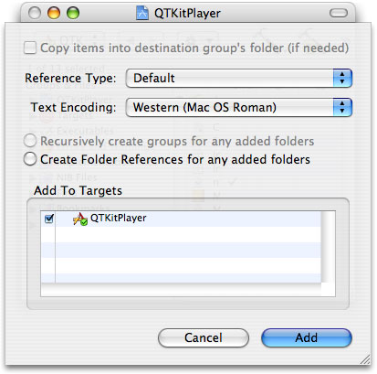
8. In your QTKitPlayer Xcode project window, open Targets in the Groups & Files list and then double-click QTKitPlayer. When the Target “QTKitPlayer” Info window opens, select the Properties pane, as shown in Figure 2-7.

   __Figure 2-7__  The Target “QTKitPlayer” Info window with the Properties pane displayed

   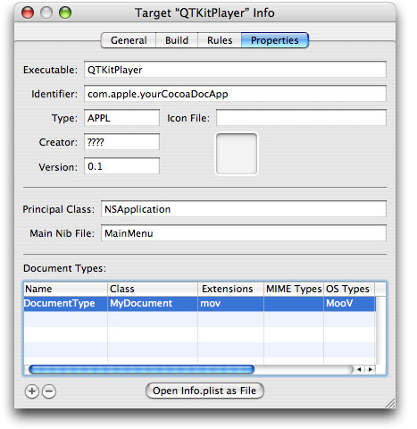
9. Select the DocumentType row and in the Extensions column, enter `mov` and in the OS Types column, enter `MooV`. Note that, strictly speaking, this step is not necessary if you use Interface Builder to specify the movie––it knows how to open movies.

The next section discusses how to use the new QTKit palette in Interface Builder to construct the QTKitPlayer application.

In this phase of constructing your QTKitPlayer application, you’ll work with the new QTKit palette in Interface Builder. After you’ve completed these steps, you’ll be able to build and run the QTKitPlayer in Xcode––without modifying any of your source files or adding any lines of code to them.

The QTKit palette resides in the `/Developer/Extras/Palettes` directory. To access the palette, you can either double-click to launch it in Interface Builder, or drag the palette into the `/Developer/Palettes` directory, in which case it will appear among the palettes in the toolbar shown in Figure 2-8. You can place the QTKit palette at any position in the row of palettes, in this case next to the Sherlock icon.

To finish building your QTKitPlayer, follow these steps:

1. Open Interface Builder by double-clicking MyDocument.nib in your Xcode project window and select the blue QuickTime icon in the palettes collection at the far right, next to the Sherlock icon, as shown in Figure 2-8. Note that the QuickTime icon in this palette looks like the one available in the Cocoa-GraphicsViews palette. Be sure that you select the Cocoa-QTKit palette.

   __Figure 2-8__  The Cocoa-QTKit palette

   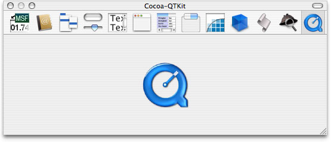
2. Delete the “Your document contents here” text in the window object shown in Figure 2-9.

   __Figure 2-9__  MyDocument.nib with the QTKit palette and a window selected

   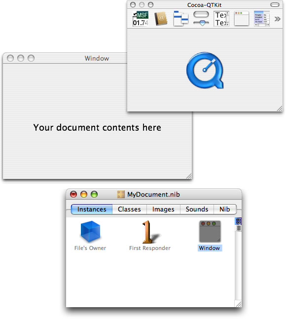
3. Drag the QTKit icon to the bottom-left corner of the project window, as shown in Figure 2-10.

   __Figure 2-10__  The QTKit icon dragged to the application window

   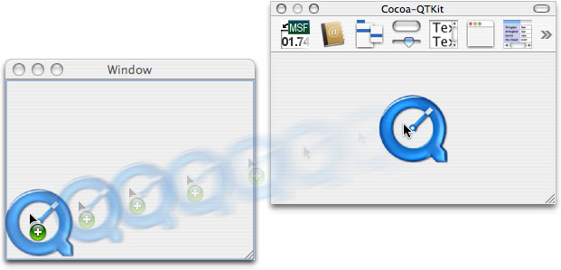
4. You now have a QuickTime movie view object with a control bar in the bottom-left corner of the window. Drag the QuickTime movie view object by its corner handle to the upper-right corner of the window, filling the entire window, so the movie view object with its control bar is visible, as shown in Figure 2-11.

   __Figure 2-11__  The QuickTime movie view object enlarged to fill the entire contents of the window

   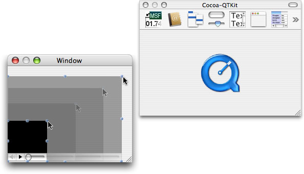
5. Click the QuickTime movie view object in the window, then press Command-1 to open the QTMovieView Info window. The Attributes pane is shown in Figure 2-12 with the default fill color of black and the Show Controller item selected. Note that the field that lets you select a movie from a list of files by clicking the File button is initially blank. The illustration in Figure 2-12 shows a partial file path for a movie to be selected.

   __Figure 2-12__  The QTMovieView Attributes pane

   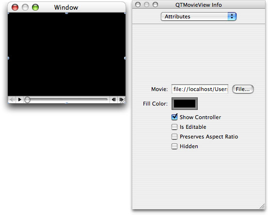
6. To add editing capabilties to your QTKitPlayer, select the Is Editable item. Notice that the slider in the control bar in your player changes from a button to another shape, shown in Figure 2-13, similar to )(, which allows for editing of a movie.

   __Figure 2-13__  The Is Editable item selected and the slider changed

   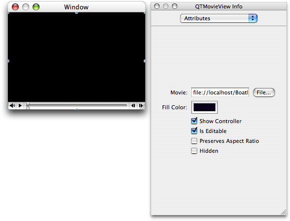
7. Now you’re ready to specify a movie to play and edit. In the QTMovieView Info Attributes pane, click the File button.
8. In the open dialog that appears, select a QuickTime movie and click Open. Your player window will look similar to the one illustrated in Figure 2-14. Note that the movie in Figure 2-14 has movie editing enabled, as shown by the appearance of the slider in the control bar.

   __Figure 2-14__  A QuickTime movie in your window

   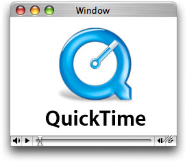
9. If you want to modify the attributes of the window in any way, you can open the NSWindow Info pane. To add texture to the movie window, for example, select the Window icon in the MyDocument.nib window and press Command-1 to open the NSWindow Info window with the Attributes pane displayed. Select the “Has texture” option, as shown in Figure 2-15.

   __Figure 2-15__  The QuickTime movie object window with texture added

   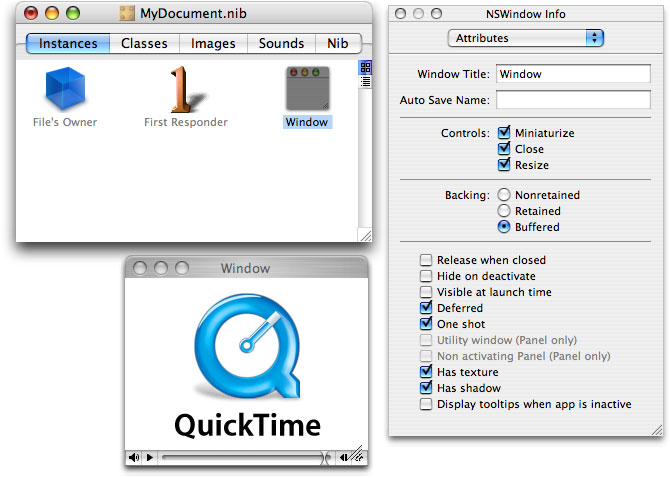
10. Save the `MyDocument.nib` file and quit Interface Builder.
11. In Xcode, run and build the QTKitPlayer application. When the movie runs, it will open a document-based window with the movie you’ve specified as Untitled. The movie is completely editable. Control-click anywhere in the movie. A contextual menu appears, as shown in Figure 2-16.

    __Figure 2-16__  The QTKitPlayer with an editable movie displayed

    
12. To access the editing features of the player, choose from the menu options shown in Figure 2-17 or use the contextual menu.

    __Figure 2-17__  The Edit menu in QTKitPlayer

    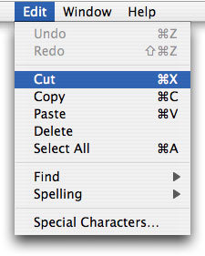

If you’ve followed correctly all the steps described in the previous section of this document, you’ll have built successfully the QTKitPlayer application, which lets you display, control, and edit QuickTime movies. This is only the beginning, however. You can extend the functionality of your media player by taking advantage of the new classes and methods provided in the QuickTime Kit framework.

For example, with the addition of a few hundred lines of code, you can add import and export capabilities to your application, so it can play QuickTime VR movies, display still images, or export movies to different file formats, such as MPEG-4 and 3GPP.

If you’re a Cocoa programmer, you’ll already be able to envision the possibilities. If you’re new to Cocoa or QuickTime, you’ll be amazed how quickly and easily you can extend the functionality of your media player. The next chapter describes how you can accomplish this.

[Next](Extending%20the%20QTKitPlayer%20Application.md)[Previous](The%20QuickTime%20Kit%20API.md)

