> 导航：[总目录](../../../README.md) · [documentation](../../../_indexes/documentation.md) · [QuickTime Kit Programming Guide](Introduction%20to%20QuickTime%20Kit%20Programming%20Guide.md)


[Next](Adding%20New%20Capabilities%20to%20the%20QTKitPlayer%20Application.md)[Previous](Building%20a%20Simple%20QTKitPlayer%20Application.md)

# Extending the QTKitPlayer Application

If you’ve built the simple QTKitPlayer application described in the previous chapter, you are now ready to extend its functionality by following the steps outlined in this chapter. If you skipped the previous chapter, you may want to familiarize yourself with the section [Working With the QTKit Palette](Building%20a%20Simple%20QTKitPlayer%20Application.md#apple-f4xwc4dqnrsv64tfmyxwi33df52wszbpkridimbqgaytenbvfvbuqmrqgqwueq2jizeemskg), which introduces the new Cocoa-QTKit palette available in the QuickTime Kit framework. This chapter assumes that, at very least, you have:

- A basic knowledge of Cocoa development as well as the fundamentals of the Objective-C programming language
- An understanding of Xcode, Interface Builder, and the QTKit palette

When completed, your extended QTKitKPlayer application will allow you not only to open and play QuickTime movies, but also to import and export them, as shown in Figure 3-1.

This added capability means that your application will be able to import and display a wide range of media types that QuickTime understands and supports in Mac OS X, including but not restricted to MP4 clips, JPEG images, and audio files, as you can see in the illustration in [Figure 3-2](#apple-f4xwc4dqnrsv64tfmyxwi33df52wszbpkridimbqgaytenbvfvbuqmrqhewueqsdijbesrse). In so doing, your application moves beyond a simple media player and provides useful functionality for handling a variety of media types and playback tasks.

__Figure 3-1__  The completed QTKitPlayer application with extended import and export capabilities

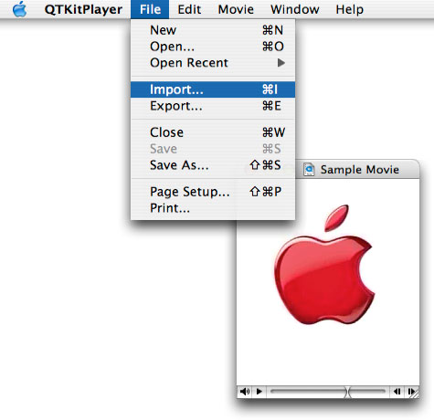

You’ll be able to accomplish all of this by working with Interface Builder to construct the QTKitPlayer user interface and then adding several hundred lines of code to your Xcode project.

Note that the QTKitPlayer application runs in both Mac OS X v10.4 and Mac OS X v10.3. You need QuickTime Player 7 (the latest version) installed on your system, however, to take full advantage of the new QuickTime Kit framework capabilities.

__Figure 3-2__  The completed QTKitPlayer application with an MP4 movie, an MP3 audio clip, and a JPEG still image displayed

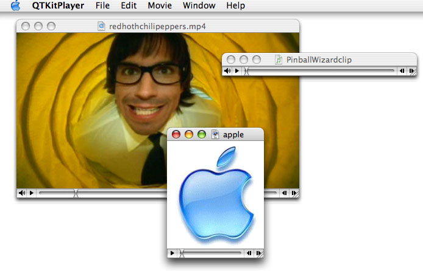

Beyond importing and exporting of QuickTime-supported media types, your completed QTKitPlayer application will also include editing capabilities more extensive than just cut, copy, and paste. You’ll add editing features such as add, add scaled, replace, and trim, all of which are supported by the QTKit framework in Mac OSX 10.4. These features will enable you to edit QuickTime movies with greater control and precision, as described in Table 3-1. If you look at the illustration shown in Figure 3-3, you’ll see the Edit menu in the QTKitPlayer with the additional commands available.

__Table 3-1__  Edit commands added to the QTKitPlayer application

| Edit Command | Description |
| Add | Adds a new chunk to a movie in one or more new tracks––on top of what’s already there––instead of inserting it as the Paste command does. |
| Add Scaled | Scales the chunk being pasted in time, and the chunk becomes stretched or compressed so that it plays for the same duration as the current selection in the receiving movie, which can result in slow-motion or fast-motion effects. |
| Replace | Replaces the current selection in the receiving movie. If there is no current selection, the command will replace the entire movie. |
| Trim | Deletes everything in the current movie except the current selection. |

__Figure 3-3__  The added editing capabilities in your QTKitPlayer project

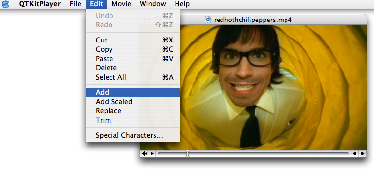

Following the steps in this chapter, you’ll also be able to provide more extensive control of movie playback and display, as shown in the Movie menu commands (Figure 3-4), including looping and cloning of your QuickTime movies.

__Figure 3-4__  The Movie menu commands for movie control and playback

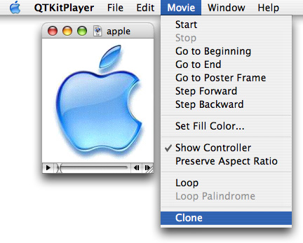

Before you get started with your extended QTKitPlayer project, be sure that you are running either Mac OS X v10.4 or Mac OS X v10.3 and have the following items installed on your system:

- Xcode 2.0 or later and Interface Builder 2.5 or later. Note that you can use Xcode 1.1 or Xcode 1.5 to build your project, but to take full advantage of the new programming and navigational features available, such as class model visualization, you’ll want to use Xcode 2.0.
- The QuickTime Kit framework, which is in the Mac OS X `/System/Library/Frameworks` directory as `QTKit.framework`
- The new QuickTime palette, which resides in the `/Developer/Extras/Palettes` directory as `QTKit.palette`. If you are running Mac OS X v10.4, the palette is installed automatically. If you are running Mac OS X v10.3, you will have to install it manually into the `/Developer/Palettes` directory, so that it appears in the Interface Builder palettes toolbar when you start up Interface Builder.
- QuickTime Player version 7

Now that you’ve verified you have all these items, let’s get cooking.

You’ll want to set aside the QTKitPlayer application you built following the steps in the previous chapter and start fresh with a new Xcode project.

There are a number of reasons for this, but suffice to say, you’ll find it easier to extend your media player application by starting from scratch. You’ll still be using the new QTKit palette to drag a QTMovieView object into a window in Interface Builder. The steps you take beyond that will nonetheless be different from those described in the previous chapter.

Note again that the QTKit palette resides in the `/Developer/Extras/Palettes` directory. To access the palette, you can either double-click its icon to launch it in Interface Builder, or drag the palette into the `/Developer/Palettes` directory, in which case it will appear among the palettes in the toolbar shown in [Figure 3-6](#apple-f4xwc4dqnrsv64tfmyxwi33df52wszbpkridimbqgaytenbvfvbuqmrqhewueqkcinfegr2f) when Interface Builder starts up.

To create the project, follow these steps:

1. Launch Xcode and choose File > New Project.
2. When the new project window appears, select Cocoa Document-based Application. Click Next.
3. Name the project `QTKitPlayer` and place it in the directory of your choice. Note that you’re naming the project the same as the project you built in the previous chapter, so you should place it in another directory.
4. Next, you need to add the QuickTime Kit framework to your QTKitPlayer project. Choose Project > Add to Project.
5. The QTKit framework resides in the `System/Library/Frameworks/QTKit.framework` directory. Select the framework, and click Add to add it to your QTKitPlayer project.
6. In the Add To Targets sheet, click the Add button.
7. Now you need to rename the nib, declaration, and implementation files with the Rename command in the File menu. Select each file in turn and rename `MyDocument.h` to `MovieDocument.h`, and `MyDocument.m` to `MovieDocument.m`. To rename the nib file, you need to open the `MyDocument.nib` in Interface Builder and save it as `MovieDocument.nib`, then delete the `MyDocument.nib`.Using Xcode 2.1, you won't be able to rename the nib from the File > Rename menu item, which is grayed out when you click a nib in the Project window.
8. The Xcode project window appears as shown in Figure 3-5, with your files renamed accordingly. Verify that the files shown in the illustration are the same as those in your project. Note that you won’t have to rename the `MainMenu.nib` file.

   __Figure 3-5__  The QTKitPlayer project in Xcode with nib, declaration, and implementation files renamed

   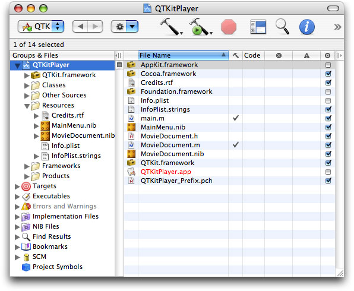

In this next sequence of steps, you’ll work with the QTKit palette and add outlets and actions in Interface Builder to your Xcode project.

1. Open Interface Builder by double-clicking `MovieDocument.nib` in your Xcode project window and select the blue QuickTime icon in the toolbar, as shown in Figure 3-6. Note that the QuickTime icon in this palette looks like the one available in the Cocoa-GraphicsViews palette, but they are different. The one in the QTKit palette gives you the QTMovieView object rather than an NSMovieView object. Be sure that you select the item in the Cocoa-QTKit palette.

   __Figure 3-6__  The Cocoa-QTKit palette

   
2. Delete the text “Your document contents here” in the window object.
3. Drag the QuickTime icon from the QTKit palette to the bottom-left corner of the project window.
4. You now have a QuickTime movie view object with a control bar in the bottom-left corner of the window. Drag the upper-right handle of the movie view object to the upper-right corner of the window, filling the entire window, so the movie view object with its control bar is visible, as shown in Figure 3-7.

   __Figure 3-7__  The QuickTime movie view object dragged to fill the entire contents of the window

   
5. Click the QuickTime movie object in the window, then press Command-1 to open the QTMovieView Info window. The Attributes pane appears with the default fill color of black and the Show Controller item selected. Note that the field that lets you select a movie from a list of files by clicking the File button is initially blank. Don’t click the File button to open a QuickTime movie that will be displayed in your window.
6. Leave the Show Controller item selected.
7. If you want to change the fill color of the movie view, click the Fill Color box and choose a new color. Figure 3-8 shows the window with a fill color of blue.

   __Figure 3-8__  The QTMovieView Info pane with a blue fill color selected for the QTMovieView object window

   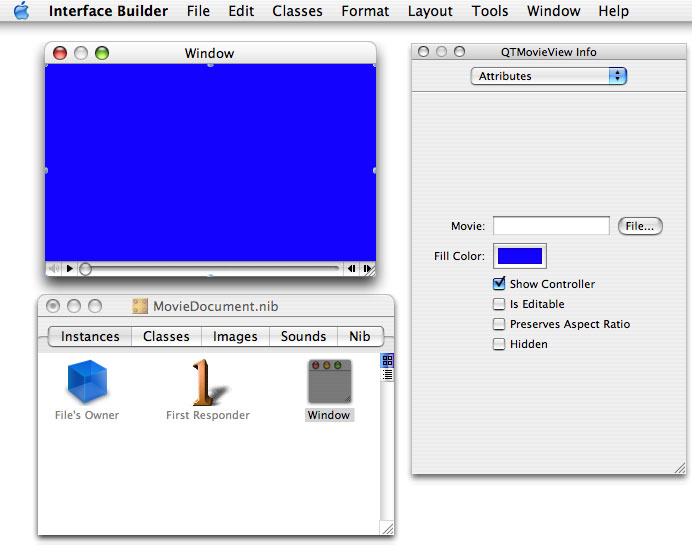
8. Next, you want to add outlets to your QTKitPlayer project. Double-click File’s Owner in your `MovieDocument.nib` window.
9. Enter `mMovieView` and `QTMovieView`, and `mMovieWindow` and `NSWindow` in their respective fields of the Connections pane, as shown in Figure 3-9. The illustration shows the Export view object in the `MovieDocument.nib` window, as well as the outlet `mExportAccessoryView` and its destination as `NSView`, and the outlet `mExportTypePopUpButton` and its destination as `NSPopUpButton`. You’ll enter these in a later step.

   __Figure 3-9__  The File’s Owner connections to various outlets, with actions specified

   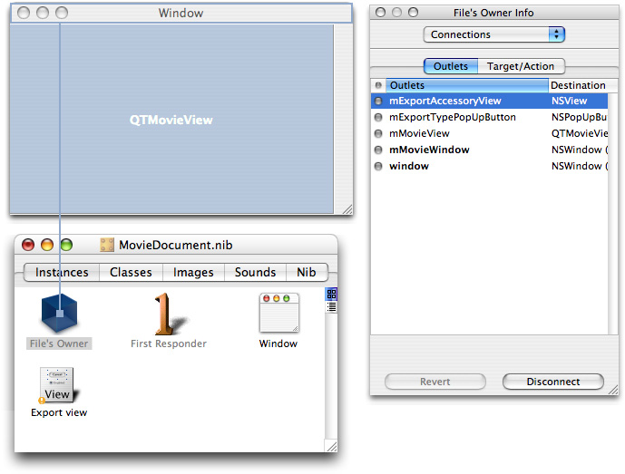
10. Select the File’s Owner icon and press the Control key. A wire appears with a small square at one end. Make sure the square lands on the File Owner’s icon. You want to hook up the File’s Owner to the QTMovieView object. Select the outlet `mMovieView` and click Connect to wire up the File’s Owner with the QTMovieView object, as shown in Figure 3-9.
11. Repeat the same step to connect the File’s Owner icon to the NSWindow object. Choose the outlet `mMovieWindow` and click Connect to wire up the File’s Owner with the NSWindow object.

In this sequence of steps, you want to create an Export view object in Interface Builder, as shown in Figure 3-10. This will enable your application to display a dialog and pop-up menu when you want to export a QuickTime movie to another file type.

__Figure 3-10__  The export view pop-up menu constructed in Interface Builder

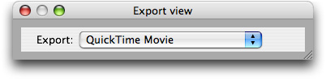

1. In the Interface Builder palette toolbar, choose Cocoa-Containers and drag the CustomView container to your `MovieDocument.nib` window. It appears as a View object.
2. Rename the View object `Export view`.
3. Now you want to add a pop-up menu labeled Export to the Export view object. Drag a pop-up menu from the Cocoa-Controls palette into the Export view window. In the Attributes pane of the NSPopUpButton Info window, type `QuickTime Movie` in the Title field, as shown in Figure 3-11.

   __Figure 3-11__  The export view object with the NSPopUpButton Info window displayed and various attributes specified

   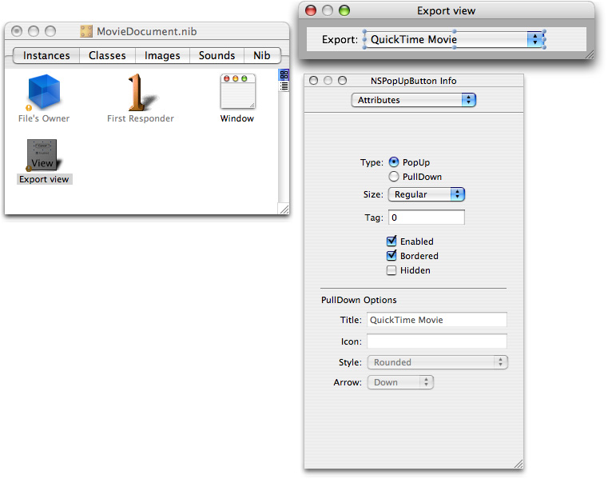
4. To add a label for the pop-up menu, drag a text field from the Cocoa-Text palette and position it to the left of the pop-up menu as shown in Figure 3-12. In the Attributes pane of the NSTextField Info window, type `Export:` in the Title field. In the Options section, deselect the Editable option and the Selectable option.

   __Figure 3-12__  The export view object with the NSTextField Info window displayed and various attributes specified

   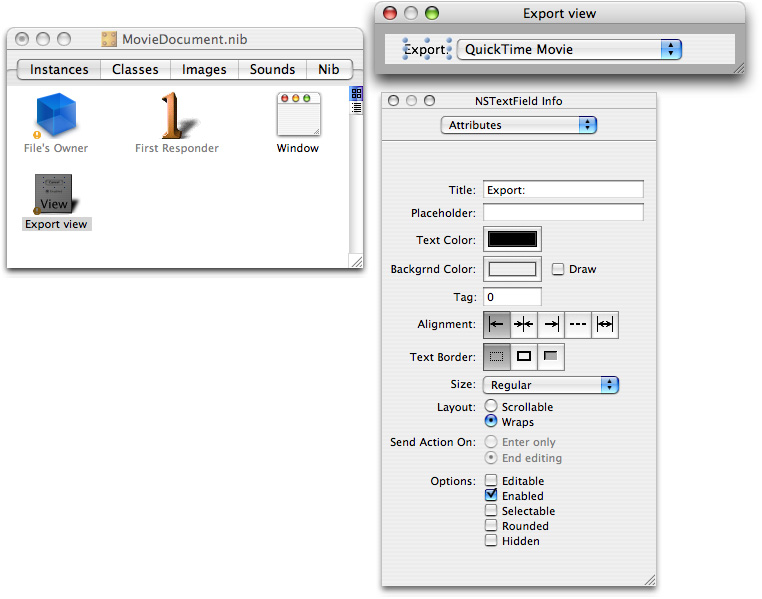
5. Now you are ready to wire up the Export view object. Select the File’s Owner icon and press the Control key. You want to hook up the File’s Owner to the Export view object. Choose the outlet `exportAccessoryView` and click Connect to wire up the File’s Owner with the NSView object. Select the outlet `exportTypePopUpButton` and click Connect to wire up the File’s Owner with the NSPopUpButton object.

Now you want to add outlets and actions to the MovieView object.

1. In the MovieDocument.nib window, double-click the File’s Owner icon. The MovieDocument Class Info window Attributes pane appears with four outlets selected and one deselected.
2. To add actions to the MovieDocument class, click the Actions tab, click Add, and type `doClone:`. Repeat for the following actions: `doExport:`, `doLoop:`, `doLoopPalindrome:`, `doPreservesAspectRatio:`, `doSetFillColor:`, `doSetFillColorPanel:`, `doSetPosterTime:`, and `doShowController:`. These are some of the actions that you want to add to your QTKitPlayer through various menu items.
3. Now you want to add more actions to your QTMovieView object using Interface Builder. In the MovieDocument.nib window, click the Classes tab, scroll down the list, and select the NSResponder class. From the list of subclasses, select NSView. Scroll down again and select QTMovieView, as shown in Figure 3-13.

   __Figure 3-13__  The QTMovieView subclass selected in MovieDocument nib file

   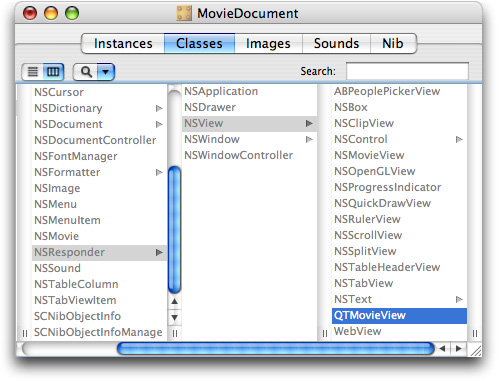
4. Press Command-1 to open the QTMovieView Class Info window. This displays the attributes of your QTMovieView object, deselected in grayed out text. You want to add these actions: `add:`, `addScaled:`, `copy:`, `cut:`, `delete:`, `gotoBeginning:`, `gotoEnd:`, `gotoPosterFrame:`, `paste:`, `replace:`, `stepBackward:`, `stepForward:`, and `trim:`.

   To add these actions, you need to parse the QTMovieView header file. In Interface Builder, select Classes > Read Files... A dialog opens. Select System > Library > Frameworks > QTKit.framework > Headers > QTMovieView.h. Click Parse. The QTMovieView window now shows the actions hilighted and added(Figure 3-14).

   __Figure 3-14__  The QTMovieView Class Attributes pane with list of actions added to the QTMovieView object

   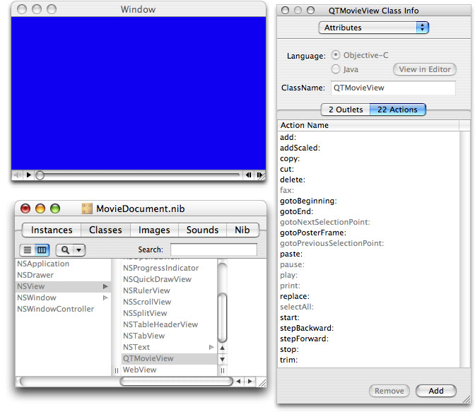

In this next sequence of steps, you want to change the NSApplication menu title in the MainMenu.nib - MainMenu file to QTKitPlayer and add items to each of the menu choices. You’ll also want to modify the attributes of each NSMenuItem.

1. In the MainMenu.nib - MainMenu file, you want to change the NSApplication menu title to QTKitPlayer. Select the menu title so that the item is highlighted. Then, double-click the item and enter the new text `QTKitPlayer`. Do this for the About, Hide, and Quit menu items in the MainMenu.nib window, so that each item refers to the QTKitPlayer, as shown in Figure 3-15.

   __Figure 3-15__  The MainMenu nib file with changes to the application menu

   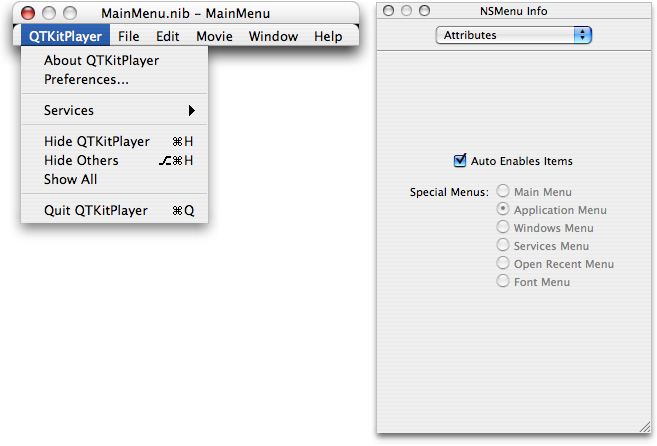
2. In the MainMenu.nib - MainMenu file, add to the File menu the items Import and Export, so your File menu appears as shown in Figure 3-16.

   __Figure 3-16__  The MainMenu nib file additions to the File menu

   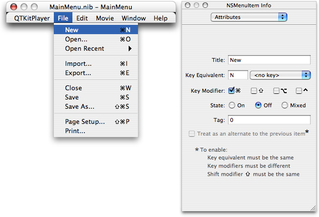
3. In the File menu, select the Import menu item and press Command-2 to open the Connections pane of the NSMenuItem Info window. Press Control and hook up the Import menu item to First Responder. Scroll down the list of the actions for First Responder and select openDocument, as shown in Figure 3-17. Click the Connect button.

   __Figure 3-17__  The MainMenu nib file with the Import menu item hooked up to First Responder and the openDocument action connected

   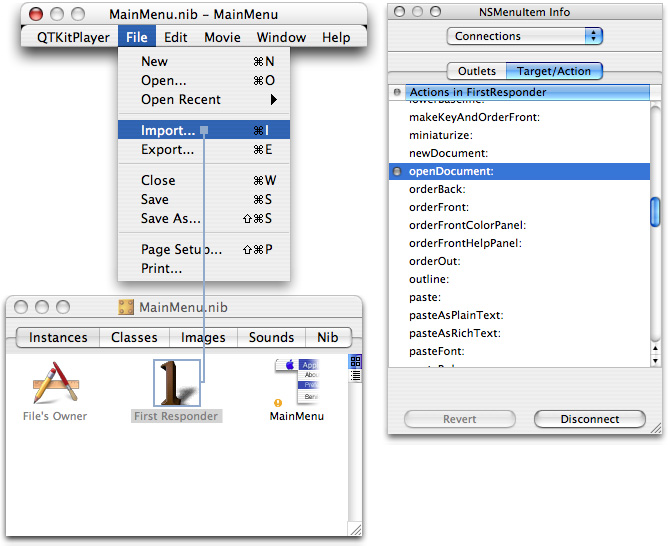
4. In the MainMenu.nib - MainMenu file, add to the Edit menu the items shown in Figure 3-18. These items include Undo, Redo, Cut, Copy, Paste, Delete, Select All, Add, Add Scaled, Replace, and Trim.

   __Figure 3-18__  The MainMenu nib file with additions to the Edit menu

   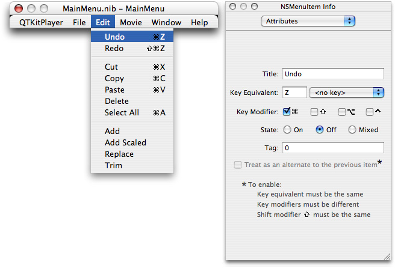
5. Before you hook up these items to actions in First Responder, you need to double-click the First Responder icon in the MainMenu.nib. The info panel brings up a list of the attributes available. Select the Actions tab. Now you want to add the following actions: `add:`, `addScaled:`, `copy:`,`cut:`, `delete:`, `gotoBeginning:`, `gotoEnd:`, `gotoPosterFrame:`, `paste:`, `replace:`, `stepBackward:`, `stepForward:`, and `trim:` Enter each action and click Add.

   Now you want to hook up these items to actions in First Responder. In the Edit menu, select each of the new menu items and connect it to the appropriate action in the actions list for First Responder, as shown in Figure 3-19.

   __Figure 3-19__  The MainMenu nib file with the Replace menu item selected and its connection specified

   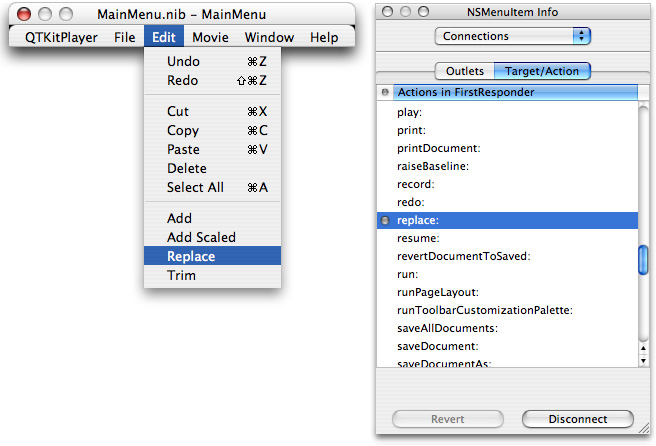
6. In the MainMenu.nib - MainMenu file, add the Movie menu and those items shown in Figure 3-20.

   __Figure 3-20__  The MainMenu nib file with additions to the Movie menu

   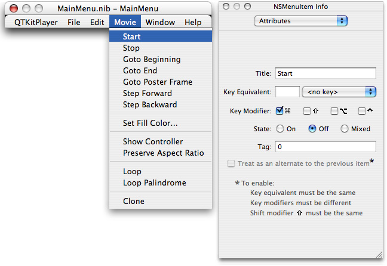
7. Hook up these items to actions in First Responder. In the Movie menu, select each item and connect it to the appropriate action. Rename Start to `play:` and Stop to `pause:`, as shown in Figure 3-21.

   __Figure 3-21__  The MainMenu nib file with the Start menu item selected and its connection specified

   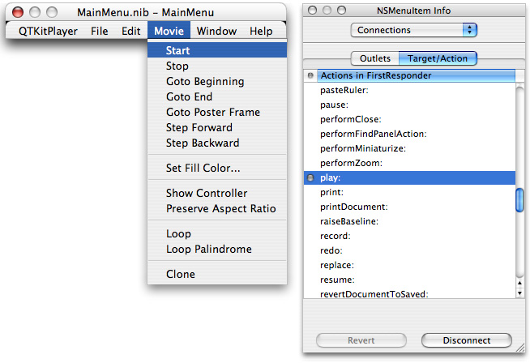
8. Save your `MainMenu.nib` file and quit Interface Builder.

You’ve now completed the first part of your project. In the next part, you’ll add the Cocoa code that makes your QTKitPlayer application work and perform like a champion.

In this next sequence of steps, you’ll be adding a small amount of code to your `MovieDocument.h` class interface file.

To begin, open the `MovieDocument.h` declaration file in your Xcode project and delete any existing code in the file. Now follow these steps:

1. Insert the following import code at the beginning of your file:

```objc
#import <Cocoa/Cocoa.h>
#import <QTKit/QTKit.h>
```
2. Add the following declaration code after your import statements:

```objc
@interface MovieDocument : NSDocument
{
 // movie window
    IBOutlet NSWindow *mMovieWindow;
    IBOutlet QTMovieView *mMovieView;

 // export
    IBOutlet NSView *mExportAccessoryView;
    IBOutlet NSPopUpButton *mExportTypePopUpButton;

 // movie document
    QTMovie         *mMovie;
}
```

   The first line defines the MovieDocument class and specifies that it inherits from the NSDocument class. The first four statements declare the outlets you set up and connected in Interface Builder. The `movieWindow` instance variable, for example, points to the NSWindow object while the `movieView` instance variable points to the QTMovieView object. The last line declares that the `mMovie` instance variable points to the QTMovie object.
3. Define a class method with the following line of code:

```objc
+ (id)movieDocumentWithMovie:(QTMovie *)movie;
```
4. To initialize movies, add this code line:

```objc
- (id)initWithMovie:(QTMovie *)movie;
```
5. For the NSMenu validation protocol, which returns a `BOOL` value, as it validates the menu items in your project, add this:

```objc
- (BOOL)validateMenuItem:(NSMenuItem *)menuItem;
```
6. The following line of code, which enables you to set a movie to the QTMovie object using the `setMovie:` method, is one of the most common you’ll use in building projects with the QuickTime Kit framework. Add it:

```objc
- (void)setMovie:(QTMovie *)movie;
```
7. Insert the following block of action method declarations in your `MovieDocument.h` file:

```objc
- (IBAction)doExport:(id)sender; // run the export sheet
- (IBAction)doSetFillColorPanel:(id)sender; // update the fill color
- (IBAction)doSetFillColor:(id)sender;
- (IBAction)doSetPosterTime:(id)sender;
- (IBAction)doShowController:(id)sender;//toggle controller visibility
- (IBAction)doPreserveAspectRatio:(id)sender;// toggle aspect ratio
- (IBAction)doLoop:(id)sender; // toggle looping
- (IBAction)doLoopPalindrome:(id)sender; // toggle palindrome looping
- (IBAction)doClone:(id)sender;
```
8. To handle NSDocument overrides, add the following lines of code:

```objc
- (NSString *)windowNibName;
- (void)windowControllerDidLoadNib:(NSWindowController*)windowController;
- (NSData *)dataRepresentationOfType:(NSString *)docType;
- (BOOL)writeWithBackupToFile:(NSString *)fullDocumentPath ofType:(NSString *)type saveOperation:(NSSaveOperationType)saveOperation;
- (BOOL)readFromFile:(NSString *)fileName ofType:(NSString *)type;
- (void)printShowingPrintPanel:(BOOL)showPanels;
```
9. Insert the following method before the `@end` directive in the file:

```objc
- (BOOL)createMovieDocumentWithFile:(NSString *)fileName asData:(BOOL)asData;
@end
```
10. To save your NSSavePanel delegate, which handles your export dialog, insert these lines:

```objc
- (void)exportPanelDidEnd:(NSSavePanel *)sheet returnCode:(int)returnCode contextInfo:(void *)contextInfo;
```
11. Save your `MovieDocument.h` file (Command-S).

This completes the first part of code additions to your Xcode project.

In this next sequence of steps, you’ll be adding a larger chunk of code to your `MovieDocument.m` implementation file.

To begin, open the `MovieDocument.m` file in your Xcode project and delete any existing code in the file. Now follow these steps:

1. Insert the following import code at the beginning of your file:

```objc
#import "MovieDocument.h"
#import <QTKit/QTKit.h>
```
2. Following your import statements, you want to define a constant for movies that are not necessarily visual––that is, audio files. Specify the width as 320. Insert these lines:

```objc
#define  kDefaultWidthForNonvisualMovies  320
@implementation MovieDocument
```
3. Now you want to add the following class method and deal with memory allocation. Note that this is just a convenience method if you want to create a document given a movie. By calling `autorelease`, you auto release the movie. Add these lines:

```objc
+ (id)movieDocumentWithMovie:(QTMovie *)movie
{
    return [[(MovieDocument *)[self alloc] initWithMovie:movie] autorelease];
}
```
4. Next, you need to add initialization code to initialize a MovieDocument instance and set the file type. Setting the movie to `nil` will release it. Add these lines:

```objc
- (id)initWithMovie:(QTMovie *)movie
{
    [super init];

    // init
    [self setFileType:@"MovieDocument"];
    [self setMovie:movie];

    if (mMovie == nil)
    {
        [self release];
        self = nil;
    }
    return self;
}
```
5. Insert the following code to handle deallocation of memory and notifications:

```objc
- (void)dealloc
{
    [[NSNotificationCenter defaultCenter] removeObserver:self];
    [self setMovie:nil];
    [super dealloc];
}
```
6. To deal with NSMenu validations for enabling and disabling of menu items, insert this chunk of code:

```objc
- (BOOL)validateMenuItem:(NSMenuItem *)menuItem
{
    BOOL valid = NO;
    SEL action;

    // init
    action = [menuItem action];
    // validate
    if (action == @selector(doExport:))
        valid = (mMovie != nil);

    else if (action == @selector(doSetFillColorPanel:))
        valid = YES;

    else if (action == @selector(doShowController:))
    {
        [menuItem setState:([mMovieView isControllerVisible] ? NSOnState : NSOffState)];
        valid = YES;
    }
    else if (action == @selector(doPreserveAspectRatio:))
    {
        [menuItem setState:([mMovieView preservesAspectRatio] ? NSOnState : NSOffState)];
        valid = (mMovie != nil);
    }
    else if ((action == @selector(doLoop:)) && mMovie)
    {
        [menuItem setState:([[mMovie attributeForKey:QTMovieLoopsAttribute] boolValue] ? NSOnState : NSOffState)];
        valid = YES;
    }
    else if ((action == @selector(doLoopPalindrome:)) && mMovie)
    {
        if ([[mMovie attributeForKey:QTMovieLoopsAttribute] boolValue])
        {
            [menuItem setState:([[mMovie attributeForKey:QTMovieLoopsBackAndForthAttribute] boolValue] ? NSOnState : NSOffState)];
            valid = YES;
        }
    }

    else if (action == @selector(doClone:))
        valid = (mMovie != nil);

    else
        valid = [super validateMenuItem:menuItem];

    return valid;
}
```
7. To set the instance variable of the movie (one of the most common operations in the QuickTime Kit framework), add the following code:

```objc
- (void)setMovie:(QTMovie *)movie
{
    [movie retain];
    [mMovie release];
     mMovie = movie;
}
```
8. The next block of code is a bit more complicated. You want to set the movie window size to fit the movie, so that it is the “natural” movie size. (Natural size is the size of the movie when it was first created. After opening the movie, you can resize it.) The code here sets the coordinates, specifying that the movie window appears in the top-left corner of the window. Otherwise, the movie appears in the bottom-left corner. The code lets you move the movie around, but pegs it initially to the top-left corner. Insert the following code:

```objc
- (void)sizeWindowToMovie:(NSNotification *)notification
{
    NSRect   currWindowBounds, newWindowBounds;
    NSPoint  topLeft;
    static BOOL nowSizing = NO;

    if (nowSizing)
        return;

    nowSizing = YES;

    NSSize contentSize = [[mMovie attributeForKey:QTMovieCurrentSizeAttribute] sizeValue];
    if ([mMovieView isControllerVisible])
        contentSize.height += [mMovieView controllerBarHeight];

// get the current location and size of the movie window, so we can keep // the top-left corner pegged, i.e. fixed
    currWindowBounds = [[mMovieView window] frame];
    topLeft.x = currWindowBounds.origin.x;
    topLeft.y = currWindowBounds.origin.y + currWindowBounds.size.height;

    if (contentSize.width == 0)
        contentSize.width = currWindowBounds.size.width;

    newWindowBounds = [[mMovieView window] frameRectForContentRect:NSMakeRect(0, 0, contentSize.width, contentSize.height)];

    [[mMovieView window] setFrame:NSMakeRect(topLeft.x, topLeft.y - newWindowBounds.size.height, newWindowBounds.size.width, newWindowBounds.size.height) display:YES];

    nowSizing = NO;
}
```
9. To deal with NSDocument overrides, add these lines:

```objc
- (NSString *)windowNibName
{
    return @"MovieDocument";
}
```
10. To set up the movie view and set the editable state of the controller, you need to add this chunk of code. You also want to “listen” for any movie size changes, so notifications are added here. Insert the following:

```objc
- (void)windowControllerDidLoadNib:(NSWindowController *)windowController
{

    // set up the movie view
    if (mMovie)
    {
        NSSize contentSize = [[mMovie attributeForKey:QTMovieNaturalSizeAttribute] sizeValue];
        [mMovieView setMovie:mMovie];
        if ([mMovieView isControllerVisible])
        {
            contentSize.height += [mMovieView movieControllerBounds].size.height;
            if (contentSize.width == 0)
            {
                contentSize.width = kDefaultWidthForNonvisualMovies;
            }
        }
        [[mMovieView window] setContentSize:contentSize];
    }
    else
        [mMovieView setMovie:[QTMovie movie]];

    // set the editable state
    [mMovie setAttribute:[NSNumber numberWithBool:YES] forKey:QTMovieEditableAttribute];

    // watch for movie resizings
    if (mMovie)
    [[NSNotificationCenter defaultCenter] addObserver:self selector:@selector(sizeWindowToMovie:) name:QTMovieSizeDidChangeNotification object:mMovie];
}
```
11. To write to handle updates and saves, add the following code:

```objc
- (BOOL)writeWithBackupToFile:(NSString *)fullDocumentPath ofType:(NSString *)type saveOperation:(NSSaveOperationType)saveOperation
{
    BOOL success = NO;

    // update/save
    if (saveOperation == NSSaveOperation)
        success = [mMovie updateMovieFile];
    else
        success = [super writeWithBackupToFile:fullDocumentPath ofType:type saveOperation:saveOperation];

    return success;
}
```
12. Add these lines of code:

```objc
- (NSData *)dataRepresentationOfType:(NSString *)docType
{
    return [mMovie movieFormatRepresentation];
}
```
13. Add these lines to handle reading the movie from a file:

```objc
- (BOOL)readFromFile:(NSString *)fileName ofType:(NSString *)type
{
    BOOL  success = NO;
    NSData  *data;

    // read the movie
    if ([QTMovie canInitWithFile:fileName])
    {
        if ([type isEqualTo:@"MovieDocumentData"])
        {
            data = [NSData dataWithContentsOfFile:fileName];

        }
        else
        {
            [self setMovie:((QTMovie *)[QTMovie movieWithFile:fileName])];
            success = (mMovie != nil);
        }
    }

    return success;
}
```
14. The following chunk of code is intended to deal with opening movies and other media that QuickTime “understands” using an instance method and setting a flag. Add these lines:

```objc
- (id)openDocumentWithContentsOfFile:(NSString *)fileName display:(BOOL)displayFlag
{
    // first check whether we already have a document for this file
    NSDocumentController *sharedDocController = [NSDocumentController sharedDocumentController];
    MovieDocument *movieDocument = [sharedDocController documentForFileName:fileName];

    if (movieDocument)
    {// we've got one, just bring it forward
        if (displayFlag)
        {
            [movieDocument showWindows];
        }
    }
    else
    {// we must create a new document.
        // we always create a movie document regardless of type
        // init
        movieDocument = [[[MovieDocument allocWithZone:[self zone]] initWithContentsOfFile:fileName ofType:@"mov"] autorelease];

        // set up the document
        if (movieDocument)
        {

            // add the document
            [sharedDocController addDocument:movieDocument];

            // set up the document
            if ([sharedDocController shouldCreateUI])
            {
                [movieDocument makeWindowControllers];
                if (displayFlag)
                {
                    [movieDocument showWindows];
                }
            }
        }
    }
    return movieDocument;
}
```
15. Add the following code to locate the file to be opened:

```objc
- (BOOL)panel:(id)sender shouldShowFilename:(NSString *)filename
{
    BOOL isDir = NO;

    [[NSFileManager defaultManager] fileExistsAtPath:filename isDirectory:&isDir];

    if (isDir)
    {
        return YES;
    }
    else
    {
        return [QTMovie canInitWithFile:filename];
    }
}
```
16. Add this code to filter files through an Open dialog and display them:

```objc
- (void)openDocument:(id)sender {
    NSOpenPanel *openPanel = [NSOpenPanel openPanel];

    [openPanel setDelegate:self];
    [openPanel setAllowsMultipleSelection:NO];

    // files are filtered through the panel:shouldShowFilename: method above
    if ([openPanel runModalForTypes:nil] == NSOKButton) {
        [self openDocumentWithContentsOfFile:[[openPanel filenames] lastObject] display:YES];
    }
}
```
17. Add the following lines of code:

```objc
- (BOOL)application:(NSApplication *)theApplication openFile:(NSString *)filename
{
    return (nil != [self openDocumentWithContentsOfFile:filename display:YES]);
}
```
18. Insert the following code to display the Print dialog:

```objc
- (void)printShowingPrintPanel:(BOOL)showPanels
{
    NSPrintOperation *printOperation;

    // init
    printOperation = [NSPrintOperation printOperationWithView:mMovieView printInfo:[self printInfo]];
    [printOperation setShowPanels:showPanels];

    // print
    [self runModalPrintOperation:printOperation delegate:nil didRunSelector:nil contextInfo:nil];
}
```
19. You add the following code to handle the NSSavePanel delegate for the export sheet. Note that you use an NSArray to list export types, such as `mpg4`, `bmpf`, `aiff`, and so on. These types are hard-coded here. You can add to the list if you want to and include, for example, `3gpp` or `mpg3`.

```objc
- (void)exportPanelDidEnd:(NSSavePanel *)sheet returnCode:(int)returnCode contextInfo:(void *)contextInfo
{
    int             selectedItem;
    NSMutableDictionary*settings = nil;
    static NSArray *exportTypes = nil;

    // init
    if (exportTypes == nil)
    {
        exportTypes = [[NSArray arrayWithObjects:
            [NSNumber numberWithLong:'AIFF'], [NSNumber numberWithLong:'BMPf'], [NSNumber numberWithLong:'dvc!'],
            [NSNumber numberWithLong:'FLC '], [NSNumber numberWithLong:'mpg4'], [NSNumber numberWithLong:'MooV'],
            [NSNumber numberWithLong:'embd'], nil] retain];
    }

    // export
    if (returnCode == NSOKButton)
    {
        // init
        selectedItem = [mExportTypePopUpButton indexOfSelectedItem];
        settings = [NSMutableDictionary dictionaryWithCapacity:5];
        [settings setObject:[NSNumber numberWithBool:YES] forKey:QTMovieExport];

        if ((selectedItem >= 0) && (selectedItem < [exportTypes count]))
            [settings setObject:[exportTypes objectAtIndex:selectedItem] forKey:QTMovieExportType];

        // export
        if (![mMovie writeToFile:[sheet filename] withAttributes:settings])
            NSRunAlertPanel(@"Error", @"Error exporting movie.", nil, nil, nil);
    }
}
```
20. Add the following actions to your file:

```objc
- (IBAction)doExport:(id)sender
{
    NSSavePanel *savePanel;

    // init
    savePanel = [NSSavePanel savePanel];

    // run the export sheet
    [savePanel setAccessoryView:mExportAccessoryView];
    [savePanel beginSheetForDirectory:nil file:[[self fileName] lastPathComponent] modalForWindow:mMovieWindow modalDelegate:self
        didEndSelector:@selector(exportPanelDidEnd: returnCode: contextInfo:) contextInfo:nil];
}

- (IBAction)doSetFillColorPanel:(id)sender
{
    NSColorPanel *colorPanel;

    // init
    colorPanel = [NSColorPanel sharedColorPanel];
    [colorPanel setAction:@selector(doSetFillColor:)];
    [colorPanel setTarget:self];
    [colorPanel setColor:[mMovieView fillColor]];

    // run the panel
    [colorPanel makeKeyAndOrderFront:nil];
}

- (IBAction)doSetFillColor:(id)sender
{
    // update the fill color
    [mMovieView setFillColor:[sender color]];
}

- (IBAction)doShowController:(id)sender
{
    // toggle the controller visibility
    [mMovieView setControllerVisible:([sender state] == NSOffState)];
}

- (IBAction)doPreserveAspectRatio:(id)sender
{
    // toggle the aspect ratio preservation
    [mMovieView setPreservesAspectRatio:([sender state] == NSOffState)];
}

- (IBAction)doLoop:(id)sender
{
    // toggle looping
    [mMovie setAttribute:[NSNumber numberWithBool:([sender state] == NSOffState)] forKey:QTMovieLoopsAttribute];
}

- (IBAction)doLoopPalindrome:(id)sender
{
    // toggle palindrome looping
    [mMovie setAttribute:[NSNumber numberWithBool:([sender state] == NSOffState)] forKey:QTMovieLoopsBackAndForthAttribute];
}

- (IBAction)doClone:(id)sender
{
    MovieDocument *movieDocument;

    // init
    movieDocument = [MovieDocument movieDocumentWithMovie:[[mMovie copy] autorelease]];

    // set up the document
    if (movieDocument)
    {
        // add the document
        [[NSDocumentController sharedDocumentController] addDocument:movieDocument];

        // set up the document
        [movieDocument makeWindowControllers];
        [movieDocument showWindows];
    }
}

@end
```
21. Save your `MovieDocument.m` file (Command-S).

This completes the steps for adding code to your `MovieDocument.m` implementation file. There is only one more step, described in the next section, before you can run and build your QTKitPlayer application.

The is the last step to complete before you can build and run your QTKitPlayer application.

1. In your Xcode project, double-click the `Info.plist` file to open it.
2. Delete the existing contents of the `Info.plist` file.
3. Replace the contents of the file with the following:

```xml
<?xml version="1.0" encoding="UTF-8"?>
<!DOCTYPE plist PUBLIC "-//Apple Computer//DTD PLIST 1.0//EN" "http://www.apple.com/DTDs/PropertyList-1.0.dtd">
<plist version="1.0">
<dict>
    <key>CFBundleDevelopmentRegion</key>
    <string>English</string>
    <key>CFBundleDocumentTypes</key>
    <array>
        <dict>
            <key>CFBundleTypeExtensions</key>
            <array>
                <string>mov</string>
            </array>
            <key>CFBundleTypeName</key>
            <string>MovieDocument</string>
            <key>CFBundleTypeOSTypes</key>
            <array>
                <string>MooV</string>
            </array>
            <key>CFBundleTypeRole</key>
            <string>Editor</string>
            <key>NSDocumentClass</key>
            <string>MovieDocument</string>
        </dict>
        <dict>
            <key>CFBundleTypeExtensions</key>
            <array>
                <string>mov</string>
            </array>
            <key>CFBundleTypeName</key>
            <string>MovieDocumentData</string>
            <key>CFBundleTypeOSTypes</key>
            <array>
                <string>????</string>
            </array>
            <key>CFBundleTypeRole</key>
            <string>Viewer</string>
            <key>NSDocumentClass</key>
            <string>MovieDocument</string>
        </dict>
    </array>
    <key>CFBundleExecutable</key>
    <string>QTKitPlayer</string>
    <key>CFBundleGetInfoString</key>
    <string>QTKitPlayer 1.0</string>
    <key>CFBundleIdentifier</key>
    <string>com.apple.QTKitPlayer</string>
    <key>CFBundleInfoDictionaryVersion</key>
    <string>6.0</string>
    <key>CFBundleName</key>
    <string>QTKitPlayer</string>
    <key>CFBundlePackageType</key>
    <string>APPL</string>
    <key>CFBundleShortVersionString</key>
    <string>1.0</string>
    <key>CFBundleSignature</key>
    <string>????</string>
    <key>CFBundleVersion</key>
    <string>1.0</string>
    <key>NSMainNibFile</key>
    <string>MainMenu</string>
    <key>NSPrincipalClass</key>
    <string>NSApplication</string>
</dict>
</plist>
```


If you’ve followed correctly all the steps described in this chapter, you’ll be ready to build and run the QTKitPlayer application. In Xcode, simply click the hammer icon with the play button on top, or press Command-R, as you would if you were compiling any other Xcode project.

The QTKitPlayer appears with the blue default movie displayed. Now you can open and import other media, export them to different formats, edit the contents of that media, and control movie playback and display, such as showing or not showing the movie controller.

You’ll also be able to perform a variety of movie-editing operations discussed earlier in this chapter, such as trimming (shown in Figure 3-22).

__Figure 3-22__  The Apple 1984-2004 QuickTime movie with the editing trim feature enabled

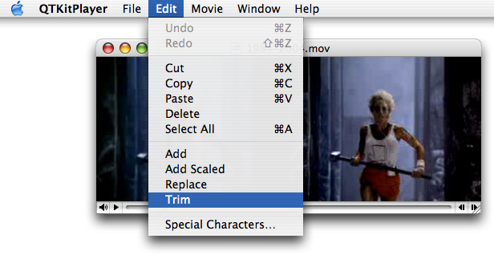

Again, the Add command lets you add a new chunk to a movie in one or more new tracks––on top of what’s already there––instead of inserting it like you would do using the Paste command. The Add Scaled command scales the chunk you are pasting in time, and the chunk becomes stretched or compressed so that it plays for the same duration as the current selection in the receiving movie, which can result in a slow-motion or fast-motion effects. The Trim command deletes everything in the current movie except the current selection

If you want to export your movie to another media format, such as MPEG-4, choose the Export command in the Edit menu, as shown in Figure 3-23, and the export sheet (Figure 3-24) will appear.

__Figure 3-23__  Exporting the Apple 1984-2004 QuickTime movie in your QTKitPlayer application

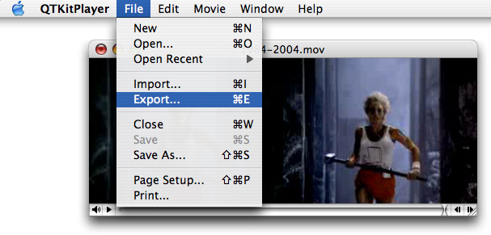

__Figure 3-24__  The export sheet for exporting a QuickTime movie to MPEG-4

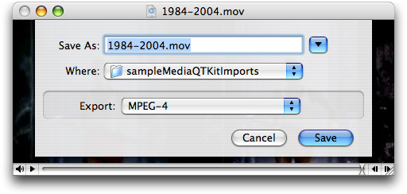

By working through the example code in this chapter and building the extended QTKitPlayer project, you’ve laid the foundation for an even more powerful and robust media player application to come.

In the next chapters of this tutorial, you’ll move into a more advanced learning phase. You’ll add new features and capabilities to your QTKitPlayer, such as the ability to open QuickTime streaming movies from URLs. You’ll also learn how to implement a Cocoa drawer with a timer that updates synchronously in real time the rate at which a QuickTime movie is displayed. In later chapters, you’ll extend the QTKitPlayer to handle more robust play back of multimedia content, with up to six movies, video streams, and QuickTime virtual reality movies playing at the same time.

Each chapter is intended to demonstrate, step by step, how you can enhance your QTKitPlayer application—and in the process, learn how to tap into the awesome power of Apple’s QTKit framework.

[Next](Adding%20New%20Capabilities%20to%20the%20QTKitPlayer%20Application.md)[Previous](Building%20a%20Simple%20QTKitPlayer%20Application.md)

