> 导航：[总目录](../../../README.md) · [documentation](../../../_indexes/documentation.md) · [QuickTime Kit Programming Guide](Introduction%20to%20QuickTime%20Kit%20Programming%20Guide.md)


[Next](Adding%20Multimedia%20Playback%20Capability.md)[Previous](Adding%20New%20Capabilities%20to%20the%20QTKitPlayer%20Application.md)

# Extending the QTKitPlayer To Stream Audio and Video

If you’ve been working diligently through the code examples in the last two chapters, you’ve no doubt advanced your knowledge of how to extend your QTKitPlayer application with the tools available in Xcode and Interface Builder. The goal has been to enhance the functionality of the media player by tapping into the power of the QTKit framework and in the process learn by doing.

In this chapter, you’ll jump into another level of programming skill by adding the capability of streaming audio and video in your application. Streaming, of course, is not the same thing as downloading a QuickTime movie file.

The URL for a streaming movie starts with the RTSP protocol identifier and looks like this

`rtsp://YourStreamServer.com/YourPath/YourMovie.mov`

After you complete the steps in this chapter, your QTKitPlayer application will be able to play audio and video streams in real time over the Internet. You’ll be able to open a streaming movie by choosing Open URL from the File menu and entering the URL string, as shown in Figure 5-1.

__Figure 5-1__  An Open URL dialog in the completed QTKitPlayer application

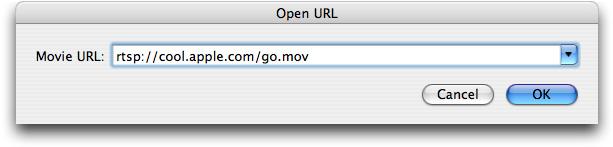

Clicking OK launches an Untitled QTKitPlayer movie window with a big blue Q at the center, as shown in Figure 5-2.

__Figure 5-2__  The movie window launched by the QTKitPlayer to stream audio and video with the big blue Q at its center

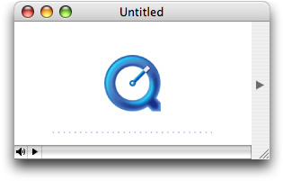

When you click the play button in the control bar at the lower left, your application will send a request to a server to fetch the audio or video stream with the RTSP protocol identifier. A few seconds later, the stream will appear in the player window. You can then resize the window accordingly, as you wish.

You’ll follow the same procedure as defined in the previous chapter: identify the tasks to accomplish, construct and wire together the necessary objects for your user interface, and then add the code to make it work.

The tasks you need to accomplish to extend the capability of your streaming QTKitPlayer are more complex than those described in the previous chapter. You’ll build on the existing QTKitPlayer application, using the tools available to you in Interface Builder 2.5 and Xcode 2.0. But you’ll also be adding more code to the project to deal with the handling of URL streams. You’ll do this:

1. Construct an OpenURL panel in Interface Builder with a ComboBox object for entering a movie URL.
2. Add actions and outlets to the OpenURL panel you’ve constructed.
3. Add a new menu item to the File menu to open the URL.
4. Subclass NSObject with a QTKitAppDelegate class in your MainMenu.nib and wire it up to handle the opening of a URL in your OpenURL panel.
5. Add to your Xcode project a new `OpenURLPanel.h` declaration file in which you define the class methods, getters and setters, delegates, notifications, and actions for your URL panel.
6. Add an `OpenURLPanel.m` implementation file in which you get the URL from a string, validate and save the URL, and inform the delegate before closing down the URL panel.
7. Add an `QTKitPlayerAppDelegate.h` class interface file to your project with IBActions for opening the URL panel.
8. Add an `QTKitPlayerAppDelegate.m` implementation file to your project in order to create the movie document from the URL.

Each task is outlined, step by step, in the next sections of this chapter. You’ll start as you have before with Interface Builder and then move on to add the code you need in four separate Xcode files.

By now you should be familiar with how to work with Interface Builder and its various palettes, icons, and objects. For purposes of simplicity and to move things forward a bit faster, this means combining a few basic steps in constructing your Open URL Panel. To start:

1. Create a new nib and call it OpenURLPanel.nib.
2. Create an Open URL panel object with Cancel and OK buttons, which are positioned according to Human Interface Guidelines, as shown in Figure 5-3.
3. Create a ComboBox object from the Cocoa-Data palette, where the user can enter a movie URL, as also shown in Figure 5-3.

   __Figure 5-3__  The Open URL panel nib and dialog for entry of a movie URL

   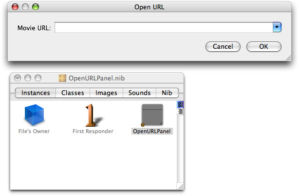
4. In the ComboBox, specify the attributes shown in Figure 5-4.

   __Figure 5-4__  The ComboBox attributes

   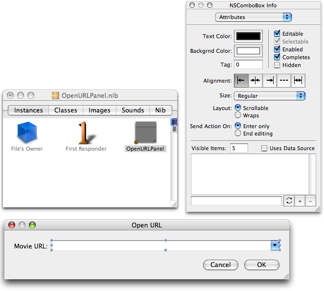
5. In the Size pane of the OpenURLPanel object, set the springs and the size of the panel, as shown in Figure 5-5.

   __Figure 5-5__  The size settings and spring positions in the OpenURLPanel object

   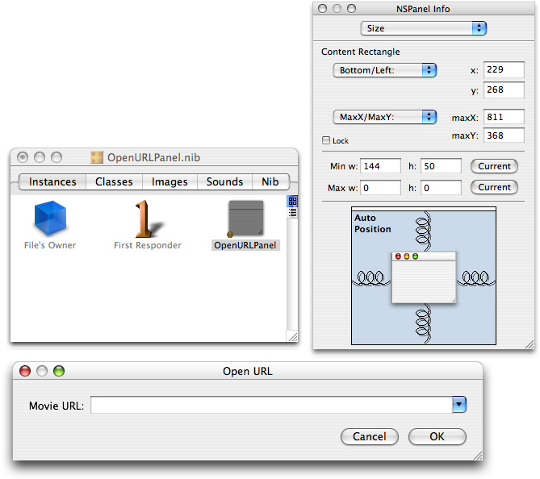
6. Now in the OpenURLPanel.nib, select OpenURLPanel from the list of classes. You can type “OpenURLPanel” in the search box and press return, or click NSObject to locate the OpenURLPanel class. Add `mPanel` and `mUrlComboBox` as your outlets, as shown in Figure 5-6.

   __Figure 5-6__  The outlets for the OpenURLPanel class

   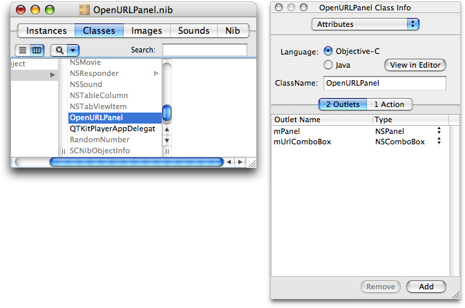
7. Now add one action to the the OpenURLPanel class in the Attributes pane, as shown in Figure 5-7.

   __Figure 5-7__  Action added to the OpenURLPanel

   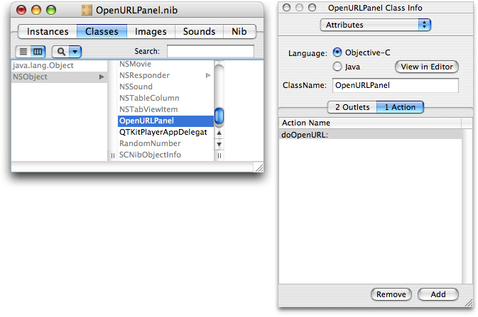
8. Save the nib and open the MainMenu.nib - MainMenu.
9. Add a menu item in the File menu as Open URL. . . with a key equivalent of Command-U, and specify its attributes as shown in Figure 5-8.

   __Figure 5-8__  The main menu nib with the menu attributes specified

   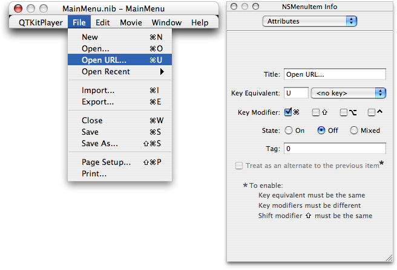
10. Now subclass NSObject and create a new class called `QTKitPlayerAppDelegate`.
11. Select `QTKitPlayerAppDelegate` from the list of classes in your MainMenu.nib and open the Attributes pane.
12. Add the `doOpenURL` action to your `QTKitPlayerAppDelegate`, as shown in Figure 5-9.

    __Figure 5-9__  Actions added to the QTKitPlayAppDelegate class in the Attributes pane

    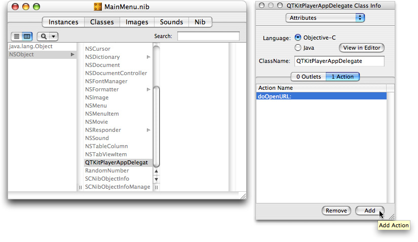
13. Now add the wiring to connect the OpenURL menu item and its action `doOpenURL` to the `QTKitPlayAppDelegate` class, as shown in Figure 5-10.

    __Figure 5-10__  Wiring to nib

    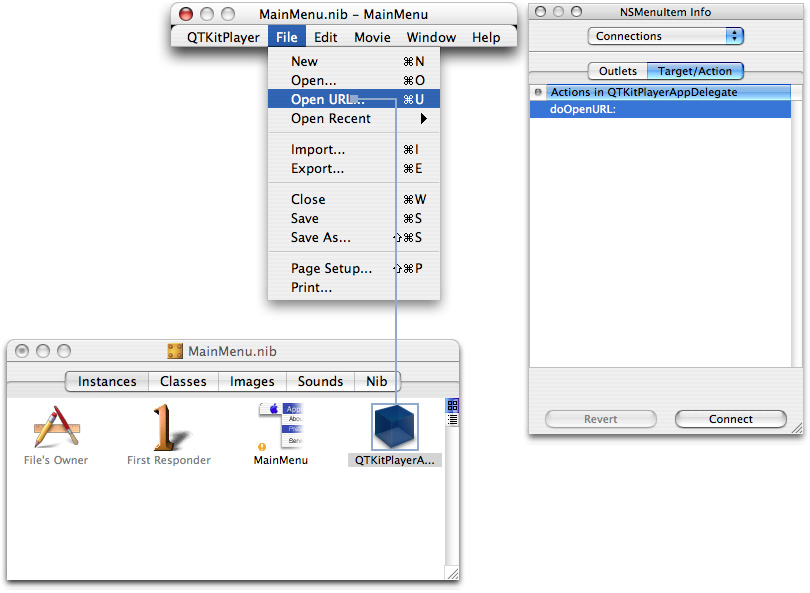
14. Save the files in Interface Builder and Quit.

If you’ve completed the steps outlined this section, you’ll be ready now to add the necessary code to your project.

In this section, you’ll add four new files to your Xcode project, including a `OpenURLPanel.h` declaration file, an `OpenURLPanel.m` implementation file, a `QTKitPlayerAppDelegate.h` class interface file, and a `QTKitPlayerAppDelegate.m` implementation file. Figure 5-11 shows the class model for the `OpenURLPanel` class with its properties and their connections listed.

__Figure 5-11__  The class model for the OpenURLPanel class

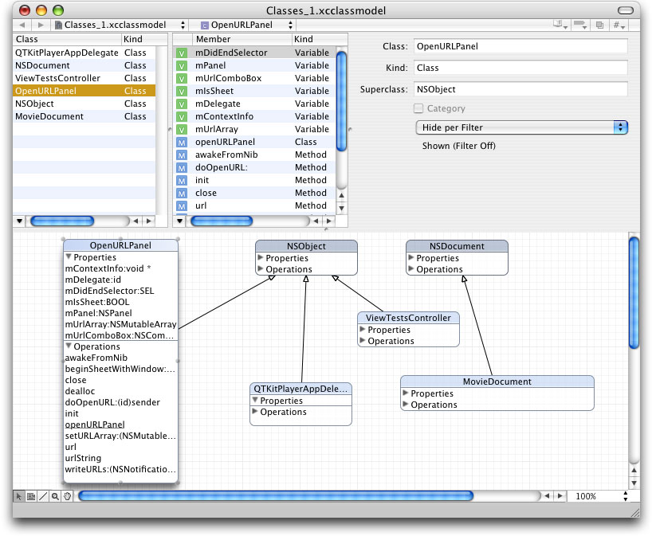

In this next sequence of steps, you’ll add the code you need for your `OpenURLPanel.h` class interface file.

To begin, in your QTKitPlayer project, choose File > New File. In the Assistant window for your new file in Xcode 2.0, select Cocoa > Objective-C class and in the window that opens enter the title `OpenURLPanel.h` . Now follow these steps:

1. Insert the following import code at the beginning of your file:

```objc
#import <Cocoa/Cocoa.h>
#import <QTKit/QTKit.h>
```
2. Add the following declaration code after your import statements:

```objc
@interface OpenURLPanel : NSObject
{
// panel
 IBOutlet NSPanel   *mPanel;
 IBOutlet NSComboBox *mUrlComboBox;
// open url panel
    id              mDelegate;
    SEL             mDidEndSelector;
    void            *mContextInfo;
    NSMutableArray  *mUrlArray;
    BOOL            mIsSheet;
 }
```
3. Define a class method with the following line of code:

```objc
+ (id)openURLPanel;
```
4. Define the getters you need with the following lines of code:

```objc
-(NSString *)urlString;
- (NSURL *)url;
```
5. Define the setters with the following line of code:

```objc
- (void)setURLArray:(NSMutableArray *)urlArray;
```
6. Define the delegate with the following line of code:

```objc
- (void)awakeFromNib;
```
7. Define the notifications:

```objc
- (void)writeURLs:(NSNotification *)notification;
```
8. Define the actions you need:

```
(IBAction)doOpenURL:(id)sender;
```
9. Define the delegate methods:

```objc
 - (void)beginSheetWithWindow:(NSWindow *)window delegate:(id)delegate didEndSelector:(SEL)didEndSelector contextInfo:(void *)contextInfo;
```

Save the file in the Classes folder in your QTKitPlayer project.

In this next sequence of steps, you’ll be adding a larger chunk of code to your `OpenURLPanel.m` implementation file.

To begin, in your QTKitPlayer project, choose File > New File. In the Assistant window for your new file in Xcode 2.0, select Cocoa > Objective-C class and in the window that opens enter the title `OpenURLPanel.m` . (Note that if you check the box in the title window, your implementation will already be created for you.) Now follow these steps:

1. Insert the following import code at the beginning of your file:

```objc
#import "OpenURLPanel.h"
```
2. Following your import statement, you want to define a constant for specifying user default keys. Insert this line:

```
#define kUserDefaultURLsKey @"UserDefaultURLsKey"
```
3. You also want to define the maximum number of URLs, in this case 15. Insert this line:

```
#define kMaximumURLs 15
```
4. Now you want to add the following class methods to deal with opening the URL panel. Add these lines:

```objc
+ (id)openURLPanel
{
 if (openURLPanel == nil)
 openURLPanel = [[self alloc] init];
return openURLPanel;
}
```
5. Next, you need to add initialization code to initialize an OpenURLPanel instance and listen for application termination notifications. Add these lines:

```objc
- (id)init
{
    [super init];

    // init
    [self setURLArray:[NSMutableArray arrayWithCapacity:10];

    [[NSNotificationCenter defaultCenter] addObserver:self selector:@selector(writeURLs:) name:NSApplicationWillTerminateNotification object:NSApp];

    return self;
}
```
6. Insert the following code to handle deallocation of memory and notifications:

```objc
- (void)dealloc
{
    [[NSNotificationCenter defaultCenter] removeObserver:self];
    [self setURLArray:nil];
    [super dealloc];
}
```
7. To get the URL string, insert this chunk of code:

```objc
- (NSString *)urlString
{
     NSString *urlString = nil;

    // get the url
     urlString = [mUrlComboBox stringValue];

    if (urlString == nil)
        urlString = [mUrlComboBox objectValueOfSelectedItem];

    if ([urlString length] == 0)
        urlString = nil;

    return urlString;
}
```
8. To set the instance variable of the URL array, add the following code:

```objc
- (void)setURLArray:(NSMutableArray *)urlLArray
{
    [urlLArray retain];
    [mUrlLArray retain];
     mUrlLArray = urlLArray;
}
```
9. The next block of code lets you restore the previous URLs. Insert the following block of code:

```objc
- (void)awakeFromNib
{
    NSArray *urls;

    // restore the previous urls
    urls = [[NSUserDefaults standardUserDefaults] objectForKey:kUserDefaultURLsKey];
 [mUrlArray addObjectsFromArray:urls];

    if (urls)
 [mUrlComboBox addItemsWithObjectValues:urls];
}
```
10. To set up deal with notifications, you need to add this chunk of code. This will enable you to “listen” for any notifications. Insert the following:

```objc
- (void)writeURLs:(NSNotification *)notification
{

    NSUserDefaults *userDefaults;
    if ([mUrlArray count]
    {
    // init
 userDefaults = [NSUserDefaults standardUserDefaults];

    // write out the urls
    [userDefaults setObject:mUrlArray forKey:kUserDefaultURLsKey];
    [userDefaults synchronize];
        }
}
```
11. To write to actions, validate and save the URL, add the following code:

```objc
- (IBAction)doOpenURL:(id)sender
{
{
    NSString*urlString;
    NSURL*url;
    BOOLinformDelegate = YES;
    IMP     callback;

    if ([sender tag] == NSOKButton)
    {
        // validate the URL
        url = [self url];
        urlString = [self urlString];

        if (url)
        {
            // save the url
            if (![mUrlArray containsObject:urlString])
            {
                // save the url
                [mUrlArray addObject:urlString];

                // add the url to the combo box
                [mUrlComboBox addItemWithObjectValue:urlString];

                // remove the oldest url if the maximum has been exceeded
                if ([mUrlArray count] > kMaximumURLs)
                {
                    [mUrlArray removeObjectAtIndex:0];
                    [mUrlComboBox removeItemAtIndex:0];
                }
            }
            else
            {
                // move the url to the bottom of the list
                [mUrlArray removeObject:urlString];
                [mUrlArray addObject:urlString];
                [mUrlComboBox removeItemWithObjectValue:urlString];
                [mUrlComboBox addItemWithObjectValue:urlString];
            }
        }
        else
        {
            if (mIsSheet)
                NSRunAlertPanel(@"Invalid URL", @"The URL is not valid.", nil, nil, nil);
            else
                NSBeginAlertSheet(@"Invalid URL", nil, nil, nil, mPanel, nil, nil, nil, nil, @"The URL is not valid.");

            informDelegate = NO;
        }
    }

    // inform the delegate
    if (informDelegate && mDelegate && mDidEndSelector)
    {
        callback = [mDelegate methodForSelector:mDidEndSelector];
        callback(mDelegate, mDidEndSelector, self, [sender tag], mContextInfo);
    }
}
```
12. Add these lines of code to save the delegate and start the sheet:

```objc
- (void)beginSheetWithWindow:(NSWindow *)window delegate:(id)delegate didEndSelector:(SEL)didEndSelector contextInfo:(void *)contextInfo
{
    // will this run as a sheet
    mIsSheet = (window ? YES : NO);

    // save the delegate, did end selector, and context info
    mDelegate = delegate;
    mDidEndSelector = didEndSelector;
    mContextInfo = contextInfo;

    // load the bundle (if necessary)
    if (mPanel == nil)
        [NSBundle loadNibNamed:@"OpenURLPanel" owner:self];

    // start the sheet (or window)
    [NSApp beginSheet:mPanel modalForWindow:window modalDelegate:nil didEndSelector:nil contextInfo:nil];
}
```
13. Add these lines to close it down:

```objc
- (void)close
{
    // close it down
    [NSApp endSheet:mPanel];
    [mPanel close];
}
```

This completes the steps for adding code to your `OpenURLPanel.m` implementation file. There is only one more sequence of steps, described in the next section, before you can run and build your QTKitPlayer application for streaming audio and video.

In this next sequence of steps, you’ll be adding a small amount of code to your `QTKitPlayerAppDelegate.h` class interface file.

In Xcode 2.0, you’ll see the class model for the delegate, as shown in Figure 5-12.

__Figure 5-12__  Class model for delegate

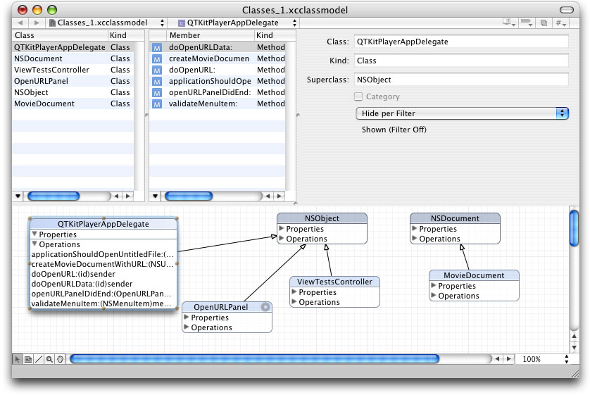

To begin, in your QTKitPlayer project, choose File > New File. In the Assistant window for your new file in Xcode 2.0, select Cocoa > Objective-C class and in the window that opens enter the title `QTKitPlayerAppDelegate.h` and check the box that also lets you create a `QTKitPlayerAppDelegate.m` file. Now follow these steps:

1. Insert the following import code at the beginning of your file:

```objc
#import <Cocoa/Cocoa.h>
#import “OpenURLPanel.h”
```
2. Add the following declaration code after your import statements:

```objc
@interface QTKitPlayerAppDelegate : NSObject
```
3. Define a NSMenu validation protocol with the following line of code:

```objc
- (BOOL)validateMenuItem:(NSMenuItem *)menuItem;
```
4. Define the OpenURLPanel delegates with the following lines of code:

```objc
- (void)openURLPanelDidEnd:(OpenURLPanel *)openURLPanel returnCode:(int)returnCode contextInfo:(void *)contextInfo;
```
5. Define the actions with the following lines of code:

```objc
- (IBAction)doOpenURL:(id)sender;
- (IBAction)doOpenURLData:(id)sender;
```
6. Define the method with the following line of code:

```objc
 - (BOOL)createMovieDocumentWithURL:(NSURL *)url asData:(BOOL)asData;
```

You’re done with the `QTKitPlayerAppDelegate.h` declaration file.

In this next sequence of steps, you’ll be adding a larger chunk of code to your `QTKitPlayerAppDelegate.m` implementation file.

To begin, in the `QTKitPlayerAppDelegate.m` file, you want to follow these steps:

1. Insert the following import code at the beginning of your file:

```objc
#import "QTKit/QTKit.h"
#import "QTKitPlayerAppDelegate.h"
#import “MovieDocument.h.”
```
2. Following your import statement, you want add these enumerations. Insert these lines:

```
{
    kQTKitPlayerOpenAsURL = 0,
    kQTKitPlayerOpenAsData

};
```
3. You also want to add `QTKitPlayAppDelegate` after the `@implementation` directive. Insert this line:

```objc
@implementation QTKitPlayerAppDelegate
```
4. Now you want to add the following lines for NSMenu validation protocols. Insert this block of code:

```objc
- (BOOL)validateMenuItem:(NSMenuItem *)menuItem
{
    BOOLvalid = NO;
    SEL action;

    // init
    action = [menuItem action];

    // validate
    if (action == @selector(doOpenURL:))
        valid = YES;
    else if (action == @selector(doOpenURLData:))
        valid = YES;
    else
        valid = [[NSDocumentController sharedDocumentController] validateMenuItem:menuItem];

    return valid;
}
```
5. Next, you need to add these OpenURLPanel delegates. Insert these lines:

```objc
- (void)openURLPanelDidEnd:(OpenURLPanel *)openURLPanel returnCode:(int)returnCode contextInfo:(void *)contextInfo
{
    BOOL closePanel = YES;

    // create the movie document
    if (returnCode == NSOKButton)
        closePanel = [self createMovieDocumentWithURL:[openURLPanel url] asData:((long)contextInfo == kQTKitPlayerOpenAsData)];

    if (closePanel)
        [openURLPanel close];
}
```
6. Insert the following code to handle the necessary actions for opening the sheet with a window:

```objc
- (IBAction)doOpenURL:(id)sender
{
    [[OpenURLPanel openURLPanel] beginSheetWithWindow:nil delegate:self didEndSelector:@selector(openURLPanelDidEnd:returnCode:contextInfo:) contextInfo:((void *)kQTKitPlayerOpenAsURL)];
}

- (IBAction)doOpenURLData:(id)sender
{
    [[OpenURLPanel openURLPanel] beginSheetWithWindow:nil delegate:self didEndSelector:@selector(openURLPanelDidEnd:returnCode:contextInfo:) contextInfo:((void *)kQTKitPlayerOpenAsData)];
}
```
7. These are the methods you need to create and set up the movie document with an associated URL. Insert this chunk of code:

```objc
- (BOOL)createMovieDocumentWithURL:(NSURL *)url asData:(BOOL)asData
{
    NSDocument  *movieDocument = nil;
    NSDocumentController*documentController;
    BOOL            success = YES;

    // init
    documentController = [NSDocumentController sharedDocumentController];

    // try to create the document from the URL
    if (url)
    {
        if (asData)
            movieDocument = [documentController makeDocumentWithContentsOfURL:url ofType:@"MovieDocumentData"];
        else
            movieDocument = [documentController makeDocumentWithContentsOfURL:url ofType:@"MovieDocument"];
    }

    // add the document
    if (movieDocument)
    {
        [documentController addDocument:movieDocument];

        // setup
        [movieDocument makeWindowControllers];
        [movieDocument updateChangeCount:NSChangeCleared];
        [movieDocument showWindows];
    }
    else
    {
        NSRunAlertPanel(@"Invalid movie", @"The url is not a valid movie.", nil, nil, nil);
        success = NO;
    }

    return success;
}
```

This wraps up the code additions for your QTKitPlayer application. Now you’re ready to build and compile the application and play streaming audio and video over the Internet.

You’ve extended the QTKitPlayer beyond its early incarnations as a simple media player, adding editing, importing, exporting, and now streaming capabilities. In the next chapter, you’ll provide new enhancements to the player that will enable you to play back as many as six different QuickTime movies, including QuickTime VR, streaming audio and video, wired sprite movies, and other multimedia content.

You’ll have a multimedia engine at your disposal that you can use to launch a variety of QuickTime content, much as you would do with an interactive movie kiosk. The steps to create this engine are spelled out in the next chapter and enable you to build on what you’ve learned so far in this programming guide.

[Next](Adding%20Multimedia%20Playback%20Capability.md)[Previous](Adding%20New%20Capabilities%20to%20the%20QTKitPlayer%20Application.md)

