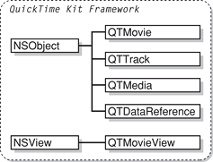

> 导航：[总目录](../../../README.md) · [documentation](../../../_indexes/documentation.md) · [QuickTime Kit Programming Guide](Introduction%20to%20QuickTime%20Kit%20Programming%20Guide.md)

[Next](Building%20a%20Simple%20QTKitPlayer%20Application.md)[Previous](Introduction%20to%20QuickTime%20Kit%20Programming%20Guide.md)

# The QuickTime Kit API

The QuickTime Kit framework was developed by Apple to provide support for the most common media-related needs of Cocoa developers. This support was accomplished by using certain abstractions and data types familiar to Cocoa programmers and by defining other abstractions and data types that are new––but only where necessary. This chapter describes the various Objective-C classes and methods implemented with QuickTime that make up the QuickTime Kit framework and discusses some of their features and possible uses.

You’ll want to read this chapter, which is brief, for an overview of the QuickTime Kit classes and functions. For more detailed information, refer to _[QuickTime Kit Framework Reference](https://developer.apple.com/documentation/qtkit)_.

If you want to see the framework header files, you can find them in the Mac OS X `/System/Library/Frameworks` directory as `QTKit.framework`. The new QuickTime palette resides in the `/Developer/Extras/Palettes` directory as `QTKit.palette`.

In the next chapter, you’ll work with the new QTKit palette and explore its capabilities in building a simple QTKitPlayer application.

The QuickTime Kit is an Objective-C API designed for the basic manipulation of media, including movie playback, editing, and import and export to standard media formats.

The framework is at once powerful, yet easy to use in your Cocoa application. The QTKit palette provided in Interface Builder, for example, lets you simply drag a QuickTime movie object, complete with a controller for playback, into a window, and then set attributes for the movie––all of this without writing a single line of code.

Notably, the QuickTime Kit provides Objective-C classes that are suitable for use within a wide range of Cocoa-based software, including applications with a GUI and tools intended to run in a “headless” environment. For example, you can use the QuickTime Kit framework to write command-line tools that manipulate QuickTime movie files.

One distinct advantage in working with the QuickTime Kit framework is that it does not require, in most cases, a thorough knowledge of the QuickTime C API, which can be in itself something of a daunting task. (The QuickTime C API contains over 2500 function calls and although those calls are documented, developers who are new to QuickTime may find the API more than a bit overwhelming.) Nor does it require an understanding of the fundamentals of Carbon, including but not limited to QuickDraw, the File Manager, and the Memory Manager.

The QuickTime Kit classes are intended to replace NSMovie and NSMovieView, which will be deprecated in a future release of Mac OS X. If you are using those classes in your application, it is recommended that you plan to make a transition to the new QTMovie and QTMovieView classes in the QuickTime Kit framework. If you are writing an application designed to run in Mac OS X v10.4 and later, you should definitely move your code to QuickTime Kit in order to take advantage of this new functionality.

The classes in the current release of the QuickTime Kit framework are expected to grow in number and functionality as the framework evolves. This document reflects the current state of the art.

The QuickTime Kit framework contains only five classes, along with a number of useful methods, functions, and protocols. Using these classes and methods, you can display, control, and edit QuickTime movies in your Cocoa application. Figure 1-1 shows the QuickTime Kit framework’s class hierarchy.

__Figure 1-1__  The QuickTime Kit framework class hierarchy

Two of these new classes––QTMovie and QTMovieView––are similar in concept to the existing Application Kit classes NSMovie and NSMovieView, but they offer the advantage of providing greater functionality than those classes, which were limited to simple movie playback and rudimentary pasteboard editing. They also expose more of QuickTime’s capabilities in an object-oriented fashion. For example, QuickTime Kit provides Cocoa methods for working with data references, thus reducing the need for developers to work with Macintosh Carbon APIs, such as the File Manager and the Memory Manager.

The principal class in the QTKit framework is QTMovie. This class serves as a Cocoa representation of a QuickTime movie and its associated movie controller. QTMovie objects typically can be associated with movie data contained in files, URLs, memory blocks, the pasteboard, or even an existing open QuickTime movie. QTMovie provides methods for getting and setting movie properties and for editing movies.

To display a QTMovie object in a window, you use the QTMovieView class. QTMovieView is a subclass of NSView that supports movie playback and editing. A movie controller bar is displayed in the view, but can optionally be hidden.

A QuickTime movie consists of one or more tracks, each of which is associated with a single media. Similarly, a QTMovie is associated with one or more objects of type QTTrack, each of which is associated with a single QTMedia object. The QTTrack and QTMedia classes provide a number of methods for operating on QuickTime tracks and media.

The QTDataReference class represents a data reference, which is QuickTime’s standard way of picking out movie data, whether stored in files, URLs, memory blocks, or elsewhere.

The QuickTime Kit also defines the `QTTime` and `QTTimeRange` structures for representing specific times and time ranges in a movie or track.

The QTMovie class represents a QuickTime movie, which is a collection of playable and editable media content. A movie describes the sources and types of the media in that collection and their spatial and temporal organization. These collections may be used for presentation (such as playback on the screen) or for the organization of media for processing (such as composition and transcoding to a different compression type).

Just as a QuickTime movie contains a set of tracks, each of which defines the type, the segments, and the ordering of the media data it presents, a QTMovie object is associated with instances of the QTTrack class. In turn, a QTTrack object is associated with a single QTMedia object.

A QTMovie object can be initialized from a file, from a resource specified by a URL, from a block of memory, from a pasteboard, or from an existing QuickTime movie.

Once a QTMovie object has been initialized, it is used in combination with a QTMovieView for playback.

The QTMovie class includes an extensive number of instance and class methods that let you perform a wide range of operations on QuickTime movies. Some of these capabilities include:

- Creating and initializing a QTMovie object
- Getting a list of supported file types
- Setting movie properties and attributes
- Getting and setting selection times
- Getting movie tracks and movie images
- Storing movie data
- Controlling movie playback
- Editing and saving a movie
- Getting QTMovie primitives—that is, getting the movie or movie controller associated with a QTMovie object

The QTMovie class also includes a large number of constants you can use to specify movie attributes.

QTMovieView, a subclass of NSView, can be used to display and control QuickTime movies. A QTMovieView is typically used in combination with a QTMovie object, which supplies the movie being displayed. A QTMovieView also supports editing operations on the movie.

The movie may be placed within an arbitrary bounding rectangle in the view’s coordinate system, and the remainder of the view can be filled with a fill color. The movie controller, if visible, can also be placed within an arbitrary bounding rectangle in the view’s coordinate system.

The QTTrack class represents a QuickTime track (of type `Track`). QTTrack objects are associated with QTMovie objects and support methods for getting and setting the track properties. If necessary, you can retrieve the track identifier associated with a QTTrack object by calling its `quickTimeTrack:` method.

The QTMedia class represents a QuickTime media (of type `Media`). QTMedia objects are associated with QTTrack objects and support methods for getting and setting the media properties. If necessary, you can retrieve the media identifier associated with a QTMedia object by calling its `quickTimeMedia:` method.

A QTDataReference object is a representation of a QuickTime data reference, which is used to specify the location of a movie or its media data. You can create QTDataReference objects that refer to data stored in files accessed using filenames or URLs, or in memory accessed using handles, pointers, or NSData objects.

The QuickTime Kit framework provides a number of functions for working with `QTTime` and `QTTimeRange` structures.

The `QTTime` structure defines the value and time scale of a time.

Functions are available for creating a `QTTime` structure, getting and setting times, comparing `QTTime` structures, adding and subtracting times, and getting a description.

The `QTTimeRange` structure defines a range of time. It’s used, for instance, to specify the active segment of a movie or track.

Functions are available for creating a `QTTimeRange` structure, querying time ranges, creating unions and intersections of time ranges, and getting a description.

[Next](Building%20a%20Simple%20QTKitPlayer%20Application.md)[Previous](Introduction%20to%20QuickTime%20Kit%20Programming%20Guide.md)

