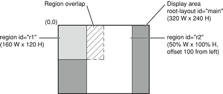
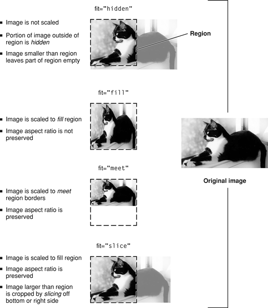

> 导航：[总目录](../../../README.md) · [documentation](../../../_indexes/documentation.md) · [SMIL Scripting Guide for QuickTime](Introduction%20To%20SMIL%20Scripting%20Guide%20for%20QuickTime.md)


[Next](Document%20Revision%20History.md)[Previous](Introduction%20To%20SMIL%20Scripting%20Guide%20for%20QuickTime.md)

# SMIL Scripting for QuickTime

Using SMIL syntax and a text editor, you can create multimedia presentations that can be played in QuickTime. You do this by writing a SMIL script that describes what media elements to display, where and when to display them, and how they should be layered.

QuickTime can import many SMIL files and create QuickTime movies from them. If you direct QuickTime to play an appropriately constructed SMIL file, the import is performed automatically and the SMIL presentation plays as if it were a QuickTime movie. Alternatively, you can save the imported movie as a QuickTime movie file.

[Overview of SMIL and QuickTime](#apple-f4xwc4dqnrsv64tfmyxwi33df52wszbpinedembtfvhxmzlsozuwk53pmzju2skmmfxgiulvnfrwwvdjnvsq) describes the QuickTime SMIL importer and gives general guides for the use of SMIL with QuickTime.

[Creating SMIL Scripts](#apple-f4xwc4dqnrsv64tfmyxwi33df52wszbpinedembtfvbxezlboruw4z2tjveuyu3dojuxa5dt) introduces you to SMIL and the features of SMIL that QuickTime supports, and shows you how to write a QuickTime-compatible SMIL script.

[SMIL Support in QuickTime](#apple-f4xwc4dqnrsv64tfmyxwi33df52wszbpinedembtfvju2skmkn2xa4dpoj2gs3srovuwg22unfwwk) provides a tabular reference of the SMIL elements and attributes that QuickTime supports.

[QuickTime SMIL Extensions](#apple-f4xwc4dqnrsv64tfmyxwi33df52wszbpinedembtfvixk2ldnnkgs3lfkngustcfpb2gk3ttnfxw44y) describes the extensions to SMIL provided by QuickTime.

[Playing SMIL Presentations in QuickTime](#apple-f4xwc4dqnrsv64tfmyxwi33df52wszbpinedembtfvigyylznfxgou2njfgfa4tfonsw45dboruw63ttnfxfc5ljmnvvi2lnmu) describes methods for making SMIL files play reliably in QuickTime, both on the desktop and over the Internet.

SMIL provides a high-level scripting syntax for describing multimedia presentations. SMIL files are text files that use XML-based syntax to specify what media elements to present, and where and when to present them. Elements can be sequenced and synchronized in time; visual elements can be positioned, scaled, overlapped, and layered.

QuickTime 4.1 and later include a SMIL importer that allows many SMIL presentations to be played in the QuickTime Player application and the QuickTime browser plug-in or ActiveX control.

The QuickTime SMIL importer creates a memory-resident QuickTime movie based on the SMIL file. Each media element listed in the SMIL file becomes a QuickTime movie track; the timing, positioning, and layering specified for each element are imported as track characteristics.

The import process is generally very fast—QuickTime does not need to actually download all the media files to begin the presentation. If the presentation contains a large number of elements, however, it can take some time simply to locate all the source files and set up the appropriate movie importer for each file format. A SMIL presentation with half a dozen elements typically opens without a perceptible pause, for example, but a presentation with 30 or 50 elements is likely to open after a noticeable lag.

The QuickTime SMIL importer does not support the full feature set of the SMIL 1.0 or SMIL 2.0 standards, but it does provide a useful way to script a QuickTime presentation using a text file and any media files that QuickTime can display, such as text, still images, audio, digital video, VR panoramas, Flash, and so on.

Media elements in a SMIL document are specified by URLs. Media elements can be files—such as text files, JPEG images, and QuickTime movies—or streams. The URLs that specify the media elements can use any of the common protocols—HTTP, FTP, RTSP, file access, and so on. This allows a SMIL file to specify a presentation that mixes streaming and non-streaming media, as well as local and web-based media.

The SMIL specification defines basic media types but it does not define specific media formats. A SMIL file may identify a media element as text, an image, video, or sound, for example, but SMIL itself does not differentiate between AIFF, WAVE, or MP3 audio files, or between DV, AVI, or MPG video formats.

Consequently, the exact set of media elements that can be played by a given SMIL player varies. Any SMIL player is likely to handle a presentation containing only JPEG images and AIFF audio, for example, but for other media and compression formats you may need to target a specific SMIL interpreter for reliable results.

QuickTime supports over 200 different media formats. Any media file or stream that QuickTime can play can be used as a SMIL media element in QuickTime.

However, QuickTime cannot play a SMIL file that specifies media QuickTime cannot play, such as a Real Media stream or a WMV video file compressed with a codec not available in QuickTime. Similarly, a Real or Windows Media SMIL interpreter would probably be unable to play a SMIL file whose media elements include QuickTime-specific media elements, such as a VR panorama, a QuickTime movie compressed using Sorenson video, or a QuickTime movie containing interactive sprites or Flash tracks.

By stitching together media elements using a text editor and SMIL syntax, you can build customized presentations from existing media—movies, slides, text, and audio recordings—and play them using QuickTime.

You can also use SMIL to combine media stored on a web server or a local disk with stored content on a streaming server (video on demand) or with live streams, both unicast and multicast.

Because SMIL documents are text files, you can generate customized QuickTime movies using another script, such as an AppleScript, Perl, or CGI script—anything that can generate text output.

For example, a common use of SMIL in QuickTime is to have a CGI or PHP script generate a SMIL file that tells QuickTime to display a programatically chosen advertisement before connecting the user to a live stream such as a radio broadcast.

Like other non-QuickTime file formats, SMIL files may or may not be associated with QuickTime in the user’s browser or operating system. Consequently, clicking a hypertext link to a `.smil` file, or double-clicking a SMIL file on the desktop, may launch QuickTime or some other SMIL player. To prevent this, you may want to save your SMIL presentations as QuickTime movies, or use HTML scripting, to ensure that your SMIL presentations play in QuickTime on the user’s system. This is described in detail in the section [Playing SMIL Presentations in QuickTime](#apple-f4xwc4dqnrsv64tfmyxwi33df52wszbpinedembtfvigyylznfxgou2njfgfa4tfonsw45dboruw63ttnfxfc5ljmnvvi2lnmu).

This section shows you how to work with SMIL to create a basic layout, define display regions, create a timeline with sequential and parallel media elements, specify media elements and set their durations, and make an element into a clickable link. This section also illustrates a technique to show different elements to different viewers using a switch. It illustrates use of the SMIL elements currently supported by QuickTime.

SMIL is based on XML, which is more rigidly structured than HTML but uses the same familiar `<tag>` and `</tag>` syntax.

Because it is XML-based, SMIL tags are case-sensitive (always lowercase) and all tags have to be explicitly ended—either a tag is self-contained and ends with `/>` (`<tag``parameters=”values”``/>`), or there are a pair of open and close tags that may enclose other elements (`<tag``parameters=”values”>``elements``</tag>`).

Unlike HTML, SMIL does not routinely mix structure and content together in the same document; a SMIL file contains only structure and the URLs of content. Where an HTML document typically contains body text, for example, a SMIL document would contain the URL of a text file instead.

Like HTML, a SMIL document has a head and a body. The structure of a SMIL file is shown in listing 1-1.

__Listing 2-1__  SMIL structure

```
<smil>
    <head>
        <layout>
            <!-- layout tags -->
        </layout>
    </head>

    <body>
        <!-- body tags -->
    </body>
</smil>
```

All the layout information is specified in the head. This determines where things can be displayed on the screen. Some or all of the screen is divided into any number of rectangular regions, which may partly or completely overlap. The media elements are listed in the body, which is also where the temporal sequencing is specified. Visual elements in the body are assigned to a region (defined in the head) where they are to be displayed.

The layout specifies the whole display area for the presentation, then defines regions where individual media elements can be displayed.

A SMIL layout always starts with a `<root-layout``/>` tag that gives the dimensions of the display area in pixels and assigns a background color:

```
<layout>
    <root-layout id="main" width="320" height="240"
    background-color="red" />
</layout>
```

The `id` parameter gives the presentation a name; it can be anything you like. The `height` and `width` parameters define the display area for the presentation in pixels. You can specify the background color using hexadecimal values (`#FF0000`) or names (`red`). Listing 1-2 is a very simple SMIL presentation—it’s just a red rectangle, but you can play it using QuickTime Player:

__Listing 2-2__  Simple SMIL presentation

```
<smil>
    <head>
        <layout>
            <root-layout id="main" width="320" height="240"
            background-color="red" />
        </layout>
    </head>
    <body> </body>
</smil>
```


The layout also defines regions within the display area. Regions themselves are invisible, but they define areas where visual media elements can be displayed. Regions can be positioned anywhere in the display area and can overlap, as shown in Listing 1-3.

__Listing 2-3__  Layout with root layout and two regions

```

<head>
    <layout>
        <root-layout id="main" width="320" height="240"
            background-color="red"/>

        <region id="r1" width="160" height="120" />
        <region id="r2" width="50%" height="100%"
        left="100" top="0" />
    </layout>
</head>
```

The first region is named `r1`, and is 160 x 120 pixels, extending from the top-left corner of the display area (the default position for a region).

The second region, `r2`, is half as wide as the display area (`width=”50%”`) and fills it from top to bottom (`height=”100%”`). Region `r2` is offset 100 pixels from the left edge of the display area (`left=”100”`). Since the first region is 160 pixels wide, the two regions overlap by 60 pixels.

__Figure 2-1__  Defining first and second regions



The top-left corner of a media element is always aligned with the top-left corner of the region it is displayed in. If you need to position an image somewhere else, just create another region at a different position—you can have as many regions as you like, and each one uses only a few bytes.

The `<region``/>` tag accepts the following parameters:

- `id`—gives each region a name, much like an HTML frame name.
- `height` and `width`—define the size of the region, either in pixels or as a percentage of the display area.
- `top` and `left` (optional)—specify the position of the region within the display area, either in pixels or as a percentage of the display area.

  By default, a region extends from the top-left corner of the display area. You can change this by specifying a `top` and `left` offset. For example, `top=”50%”``left=”100”` creates a region whose top-left corner is halfway down and 100 pixels from the left edge of the display area.

  If you set the `top` or `left` parameter, you must specify _both_`top` and `left` as a pair, even if one of them is zero.
- `z-index` (optional)—specifies the layering order when regions overlap.

  When regions overlap, one lies on top of the other. By default, a region defined later in the layout is on top of any regions defined earlier. You can set the layering explicitly using the `z-index` parameter. The layer with the highest `z-index` value is on top. The following example defines three regions with explicit `z-axis` values.

```
<region id="r1" width="160" height="120" z-index="3" />
<region id="r2" width="160" height="120" z-index="2" />
<region id="r3" width="160" height="120" z-index="1" />
```

The three regions overlap completely, with `r1` on top, `r2` in the middle, and `r3` at the bottom of the pile. If no `z-index` values had been specified, the layering would be reversed, with the last-defined region on top.

- `fit` (optional)—defines how media elements are cropped or scaled if they have pixel dimensions different from the region they’re displayed in. There are four possible values for this parameter:

  - `fit=”hidden”` (default)—images are not scaled. If an image is larger than the region, it is cropped. If an image is smaller than a region, part of the region is left empty.
  - `fit=”fill”`—images are scaled to match the height and width of the region, so an image always fills the region completely. The image’s aspect ratio may be distorted to make it fit.
  - `fit=”meet”`—images are scaled to meet the region’s boundaries while preserving each image’s aspect ratio, without cropping. An image may not fill the region completely, but always fills either the whole width or the whole height. The image is not cropped or distorted.
  - `fit=”slice”`—images are scaled to fill the region completely while preserving each image’s aspect ratio, cropping if necessary. If the aspect ratio of an image differs from the region, the image is cropped by taking a slice from the edge or bottom where it would extend beyond the region.

__Figure 2-2__  Scaling and cropping choices



Unlike HTML, scaling and cropping are applied to regions, not images. If you want to display different images on the same part of the screen, using different `fit` settings, create more than one region with the same area and x,y coordinates, but different `fit` values, and assign each image to the appropriate region. Create as many regions as you need.

Listing 1-4 is a SMIL document with two overlapping regions. It looks like a red rectangle when you play it using QuickTime Player, because regions are invisible; they just define areas where media elements _can_ be displayed.

__Listing 2-4__  SMIL with overlapping regions

```
<smil>
    <head>
        <layout>
            <root-layout id="main" width="320" height="240"
            background-color="red"/>

            <region id="r1" width="160" height="120" />
            <region id="r2" width="50%" height="100%" left="100"
            top="0" fit="fill" />
        </layout>
    </head>
    <body> </body>
</smil>
```


The body of a SMIL document specifies what media elements to present, which regions to display the visual elements in, and a timeline for the presentation.

The timeline groups media elements in two ways: things that happen in sequence and things that happen in parallel. If you don’t specify whether elements should be played sequentially or in parallel, QuickTime plays them in sequence. Sequences are surrounded by the `<seq>` and `</seq>` tags. Media elements in a sequence are presented one after the other—each element is presented after the previous element ends. There are different ways to determine when an element should end.

Media elements such as audio and video have an inherent duration, so they end when you would expect them to. For example:

```
<seq>
    <audio src="audio1.mp3" />
    <audio src="audio2.aiff" />
    <audio src="audio3.wav" />
</seq>
```

This sequence plays three audio files in a row. Each element ends when the audio has played all the way through. As soon as one element ends, the next begins.

Note that audio components have no visual part, so they are not assigned to a region.

Media elements such as still images and text have no inherent duration, so they’re usually assigned explicit durations:

```
<seq>
    
    
</seq>
```

In this example, the first image ends after being displayed for 5 seconds, then the second image appears and is displayed for 7 seconds. If you specify an explicit duration for an element that has its own inherent duration, it either ends when it normally would or after the duration you specify, whichever comes first.

Media elements that are displayed at the same time are surrounded by the `<par>` and `</par>` tags. Parallel elements are presented starting at the same time, but they don’t necessarily end at the same time. For example:

```
<par>
    <audio src="themesong.mp3" />
    
    <text src="lyrics.txt" region="r2" dur="30 sec" />
</par>
```

This example plays an MP3 audio file while simultaneously displaying a JPEG image in one region and some text in another. The image and the text are displayed for 30 seconds; the audio element ends whenever the MP3 finishes playing.

You can put a group of parallel elements into a sequence. The parallel group is treated as a single element in the sequence. All the elements in the parallel group start together at the appropriate point in the sequence. When the last element in the parallel group ends, the sequence continues, as shown in the following example.

```
<seq>
    <video src="Intro.mov" region="r1" />
    <par>
        <audio src="narration.aiff" />
        <video src="slides.mov" region="r1" />
    </par>
    <text src="credits.txt" dur="20 sec" region="r1" />
</seq>
```

In this example, `Intro.mov` plays first. The narration and the slides start together as soon as `Intro.mov` ends. When both the narration and the slides have ended, the credits are displayed.

You can combine parallel and sequential elements in different ways to achieve the same effect. When you have a choice, always choose the structure that creates the smallest number of elements. Each element in the SMIL structure takes time to import, slightly delaying the start of the presentation. As structures nest ever deeper, these slight delays can add up.

For example, suppose you want to display two sequences of images side by side. There are two obvious approaches.

You could create a sequence of parallel elements, with the left and right image pairs specified as parallel elements. If you have twenty image pairs, this results in a single sequence element containing twenty parallel elements, each with two media elements. This creates a file with a total of 21 structural elements, as shown in Listing 1-5.

__Listing 2-5__  Unnecessarily complex structure

```
<seq>
    <par>
        
        
    </par>

    <par>
        
        
    </par>
.
.
.
</seq>
```

Alternatively, you could create a single parallel element with two sequences, a left sequence and a right sequence, each with twenty media elements, as shown in Listing 1-6. This specifies an identical presentation of media, but creates a file with only 3 structural elements.

__Listing 2-6__  Simpler alternative structure

```
<par>
    <seq>
        
        
.
.
.
    </seq>
    <seq>
        
        
.
.
.
    </seq>
</par>
```

This version of the presentation will open _much_ more quickly than the version with 21 structural elements.

SMIL media elements are classified by type and specified by URL. Each visual media element is assigned to a region defined in the layout. The media type, the URL, and the region for visual media must be specified. All other parameters are optional.

There are currently six defined media types:

- `<audio``/>` (nonvisual)
- `<video``/>`
- ``
- `<text``/>`
- `<textstream``/>`
- `<animation``/>`

Use the media type that most closely describes a given media element. For a sound-only QuickTime movie, for example, use the `<audio/>` media type. SMIL isn’t terribly strict about this, so you can specify a FLIC animation file, for example, using either `<animation``/>` or `<video``/>`. Each media element is specified by a `src` parameter whose value is a URL. The URL can be absolute or relative and can use any protocol that QuickTime understands, including HTTP and RTSP.

Some example media types and URLs:

```
<audio src="http://www.myserver.com/path/myaudio.mp3" />
<video src="rtsp://streamserver.com/VideoOnDemand.mov"/>

<text src="subtitles.txt" />
<textstream src="rtsp://streamserver.com/streamtext.mov" />
<animation "http://www.myserver.com/myanim.flc" />
```

If the URL is specified as a local file, it would be `file:///`.

One URL protocol you may not be familiar with is `data:,` which lets you embed a media element inside your SMIL document. It’s normally used to embed small amounts of text that would otherwise require a separate file. Here’s an example of a `data:` URL:

```
<text region="aregion" dur="1:30" src="data:text/plain,Copyright Apple Computer, 2000" />
```


Every visual media element needs to be assigned to a display region defined in the layout. Only one element can be displayed in a region at any time (but you can have multiple regions covering the same screen area).

If the media element contains an image that is larger or smaller than its assigned display region, the image can be scaled, clipped, or both scaled and clipped, depending on the value of the `fit` parameter for that region.

Listing 1-7 illustrates the use of regions to display a sequence of images.

__Listing 2-7__  SMIL document that displays a series of JPEG images

```

<smil>
<head>
    <layout>
        <root-layout id="slideshow" width="320" height="240"
            background-color="black"/>
        <region id="r1" width="100%" height="100%" fit="meet" />
    </layout>
</head>

<body>
    <seq>
    
    
    
    </seq>
</body>
</smil>
```

This example displays a sequence of three JPEG images. All the images are displayed in the same region and are automatically scaled to fill the region as completely as possible without clipping or changing their aspect ratios. Each image has a duration of 5 seconds.

Some media elements, such as audio and video, have inherent duration. Text and still images, however, have no inherent duration. The easiest way to assign a duration is with the `dur` parameter. For example:

```

```

You can assign an explicit duration to override an element’s inherent duration. For example, if you specify

```
<audio src="sound1.wav" dur="1:05" />
```

the audio file `sound1.wav` ends after 1 minute 5 seconds, or when the audio finishes naturally, whichever comes first.

`Duration` is specified in `Hours:Minutes:Seconds.DecimalFractions.` You can leave off the hours, or the hours and minutes, or the fractions. You can add the “sec” identifier to make things more readable. The following five expressions are all equivalent:

```
dur="00:00:05.000"
dur="00:05.000"
dur="05.000"
dur="05"
dur="5 Sec"
```

Another way to explicitly set an element’s duration is to specify an end time or an end event. An element ends when its duration is exceeded, its end time or end event occurs, or it reaches its inherent end, whichever comes first. Setting `begin` and `end` parameters are discussed next.

You can specify an explicit start time and end time, or an event that triggers an element’s start or end, using the `begin` and `end` parameters. The time value that you specify is relative to when the element would normally begin.

For example, when you specify the following media element

```

```

you get this timing:

- If the element is part of a `<seq>``</seq>` sequence, it begins 5 seconds after the preceding element ends.
- If the element is part of a `<par>``</par>` group, it begins 5 seconds after the parallel group as a whole begins.

If you specify an end time, the element ends that amount of time after it would naturally begin. For example:

```

```

In this example, the image begins 5 seconds after its natural start time, and it ends 35 seconds after its natural start time, giving it a duration of 30 seconds. The element’s duration is equal to its end time minus its start time. If no `begin` value is specified, an `end` value is the equivalent of a `dur` value.

Alternately, you can specify that an element should begin or end when another element begins, ends, or reaches a specified duration. Instead of using a time as the value of the `begin` or `end` parameter, use the string:

```
"id(idname)(event)"
```

where `idname` is the `id` value of another element, and `event` is either `begin,``end,` or a time value. For example:

```
<par>
    <audio src="themesong.mp3" id="x" />
    
    <text src="lyrics.txt" region="r2" end="id(x)(end)" />
</par>
```

This example assigns an `id` value of `x` to the audio and sets the end of the image and text elements to synchronize with the end of element `x.`

Another example:

```
<par>
    <audio src="Sound1.aif" id="master" />
    <audio src="Sound2.aif" begin="id(master)(5sec)" />
    <audio src="Sound3.aif" end="id(master)(end)" />
</par>
```

In this example, the element `Sound1.aif` begins normally and has the `id` of `master.``Sound2.aif` begins 5 seconds after `Sound1.aif` begins. `Sound3.aif` begins normally (at the same time as `Sound1.aif`), but ends when `Sound1.aif` ends.

You can specify a clip from a media element using the `clip-begin` and `clip-end` attributes. This lets you play a selection from a longer file or stream. This works most efficiently with local content or streams. It does not work as well with files delivered by HTTP, because HTTP files always download in their entirety, even if only a small clip is actually played, and the file must download to the `clip-begin` point before it can begin playing.

The following example plays a clip from the movie `some.mov,` starting 4 seconds into the movie and ending 1 minute and 1 second into the movie:

```
 <video src="some.mov" region="movieregion"
     clip-begin = "npt=0:04"
     clip-end = "npt=1:01"
 />
```

Note that the time stamp has a different format than other SMIL attributes or QuickTime parameters; it is preceded by the label `npt=` and the label and parameter value are jointly surrounded by quotes. The format is limited to MM:SS. Hours and fractional seconds are not supported. For values less than 60 seconds, minutes must be specified as zero and cannot be simply omitted (for example, `clip-begin``=``”npt=0:59”`).

You can specify `clip-begin` without specifying `clip-end.`

You can make any visual media element in a SMIL document into a clickable link by using the `<a>``</a>` tags. You can direct the URL to load in a browser window or to replace the current SMIL presentation.

To make a visual element into a link, take the following steps:

- Precede the element with the `<a>` tag.
- Put the URL of the link in the `href` parameter of the `<a>` tag.

  - Set the `show` parameter of the `<a>` tag to `new` or `replace.`
  - Follow the element with the `</a>` tag.

In the following example, the Apple website loads in the default browser window if the user clicks in region `r1` while `poster.jpg` is being displayed.

```
<a href="http://www.apple.com/" show="new" >
    
</a>
```

The `show` parameter can have two possible values:

- `show=”replace”`—replaces the current SMIL presentation in the plug-in or QuickTime Player (whichever is active). In this case, the URL must specify something that QuickTime can play.
- `show=”new”`—opens the URL in the default browser window. In this case, the URL can specify a web page or anything the browser or one of its plug-ins can display.

You can use `show=”new”` to target a specific browser frame, specific browser window, or QuickTime Player, using the `target` SMIL extension. Refer to the section [QuickTime SMIL Extensions](#apple-f4xwc4dqnrsv64tfmyxwi33df52wszbpinedembtfvixk2ldnnkgs3lfkngustcfpb2gk3ttnfxw44y), for more information.

QuickTime doesn’t currently allow you to jump to a named point in SMIL presentations—you can’t use URLs of the form `href=name.smi#name` or `href=#name.`

You can automatically present different elements to different viewers using the `<switch>``</switch>` tags.

SMIL supports a set of user attributes, such as screen resolution, color depth, maximum data rate, and language. Groups of elements can be listed between `<switch>` and `</switch>` tags. QuickTime selects one element from the list based on user attributes, much like QuickTime’s alternate track and alternate movie mechanism.

This can be used to select an audio track based on language, as shown in the following example:

```
        <switch>
            <audio src="french.aif" system-language="fr"/>
            <audio src="german.aif" system-language="de"/>
            <audio src="english.aif" system-language="en"/>
        </switch>
```

This example selects `french.aif` for French speakers, `german.aif` for German speakers, and `english.aif` for English speakers.

The `<switch>` element selects the first item in the list that matches the user’s system attributes. If you select an item based on connection speed, order the elements from highest speed to lowest speed—QuickTime loads the first element whose requirement is less than or equal to the viewer’s connection speed, as illustrated in the following example:

```
<switch>
    <audio src="192k.mp3" system-bitrate=192000"/>
    <audio src="128k.mp3" system-bitrate="128000"/>
    <audio src="qdesign.mov" system-bitrate="28800"/>
</switch>
```

To provide a default, make the default the last item in the list and don’t specify a required attribute. It’s usually a good idea to include a default, as there may be cases you haven’t allowed for explicitly. The following example selects `french.aif` for French speakers, `german.aif` for German speakers, and `english.aif` for all others.

```
        <switch>
            <audio src="french.aif" system-language="fr"/>
            <audio src="german.aif" system-language="de"/>
            <audio src="english.aif"/>
        </switch>
```

QuickTime supports the following user attributes:

- `system-bitrate`—corresponds to the user’s connection speed in the QuickTime Settings control panel. The QuickTime settings are specified in kilobits per second, but `system-bitrate` is set in bits per second, so multiply the QuickTime setting by 1000 to get the correct `system-bitrate`. For example, the correct `system-bitrate` for QuickTime’s “56 Kbps Modem/ISDN” is `56000` and the `system-bitrate` corresponding to “256 Kbps DSL/Cable” is `256000`.
- `system-screen-size`—the minimum required screen resolution in pixels. The resolution is specified by HEIGHTxWIDTH. Note that this is contrary to common usage—a 640 x 480 minimum screen resolution is specified by setting `system-screen-size=”480x640”.`
- `system-screen-depth`—the minimum required color depth, in bits. Common values are `8` (256 colors), `16` (thousands of colors), and `24` (millions of colors).
- `system-language`—corresponds the user’s system language setting. The language is specified by a two-character code matching the ISO 639 language code specification, such as these:

  - Arabic—AR
  - Chinese—ZH
  - Danish—DA
  - Dutch—NL
  - English—EN
  - French—FR
  - German—DE
  - Greek—EL
  - Italian—IT
  - Japanese—JA
  - Korean—KO
  - Persian (Farsi)—FA
  - Polish—PL
  - Portuguese—PT
  - Russian—RU
  - Spanish—ES
  - Swahili—SW
  - Swedish—SV

For additional language codes, refer to [http://www.oasis-open.org/cover/iso639a.html](http://www.oasis-open.org/cover/iso639a.html)

For QuickTime to play a SMIL presentation, the presentation must use media elements that QuickTime can play, such as QuickTime movies, real-time streams in QuickTime format, AIFF and MP3 sound files, JPEG and GIF images, FLIC animations, text files, MIDI files, and so on.

As a simple test, if you can successfully open a URL in QuickTime Player (using Open URL in the File menu), you can use that URL as the `src` attribute of a media element in a SMIL presentation for QuickTime.

QuickTime does not currently support the complete SMIL specification. You can use all the SMIL tags and parameters described in [Creating SMIL Scripts](#apple-f4xwc4dqnrsv64tfmyxwi33df52wszbpinedembtfvbxezlboruw4z2tjveuyu3dojuxa5dt), but you should note the following exceptions from the W3C specification for SMIL 1.0:

- Regions can’t have scroll bars (don’t use `fit=”scroll”` in the `<region>` tag).
- Only the basic layout is supported (no CSS-based layout).
- The `<switch>` tag can’t be used to specify a root layout from a list.
- Hyperlinks can’t be used to pause the current SMIL presentation, load another one, then resume the current presentation (don’t use `show=”pause”` in the `<a>` tag).
- You can’t jump to a named point in another SMIL presentation—don’t use links of the form `<a``href=”fname.smi#anchor”>.`

Following is a summary of SMIL elements and attributes currently supported in QuickTime. Additional QuickTime-specific attributes are supported for some elements, as described in the section [QuickTime SMIL Extensions](#apple-f4xwc4dqnrsv64tfmyxwi33df52wszbpinedembtfvixk2ldnnkgs3lfkngustcfpb2gk3ttnfxw44y).

- `<smil>``</smil>`
- `<head>``</head>`
- `<layout>``</layout>`
- `<root-layout>``</root-layout>`

  - `height`
  - `width`
  - `id`
  - `background-color`

- `<region``/>`

  - `height`
  - `width`
  - `top`
  - `left`
  - `z-index`
  - `fit` (`hidden,``fill,``meet,``slice`)
- `<body>``</body>`
- `<seq>``</seq>`
- `<par>``</par>`

QuickTime supports the following media elements. Media typing in SMIL is not strict, so media types that do not have an exact match in SMIL, such as Flash and VR, can be labeled as animation or video in a SMIL file.

- `<audio``/>`
- `<video``/>`
- ``
- `<text``/>`
- `<textstream``/>`
- `<animation``/>`

Media elements can contain the following attributes:

- `src`
- `id`
- `region`
- `dur`
- `begin`
- `end`
- `clip-begin`
- `clip-end`

If used inside a `<switch>` element, media elements can contain the following attributes as system requirements:

- `system-language`
- `system-bitrate`
- `system-screen-size`
- `system-screen-depth`

QuickTime supports the following dynamic SMIL elements.

- `<a>``</a>`

  - `href`
  - `show` (`new,``replace`)
  - `target`

- `<switch>``</switch>`

  - `system-language`
  - `system-bitrate`
  - `system-screen-size`
  - `system-screen-depth`

In addition to support for the standard SMIL elements listed in the previous section, QuickTime provides a number of SMIL extensions. The QuickTime SMIL extensions allow you to specify behaviors that are supported by QuickTime but do not have SMIL equivalents, such as the `autoplay` attribute.

The SMIL standard allows for such extensions using an XML namespace specification. A namespace specification consists of a unique URL, provided by the vendor (in this case Apple Computer), and a namespace prefix to be used within a given SMIL document.

The URL for the QuickTime SMIL extensions is `http://www.apple.com/quicktime/resources/smilextensions` .

For simplicity and clarity, we recommend that you use the namespace prefix `qt:` for the QuickTime SMIL extensions in all your documents. You may use a different prefix however, as long as you are consistent throughout your document.

You need to specify the XML namespace for extensions before you use them. You can specify the namespace in the element where they are used, or in a parent element. In addition, each SMIL extension you use must include the namespace prefix.

In practice, this means adding an XML namespace attribute to your `<smil>` tag and preceding each QuickTime SMIL extension with `qt:`. For example:

```
<smil
xmlns:qt="http://www.apple.com/quicktime/resources/smilextensions"
qt:autoplay="true"
qt:time-slider="true" >
```

The example above sets the XML namespace attribute (`xmlns:`) using a prefix identifier (`qt=`) and the Apple QuickTime URL. It then sets the QuickTime SMIL attributes `autoplay` and `time-slider,` identifying them as QuickTime-specific attributes by using the `qt:` prefix.

The general syntax for using an XML namespace follows.

```
xmlns:nsprefix="URL"
```

where `nsprefix` is a namespace identifier and `URL` is the unique URL provided by the vendor of the XML extensions.

The URL is provided for reference purposes only; this URL is not accessed when the SMIL file is executed. The user does not need an Internet connection in order to view a SMIL presentation with a namespace URL.

Once the namespace attribute has been set in a SMIL element, that element and any elements within it can use names defined for that namespace.

Therefore, setting a namespace attribute at the beginning of the root `<smil>` element makes extensions for that namespace valid anywhere in the SMIL document.

The QuickTime SMIL extensions define the following additional attributes for the `<smil>` element:

_autoplay_

Specifies whether the presentation should automatically start playback. Legal values are `true` or `false`. The default is `false`. Common usage:

```
<smil xmlns:qt="http://www.apple.com/quicktime/resources/smilextensions"
qt:autoplay="true"/>
```

_next_

Specifies to the player that after this presentation is finished, the presentation referenced in the attribute value should be invoked and played in the same space. Used to chain presentations together. A valid attribute value is any URL. This capability is equivalent to the QuickTime browser plug-in’s `qtnext` attribute. The following example shows common usage:

```
<smil xmlns:qt="http://www.apple.com/quicktime/resources/smilextensions"
qt:next="nextpresentation.smi"/>
```

_time-slider_

Specifies whether a time-slider or “scrubber” should be included in the user interface. Legal values are `true` or `false.` The default is `false.` Because QuickTime normally loads SMIL media elements dynamically as needed, the known duration of the overall media presentation can change as a movie is played or navigated. This can be confusing to the user, as the current time indicator may jump around, speed up, or slow down unexpectedly. Consequently, the time-slider is not normally displayed in SMIL presentations. The time-slider can still be a valuable tool for navigating a presentation, however, and can be enabled by setting the time-slider attribute to `true.` You can modify the behavior of the time-slider using the `immediate-instantiation` attribute and the `chapter-mode` attribute. The following example shows common usage:

```
<smil xmlns:qt="http://www.apple.com/quicktime/resources/smilextensions"
qt:time-slider="true"/>
```

_chapter-mode_

Specifies the behavior of the time-slider (if it is included in the user interface by setting the `time-slider` attribute `true`). Legal values are `all` or `clip`. The default value is `all`.

In `all` mode, the time-slider can be used to navigate through the entire presentation and shows the current time in the presentation timeline as a whole. The time-slider represents the entire duration of the presentation, which is the sum of the durations of all elements in all sequences (the duration of a parallel group is the duration of the longest element in that group).

In `clip` mode, the time-slider can be used to navigate within the currently playing element and shows the current time within that element. The time-slider represents the duration of the current element in the sequence, or the duration of the longest element in the current parallel group.

The `clip` setting is useful for long presentations where the granularity of the timeline may be unacceptably low. It is also useful for network-based presentations, particularly those using streaming media, where the actual duration of a movie isn’t known until it has started to play. The example that follows shows common usage:

```
<smil xmlns:qt="http://www.apple.com/quicktime/resources/smilextensions"
qt:chapter-mode="clip"/>
```

_immediate-instantiation_

Specifies whether the media objects within the presentation should be instantiated immediately (at the time the presentation itself is instantiated), or whether instantiation should be deferred until the element is about to be played. Legal values are `true` (immediate) or `false` (when needed). Default is `false`. Instantiation means getting an instance of an object ready to play, and may involve opening or downloading a file, opening a stream, and importing a non-QuickTime media type into QuickTime.

The value of this attribute may be set on a per-media-object basis, using it as an attribute of individual media-object elements, as described in the following section, or as an attribute of the presentation as a whole, as shown in the following usage example.

Setting the `immediate-instantiation` attribute to `true` in the `<smil>` element causes all media objects used in the presentation to be instantiated immediately; this can make it easier for QuickTime to correctly determine the duration of the presentation before it begins, making the time-slider behavior more consistant. However, to instantiate all of the presentation elements at once can take considerable time and memory, particularly for a complex presentation or one being loaded over an Internet connection. Therefore, it is recommended that this attribute be used in the `<smil>` element only after careful consideration and testing. Common usage:

```
<smil xmlns:qt="http://www.apple.com/quicktime/resources/smilextensions"
qt:immediate-instantiation="true"/>
```


The QuickTime SMIL extensions define the following additional attributes for SMIL media elements.

_composite-mode_

Specifies how to composite a visual media element against the background color and visual media elements in overlapping regions that are lower on the z-axis. Media objects may be opaque, partly transparent, or translucent to varying degrees. This attribute’s value is a combination of a text string identifying the mode and an optional semicolon followed by a second parameter, which varies depending on the mode. The `composite-mode` SMIL attribute is equivalent to the graphics mode property of a QuickTime video track. Possible modes are:

- `copy`, `none`, `direct`—Any of these three values specify that the element is opaque. Elements below it on the z-axis are completely obscured where the elements overlap. This is the default mode for most image formats (a GIF with a designated transparent color defaults to `transparent-color` mode; a Photoshop image with an alpha channel defaults to `alpha` mode).
- `blend;percent`—Specifies a weighted blend between the image and the background, with the degree of opacity specified by an integer percent value (for example `composite-mode=”blend;50%”`). Elements lower on the z-axis are partly visible through the current element, determined using a blend algorithm. A setting of 100% makes an object completely opaque, 0% makes it completely transparent.
- `transparent-color;color`—Specifies that all pixels of a particular color within the image should be treated as transparent. Accepts a second parameter, `color`, which specifies the color value to be rendered as transparent. The `color` parameter may be any valid color specification supported by Cascading Style Sheets Level 2, such as `red`, `#ff0000`, `#f00`, `rgb(255,0,0)`, or `rgb(100%,``0%,``0%)`. Elements lower on the z-axis are visible through any transparent pixels.
- `alpha,``straight-alpha,``premultiplied-white-alpha,``premultiplied-black-alpha`—Specify that the image has an internal alpha channel that should be used when compositing. The values `alpha` and `straight-alpha` refer to a separate alpha channel; the premultiplied modes are used for images that have been premultiplied with an alpha channel against a white or black background, respectively. Elements lower on the z-axis are visible to the degree specified by the alpha component of each pixel.
- `straight-alpha-blend`—Specifies that the image has an internal alpha channel as a separate component, and that the alpha weight should also be multiplied by a percentage blend value, which is specified by a second parameter, with `0%` meaning completely transparent and `100%` meaning unmodified alpha. This has the effect of adding a degree of translucence to the object as a whole, in addition to any graduated translucence specified in the alpha channel.

Example usage:

```
    
    
    
    
```

_immediate-instantiation_

Specifies whether this element should be instantiated immediately when the SMIL presentation is instantiated, or whether instantiation should be deferred until this element is about to be presented. Legal values are `true` or `false`. Default is `false`. Instantiation may require opening or downloading a file, opening a stream, and importing a non-QuickTime media format into QuickTime. Immediate instantiation may add to the time and memory required to begin the presentation, but may also ensure a seamless presentation once display begins. See also: `bitrate`. Example usage:

```
    
```

_bitrate_

Specifies the bitrate at which a media object would need to be transmitted in order to play back in real time. This is used to allow QuickTime to estimate how far in advance it should attempt to read a deferred-instantitation media object in order to provide seamless playback. Possible values are positive integers, in units of bits-per-second. Example usage:

```
<video src="stream56k.mov" qt:bitrate="56000" />
```

_system-mime-type-supported_

Specifies to the player the MIME type that needs to be supported in order to be able to play back this particular media-object. This is distinct from the the `type` attribute because it is used in conjunction with the `<switch>` element in SMIL (in the same manner as system attributes such as `system-bitrate`). Legal values are character strings matching a valid MIME type. Example usage:

```
<switch>


</switch>
```

_attach-timebase_

Determines whether a child movie has an independent timebase or is linked to the timebase of the parent movie. (Each media element is loaded into QuickTime as a child movie. The parent movie is the SMIL presentation as a whole.) Default is `true`, which slaves the child’s timebase to its parent’s. This means the play/pause buttons control both the child movie and the SMIL presentation. Setting `attach-timebase` to `false` makes the child independent, which can be useful for allowing the user to interact directly with child movies, particularly multiple child movies within a parallel element. Be aware that when `attach-timebase` is set `false`, the play/pause controls do not affect the child movie, so you may need to provide some other method of control, such as sprites with wired actions. Example usage:

```
    
```

_chapter_

Specifies a chapter name to attach to this particular media object, which then may be used by the player to provide a higher-level navigation UI than a simple linear control. A list of chapters appears in the control bar, allowing the user to jump to the beginning of any chapter. The beginning of the media element is the beginning of a chapter. Legal values are a character string (display of long strings may be truncated unless the movie is very wide). Example usage:

```
    
```


You can play a SMIL presentation in QuickTime from the desktop or in a web browser, using the QuickTime Player application, the QuickTime browser plug-in, or the QuickTime ActiveX control. Because multiple applications and plug-ins may be registered to play SMIL presentations on a user’s system, different techniques are required to ensure that a SMIL presentation opens in QuickTime instead of some other player. This allows you to safely use all QuickTime-supported media as well as the QuickTime SMIL extensions.

Alternatively, you can create a “plain vanilla” SMIL presentation that uses only media elements supported by all common SMIL players—JPEG images, for example—and only structural elements supported by all common SMIL players, such as the `<seq>` and `<par>` tags. Such a presentation can be delivered to the desktop or over the web using the .smil file extension and rely on the user’s system to select a SMIL player, if one is available.

To play a SMIL file in QuickTime, it must be given a file extension that QuickTime is registered to play, prefereably .smi or .smil. Such a file can be dragged onto the QuickTime Player icon or opened in QuickTime Player by choosing Open from the File menu.

Double-clicking a SMIL file may or may not open the file in QuickTime Player. It depends on what application has most recently registered for the SMIL file type with the user’s operating system. For example, installing RealPlayer typically makes it the default SMIL player. On Macintosh computers, the application registered as the file creator generally takes precedence when a file is double-clicked, so a SMIL file may open in the text editor used to create it.

To be certain that a SMIL presentation will open in QuickTime Player when double-clicked from the desktop, drag the file onto the QuickTime Player icon and save as a self-contained movie (requires QuickTime Pro). This saves the movie data structure that results from importing a SMIL file. It should always open in QuickTime Player, and should open considerably faster than a raw SMIL file, particularly a SMIL file with many structural elements.

You should be aware that a self-contained movie file saved from a SMIL presentation does not include the media elements referenced by the SMIL file. The movie is “self-contained” in the respect that it no longer relies on the original SMIL file. It remains dependent on the external media objects referenced in the SMIL file.

To play a SMIL file in QuickTime, a web browser must call either the QuickTime plug-in or ActiveX control, or the QuickTime Player application. Because multiple applications and plug-ins may be registered for the SMIL file type, you need to help the browser to choose QuickTime. There are several ways to do this.

The simplest method is to save the SMIL file as a QuickTime movie, as described in the previous section, [Playing SMIL Files on the Desktop.](#apple-f4xwc4dqnrsv64tfmyxwi33df52wszbpinedembtfvigyylznfxgou2njfgem2lmmvzw63tunbsuizltnn2g64a) You can then embed the SMIL file in a web page as you would any QuickTime movie. See “HTML Scripting Guide for QuickTime” for additional information.

Other methods of assisting a browser to choose QuickTime are somewhat browser-dependent. It is possible to combine methods to cover all common cases, however.

The most common browser is Internet Explorer for Windows (IE/Win). You can tell IE/Win to play media in QuickTime by using the `<object>` tag with the QuickTime class ID and code base. For example:

```
<OBJECT
CLASSID="clsid:02BF25D5-8C17-4B23-BC80-D3488ABDDC6B"
CODEBASE="http://www.apple.com/qtactivex/qtplugin.cab"
WIDTH="320" HEIGHT="256" >

<PARAM NAME="src" VALUE="My.smil" />

</OBJECT>
```

As shown in the example, the class ID for QuickTime is `02BF25D5-8C17-4B23-BC80-D3488ABDDC6B` and the code base is `http://www.apple.com/qtactivex/qtplugin.cab` .

For all other browsers, you can use the `QTSRC` attribute in the `<embed>` tag. This requires you to embed a file in your web page that only QuickTime is registered to play, such as a QuickTime movie (`.mov`) or QuickTime image file (`.qtif`). The browser invokes the QuickTime plug-in to play the embedded file (the browser may also download the embedded file). The QuickTime plug-in recognizes the `QTSRC` attribute and loads the SMIL file, as shown in this example:

```
<EMBED
SRC="Some.mov"
QTSRC="My.smil"
WIDTH="320" HEIGHT="256"
PLUGINSPAGE="www.apple.com/quicktime/download"
TYPE="video/quicktime" />
```

Note that the `PLUGINSPAGE` and `TYPE` attributes tell the browser where to get the QuickTime plug-in and that this is a QuickTime movie file.

Note also that the file whose name is passed in the `SRC` attribute is not actually displayed, but that it may be downloaded by the browser. For this reason, it is best to pass the name of a very small QuickTime movie or QuickTime image file. You can make such a movie file by opening a single-pixel GIF in QuickTime Player and saving it as a self-contained movie.

The `<embed>` tag actually works with IE/Win, much as it does in other browsers, but IE/Win does not recognize the `PLUGINSPAGE` command. Consequently, if the `<embed>` tag is used alone, IE/Win does not offer to download QuickTime for users who need it. For this reason, it is recommended to combine both the `<object>` and `<embed>` tags. This provides a reliable user experience regardless of the user’s browser or operating system. Listing 1-8 provides an example.

__Listing 2-8__  Combining the object and embed tags

```
<OBJECT
CLASSID="clsid:02BF25D5-8C17-4B23-BC80-D3488ABDDC6B"
CODEBASE="http://www.apple.com/qtactivex/qtplugin.cab"
WIDTH="320" HEIGHT="256" >

<PARAM NAME="src" VALUE="My.smil" />

<EMBED
SRC="Some.mov"
QTSRC="My.smil"
WIDTH="320" HEIGHT="256"
PLUGINSPAGE="www.apple.com/quicktime/download"
TYPE="video/quicktime" />

</OBJECT>
```

Note that the `<embed>` tag must be closed with either a `/>` or a `</embed>` tag to work correctly inside an `<object>``</object>` tagset.

Other methods of playing a SMIL file in a web browser include using the `HREF` attribute to target QuickTime Player, using a QuickTime reference movie, and using an XML QuickTime Media Link file. For details, see “HTML Scripting Guide for QuickTime.”

[Next](Document%20Revision%20History.md)[Previous](Introduction%20To%20SMIL%20Scripting%20Guide%20for%20QuickTime.md)

