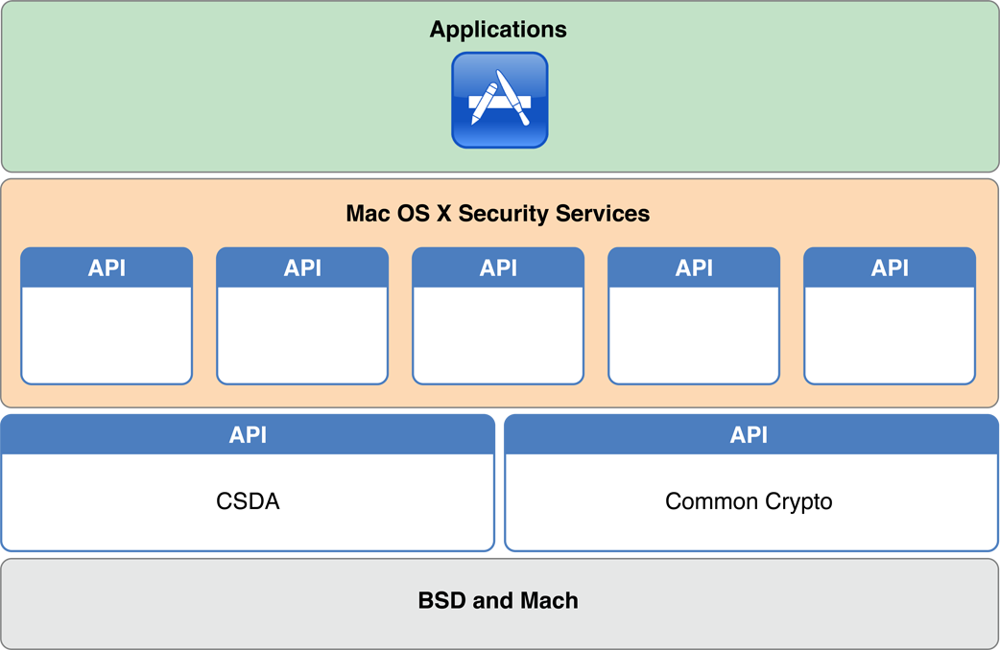

> 导航：[总目录](../../../README.md) · [documentation](../../../_indexes/documentation.md)

[Next](Authentication%20and%20Identification%20In%20Depth.md)

# About Authentication, Authorization, and Permissions

Authentication and authorization are a key aspect of computer security. _Authentication_ means determining the identity of a user, server, or client. _Authorization_ means determining whether that user, server, or client as permission to do something. _Permissions_ are settings on a file or other object that define who or what is allowed to use it and what they are allowed to do with it. This document describes the way macOS approaches authentication, authorization, and permissions.

As you saw in _[Security Overview](../Security%20Overview/About%20Software%20Security.md#apple-f4xwc4dqnrsv64tfmyxwi33df52wszbpkridgmbqgaydsnzw)_, macOS provides a wide range of security technologies that you can use when securing your application and its data. Authentication, authorization, and permissions in macOS are largely based on two open-source standards: Mach and BSD. These technologies sit at the lowest layer of macOS. The cryptography used for storing passwords and other secret information is provided by higher level technologies, such as Common Crypto. Common Crypto is an Apple open source technology that provides support for symmetric and asymmetric encryption, hashing, and other cryptography-related tasks.

On top of these three technologies, macOS layers a number of security APIs (most of which are in the Core Services layer), including Security Transforms, the Security Interface framework, and Keychain Services. The Security Objective-C API is described in this document. The others are described in _[Cryptographic Services Guide](../Cryptographic%20Services%20Guide/About%20Cryptographic%20Services.md#apple-f4xwc4dqnrsv64tfmyxwi33df52wszbpkridimbqgeytcnzs)_.

### macOS Provides Many Authentication and Identification Schemes and Technologies

There are many different ways to do authentication and identification, and macOS provides a number of authentication-related APIs and UI elements to help you. macOS also provides a number of authentication features to help you integrate macOS into enterprise environments.

### Authorization Services Provides Centralized Management of Privileges

The Authorization Services API lets you run privileged helpers, and lets you use a single, central source of information for limiting what features of your app are usable by different accounts on the system. The Authorization Services API is not supported in sandboxed apps.

### Permissions and Access Control Limit Program Behavior

macOS supports permissions systems at various levels of the system, from Mach ports to file system permissions and mandatory access control.

The BSD portions of macOS provide fundamental services, including a user and group identification scheme, file system security policies based on users and groups, and network security policies.

The Mach portions of the macOS kernel provide fundamental services, including memory management, process management, thread management, hardware abstraction (with the help of the I/O Kit), and Mach port-based communication. Mach enforces access by controlling which tasks can send a message to a given Mach port, where a Mach port represents a task or some other Mach resource.

Before reading this document, you should be familiar with the concepts in _[Security Overview](../Security%20Overview/About%20Software%20Security.md#apple-f4xwc4dqnrsv64tfmyxwi33df52wszbpkridgmbqgaydsnzw)_ and _[Secure Coding Guide](../Secure%20Coding%20Guide/Introduction%20to%20Secure%20Coding%20Guide.md#apple-f4xwc4dqnrsv64tfmyxwi33df52wszbpkridimbqgazdimjv)_.

For more information on related technologies, consider the following documents:

- _[Security Overview](../Security%20Overview/About%20Software%20Security.md#apple-f4xwc4dqnrsv64tfmyxwi33df52wszbpkridgmbqgaydsnzw)_—Provides an overview of security concepts
- _[Cryptographic Services Guide](../Cryptographic%20Services%20Guide/About%20Cryptographic%20Services.md#apple-f4xwc4dqnrsv64tfmyxwi33df52wszbpkridimbqgeytcnzs)_—Describes the cryptographic features of macOS and iOS
- _[Running At Login](https://developer.apple.com/library/archive/technotes/tn2228/_index.html#//apple_ref/doc/uid/DTS40007991)_—Describes how to write authorization services plug-ins for adding authentication schemes
- _[Secure Coding Guide](../Secure%20Coding%20Guide/Introduction%20to%20Secure%20Coding%20Guide.md#apple-f4xwc4dqnrsv64tfmyxwi33df52wszbpkridimbqgazdimjv)_—Explains how to write code that is robust against security holes
[Next](Authentication%20and%20Identification%20In%20Depth.md)

