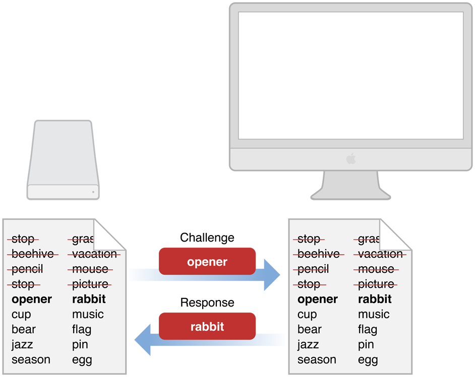
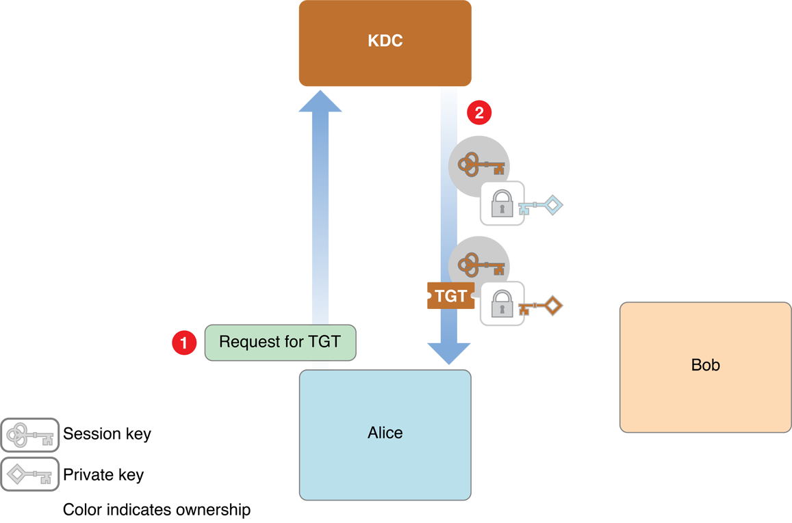
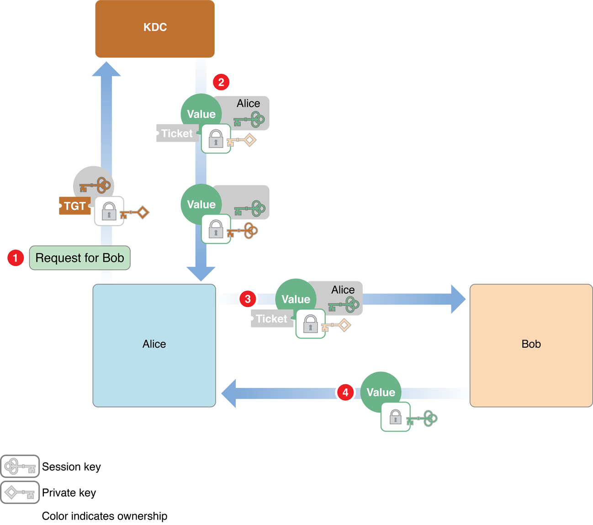
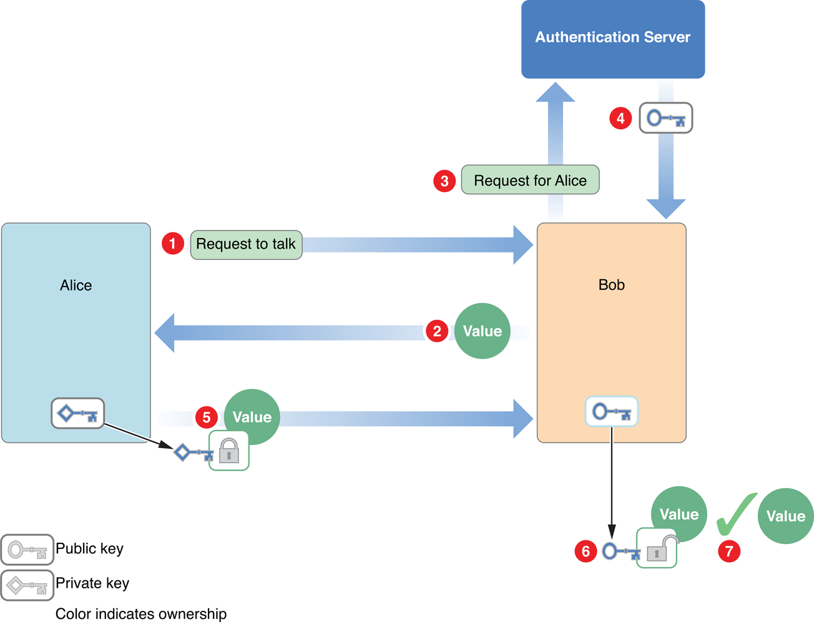
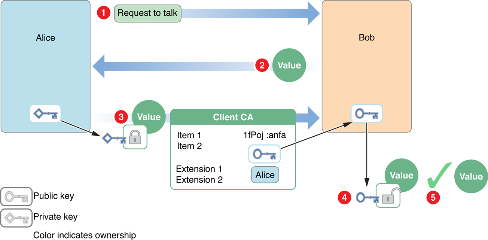
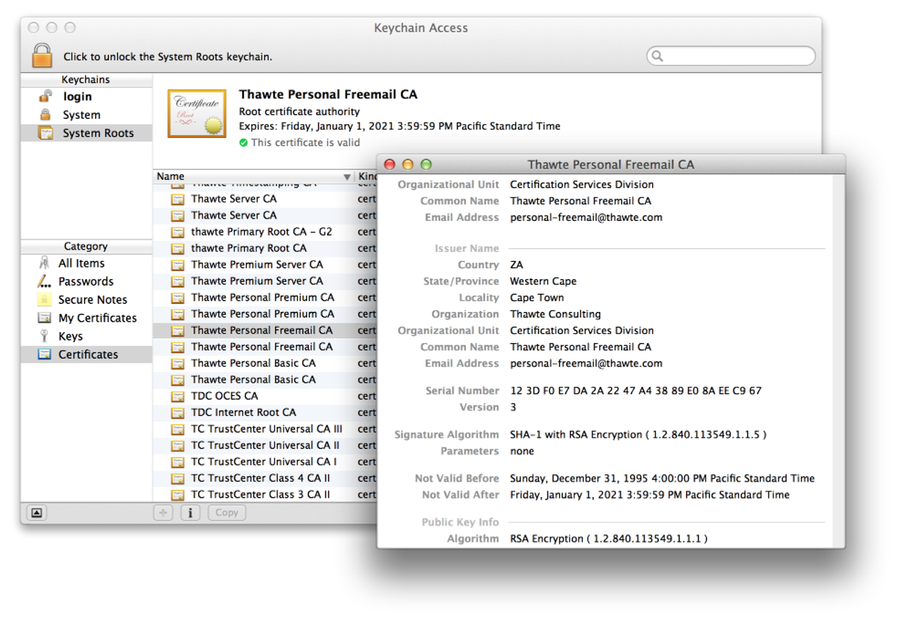
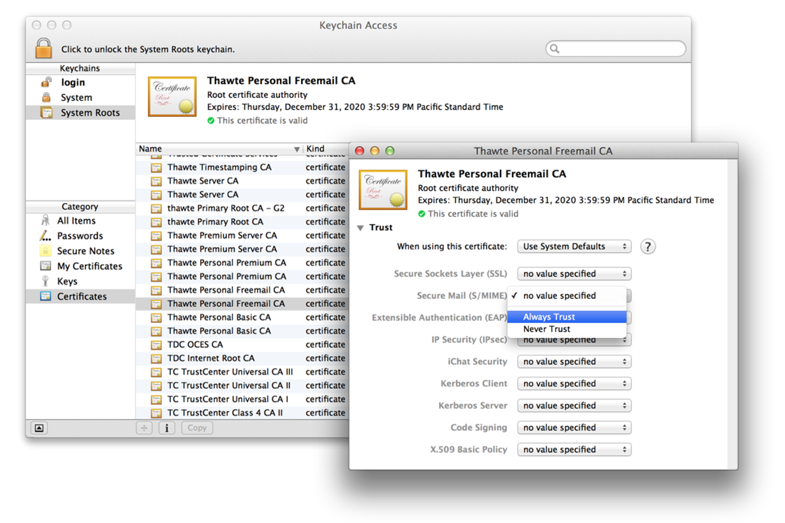
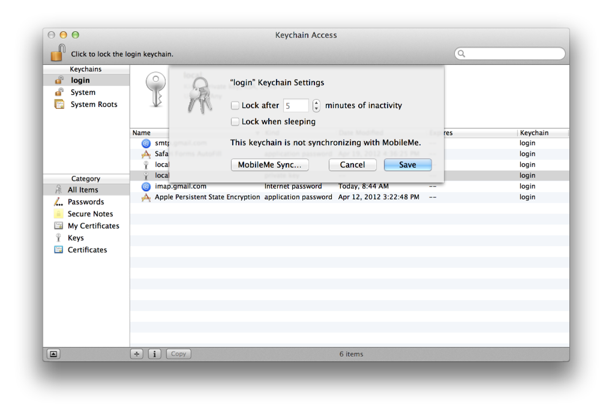

> 导航：[总目录](../../../README.md) · [documentation](../../../_indexes/documentation.md) · [Authentication, Authorization, and Permissions Guide](About%20Authentication%2C%20Authorization%2C%20and%20Permissions.md)

[Next](Using%20Authorization.md)[Previous](About%20Authentication%2C%20Authorization%2C%20and%20Permissions.md)

# Authentication and Identification In Depth

As explained in _[Security Overview](../Security%20Overview/About%20Software%20Security.md#apple-f4xwc4dqnrsv64tfmyxwi33df52wszbpkridgmbqgaydsnzw)_, authentication is the process by which a person, app, server, or other entity proves that it is who or what it says it is. Authentication is achieved through presenting something that you know, something that you have, some unique identifying feature, or some combination of these.

To make authentication more convenient and efficient, many systems use some method of identification, which is a means of verifying that the person or entity is the same one you communicated with last time. In the physical world, this might be an ID card, a conference badge, or a colored wrist band. In computers, identification usually means issuing a ticket, token, or other credential at the end of the authentication process.

This chapter provides an in-depth explanation of types of authentication, tells you where to get information about writing new authentication schemes, and describes the authentication-related APIs and UI elements available to you in macOS.

When a user logs in, identifies himself or herself to the security agent, or performs various other tasks, macOS authenticates the user using one of the following technologies:

- The Kerberos Key Distribution Center (KDC), which is built into macOS Server (see [Kerberos](#apple-f4xwc4dqnrsv64tfmyxwi33df52wszbpkridimbqgeytembqfvbuqnbnineeir2cincem))
- A password stored securely in the Open Directory Password Server database
- Shadow hash authentication, in which cryptographic hashes for NT and LAN Manager authentication are stored in a local file that only the root user can access
- An encrypted password stored directly in the user’s account
- A non-Apple LDAP (Lightweight Directory Access Protocol) server

Using the technologies listed above, there are three common ways that macOS authenticates a user, server, or other entity: shared secrets, Kerberos tickets, and the combination of public key cryptography with certificates. These techniques are described in the sections that follow.

Many authentication methods are based on shared secrets, such as passwords. The security of shared secret authentication methods depends on the ability of both parties to keep the secret safe. If the secret is ever intercepted or is simple enough to be easily guessed, the method is not secure at all.

For example, the physicist Richard Feynman had a reputation as a safecracker when he worked at Los Alamos. However, in most instances he merely guessed the safe’s combination by using such numbers as the safe owner’s birthday or address. Similarly, if you select a password based on your middle name and then use the same password on all your accounts, none of your accounts will be secure.

On the other hand, carefully picked and guarded secrets can be extremely secure. Two examples of highly secure shared secret methods are one-time pads and time-based passwords.

One-time pad authentication requires that both parties have an identical list of pairs of numbers, words, or symbols. The most secure lists are randomly generated. When one party (Alice) requests an interchange with the other (Bob), Bob sends Alice a challenge in the form of one of the items selected from the list. Alice must respond with the corresponding paired item (Figure 1-1). After a challenge has been used, it is crossed off the list and never used again.

__Figure 1-1__  Authentication using one-time pads

The one-time nature of one-time pad authentication makes it impossible for someone to guess the appropriate response to any one particular challenge by a brute force attack—that is, by responding to the challenge repeatedly with different answers until hitting the right answer. Similarly, it is impossible to guess what the next challenge should be. Assuming that the lists are truly randomly generated, the only way to break such a system is to know some portion of the contents of the list of pairs.

For this reason, after the one-time pad has been shared securely, it can be used over insecure communication channels. If someone snoops the communication, they can obtain that challenge-response pair. However, that information is of no use to them, since that particular challenge is never issued again.

The first problem with challenge-response pairs is that generating truly random lists is difficult with computers. Pseudorandom lists are much easier to obtain, and can (in principle at least) be duplicated, given the right algorithm and a good guess at the seed value. The second problem is that this method is useful only if every pair of correspondents has a unique set of lists. Otherwise, it is impossible to determine which holder of the list is authenticating. Finally, as with any shared secret method, the lists must be kept secret when they are shared and stored securely. If one of the lists is obtained by a third party, the method is compromised and the security breach might be undetectable.

_Time-based authentication_ is a shared secret method in which the secret is changed periodically in a way known only to the two parties involved.

For example, in one variant, both parties begin with the same small set of seed numbers (as few as two or three) and use a mathematical function that calculates a new number from them. Every time interval (for example, once per minute), a new number is calculated from the previous two or three numbers, and the oldest number is discarded.

As long as both parties keep their clocks synchronized and start with the same seed numbers, they can calculate the current authentication number. In order to guard against a third party intercepting enough numbers to calculate the series or authenticating themselves before the number expires, the numbers should be transmitted over a secure communication channel. To further increase security (for example, if the number-generating ID card is lost or stolen), the generated number is combined with a password or PIN known only to the two parties.

As with other shared secret methods, time-based authentication depends on the physical security of the shared secret, and each individual user must have a unique generated number and PIN.

_Event-based authentication_ is very similar to time-based authentication, except that the generation of a new value is triggered by an explicit user action instead of a timer.

In one common variation of this scheme, the user presses a button on a hardware token to generate a new value (computed based on the previous few values).

Whenever someone authenticates successfully, the server stores the last value used for logging in (and the values used to compute it). When the server receives a subsequent request, it computes the next few values in the sequence, beginning with the first value after that stored value (where the exact value of “few” is implementation dependent).

If the user enters one of those computed values, the user is authenticated, and that new value is stored (along with the values used to compute it) for future use.

In Greek mythology, Kerberos was the three-headed dog that guarded the gates of Hades. In computer security, Kerberos is an industry-standard protocol created by the Massachusetts Institute of Technology (MIT) to provide authentication over a network.

_Kerberos_ is a symmetric-key, server-based protocol that is widely used in Macintosh, Windows, and UNIX networks. Kerberos has been integrated into macOS since 10.1. Kerberos is highly secure, and unlike some other shared secret, private-key methods, it can be used for one-to-many and many-to-many communications as well as one-to-one. Kerberos achieves this ability by storing all users’ passwords in a central location, the directory server. Kerberos can be used for any number of users and servers on a network.

macOS works with all common directory servers, including LDAP (Lightweight Directory Access Protocol) servers and Microsoft Windows Active Directory servers. macOS Server includes an open source LDAP server.

Kerberos works by passing around Kerberos tickets—blocks of data used to identify a user who has been previously authenticated. These tickets are issued for a specific user, service, and period of time. Because the initial Kerberos ticket is a form of identification, a kerberized application can use that ticket to request access to additional kerberized services without requiring the user to reauthenticate (by reentering the user’s password). (A kerberized service or application is one that has been configured to support Kerberos tickets.) This ability to access additional services without reauthentication is called _single sign-on_.

macOS can host Kerberos authentication services (called a _Key Distribution Center_ (KDC)). Any macOS Server installation that is configured to include a shared LDAP server automatically includes a Kerberos v5 KDC. The Kerberos server software is also included in the client version of macOS.

Although users’ passwords cannot be intercepted during authentication (because they are never sent over the network), it is very important to keep the machine containing the directory server in a secure location. All passwords and private encryption keys are stored in the directory server and are therefore vulnerable to attack if a malicious person gains access to the server.

Any user with an iCloud account can use Kerberos over the Internet to access and control a computer remotely—a service known as _Back To My Mac_. This service uses public key cryptography to authenticate the two computers, which then follow standard Kerberos protocols, with one computer acting as the KDC and the other as the Kerberos client. The protocol that defines the use of public key cryptography for initial authentication in Kerberos is known as _PKINIT_. You use the open-source Generic Security Service Application Program Interface (_GSS-API_) to adapt your application to use Kerberos.

The following macOS services support Kerberos authentication:

- Apple Mail
- Apple Filing Protocol (AFP server)
- Apple FTP server
- Telnet
- SSH
- NFS
- SMB
- CUPS
- VNC
- iCal
- Xgrid
- Macintosh Manager Client Logins

See the advanced administration guides for your version of macOS at [Apple's macOS Server resources site](http://www.apple.com/macos/server/specs) to learn about the services that support Kerberos and to learn how to implement a Kerberos KDC on your macOS server.

There are several phases to Kerberos authentication. In the first phase, the client obtains credentials (blocks of data that identify and authenticate an entity) to be used to request access to kerberized services. In the second phase, the client requests authentication for a specific service. In the final phase, the client presents those credentials to the service. Figure 1-2 and [Figure 1-3](#apple-f4xwc4dqnrsv64tfmyxwi33df52wszbpkridimbqgeytembqfvbuqnbnineeirkcjjdei) illustrate this process.

Figure 1-2 shows the first phase, in which the client, labeled Alice in the figure, requests credentials from the Kerberos KDC.

__Figure 1-2__  Requesting credentials from the KDC

The steps are as follows:

1. Alice looks up the user ID for her username using a directory server.

   Alice then sends a request to the KDC asking for credentials, providing that user ID (in cleartext).

   The KDC gets Alice’s password from the directory server, and applies a hashing function to it, thus turning it into a temporary encryption key. This temporary key is known as Alice’s _secret key_.
2. The KDC creates an encryption key called a _session key_ for use by Alice the next time she wants to request service from a kerberized server, and encrypts that key with the Alice’s secret key.

   It also creates an identification credential called a _ticket-granting ticket_ (TGT), which contains a copy of the session key encrypted with the KDC’s secret symmetric key (plus other information).

   Both the session key and the TGT include timestamps and expiration times to limit the chances of their being intercepted and used by unauthorized persons.

   The KDC sends both credentials to Alice, along with information about how to transform Alice’s password into her secret key.

   Because Alice knows her password, Alice uses it, along with that hash information, to compute her secret key. Alice then uses her secret key to decrypt the session key and stores it for later. She can’t decrypt the TGT or modify it, but saves it for later use as well.

In the second phase, Alice uses the TGT to request identification credentials from the KDC in order to use a kerberized service, labeled Bob in the figure. Because Alice has a TGT, the KDC does not have to reauthenticate her, so Alice is not asked again for her password.

In the third phase, Alice sends the credentials to Bob, and Bob sends authentication information to Alice. The second and third phases are illustrated in Figure 1-3.

__Figure 1-3__  Authenticating the client and server with a Kerberos ticket

The steps are as follows:

1. Alice sends two messages to the KDC:

   - An authenticator—a request to open a session with Bob that includes the client ID ad a timestamp—encrypted using the session key
   - A message that contains the TGT that the KDC issued earlier
2. The KDC decrypts the TGT and extracts the session key it issued earlier to Alice. (Recall that when the KDC sent the session key to Alice earlier, it was encrypted with Alice’s secret key, so only the KDC and Alice can know this session key.) Because the TGT is encrypted with the KDC’s secret key, it cannot have been altered, and thus the KDC trusts that session key.

   The KDC obtains Alice’s client ID by using the main session key to decrypt the authenticator.

   The KDC then generates a new client-server session key for Alice to use when communicating with Bob, encrypts it with the main session key, and sends it to Alice.

   The KDC also creates a ticket for Alice to send to Bob. This ticket contains a new session key, and Alice’s client ID. This key is encrypted with Bob’s secret key, so Alice (or an intruder) cannot read or modify it. The KDC sends this ticket to Alice.
3. Alice sends the ticket to Bob. Alice also sends a new authenticator (client ID and timestamp) encrypted using the client-server session key.

   Bob decrypts it with his secret key. Because only the KDC and Bob know his secret key, Bob knows the ticket was issued by the KDC. Bob extracts the client-server session key.

   Bob uses the client-server session to decrypt the authenticator. It then sends back a message containing the timestamp from the authenticator plus one, encrypted using the session key.
4. Because Alice knows that only she and Bob have this session key, she knows that the credential must have come from Bob. She checks the value and compares it with the one she received earlier from the KDC. If they are off by one (as expected), she knows that the Bob has been authenticated by the KDC.

Note that this procedure does not involve sending either Alice’s or Bob’s secret key over the network. Because both Alice and Bob are authenticated to each other, Bob knows that Alice is a valid user and Alice knows that Bob is the server with which she intended to do business. All credentials are further protected with timestamps and expiration times. Kerberos has other security features as well; for details, see the MIT Kerberos website at [MIT's kerberos page](http://web.mit.edu/kerberos/).

Kerberos is an authentication protocol, not an authorization protocol. That is, it verifies the identities of both the client and the server, but it does not include any information about whether the client has a right to use the services provided by the server. In terms of the preceding discussion, after Bob is satisfied that the request for services really came from Alice, it is up to Bob to determine whether to grant Alice access to those services. The ticket that Bob receives from Alice contains enough information about Alice to enable Bob to make that determination.

Starting with Kerberos version 5, Kerberos tickets provide a mechanism for the tamperproof transmission of authorization information. When the client requests a ticket, it includes information about itself in the request and can request that the KDC include additional authorization in the ticket. The KDC inserts this information into the authorization data field of the ticket and forwards it to the server. Kerberos does not define how this authorization information should be encoded; it provides only a secure mechanism for its transmission. It is up to the client and server to implement the authorization protocol.

macOS uses Kerberos for single sign-on authentication, which relieves users from entering a name and password separately for every kerberized service. With single sign-on, after a user enters a name and password in the login window, the user does not have to enter a name and password for Apple file service, mail service, or other services that use Kerberos authentication. In other words, Kerberos authenticates the user once, and thereafter uses tickets to identify the user.

To take advantage of the single sign-on feature, services must be configured for Kerberos authentication and users and services must use the same Kerberos KDC. In macOS, user accounts in an LDAP directory that have a password type of Open Directory use the server’s built-in KDC. These user accounts are automatically configured for Kerberos and single sign-on. The server’s kerberized services also use the server’s built-in KDC and are automatically configured for single sign-on.

At a high level, you can usually think of the Kerberos Key Distribution Center (KDC) as a single entity. However, a KDC consists of two separate software processes: the authentication server and the ticket-granting server. The authentication server verifies a user’s identity by prompting the user for a name and password and asking the directory server for the user’s password. The authentication server then looks up the user’s secret key, generates a session key, and creates the ticket-granting ticket (TGT), as shown in Figure 1-4.

__Figure 1-4__  Requesting credentials from the KDC (revisited)

Thereafter, the user sends the TGT to the ticket-granting server whenever the services of a kerberized server are required, and the ticket-granting server issues the ticket, as shown in Figure 1-5.

__Figure 1-5__  Authenticating the client and server with a Kerberos ticket (revisited)

Many networks are too large to efficiently store all the information about users and computers in a single directory server. Instead, a distributed model is used, where there are a number of directory servers, each serving a subset of the network. In Kerberos parlance, this subset is referred to as a _realm_. Each realm has its own ticket-granting server and authentication server. If a user needs a ticket for a service in a different realm, the authentication server issues a TGT and the user sends the TGT to the authentication server, as before. The authentication server then issues a ticket, not for the desired service but for the remote ticket-granting server for the realm that the service is in. The user then sends the ticket to the remote ticket-granting server to get the ticket for the actual service.

In fact, in a large network, the user might have to contact the remote ticket-granting server in a sequence of realms before finally getting the ticket for the desired service. When a ticket for the application service is finally issued, it contains an enumeration of all the realms consulted in the process of requesting the ticket. An application server that applies strict authorization rules is permitted to reject authentication that passes through realms that it does not trust.

As described in _[Security Overview](../Security%20Overview/About%20Software%20Security.md#apple-f4xwc4dqnrsv64tfmyxwi33df52wszbpkridgmbqgaydsnzw)_, public key cryptography uses a pair of mathematically related keys for encryption and decryption so that data encrypted with one key can be decrypted only with the other and vice versa. Computing one key from the other is computationally difficult, and thus one key, the _public key_ can be made publicly available without compromising the other key. The other key, the _private key_, is kept secure.

In addition being a good way to send messages securely over insecure channels, public key cryptography can also be used as an authentication method. Because the private key is known only by its owner, access to that public key can be treated as proof of identity.

In principle, public key authentication works in much the same way as symmetric key authentication, with one major difference: because public keys do not have to be kept secret, there is no need to encrypt them or send them over secure channels. The public key can be provided by a server, in a certificate, or through some other method. Figure 1-6 illustrates public key authentication using an authentication server.

__Figure 1-6__  Public key authentication

The steps are as follows:

1. Alice sends Bob a request to talk.
2. Bob generates a random value and sends it to Alice as a challenge.
3. Bob requests Alice’s public key from the authentication server.
4. The authentication server sends the unencrypted public key to Bob.
5. Alice encrypts the random value with her private key and sends it to Bob.
6. Bob decrypts the value with Alice’s public key.
7. Bob compares the decrypted value with the original value to verify that they are identical. Alice has now authenticated herself to Bob.

Bob can authenticate himself to Alice in exactly the same way.

Notice that there is no need for the authentication server to store any sensitive material. The public keys do not have to be stored securely, and the authentication server does not need to hold passwords because it never has to verify one. However, it is necessary to ensure that no one alters the public keys stored in the authentication server. Otherwise, Eve (for example) could substitute her public key for Alice’s and could then impersonate Alice. Actual implementations of server-based public key authentication systems, therefore, such as those used by Novell Corporation’s NDS (Novell Directory Services), include additional security features.

Note, however, that it is not necessary to have an authentication server in order to use public key authentication. Digital certificates can take the place of a central distributor of public keys.

The problem of ensuring that a public key actually belongs to the entity you want to authenticate can be addressed using digital certificates. Authentication using a digital certificate is illustrated in Figure 1-7.

__Figure 1-7__  Authentication with a digital certificate

The steps are as follows:

1. Alice sends Bob a request to talk.
2. Bob generates a random value and sends it to Alice as a challenge.
3. Alice encrypts the value with her private key and sends it to Bob. She also sends Bob her digital certificate containing her public key.
4. Bob verifies the digital certificate and uses the public key to decrypt the value.
5. Bob compares the decrypted value to the original value, verifying that it was truly Alice who sent him the certificate.

Alternatively, Alice could digitally sign her response to Bob rather than separately encrypting the challenge.

In addition to the built-in authentication schemes described above, macOS allows you to write custom authorization plug-ins that can perform tasks during the login process, add new authentication schemes, and so on.

Writing authorization plug-ins is beyond the scope of this document. To learn more about writing these plug-ins, read _[Running At Login](https://developer.apple.com/library/archive/technotes/tn2228/_index.html#//apple_ref/doc/uid/DTS40007991)_.

The Security Interface framework provides a number of user interface classes for working with certificates. Some of these are briefly described below.

- The [SFCertificateView](https://developer.apple.com/documentation/securityinterface/sfcertificateview) and [SFCertificatePanel](https://developer.apple.com/documentation/securityinterface/sfcertificatepanel) classes display the contents of a certificate. The [SFCertificateView](https://developer.apple.com/documentation/securityinterface/sfcertificateview) class is used by the Keychain Access application, for example (Figure 1-8).

  __Figure 1-8__  Certificate view

  
- The [SFCertificateTrustPanel](https://developer.apple.com/documentation/securityinterface/sfcertificatetrustpanel) class displays and optionally lets the user edit the trust settings in a certificate. Figure 1-9 shows this feature as used by the Keychain Access application.

  __Figure 1-9__  Editable trust settings

  
- The [SFChooseIdentityPanel](https://developer.apple.com/documentation/securityinterface/sfchooseidentitypanel) class displays a list of identities in the system and lets the user select one. In this context, _identity_ refers to the combination of a private key and its associated certificate. If a user had two or more certificates, for example, each with its own private key, the user’s email application could use this interface to let the user select which identity to use to sign a specific letter.
- The [SFKeychainSavePanel](https://developer.apple.com/documentation/securityinterface/sfkeychainsavepanel) class adds an interface to an application that lets the user save a new keychain. The user interface is nearly identical to that used for saving a file. The difference is that this class returns a keychain in addition to a filename and lets the user specify a password for the keychain.
- The [SFKeychainSettingsPanel](https://developer.apple.com/documentation/securityinterface/sfkeychainsettingspanel) class displays an interface that lets the user change keychain settings. Figure 1-10 shows this interface in the Keychain Access application.

  __Figure 1-10__  Keychain settings

  

Some applications and operating system components carry out their own authentication. For example, when you enable iCloud support in your app, your app does not interact with the user’s login credentials.

If you are using digital certificates for authentication—to authenticate a web server, for example—use the functions described in _[Certificate, Key, and Trust Services Reference](https://developer.apple.com/documentation/security/certificate_key_and_trust_services)_.

To exchange certificates over a secure connection, use the Secure Transport API (macOS only) or one of the high-level APIs that call Secure Transport, such as CFNetwork and the URL Loading System. See [Secure Network Communication APIs](https://developer.apple.com/library/archive/documentation/Security/Conceptual/cryptoservices/SecureNetworkCommunicationAPIs/SecureNetworkCommunicationAPIs.html#//apple_ref/doc/uid/TP40011172-CH13) in _[Cryptographic Services Guide](../Cryptographic%20Services%20Guide/About%20Cryptographic%20Services.md#apple-f4xwc4dqnrsv64tfmyxwi33df52wszbpkridimbqgeytcnzs)_ for details.

To authenticate with a directory server, use the Open Directory API. See _[Open Directory Programming Guide](https://developer.apple.com/library/archive/documentation/Networking/Conceptual/Open_Directory/Introduction/Introduction.html#//apple_ref/doc/uid/TP40000917)_ for details.

For more information on cryptographic technologies in macOS, read _[Cryptographic Services Guide](../Cryptographic%20Services%20Guide/About%20Cryptographic%20Services.md#apple-f4xwc4dqnrsv64tfmyxwi33df52wszbpkridimbqgeytcnzs)_.

For general information on Kerberos, see [MIT's kerberos page](http://web.mit.edu/kerberos/). For information on MIT’s Kerberos for Macintosh, see [MIT's Mac development website](http://web.mit.edu/macdev/Development/MITKerberos/MITKerberosLib/Common/Documentation/KerberosFramework.html). Kerberos version 5 is defined in RFC 4120, PKINIT is defined in RFC 4556, and GSS-API is defined in RFC 2078.

[Next](Using%20Authorization.md)[Previous](About%20Authentication%2C%20Authorization%2C%20and%20Permissions.md)

