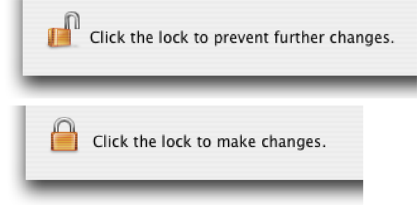

> 导航：[总目录](../../../README.md) · [documentation](../../../_indexes/documentation.md) · [Authentication, Authorization, and Permissions Guide](About%20Authentication%2C%20Authorization%2C%20and%20Permissions.md)

[Next](Understanding%20Permissions.md)[Previous](Authentication%20and%20Identification%20In%20Depth.md)

# Using Authorization

For the most part, authorization—obtaining the right to perform a restricted operation—is transparent to you as a developer of a modern application. The user logs in prior to running your application. After the user logs in, the user either has the right to perform an operation or doesn’t; you should display reasonable error messages when the user doesn’t. Apart from that, it is largely outside the scope of your responsibility.

However, in non-sandboxed applications, your application can request authorization to perform certain tasks that may require root permissions, such as loading a kernel extension, installing files in protected directories, and so on. For these tasks, macOS provides the Authorization Services API.

Authorization Services is implemented by the Security Server daemon (see [Security Server and Security Agent](https://developer.apple.com/library/archive/documentation/Security/Conceptual/Security_Overview/Architecture/Architecture.html#//apple_ref/doc/uid/TP30000976-CH202) in _[Security Overview](../Security%20Overview/About%20Software%20Security.md#apple-f4xwc4dqnrsv64tfmyxwi33df52wszbpkridgmbqgaydsnzw)_) and built on top of BSD. Unlike BSD, however, which can control access at the level of individual files or programs, Authorization Services lets you control access to specific features or data within an application. The security daemon uses a policy database to determine the rights of a given authenticated user. Authorization Services includes functions to read, add, edit, and delete policy database items.

When you request that Authorization Services authorize a user to perform a certain action, the Security Server authenticates the user if necessary. Because the interaction with the user is handled automatically for you, your code is not affected by the authentication method in use. For example, if at some time in the future Apple provides a user interface to support a new form of authentication, your application will automatically gain the benefits of this new feature without any changes in your code.

Occasionally an macOS application needs to perform some operation that requires running with root privileges, for example, when installing new software. In order to avoid having the entire application run as `root`, in this case the developer creates a separate helper tool that runs with root privileges only as long as is necessary.

The remaining sections in this chapter describe specific technologies.

Nonsandboxed Mac apps can use authorization to gain access to files and programs. Before a user or service on macOS can execute a program or gain access to data, it must be authorized to do so. Authorization is normally a three-step process:

1. Authenticate a user or service. (This step may be omitted in special circumstances, such as when a user is using a Kerberos ticket.)
2. Determine the user’s or service’s permissions.
3. Decide whether to give the user or service access to the data or allow them to execute the program.

Authentication and determination of permissions are facilitated by Authorization Services. Each individual process, whether the Finder or your application, must then make its own determination of whether to allow access to the data or code it controls. The BSD permissions structure provides a basic level of access permission. You can implement more sophisticated or fine-grained access permissions based on user access lists or security policies of your own design. For example, you can let any user run your application but allow only users who are members of the `admin` group to change application preferences.

Authorization Services can be used to implement such security policies. For details, see _[Authorization Services C Reference](https://developer.apple.com/documentation/security/authorization_services)_ and _[Authorization Services Programming Guide](../Authorization%20Services%20Programming%20Guide/Introduction%20to%20Authorization%20Services%20Programming%20Guide.md#apple-f4xwc4dqnrsv64tfmyxwi33df52wszbpkridgmbqgaydsojv)_.

The `SFAuthorizationView` class in the Security Foundation framework implements an authorization view in a window. An authorization view is a lock icon and accompanying text that indicates whether an operation can be performed (Figure 2-1). If the lock is closed, when the user clicks it, an authorization dialog is displayed. After the user is authorized, the lock icon appears open. When the user clicks the open lock, Authorization Services restricts access again and changes the icon to the closed state.

__Figure 2-1__  Authorization view

Documentation for the Security Objective-C API is in _[Security Interface Framework Reference](https://developer.apple.com/documentation/securityinterface)_.

The following resources provide additional information about authorization in macOS:

- For information on macOS Authorization Services, see _[Authorization Services C Reference](https://developer.apple.com/documentation/security/authorization_services)_ and _[Authorization Services Programming Guide](../Authorization%20Services%20Programming%20Guide/Introduction%20to%20Authorization%20Services%20Programming%20Guide.md#apple-f4xwc4dqnrsv64tfmyxwi33df52wszbpkridgmbqgaydsojv)_.
- Technical Note TN2095, _[Authorization for Everyone](https://developer.apple.com/library/archive/technotes/tn2095/_index.html#//apple_ref/doc/uid/DTS10003110)_, shows how to use Authorization Services.
- _[Security Interface Framework Reference](https://developer.apple.com/documentation/securityinterface)_ describes the Objective-C interface to Authorization Services and provides information about a variety of security-related user interface elements.

[Next](Understanding%20Permissions.md)[Previous](Authentication%20and%20Identification%20In%20Depth.md)

