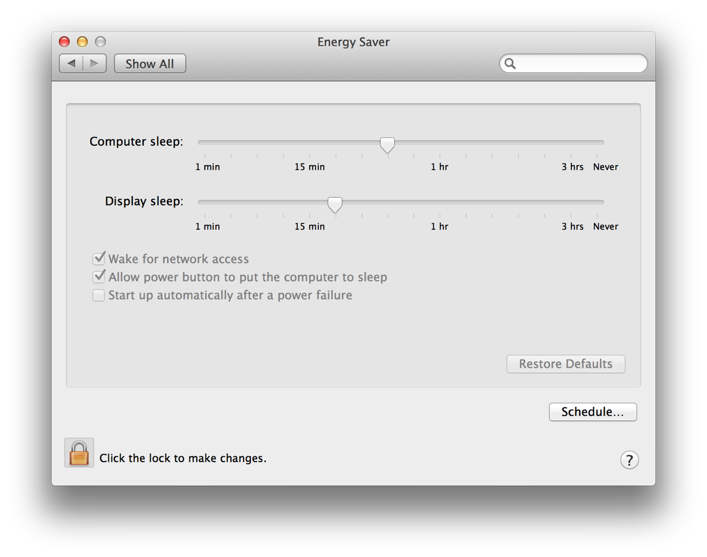
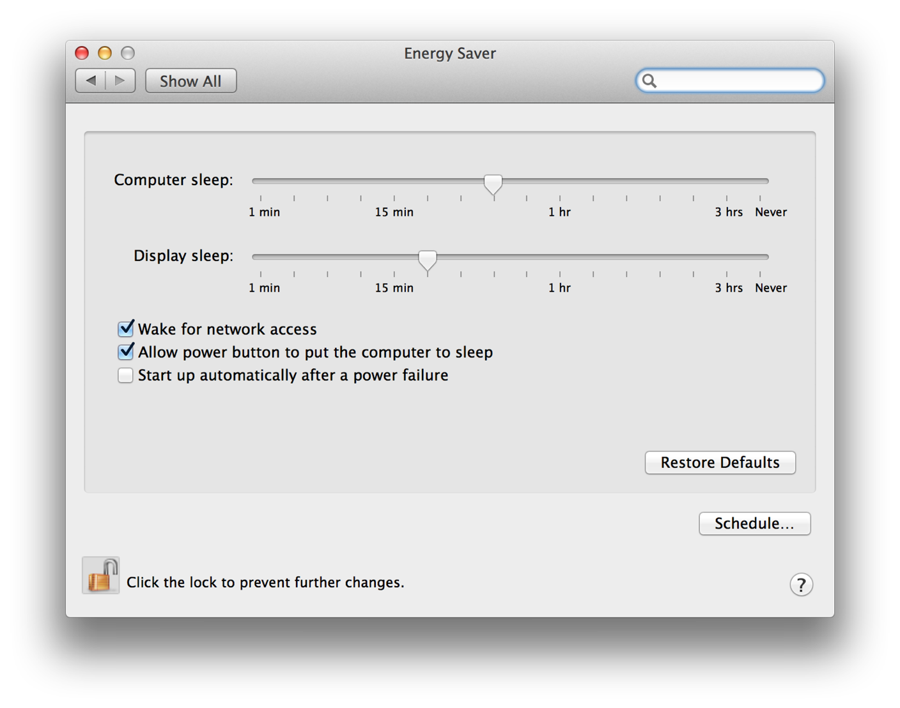
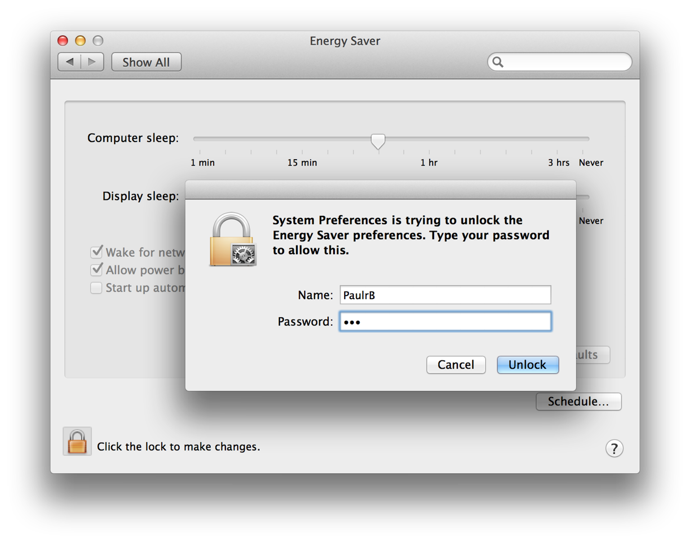
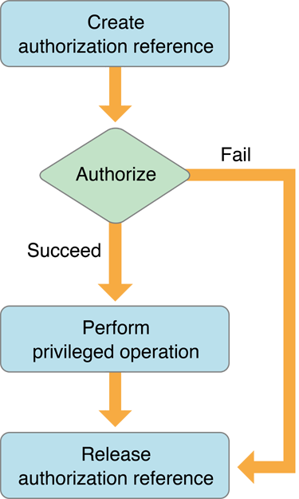
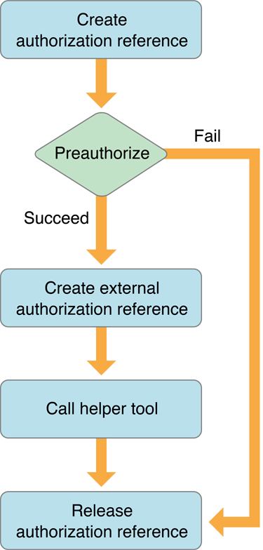
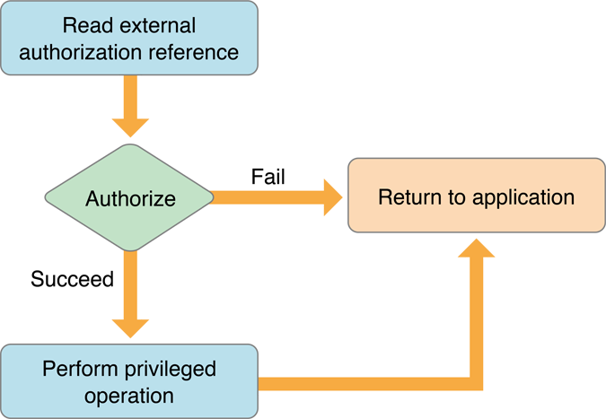
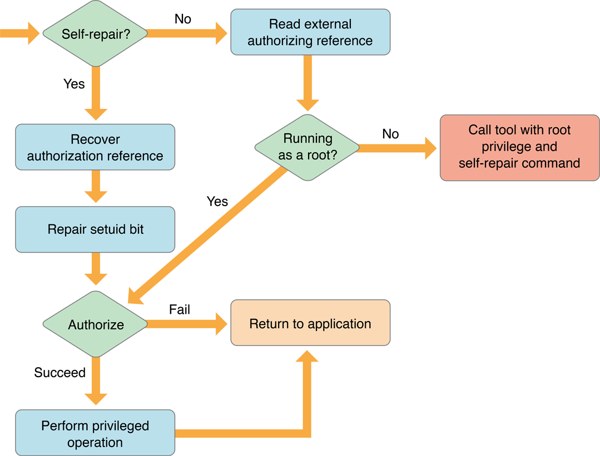
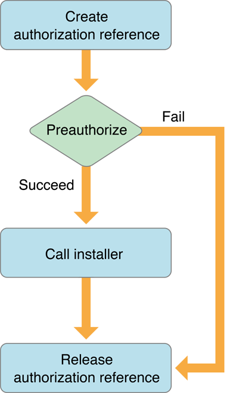
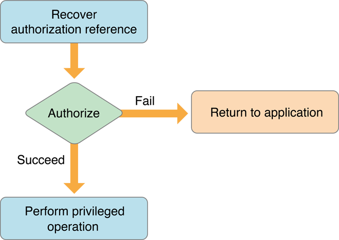

> 导航：[总目录](../../../README.md) · [documentation](../../../_indexes/documentation.md) · [Authorization Services Programming Guide](Introduction%20to%20Authorization%20Services%20Programming%20Guide.md)

[Next](Authorization%20Services%20Tasks.md)[Previous](Introduction%20to%20Authorization%20Services%20Programming%20Guide.md)

# Authorization Concepts

This chapter covers concepts rather than implementation or programming details. See [Authorization Services Tasks](Authorization%20Services%20Tasks.md#apple-f4xwc4dqnrsv64tfmyxwi33df52wszbpkridgmbqgaydsojvfvbuqmrqgywviubz) for information about using specific Authorization Services functions in your application.

You should understand the basics of permissions and ownership in BSD and macOS before reading this chapter. See _[Security Overview](../Security%20Overview/About%20Software%20Security.md#apple-f4xwc4dqnrsv64tfmyxwi33df52wszbpkridgmbqgaydsnzw)_ for a brief introduction to these concepts. For definitions of terms, see the [Glossary](Glossary.md#apple-f4xwc4dqnrsv64tfmyxwi33df52wszbpkridgmbqgaydsojvfvbuqmrqhawviubr).

This chapter contains the following sections:

- [Authorization](#apple-f4xwc4dqnrsv64tfmyxwi33df52wszbpkridgmbqgaydsojvfvbuqmrqguwviucykjcumoi) provides a conceptual overview of the policy-based authorization used by macOS.
- [Authentication](#apple-f4xwc4dqnrsv64tfmyxwi33df52wszbpkridgmbqgaydsojvfvbuqmrqguwviucykjcummjy) describes how authorization uses authentication.
- [The Security Server](#apple-f4xwc4dqnrsv64tfmyxwi33df52wszbpkridgmbqgaydsojvfvbuqmrqguwviucykjcummju) describes how you use Authorization Services in your application to interact with the Security Server.
- [Rights](#apple-f4xwc4dqnrsv64tfmyxwi33df52wszbpkridgmbqgaydsojvfvbuqmrqguwviucykjcummjw) describes how to name your own rights.
- [The Policy Database](#apple-f4xwc4dqnrsv64tfmyxwi33df52wszbpkridgmbqgaydsojvfvbuqmrqguwviucykjcummjz) explains how the Security Server uses a policy database to make authorization decisions.
- [The Credentials Cache and the Authentication Dialog](#apple-f4xwc4dqnrsv64tfmyxwi33df52wszbpkridgmbqgaydsojvfvbuqmrqguwugsscjjbeoqkb) explains how the Security Server determines whether to display an authentication dialog.
- [Scenarios](#apple-f4xwc4dqnrsv64tfmyxwi33df52wszbpkridgmbqgaydsojvfvbuqmrqguwviucykjcummrq) describes different scenarios that use Authorization Services.

The underlying BSD portion of the macOS kernel provides a user-and-owner-security model. Each file system object, such as a file or directory, has an owner and a set of _permissions_, or attributes, specifying what the owner, one group, and all others are able to do with the object.

There are cases where the BSD security model doesn’t fit situations faced by macOS users. For example, if you want to create a grades-and-transcripts application, you’ll want teachers and school registrars to use the application, but you may want to restrict the creation of transcripts to just the registrars.

You may need to protect the user from accidentally making important changes that the underlying BSD security model allows. For example, you may want to allow only administrators to change application-specific preferences. Authorization Services can also be used to perform operations as _root_—also known as the superuser—such as restarting a daemon.

In these cases, a policy-based security model, used in addition to the BSD permissions, provides additional important features for your application. In a _policy-based system_, a user requests _authorization_—the act of granting a right or privilege—to perform a privileged operation. Authorization is performed through an agent so the user doesn’t have to trust the application with a password. The agent is the user interface— operating on behalf of the Security Server—used to obtain the user’s password or other form of identification, which also ensures consistency between applications. The _Security Server_—a Core Services daemon in macOS that deals with authorization and authentication—determines whether no one, everyone, or only certain users may perform a privileged operation.

Authorization offers you fine-grained control over granting users privileges to perform administrative tasks and other privileged operations. Using Authorization Services allows you to restrict parts of your application, add extra security precautions, and still satisfy the BSD security model. You should avoid bypassing the BSD security model—for example, don’t run processes as root—unless you have no alternative, in which case you should limit the amount of code involved.

In some circumstances it is valuable to determine if the user is authorized to perform privileged operations well before your application actually needs to perform those operations. For example, when the System Preferences application is locked, it requires a user to provide a name and password before it will allow the user to change any settings. When a non-administrator user clicks the lock button (see Figure 1-1), the System Preferences application performs _preauthorization_. Preauthorization determines a user’s rights before authorization is required. By preauthorizing, System Preferences prevents users from customizing and selecting options for an operation they are not authorized to perform.

__Figure 1-1__  An example of the System Preferences application as seen by an unauthorized user

Figure 1-2 shows the window the user sees after successfully preauthorizing. However, the System Preferences application still performs authorization immediately before carrying out any privileged operation.

__Figure 1-2__  An example of the System Preferences application as seen by a preauthorized user

_Authentication_ is the act of verifying the identity of the user. A common misconception is that authorization and authentication are one and the same; however, authentication is only part of the authorization process. As discussed in [Authorization](#apple-f4xwc4dqnrsv64tfmyxwi33df52wszbpkridgmbqgaydsojvfvbuqmrqguwviucykjcumoi), after the user is authenticated, the authorization process involves determining what rights or privileges that user has.

Figure 1-3 shows an example of authentication in the System Preferences application.

__Figure 1-3__  An example of authentication in the System Preferences application

To authenticate, depending on the available hardware, the user typically types in a user name and password or scans a fingerprint for Touch ID. Additional authentication mechanisms could include inserting a smart card or other kinds of biometry.

When your application requests authorization of the user, you can set an option that allows the Security Server to interact with the user. Doing so tells the Security Server to request proof of identity, or consent, from the user for authentication purposes, as needed.

Your app provides an authorization reference, authorization rights set, and authorization options to the Security Server. The Security Server then performs authentication by:

- Using the authorization reference to access credentials.
- Asking the user to provide a user name and password for authentication.
- Using the rights in the authorization rights set to look up the rules in the policy database.
- Using the credentials and authorization options to determine if the user complies with the rules and should be granted the rights requested in the authorization rights set.
- Returning a result granting or denying the authorization rights.

To initiate an authorization session between your application and the Security Server, you create an _authorization reference_. The Security Server uses the authorization reference to access the authorization session. You pass the authorization reference to almost every Authorization Services function.

When you request authorization, you send instructions to the Security Server in the form of _authorization options_. The authorization options tell the Security Server how to proceed with the authorization request. For example, you can specify that the call is for authorization, partial authorization, or preauthorization. You can also specify whether you want to allow the Security Server to interact with the user to perform authentication, or request consent.

To authorize a user, you must pass the Security Server an _authorization rights set_ that contains rights a user needs, such as the right to create a transcript or restart a daemon. A _right_ is a named privilege that the application requests on behalf of a user.

A _credential_ is a token representing an authenticated user that the Security Server stores as part of the authorization session. The Security Server uses these credentials as proof of authenticity. Credentials expire after a set length of time. You can also force their expiration when freeing an authorization reference.

The Security Server uses a _policy database_ that contains a set of rules. A _rule_ is a set of attributes that determine who should be authorized to perform a specific action. The Security Server compares the rules with a user’s rights and authentication credentials to determine if the user is authorized to perform a privileged operation.

Rights that are granted are not stored in the authorization session. Instead, every time authorization is performed, the Security Server uses the credentials—or reauthenticates the user, or rerequests consent, if the credentials have expired—and consults the appropriate rule in the policy database to reevaluate the authorization.

When your application requests authorization, you pass the requested rights (an authorization rights set) to the Security Server. The Security Server compares the rights you pass to the keys in the policy database. When a match is found, the Security Server uses the rules associated with the key to determine authorization. For more information about the policy database see [The Policy Database](#apple-f4xwc4dqnrsv64tfmyxwi33df52wszbpkridgmbqgaydsojvfvbuqmrqguwviucykjcummjz).

You must create the rights your application uses. Rights use a hierarchical namespace. The right should begin with the reverse domain name of your organization. The right should then specify the name of your application and become more specific—for example, `com.myOrganization.myProduct.myRight`. Rights that are specific to macOS have right names that begin with `system`.

Your right should represent an individual action on one or a group of targets. For example, a right might represent the individual action of restarting a daemon, such as `com.myOrganization.myProduct.inetd.restart` to restart the Internet daemon, or `com.myOrganization.myProduct.daemons.restart` to restart a group of daemons.

Because you can request multiple rights for the same user, there is no need to create rights that represent combinations of actions. For example, in a grades-and-transcripts application, if you name a right `com.myOrganization.myProduct.transcripts.create` and another right `com.myOrganization.myProduct.grades.edit`, there is no need for a separate right `com.myOrganization.myProduct.createTranscriptsAndEditGrades`.

The name you select for a right should make sense to the user. For example, `system.finder.trash.empty` is more readily understood than `system.finder.trashDirectory.deleteFiles`.

The policy database contains a set of rules the Security Server uses to authorize rights for a user. Each rule consists of a set of attributes. The rules are preconfigured when macOS is installed, but an application may change them at any time. Because any application can change the rights in the database, your application must take into account all possible scenarios. Table 1-1 describes the attributes defined for rules.

There are some specific rules in the policy database for Mac apps. There is also a generic rule in the policy database that the Security Server uses for any right that doesn’t have a specific rule.

__Table 1-1__  Rule attributes and descriptions

| Rule attribute | Generic rule value | Description |
| `key` |  | The _key_ is the name of a rule. A key uses the same naming conventions as a right. The Security Server uses a rule’s key to match the rule with a right. Wildcard keys end with a ‘`.`’. The generic rule has an empty key value. Any rights that do not match a specific rule use the generic rule. |
| `group` | `admin` | The user must be a member of this group. |
| `shared` | `true` | If this is set to `true`, then the Security Server marks the credentials used to gain this right as shared. The Security Server may use any shared credentials to authorize this right. For maximum security, set sharing to `false` so credentials stored by the Security Server for one application may not be used by another application. |
| `timeout` | `300` | The credential used by this rule expires in the specified number of seconds. For maximum security where the user must authenticate or consent every time, set the timeout to `0`. |

Your right always matches up with the generic rule unless a new rule is added to the policy database. Use the `AuthorizationRightSet` function to add or edit a rule in the database. Use the `AuthorizationRightGet` function to read the current rule. Use the `AuthorizationRightRemove` function to delete a rule.

To lock out all privileged operations not explicitly allowed, change the generic rule by setting the timeout attribute to `0`. To allow all privileged operations once the user is authorized, remove the timeout attribute from the generic rule. To prevent applications from sharing rights, set the shared attribute to `false`. To require users to authenticate as a member of the staff group instead of the admin group, set the group attribute to `staff`.

As an example of how the Security Server matches a right with a rule in the policy database, consider a grades-and-transcripts application. The application requests the right `com.myOrganization.myProduct.transcripts.create`. The Security Server looks up the right in the policy database. Not finding an exact match, the Security Server looks for a rule with a wildcard key set to `com.myOrganization.myProduct.transcripts.`, `com.myOrganization.myProduct.`, `com.myOrganization.`, or `com.`—in that order—checking for the longest match. If no wildcard key matches, then the Security Server uses the generic rule. The Security Server requests authentication from the user. The user provides a user name and password to authenticate as a member of the group `admin`. The Security Server creates a credential based on the user authentication or consent and the right requested. The credential specifies that other applications may use it, and the Security Server sets the expiration to five minutes.

Three minutes later, a child process of the application starts up. The child process requests the right `com.myOrganization.myProduct.transcripts.create`. The Security Server finds the credential, sees that it allows sharing, and uses the right. Two and a half minutes later, the same child process requests the right `com.myOrganization.myProduct.transcripts.create` again, but the right has expired. The Security Server begins the process of creating a new credential by consulting the policy database and requesting user authentication or consent.

You might notice that when you call the [AuthorizationCreate](https://developer.apple.com/documentation/security/1397453-authorizationcreate) function or the [AuthorizationCopyRights](https://developer.apple.com/documentation/security/1395770-authorizationcopyrights) function to obtain rights for a user, sometimes an authentication dialog appears, sometimes a consent dialog appears, and at other times no dialog appears. The reason for this behavior is related to the settings in the policy database and the way in which the Security Server caches user credentials.

A credential is something that the Security Server knows about a particular user, such as the fact that a particular user has entered a valid user name and password.

For each login session, the Security Server maintains a global credentials cache and a credentials cache per authorization instance (that is, for each time a new authorization reference is created). The rule for each right in the policy database indicates the group to which the authenticated user must belong and how long the credential is considered valid. The rule might also indicate that the credential is to be shared.

When Authorization Services needs a credential in order to grant a right to a user, the Security Server attempts to obtain the credential from a credentials cache. It first looks in the credentials cache associated with the authorization instance. If the credential isn’t there and credentials are shared, it then looks in the global credentials cache. Only if the Security Server can’t find the credential in a cache does it try to acquire the credential, typically by displaying an authentication or consent dialog. (In some cases, the Security Server might be able to acquire the credential from another source, such as a smart card.)

If the Security Server successfully obtains a new credential, it stores it in the credentials cache associated with the authorization instance and—if the rule specifies that the credential should be shared—in the global credentials cache.

If the rule for the right has a timeout attribute, its value indicates how long (in seconds) a cached credential is applicable for this right. A value of `0` means that the credential can only be used once (that is, it times out immediately). If the timeout attribute is missing, the credential can be used to grant the right as long as the login session lasts, unless the credential is explicitly destroyed.

When a user who is a member of the admin group logs on to the system, for example, the user’s credential (that is, the fact that they have entered a valid admin user name and password) is saved in the global credentials cache. Then when this user attempts to modify a system preference, Security Server finds the credential in the cache and does not display an authentication dialog.

On the other hand, if a user logs on with a non-admin user name and password and tries to modify one of the system preferences, Security Server cannot obtain the needed credential from a credentials cache. Therefore, it displays the authentication dialog.

The same principle applies for any application that requires a credential: if the user has been authenticated for one application and the credential has been shared, another application can use that credential.

Consequently, whether a call to [AuthorizationCopyRights](https://developer.apple.com/documentation/security/1395770-authorizationcopyrights) results in a dialog depends on whether the Security Server has already cached the required credential.

The only way to guarantee that a credential acquired when you request a right is not shared with other authorization instances is to destroy the credential. To do so, call the [AuthorizationFree](https://developer.apple.com/documentation/security/1394257-authorizationfree) function with the flag [kAuthorizationFlagDestroyRights](https://developer.apple.com/documentation/security/authorizationflags/1397545-destroyrights).

There are three main scenarios that involve Authorization Services: simple self-restricted applications, factored applications, and installers.

A _self-restricted application_ requires that certain features be accessible only by a specific group of users. In a simple self-restricted application, this separation of features is done within the main application. You use Authorization Services in this situation because this kind of fine-grain restriction cannot be controlled by BSD permissions.

Consider a grades-and-transcripts application that allows only registrars to create transcripts, while the rest of the application is available to both teachers and registrars. When a user attempts to create a transcript, the application uses Authorization Services to decide if that user may perform the operation.

Figure 1-4 shows a flow chart of a simple, self-restricting application. The application creates an authorization reference. The authorization reference refers to the authorization session with the Security Server. Immediately before performing any privileged operation, such as creating a transcript, the application requests authorization on behalf of the user. If required, the Security Server requests authentication of, or consent from, the user. If authorization succeeds, the privileged operation is performed. The application releases the authorization reference when it is no longer needed.

In most cases, it is beneficial to separate the privileged operations into a separate helper tool. See [Factored Applications](#apple-f4xwc4dqnrsv64tfmyxwi33df52wszbpkridgmbqgaydsojvfvbuqmrqguwviucykjcummrs) for more information on how to use Authorization Services with helper tools.

You can perform authorization without creating an authorization reference if you need to authorize just once—for example, when your application first starts up. To do so you use the result of the authorization call directly. Because in this case you did not create an authorization reference, you don’t have to release it. One-time authorization is described in more detail in the section [Authorizing](Authorization%20Services%20Tasks.md#apple-f4xwc4dqnrsv64tfmyxwi33df52wszbpkridgmbqgaydsojvfvbuqmrqgywviucykjcummjs).

__Figure 1-4__  Flow chart for a simple, self-restricted application

A _factored application_ is an application that delegates specific tasks to smaller, separate tools. These tools are sometimes referred to as _helper tools_. In a simple, self-restricted application, the privileged code is in the application itself, whereas in a factored application, the privileged code is in the helper tool.

An operation that your application performs might be restricted by the BSD security model. Such an application is a _system-restricted_ application. For example, an application that requires restarting the Internet daemon (`inetd`) must have root privileges, but it runs with the privileges of the user that started it.

It is recommended that you factor both self-restricted applications and system-restricted applications. Factoring your application provides two benefits. The first is that it is easier to audit a factored application because the privileged operation is performed in a separate process by the helper tool. The second is that a factored application provides more security. In a nonfactored application, you not only have to trust that there are no security holes in your code but also no holes in all of the code that you link to.

Figure 1-5 shows a flow chart for the application part of a factored application while the flow chart for the helper tool is shown in Figure 1-6.

__Figure 1-5__  Flow chart for the application part of a factored application

The application begins by creating an authorization reference and requesting preauthorization from the Security Server immediately before calling the helper tool. The application uses the results of preauthorization to determine if the user has the right to perform the privileged operations in the helper tool. Performing preauthorization ensures that resources and time aren’t wasted invoking a helper tool that the user does not have the right to use.

__Figure 1-6__  Flow chart for a helper tool

The application needs to pass the authorization reference to the helper tool. Because you cannot transfer an authorization reference itself between two processes, the application uses Authorization Services to create an external, transferable form of the authorization reference to send to its helper tool.

The helper tool uses Authorization Services to create an authorization reference from the external authorization reference. The helper tool requests authorization and uses the results to decide whether to continue with the privileged operation.

You must pass the authorization reference to your helper tool so that the authorization dialog can show your application’s path rather than the path to the helper tool and to allow the system to determine whether the authorization dialog should have keyboard focus.

You must perform authorization immediately before any privileged operation, even if the user has already successfully authorized. Rights can expire, thus it is your responsibility as a developer to ensure that the user is up to date on all required rights. Any application can modify the policy database to set the length of time a right is available (see [The Policy Database](#apple-f4xwc4dqnrsv64tfmyxwi33df52wszbpkridgmbqgaydsojvfvbuqmrqguwviucykjcummjz)).

Some system-supplied utilities use Authorization Services. For example, the `authopen` utility uses Authorization Services to open privileged files. If you call a utility like `authopen`, then it is unnecessary to write your own helper tool.

Some privileged operations require special permissions. For example, an application that restarts the Internet daemon must have root privileges. There are three possible ways to perform this operation, all with their own problems:

- Make the application run as root by calling itself with a special Authorization Services function.
- Set the _setuid bit_ of the application and change its owner to root, and then use the special Authorization Services function.
- Factor out the operation that performs the privileged operation and put it in a separate _setuid tool_—a tool that has its setuid bit set—and set the setuid tool’s owner to root.

Both the first and second options are a security breach waiting to happen. When the privileged application runs, it calls a special function that Authorization Services provides—[AuthorizationExecuteWithPrivileges](https://developer.apple.com/documentation/security/1540038-authorizationexecutewithprivileg) (see [Calling a Helper Tool as Root](Authorization%20Services%20Tasks.md#apple-f4xwc4dqnrsv64tfmyxwi33df52wszbpkridgmbqgaydsojvfvbuqmrqgywviucykjcummjy) for more details). Calling this function executes any application or tool with root privileges, regardless of the owner of the application or tool. This is very dangerous since parts of the application can be easily replaced.

The second option is to set the setuid bit of the privileged application and change its owner to root. The setuid bit, when set, allows the process running it to masquerade as another user. Setting the setuid bit and owner of the application to a different user, such as root, makes it more difficult to replace. However, running code as root is very dangerous and should be done as seldom as possible. Setting the setuid bit on an entire application is especially dangerous because you are trusting that your entire application, and the code your application links to, is free of security holes.

The third scenario is by far the best. The application is split into an application that controls all of the graphical user interface elements and nonprivileged operations, and a helper tool that performs only the operations involved in restarting the Internet daemon. The helper tool’s setuid bit is set and the owner is set to root. The proper Authorization Services functions are used as described previously. Factoring and setting the setuid bit not only minimizes the risk but also makes it easier to audit your code for security holes.

One problem with the last scenario is that setuid bit settings are lost when a file is copied. Thus, if the user copies your setuid tool, the setuid bit is no longer set. It is possible to reset the setuid bit in the setuid tool itself. Figure 1-7 shows the flow chart of a setuid tool that repairs its own setuid bit. You may not want the user to be able to copy the application. If that is the case, you don’t need to worry about repairing the setuid bit, just let the user know that they need to reinstall the application.

__Figure 1-7__  Flow chart for a self-repairing helper tool

When the self-repairing helper tool is run, it checks if the self-repair flag was passed. If the self-repair flag was not passed, then it reads in the external authorization reference that the application passed.

The self-repairing setuid tool then checks if it is running as root. If it is running as root, then authorization is performed and, based on the result, the privileged operation is performed. If the self-repairing setuid tool is not running as root, then it calls itself with the [AuthorizationExecuteWithPrivileges](https://developer.apple.com/documentation/security/1540038-authorizationexecutewithprivileg) function and passes itself the self-repair flag.

When the new self-repairing setuid tool process starts, it checks if the self-repair flag was passed. If the self-repair flag was passed, then the self-repairing setuid tool recovers the authorization reference and repairs the setuid bit. After the self-repairing setuid tool is running as root, it performs authorization and continues as a normal helper tool.

Not all installers require authorization—only those that need special privileges to copy files to restricted directories, make changes to restricted files, or set setuid bits.

An installer is a special case because unlike other applications, an installer is usually run only once. Due to the limited use, Authorization Services provides a function to invoke your installer to run with root privileges. It is up to the user to determine if the installer is from a trusted source.

Figure 1-8 shows a flow chart of an application using Authorization Services to call an installer. In this case, the application creates the authorization reference and performs preauthorization. If the user successfully preauthorizes, then you call the [AuthorizationExecuteWithPrivileges](https://developer.apple.com/documentation/security/1540038-authorizationexecutewithprivileg) function to execute your installer with root privileges.

__Figure 1-8__  Flow chart of an application to call a privileged installer

Figure 1-9 shows a flow chart for the Authorization Services calls performed in the installer itself. Authorization should be performed before any privileged operation.

__Figure 1-9__  Flow chart of an installer’s Authorization Services calls.

[Next](Authorization%20Services%20Tasks.md)[Previous](Introduction%20to%20Authorization%20Services%20Programming%20Guide.md)

