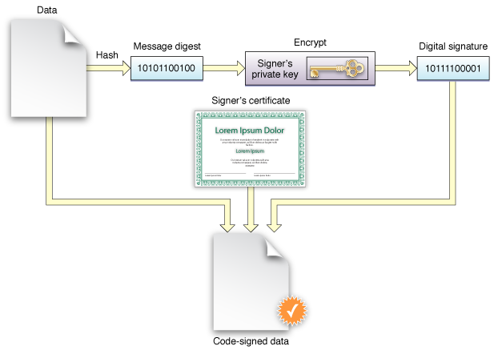

> 导航：[总目录](../../../README.md) · [documentation](../../../_indexes/documentation.md)

[Next](Understanding%20the%20Code%20Signature.md)

# About Code Signing

Code signing is a macOS security technology that you use to certify that an app was created by you. Once an app is signed, the system can detect any change to the app—whether the change is introduced accidentally or by malicious code.

You participate in code signing as a developer when you obtain a signing identity and apply your signature to apps that you ship. A certificate authority (often Apple) vouches for your signing identity.

After installing a new version of a code-signed app, a user is not bothered with alerts asking again for permission to access the keychain or similar resources. As long as the new version uses the same digital signature, macOS can treat the new app exactly as it treated the previous one.

Other macOS security features, such as App Sandbox and parental controls, also depend on code signing. Specifically, code signing allows the operating system to:

- __Ensure that a piece of code has not been altered since it was signed.__ The system can detect even the smallest change, whether it was intentional (by a malicious attacker, for example) or accidental (as when a file gets corrupted). When a code signature is intact, the system can be sure the code is as the signer intended.
- __Identify code as coming from a specific source (a developer or signer).__ The code signature includes cryptographic information that unambiguously points to a particular author.
- __Determine whether code is trustworthy for a specific purpose.__ Among other things, a developer can use a code signature to state that an updated version of an app should be considered by the system to be the same app as the previous version.

Code signing is one component of a complete security solution, working in concert with other technologies and techniques. It does not address every possible security issue. For example, code signing does not:

- Guarantee that a piece of code is free of security vulnerabilities.
- Guarantee that an app will not load unsafe or altered code—such as untrusted plug-ins—during execution.
- Provide digital rights management (DRM) or copy protection technology. Code signing does not in any way hide or obscure the content of the signed code.

Read _[Security Overview](../Security%20Overview/About%20Software%20Security.md#apple-f4xwc4dqnrsv64tfmyxwi33df52wszbpkridgmbqgaydsnzw)_ to understand the place of code signing in the macOS security picture.

For descriptions of the command-line tools for performing code signing, see the codesign and csreq man pages.

[Next](Understanding%20the%20Code%20Signature.md)

