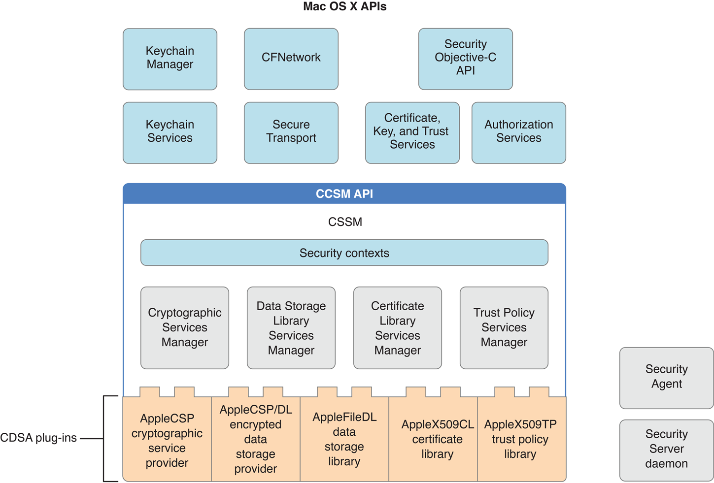

> 导航：[总目录](../../../README.md) · [documentation](../../../_indexes/documentation.md) · [Cryptographic Services Guide](About%20Cryptographic%20Services.md)

[Next](Glossary.md)[Previous](Transmitting%20Data%20Securely.md)

# CDSA Overview

_CDSA_ is an Open Source security architecture adopted as a technical standard by the [Open Group](http://www.opengroup.org/security/cdsa.htm). Apple has developed its own Open Source implementation of CDSA, available as part of Darwin at [Apple’s Open Source site](http://opensource.apple.com/). The core of CDSA is _CSSM_ (Common Security Services Manager), a set of Open Source code modules that implement a public application programming interface called the CSSM API. CSSM provides APIs for cryptographic services (such as creation of cryptographic keys, encryption and decryption of data), certificate services (such as creation of digital certificates, reading and evaluation of digital certificates), secure storage of data, and other security services (see [Apple CDSA Plug-ins](#apple-f4xwc4dqnrsv64tfmyxwi33df52wszbpkridimbqgeytcnzsfvbuqnbnineeiskijjbee) for a more complete list).

CSSM also defines an interface for plug-ins that implement security services for a particular operating system and hardware environment. The implementation on a given platform can optionally supply a middleware layer that provides an operating-system-specific API for apps. Whether such a layer is present or not, apps can call the CSSM API directly.

OS X implements nearly all the standard features of CSSM, plus a set of middleware security services to provide an OS X-standard interface for app programmers. In addition, to enhance the security of the most sensitive operations, the OS X implementation runs a Security Server daemon as a separate process. The Security Server daemon launches another process, the Security Agent, which serves as the user interface for Security Server.

Figure A-1 illustrates the OS X implementation of CDSA. The CDSA standard defines a four-layer architecture, with the top layer being the apps that use the CDSA security features. Figure A-1 shows the first three layers: the CDSA plug-ins, CSSM, and the OS X security APIs, which constitute the middleware layer referred to in the specification. The OS X Authorization Services API, the Security Server daemon, and the Security Agent shown in the figure are technically outside of CDSA, but they are shown here for completeness because they constitute an integral part of the OS X security architecture.

__Figure A-1__  OS X implementation of CDSA

Security contexts (see Figure A-1) are data structures used by CSSM to assist apps in managing the many parameters used in security operations. The CSSM managers implement the standard CSSM API. (A fifth manager defined in the CDSA standard, called the Authorization Computation Services Manager, is not implemented in OS X. Instead of using a CSSM API, OS X Authorization Services calls the Security Server daemon directly.)

The CDSA plug-ins shown in Figure A-1 are those provided as part of OS X. The CDSA specification allows any number of plug-ins. As long as a plug-in follows the rules for interfacing with the CSSM managers, it can implement any portion of the CDSA feature set, including a combination of features associated with two or more of the CSSM managers. (See [AppleCSP/DL Module](#apple-f4xwc4dqnrsv64tfmyxwi33df52wszbpkridimbqgeytcnzsfvbuqnbnineeirkejfbuo) for an example of a multiservice CDSA plug-in.) The CDSA specification even allows for the expansion of CDSA by the addition of elective module managers and associated plug-ins. Plug-ins can call each other as well as being called by the CSSM managers—in fact, it is common for them to do so.

For an introduction to CDSA, see _CDSA Explained_, second edition, from the Open Group. The CDSA/CSSM technical standard is _Common Security: CDSA and CSSM_, version 2 (with corrigenda), also from the Open Group.

As long as you use the OS X security APIs, you don’t have to worry about the details of the OS X CDSA implementation. However, because a call to the CSSM API allows you to specify the plug-in module to which you want to direct your request, if you want to call CSSM directly you should have some understanding of the OS X CDSA plug-ins.

The OS X implementation of CDSA includes five CDSA plug-ins (see [Figure A-1](#apple-f4xwc4dqnrsv64tfmyxwi33df52wszbpkridimbqgeytcnzsfvbuqnbnineeircbjbfeo)):

- AppleCSP cryptographic service provider
- AppleFileDL data storage library
- AppleCSP/DL encrypted data storage provider
- AppleX509CL certificate library
- AppleX509TP trust policy library

This section briefly describes the purpose and function of each of these modules. (See the glossary for explanations of any unfamiliar terms.)

All secure communications and authentication protocols are based on keys and encryption. The Apple cryptographic service provider (AppleCSP) is a basic plug-in module used by several of the security services for creating cryptographic keys and encrypting or decrypting data. Digital signatures also use the AppleCSP module to create message digests used to create and verify the signature. A CSP can use any number of algorithms.

A data storage library (DL) module provides _secure storage_—that is, storage of encrypted data on disk or another medium that persists when the power is turned off. The CDSA standard allows a DL module to use any sort of database or other data store. Keeping things simple, the AppleFileDL module stores its data in files in the OS X file system. It provides lower-level services used by the AppleCSP/DL plug-in for storing secrets on the _keychain_, Apple’s database used to store encrypted passwords, private keys, and other secrets.

The AppleCSP/DL plug-in is a multifunction module that combines cryptographic service and data storage functions to implement the Apple keychain, used for storage of passwords, keys, and other secrets. The AppleCSP/DL module calls the AppleFileDL module to perform file I/O, and the Security Server daemon to encrypt and decrypt secrets.

A certificate library (CL) module performs operations on digital certificates. Digital certificates are used to establish or confirm the identity of an entity such as a website or the sender of a digitally signed message. They do so by using a digital signature to ensure that only the identified entity could have provided the certificate (see [Digital Certificates](Cryptography%20Concepts%20In%20Depth.md#apple-f4xwc4dqnrsv64tfmyxwi33df52wszbpkridimbqgeytcnzsfvbuqobnineeiqsji5buk)). A CL module performs such functions as creating new certificates (in memory), creating certificate revocation lists (that indicate which certificates are no longer valid), verifying the digital signature contained in a certificate, and extracting information from a certificate. CL modules do not store persistent copies of certificates. Rather, a DL module is used for that purpose.

The AppleX509CL plug-in performs these functions for certificates that conform to the X.509 standard promulgated by the International Telecommunication Union (ITU). The X.509 ITU standard is widely used on the Internet and throughout the information technology industry for designing secure apps based on a public key infrastructure (the set of hardware, software, people, policies, and procedures needed to create and manage digital certificates that are based on public key cryptography). See [Asymmetric Keys](Cryptography%20Concepts%20In%20Depth.md#apple-f4xwc4dqnrsv64tfmyxwi33df52wszbpkridimbqgeytcnzsfvbuqobnineeirsgizbug) for more information on public keys.

A digital certificate has a level of trust associated with it, based on attributes of the certificate. A trust policy is a set of rules that specify the actions that can be taken given a specific level of trust. In other words, the purpose of establishing a level of trust for a certificate is to answer the question “Should I trust this certificate for this action?”

The issuer of a digital certificate adds a digital signature to the certificate to ensure that the certificate has not been altered and to verify the identity of the issuer. In general, a digital signature is verified through the use of another certificate. Consequently, each certificate is typically part of a chain of certificates that ends with a root certificate, which can be verified without recourse to another certificate (see [Digital Certificates](Cryptography%20Concepts%20In%20Depth.md#apple-f4xwc4dqnrsv64tfmyxwi33df52wszbpkridimbqgeytcnzsfvbuqobnineeiqsji5buk)).

A trust policy (TP) plug-in performs two main functions: it assembles the chain of certificates needed to verify a given certificate, and it determines the level of trust that can be accorded the certificate.

The AppleX509TP module performs these functions on X.509 certificates, using trust policies established by Apple. 

Although the OS X security APIs provide all the capabilities you are ever likely to need for developing secure apps, nearly all the standard CSSM APIs are also available for your use. This section briefly describes the functions provided by each CSSM service. For details, see _Common Security: CDSA and CSSM_, version 2 (with corrigenda), from the [Open Group](http://www.opengroup.org/security/cdsa.htm).

Cryptographic Services in CSSM provides functions to perform the following tasks:

- Encrypting and decrypting text and data
- Creating and verifying digital signatures
- Creating a cryptographic hash (used for message digests and other purposes)
- Generating symmetric and asymmetric pairs of cryptographic keys
- Generating pseudorandom numbers
- Controlling access to the CSP for creation of keys

To see exactly which security protocols and algorithms are supported by Apple’s CSP implementation, see the documentation provided with the Open Source security code, which you can download at [Apple’s Open Source site](http://opensource.apple.com/), and the Security Release Notes in the latest Xcode Tools from Apple.

CSSM Data Store Services provides an API for storing and retrieving data that is independent of the type of storage used. If there is more than one DL module installed, the caller can query Data Store Services to learn the capabilities of each and select which one to use in a particular call. The Apple implementation of Data Store Services supports any standard CDSA DL plug-in module. The AppleFileDL Data Storage Library and AppleCSP/DL Encrypted Data Storage module both implement functions called by Data Store Services.

Certificate Services as specified by CDSA performs the following functions:

- Verifies the signatures on certificates and certificate revocation lists
- Creates certificates and certificate revocation lists
- Signs certificates and certificate revocation lists
- Extracts values of fields from certificates and certificate revocation lists
- Searches certificate revocation lists for specified certificates

Apple’s implementation of Certificate Services supports all of the CL API functions in the CDSA/CSSM specification.

The OS X implementation of CSSM Trust Policy Services provides functions to verify certificates, to determine what attributes they contain and therefore the level of trust they can be given, and to construct a chain of related certificates. It does not implement other trust policy functions in the CSSM standard. Documentation for the CSSM trust policy functions supported by Apple’s TP implementation can be found with the Open Source security code, which you can download at [Apple’s Open Source site](http://opensource.apple.com/).

Apple’s implementation of CSSM does not include the Authorization Computation Services defined in the CDSA standard. Instead, the Authorization Services API calls the Security Server daemon directly (see [Figure A-1](#apple-f4xwc4dqnrsv64tfmyxwi33df52wszbpkridimbqgeytcnzsfvbuqnbnineeircbjbfeo)).

[Next](Glossary.md)[Previous](Transmitting%20Data%20Securely.md)

