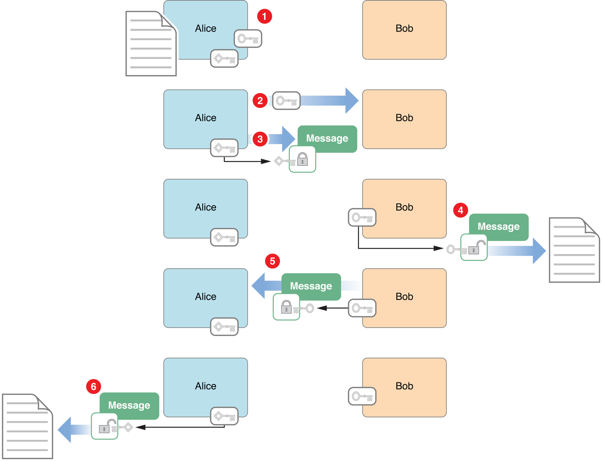
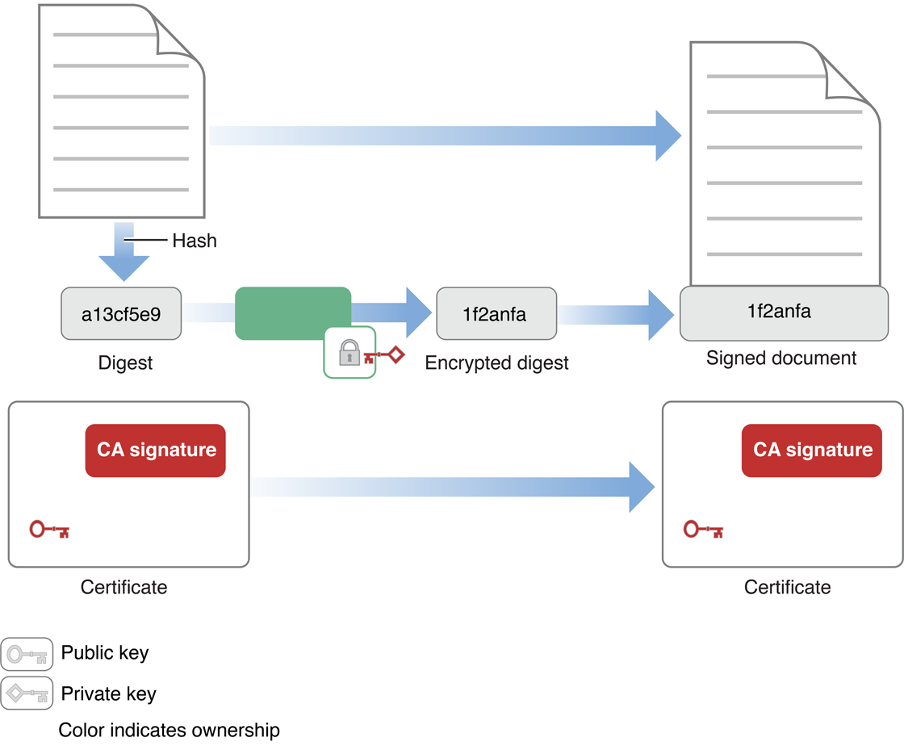
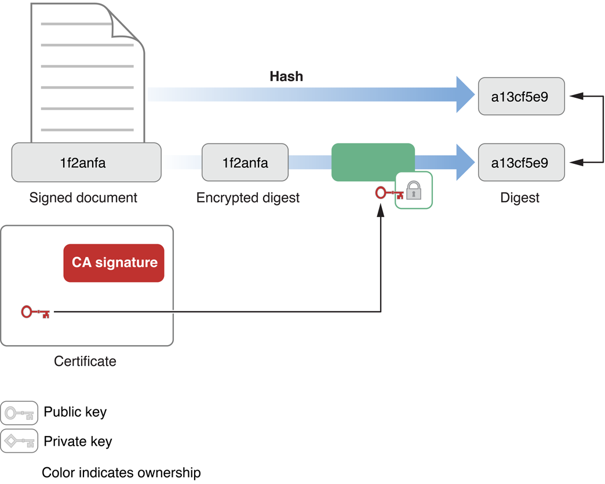
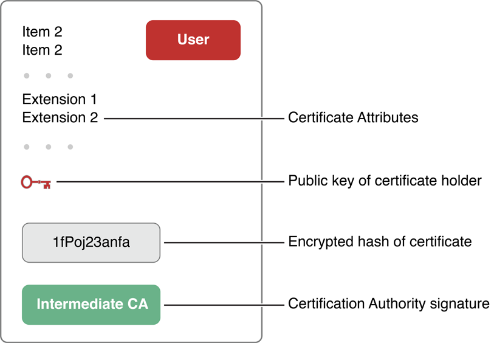
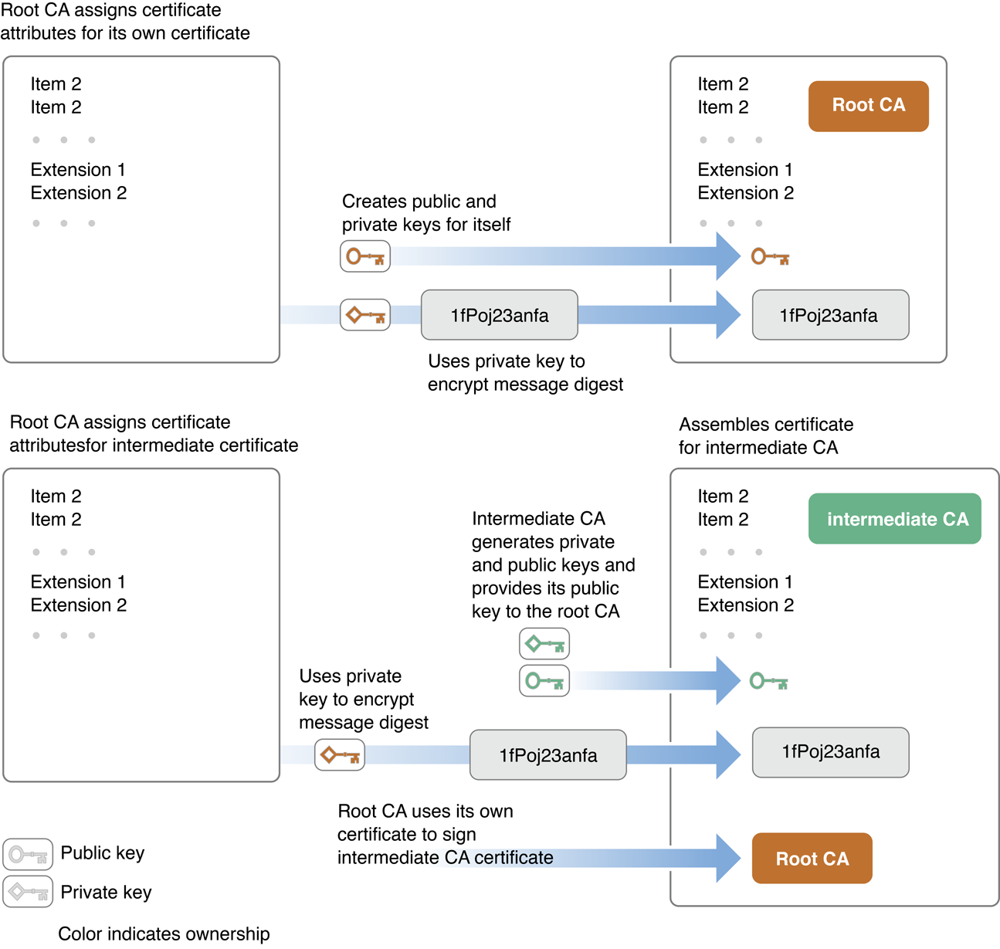
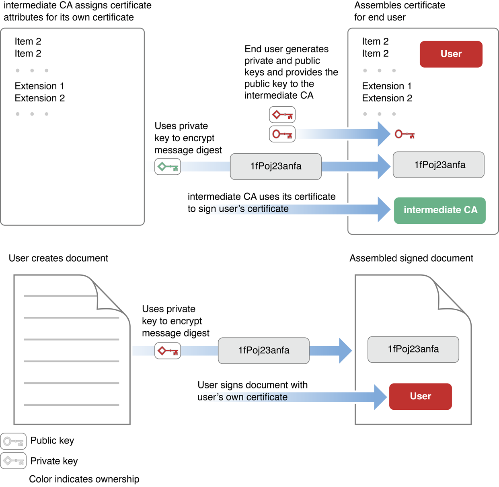

> 导航：[总目录](../../../README.md) · [documentation](../../../_indexes/documentation.md) · [Cryptographic Services Guide](About%20Cryptographic%20Services.md)

[Next](Encrypting%20and%20Hashing%20Data.md)[Previous](About%20Cryptographic%20Services.md)

# Cryptography Concepts In Depth

The word cryptography (from Greek _kryptos_, meaning hidden) at its core refers to techniques for making data unreadable to prying eyes. However, cryptography can also be used for other purposes. Cryptography includes a range of techniques that can be used for verifying the authenticity of data (detecting modifications), determining the identity of a person or other entity, determining who sent a particular message or created a particular piece of data, sending data securely across a network, locking files securely behind a password or passphrase, and so on.

This chapter describes a number of these techniques, beginning with basic encryption, then moving on to other cryptographic constructs built on top of it.

_Encryption_ is the transformation of data into a form in which it cannot be made sense of without the use of some key. Such transformed data is referred to as _ciphertext_. Use of a key to reverse this process and return the data to its original (cleartext or plaintext) form is called _decryption_. Most of the security APIs in macOS and iOS rely to some degree on encryption of text or data. For example, encryption is used in the creation of certificates and digital signatures, in secure storage of secrets in the keychain, and in secure transport of information.

Encryption can be anything from a simple process of substituting one character for another—in which case the key is the substitution rule—to a complex mathematical algorithm. For purposes of security, the more difficult it is to decrypt the ciphertext, the better. On the other hand, if the algorithm is too complex, takes too long to do, or requires keys that are too large to store easily, it becomes impractical for use in a personal computer. Therefore, some balance must be reached between _strength_ of the encryption (that is, how difficult it is for someone to discover the algorithm and the key) and ease of use.

For practical purposes, the encryption only needs to be strong enough to protect the data for the amount of time the data might be useful to a person with malicious intent. For example, if you need to keep your bid on a contract secret only until after the contract has been awarded, an encryption method that can be broken in a few weeks will suffice. If you are protecting your credit card number, you probably want an encryption method that cannot be broken for many years.

There are two main types of encryption in use in computer security, referred to as _symmetric key encryption_ and _asymmetric key encryption_. A closely related process to encryption, in which the data is transformed using a key and a mathematical algorithm that cannot be reversed, is called _cryptographic hashing_. The remainder of this section discusses encryption keys, key exchange mechanisms (including the Diffie-Hellman key exchange used in some secure transport protocols), and cryptographic hash functions.

_Symmetric key cryptography_ (also called _secret key cryptography_) is the classic use of keys that most people are familiar with: The same key is used to encrypt and decrypt the data. The classic, and most easily breakable, version of this is the Caesar cipher (named for Julius Caesar), in which each letter in a message is replaced by a letter that is a fixed number of positions away in the alphabet (for example, “a” is replaced by “c”, “b” is replaced by “d”, and so forth). In the Caesar cipher, the key used to encrypt and decrypt the message is simply the number of places by which the alphabet is rotated and the direction of that rotation. Modern symmetric key algorithms are much more sophisticated and much harder to break. However, they share the property of using the same key for encryption and decryption.

There are many different algorithms used for symmetric key cryptography, offering anything from minimal to nearly unbreakable security. Some of these algorithms offer strong security, easy implementation in code, and rapid encryption and decryption. Such algorithms are very useful for such purposes as encrypting files stored on a computer to protect them in case an unauthorized individual uses the computer. They are somewhat less useful for sending messages from one computer to another, because both ends of the communication channel must possess the key and must keep it secure. Distribution and secure storage of such keys can be difficult and can open security vulnerabilities.

In 1968, the USS _Pueblo_, a U.S. Navy intelligence ship, was captured by the North Koreans. At the time, every Navy ship carried symmetric keys for a variety of code machines at a variety of security levels. Each key was changed daily. Because there was no way to know how many of these keys had not been destroyed by the Pueblo’s crew and therefore were in the possession of North Korea, the Navy had to assume that all keys being carried by the Pueblo had been compromised. Every ship and shore station in the Pacific theater (that is, several thousand installations, including ships at sea) had to replace all of their keys by physically carrying code books and punched cards to each installation.

The Pueblo incident was an extreme case. However, it has something in common with the problem of providing secure communication for commerce over the Internet. In both cases, codes are used for sending secure messages—not between two locations, but between a server (the Internet server or the Navy’s communications center) and a large number of communicants (individual web users or ships and shore stations). The more end users who are involved in the secure communications, the greater the problems of distribution and protection of the secret symmetric keys.

Although secure techniques for exchanging or creating symmetric keys can overcome this problem to some extent (for example, Diffie-Hellman key exchange, described later in this chapter), a more practical solution for use in computer communications came about with the invention of practical algorithms for asymmetric key cryptography.

In asymmetric key cryptography, different keys are used for encrypting and decrypting a message. The asymmetric key algorithms that are most useful are those in which neither key can be deduced from the other. In that case, one key can be made public while the other is kept secure. This arrangement is often referred to as _public key cryptography_, and provides some distinct advantages over symmetric encryption: the necessity of distributing secret keys to large numbers of users is eliminated, and the algorithm can be used for authentication as well as for cryptography.

The first public key algorithm to become widely available was described by Ron Rivest, Adi Shamir, and Len Adleman in 1977, and is known as _RSA encryption_ from their initials. Although other public key algorithms have been created since, RSA is still the most commonly used. The mathematics of the method are beyond the scope of this document, and are available on the Internet and in many books on cryptography. The algorithm is based on mathematical manipulation of two large prime numbers and their product. Its strength is believed to be related to the difficulty of factoring a very large number. With the current and foreseeable speed of modern digital computers, the selection of long-enough prime numbers in the generation of the RSA keys should make this algorithm secure indefinitely. However, this belief has not been proved mathematically, and either a fast factorization algorithm or an entirely different way of breaking RSA encryption might be possible. Also, if practical quantum computers are developed, factoring large numbers will no longer be an intractable problem.

Other public key algorithms, based on different mathematics of equivalent complexity to RSA, include ElGamal encryption and elliptic curve encryption. Their use is similar to RSA encryption (though the mathematics behind them differs), and they will not be discussed further in this document.

To see how public key algorithms address the problem of key distribution, assume that Alice wants to receive a secure communication from Bob. The procedure is illustrated in Figure 1-1.

__Figure 1-1__  Asymmetric key encryption

The secure message exchange illustrated in Figure 1-1 has the following steps:

1. Alice uses one of the public key algorithms to generate a pair of encryption keys: a private key, which she keeps secret, and a public key. She also prepares a message to send to Bob.
2. Alice sends the public key to Bob, unencrypted. Because her private key cannot be deduced from the public key, doing so does not compromise her private key in any way.
3. Alice can now easily prove her identity to Bob (a process known as _authentication_). To do so, she encrypts her message (or any portion of the message) using her private key and sends it to Bob.
4. Bob decrypts the message with Alice’s public key. This proves the message must have come from Alice, as only she has the private key used to encrypt it.
5. Bob encrypts his message using Alice’s public key and sends it to Alice. The message is secure, because even if it is intercepted, no one but Alice has the private key needed to decrypt it.
6. Alice decrypts the message with her private key.

Since encryption and authentication are subjects of great interest in national security and protecting corporate secrets, some extremely smart people are engaged both in creating secure systems and in trying to break them. Therefore, it should come as no surprise that actual secure communication and authentication procedures are considerably more complex than the one just described. For example, the authentication method of encrypting the message with your private key can be got around by a _man-in-the-middle attack_, in which someone with malicious intent (usually referred to as Eve in books on cryptography) intercepts Alice’s original message and replaces it with their own, so that Bob is using not Alice’s public key, but Eve’s. Eve then intercepts each of Alice’s messages, decrypts it with Alice’s public key, alters it (if she wishes), and reencrypts it with her own private key. When Bob receives the message, he decrypts it with Eve’s public key, thinking that the key came from Alice.

Although this is a subject much too broad and technical to be covered in detail in this document, digital certificates and digital signatures can help address these security problems. These techniques are described later in this chapter.

The _Diffie-Hellman key exchange_ protocol is a way for two ends of a communication session to generate a shared symmetric key securely over an insecure channel. Diffie-Hellman is usually implemented using mathematics similar to RSA public key encryption. However, a similar technique can also be used with elliptic curve encryption. The basic steps are listed below:

1. Alice and Bob exchange public keys.

   - For RSA, these keys must have the same modulo portion, _p_.
   - For elliptic curve encryption, the domain parameters used for encryption must be agreed upon.

   As a rule, you should use the modulo or domain parameter values specified in RFC 5114.
2. Alice and Bob each encrypt a shared, non-secret value, _g_, using their private keys, and they exchange these encrypted values.

   The value for _g_ is also usually taken from RFC 5114, but if another value is chosen when using RSA, the value for _g_ must be a primitive root mod _p_—that is, any number that shares no common divisors with _p_ other than 1, is congruent to a power of _g_ mod _p_.
3. Alice encrypts the encrypted value received from Bob with her private key, and vice versa. These values are used as a shared session key.

At this point, even though neither side knows the other side’s private key, both sides’ session keys are identical. A third party intercepting the public keys but lacking knowledge of either private key cannot generate a session key. Therefore, data encrypted with the resulting session key is secure while in transit.

Although Diffie-Hellman key exchange provides strong protection against compromise of intercepted data, it provides no mechanism for ensuring that the entity on the other end of the connection is who you think it is. That is, this protocol is vulnerable to a man-in-the-middle attack. Therefore, it is sometimes used together with some other authentication method to ensure the integrity of the data.

Diffie-Hellman key exchange is supported by Apple Filing Protocol (AFP) version 3.1 and later and by Apple’s Secure Transport API. Because RSA encryption tends to be slower than symmetric key methods, Diffie-Hellman (and other systems where public keys are used to generate symmetric private keys) can be useful when a lot of encrypted data must be exchanged.

A _cryptographic hash function_ takes any amount of data and applies an algorithm that transforms it into a fixed-size output value. For a cryptographic hash function to be useful, it has to be extremely difficult or impossible to reconstruct the original data from the hash value, and it must be extremely unlikely that the same output value could result from any other input data.

Sometimes it is more important to verify the integrity of data than to keep it secret. For example, if Alice sent a message to Bob instructing him to shred some records (legally, of course), it would be important to Bob to verify that the list of documents was accurate before proceeding with the shredding. Since the shredding is legal, however, there is no need to encrypt the message, a computationally expensive and time-consuming process. Instead, Alice could compute a hash of the message (called a _message digest_) and encrypt the digest with her private key. When Bob receives the message, he decrypts the message digest with Alice’s public key (thus verifying that the message is from Alice) and computes his own message digest from the message text. If the two digests match, Bob knows the message has not been corrupted or tampered with.

The most common hash function you will use is SHA-1, an algorithm developed and published by the U.S. Government that produces a 160-bit hash value from any data up to 2\*\*64 bits in length. There are also a number of more exotic algorithms such as SHA-2, elliptic-curve-based algorithms, and so on.

For compatibility with existing systems and infrastructure, you may occasionally need to use older algorithms such as MD5, but they are not recommended for use in new designs because of known weaknesses.

_Digital signatures_ are a way to ensure the integrity of a message or other data using public key cryptography. Like traditional signatures written with ink on paper, they can be used to authenticate the identity of the signer of the data. However, digital signatures go beyond traditional signatures in that they can also ensure that the data itself has not been altered. This is like signing a check in such a way that if someone changes the amount of the sum written on the check, an “Invalid” stamp becomes visible on the face of the check.

Before a signer can create a digital signature, the signer must first have a digital _identity_—a public-private key pair and a corresponding digital certificate that proves the authenticity of the signer’s public key.

The signer generates a message digest of the data and then uses the private key to encrypt the digest. The signer includes the encrypted digest and information about the signer’s digital certificate along with the message. The combination of the encrypted digest and the digital certificate is a digital signature.

The certificate can later be used by the recipient to verify the signature; the certificate includes the public key needed to decrypt the digest and the algorithm used to create the digest. To verify that the signed document has not been altered, the recipient uses the same algorithm to create a digest of the message as received, then uses the public key to decrypt the encrypted digest from the message signature. If the two digests are identical, then the message cannot have been altered and must have been sent by the owner of the public key.

To ensure that the person who provided the signature is not only the same person who provided the data but is also who he or she claims to be, the certificate is also signed—in this case by the certification authority who issued the certificate. (More on certification authorities later.)

Digital signatures play a key role in code signing. Developers are encouraged to sign their apps. On execution, each app’s signature is checked for validity. Digital signatures are required on all apps for iOS. Read _[Code Signing Guide](../Code%20Signing%20Guide/About%20Code%20Signing.md#apple-f4xwc4dqnrsv64tfmyxwi33df52wszbpkridimbqga2tsmrz)_ for details about how code signing is used by macOS and iOS.

Figure 1-2 illustrates the creation of a digital signature.

__Figure 1-2__  Creating a digital signature

Figure 1-3 illustrates the verification of a digital signature. The recipient gets the signer’s public key from the signer’s certificate and uses that to decrypt the digest. Then, using the algorithm indicated in the certificate, the recipient creates a new digest of the data and compares the new digest to the decrypted copy of the one delivered in the signature. If they match, then the received data must be identical to the original data created by the signer.

__Figure 1-3__  Verifying a digital signature

A _digital certificate_ is a collection of data used to verify the identity of the holder or sender of the certificate.

For example, an X.509 certificate contains such information as:

- Structural information—version, serial number, the message digest algorithm used to create the signature, and so on
- A digital signature from a _certification authority_ (CA)—a person or organization that issued the certificate—to ensure that the certificate has not been altered and to indicate the identity of the issuer
- Information about the certificate holder—name, email address, company name, the owner’s public key, and so on
- Validity period (the certificate is not valid before or after this period)
- _Certificate extensions_—attributes that contain additional information such as allowable uses for this certificate

The careful reader will have noticed that a digital signature includes the certificate of the signer, and that the signer’s certificate, in turn, contains a digital signature that includes another certificate.

In general, each certificate is verified through the use of another certificate, creating a _chain of trust_—a chain of certificates, each of which is digitally signed by the next certificate in the chain, ending with a _root certificate_. The owner of this root certificate is called the _root certification authority_. Figure 1-4 illustrates the parts of a digital certificate.

__Figure 1-4__  Anatomy of a digital certificate

The root certificate is self-signed, meaning the signature of the root certificate was created by the root certification authority themselves. Figure 1-5 and Figure 1-6 illustrate how a chain of certificates is created and used. Figure 1-5 shows how the root certification authority creates its own certificate and then creates a certificate for a secondary certification authority.

__Figure 1-5__  Creating the certificates for the root CA and a secondary CA

Figure 1-6 shows how the secondary certification authority creates a certificate for an end user and how the end user uses it to sign a document.

__Figure 1-6__  Creating the certificate for an end user and signing a document with it

In Figure 1-6, the creator of the document has signed the document. The signature indicates the certificate of the document’s creator (labeled User in the figure). The document’s creator signs the document with a private key, and the signing certificate contains the corresponding public key, which can be used to decrypt the message digest to verify the signature (described earlier in Digital Signatures). This certificate—together with the private and public keys—was provided by a certification authority (CA).

In order to verify the validity of the user’s certificate, the certificate is signed using the certificate of the CA. The certificate of the CA includes the public key needed to decrypt the message digest of the user’s certificate. Continuing the certificate chain, the certificate of the CA is signed using the certificate of the authority who issued that certificate. The chain can go on through any number of intermediate certificates, but in Figure 1-5 the issuer of the CA’s certificate is the root certification authority. Note that the certificate of the root CA, unlike the others, is self-signed—that is, it does not refer to a further certification authority but is signed using the root CA’s own private key.

When a CA creates a certificate, it uses its private key to encrypt the certificate’s message digest. The signature of every certificate the CA issues refers to its own signing certificate. The CA’s public key is in this certificate, and the app verifying the signature must extract this key to verify the certificate of the CA. So it continues, on down the certificate chain, to the certificate of the root CA. When a root CA issues a certificate, it, too, signs the certificate. However, this signing certificate was not issued by another CA; the chain stops here. Rather, the root CA issues its own signing certificate, as shown in Figure 1-5.

The certificate of the root CA can be verified by creating a digest and comparing it with one widely available. Typically, the root certificate and root CA’s public key are already stored in the app or on the computer that needs to verify the signature.

It’s possible to end a certificate chain with a trusted certificate that is not a root certificate. For example, a certificate can be certified as trusted by the user, or can be cross certified—that is, signed with more than one certificate chain. The general term for a certificate trusted to certify other certificates—including root certificates and others—is _anchor certificate_. Because most anchor certificates are root certificates, the two terms are often used interchangeably.

The confidence you can have in a given certificate depends on the confidence you have in the anchor certificate; for example, the trust you have in the certificate authorities and in their procedures for ensuring that subsequent certificate recipients in the certificate chain are fully authenticated. For this reason, it is always a good idea to examine the certificate that comes with a digital signature, even when the signature appears to be valid. In macOS and iOS, all certificates you receive are stored in your keychain. In macOS, you can use the Keychain Access utility to view them.

Certain attributes of a digital certificate (known as _certificate extensions_) provide additional information about the certificate. Some of these extensions describe how the certificate was intended to be used. For example, a certificate extension might indicate that a key can be used for code signing, or might provide a list of additional domain names for which a TLS certificate is valid. Other extensions provide signed time stamps indicating when the certificate was used to sign a particular document, thus allowing you to verify that a now-expired certificate was valid when it was used to sign the document. Still others provide information used for checking whether a certificate has been revoked. And so on.

These certificate extensions are interpreted in the context of a _trust policy_—a set of rules that specify how a particular extension affects whether the certificate should be trusted for a given use. For example, a trust policy might specify that in order to be trusted to verify a digitally signed email message, a certificate must contain an email address that matches the address of the sender of the email.

[Next](Encrypting%20and%20Hashing%20Data.md)[Previous](About%20Cryptographic%20Services.md)

