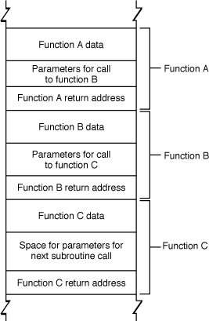
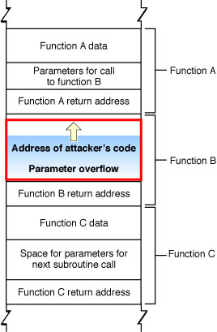
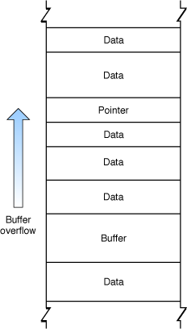
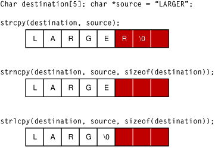
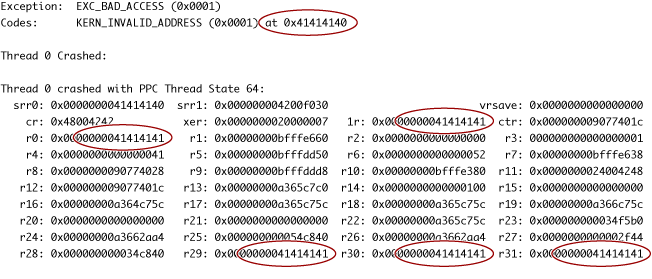

> 导航：[总目录](../../../README.md) · [documentation](../../../_indexes/documentation.md) · [Secure Coding Guide](Introduction%20to%20Secure%20Coding%20Guide.md)


[Next](Validating%20Input%20and%20Interprocess%20Communication.md)[Previous](Types%20of%20Security%20Vulnerabilities.md)

# Avoiding Buffer Overflows and Underflows

Buffer overflows, both on the stack and on the heap, are a major source of security vulnerabilities in C, Objective-C, and C++ code. This chapter discusses coding practices that will avoid buffer overflow and underflow problems, lists tools you can use to detect buffer overflows, and provides samples illustrating safe code.

Every time your program solicits input (whether from a user, from a file, over a network, or by some other means), there is a potential to receive inappropriate data. For example, the input data might be longer than what you have reserved room for in memory.

When the input data is longer than will fit in the reserved space, if you do not truncate it, that data will overwrite other data in memory. When this happens, it is called a _buffer overflow_. If the memory overwritten contained data essential to the operation of the program, this overflow causes a bug that, being intermittent, might be very hard to find. If the overwritten data includes the address of other code to be executed and the user has done this deliberately, the user can point to malicious code that your program will then execute.

Similarly, when the input data is or appears to be shorter than the reserved space (due to erroneous assumptions, incorrect length values, or copying raw data as a C string), this is called a _buffer underflow_. This can cause any number of problems from incorrect behavior to leaking data that is currently on the stack or heap.

Although most programming languages check input against storage to prevent buffer overflows and underflows, C, Objective-C, and C++ do not. Because many programs link to C libraries, vulnerabilities in standard libraries can cause vulnerabilities even in programs written in “safe” languages. For this reason, even if you are confident that your code is free of buffer overflow problems, you should limit exposure by running with the least privileges possible. See [Elevating Privileges Safely](Elevating%20Privileges%20Safely.md#apple-f4xwc4dqnrsv64tfmyxwi33df52wszbpkridimbqgazdkobzfvjvomi) for more information on this topic.

Keep in mind that obvious forms of input, such as strings entered through dialog boxes, are not the only potential source of malicious input. For example:

1. Buffer overflows in one operating system’s help system could be caused by maliciously prepared embedded images.
2. A commonly-used media player failed to validate a specific type of audio files, allowing an attacker to execute arbitrary code by causing a buffer overflow with a carefully crafted audio file.

   [1CVE-2006-1591 2CVE-2006-1370]

There are two basic categories of overflow: stack overflows and heap overflows. These are described in more detail in the sections that follow.

In most operating systems, each application has a stack (and multithreaded applications have one stack per thread). This stack contains storage for locally scoped data.

The stack is divided into units called stack frames. Each stack frame contains all data specific to a particular call to a particular function. This data typically includes the function’s parameters, the complete set of local variables within that function, and linkage information—that is, the address of the function call itself, where execution continues when the function returns). Depending on compiler flags, it may also contain the address of the top of the next stack frame. The exact content and order of data on the stack depends on the operating system and CPU architecture.

Each time a function is called, a new stack frame is added to the top of the stack. Each time a function returns, the top stack frame is removed. At any given point in execution, an application can only directly access the data in the topmost stack frame. (Pointers can get around this, but it is generally a bad idea to do so.) This design makes recursion possible because each nested call to a function gets its own copy of local variables and parameters.

Figure 2-1 illustrates the organization of the stack. Note that this figure is schematic only; the actual content and order of data put on the stack depends on the architecture of the CPU being used. See _[OS X ABI Function Call Guide](../../Developer%20Tools/OS%20X%20ABI%20Function%20Call%20Guide/Introduction%20to%20OS%20X%20ABI%20Function%20Call%20Guide.md#apple-f4xwc4dqnrsv64tfmyxwi33df52wszbpkridimbqgazdkmrr)_ for descriptions of the function-calling conventions used in all the architectures supported by macOS.

__Figure 2-1__  Schematic view of the stack



In general, an application should check all input data to make sure it is appropriate for the purpose intended (for example, making sure that a filename is of legal length and contains no illegal characters). Unfortunately, in many cases, programmers do not bother, assuming that the user will not do anything unreasonable.

This becomes a serious problem when the application stores that data into a fixed-size buffer. If the user is malicious (or opens a file that contains data created by someone who is malicious), he or she might provide data that is longer than the size of the buffer. Because the function reserves only a limited amount of space on the stack for this data, the data overwrites other data on the stack.

As shown in Figure 2-2, a clever attacker can use this technique to overwrite the return address used by the function, substituting the address of other code. Then, when function C completes execution, rather than returning to function B, it jumps to the attacker’s code.

Because the application executes the attacker’s code, the attacker’s code inherits the user’s permissions. If the user is logged on as an administrator, the attacker can take complete control of the computer, reading data from the disk, sending emails, and so forth. (Note that apps subject to sandboxing, which includes any app in iOS, as well as any for which you adopt App Sandbox in macOS, are unable to take complete control of the device, although an attacker can still access the app’s own data this way.)

__Figure 2-2__  Stack after malicious buffer overflow



In addition to attacks on the linkage information, an attacker can also alter program operation by modifying local data and function parameters on the stack. For example, instead of connecting to the desired host, the attacker could modify a data structure so that your application connects to a different (malicious) host.

The heap is used for all dynamically allocated memory in your application. When you use [malloc](https://developer.apple.com/library/archive/documentation/System/Conceptual/ManPages_iPhoneOS/man3/malloc.3.html#//apple_ref/doc/man/3/malloc), the C++ `new` operator, or equivalent functions to allocate a block of memory or instantiate an object, the memory that backs those pointers is allocated on the heap.

Because the heap is used to store data but is not used to store the return address value of functions and methods, and because the data on the heap changes in a nonobvious way as a program runs, it is less obvious how an attacker can exploit a buffer overflow on the heap. To some extent, it is this nonobviousness that makes heap overflows an attractive target—programmers are less likely to worry about them and defend against them than they are for stack overflows.

Figure 2-1 illustrates a heap overflow overwriting a pointer.

__Figure 2-3__  Heap overflow



In general, exploiting a buffer overflow on the heap is more challenging than exploiting an overflow on the stack. However, many successful exploits have involved heap overflows. There are two ways in which heap overflows are exploited: by modifying data and by modifying objects.

An attacker can exploit a buffer overflow on the heap by overwriting critical data, either to cause the program to crash or to change a value that can be exploited later (overwriting a stored user ID to gain additional access, for example). Modifying this data is known as a non-control-data attack. Much of the data on the heap is generated internally by the program rather than copied from user input; such data can be in relatively consistent locations in memory, depending on how and when the application allocates it.

An attacker can also exploit a buffer overflow on the heap by overwriting pointers. In many languages such as C++ and Objective-C, objects allocated on the heap contain tables of function and data pointers. By exploiting a buffer overflow to change such pointers, an attacker can potentially substitute different data or even replace the instance methods in a class object.

Exploiting a buffer overflow on the heap might be a complex, arcane problem to solve, but some malicious hackers thrive on just such challenges. For example:

1. A heap overflow in code for decoding a bitmap image allowed remote attackers to execute arbitrary code.
2. A heap overflow vulnerability in a networking server allowed an attacker to execute arbitrary code by sending an HTTP POST request with a negative “Content-Length” header.

   [1CVE-2006-0006 2CVE-2005-3655]

Strings are a common form of input. Because many string-handling functions have no built-in checks for string length, strings are frequently the source of exploitable buffer overflows. Figure 2-4 illustrates the different ways three string copy functions handle the same over-length string.

__Figure 2-4__  C string handling functions and buffer overflows



As you can see, the [strcpy](https://developer.apple.com/library/archive/documentation/System/Conceptual/ManPages_iPhoneOS/man3/strcpy.3.html#//apple_ref/doc/man/3/strcpy) function merely writes the entire string into memory, overwriting whatever came after it.

The [strncpy](https://developer.apple.com/library/archive/documentation/System/Conceptual/ManPages_iPhoneOS/man3/strncpy.3.html#//apple_ref/doc/man/3/strncpy) function truncates the string to the correct length, but without the terminating null character. When this string is read, then, all of the bytes in memory following it, up to the next null character, might be read as part of the string. Although this function can be used safely, it is a frequent source of programmer mistakes, and thus is regarded as moderately unsafe. To safely use `strncpy`, you must either explicitly zero the last byte of the buffer after calling `strncpy` or pre-zero the buffer and then pass in a maximum length that is one byte smaller than the buffer size.

Only the [strlcpy](https://developer.apple.com/library/archive/documentation/System/Conceptual/ManPages_iPhoneOS/man3/strlcpy.3.html#//apple_ref/doc/man/3/strlcpy) function is fully safe, truncating the string to one byte smaller than the buffer size and adding the terminating null character.

Table 2-1 summarizes the common C string-handling routines to avoid and which to use instead.

__Table 2-1__  String functions to use and avoid

| Don’t use these functions | Use these instead |
| [strcat](https://developer.apple.com/library/archive/documentation/System/Conceptual/ManPages_iPhoneOS/man3/strcat.3.html#//apple_ref/doc/man/3/strcat) | [strlcat](https://developer.apple.com/library/archive/documentation/System/Conceptual/ManPages_iPhoneOS/man3/strlcat.3.html#//apple_ref/doc/man/3/strlcat) |
| [strcpy](https://developer.apple.com/library/archive/documentation/System/Conceptual/ManPages_iPhoneOS/man3/strcpy.3.html#//apple_ref/doc/man/3/strcpy) | [strlcpy](https://developer.apple.com/library/archive/documentation/System/Conceptual/ManPages_iPhoneOS/man3/strlcpy.3.html#//apple_ref/doc/man/3/strlcpy) |
| [strncat](https://developer.apple.com/library/archive/documentation/System/Conceptual/ManPages_iPhoneOS/man3/strncat.3.html#//apple_ref/doc/man/3/strncat) | [strlcat](https://developer.apple.com/library/archive/documentation/System/Conceptual/ManPages_iPhoneOS/man3/strlcat.3.html#//apple_ref/doc/man/3/strlcat) |
| [strncpy](https://developer.apple.com/library/archive/documentation/System/Conceptual/ManPages_iPhoneOS/man3/strncpy.3.html#//apple_ref/doc/man/3/strncpy) | [strlcpy](https://developer.apple.com/library/archive/documentation/System/Conceptual/ManPages_iPhoneOS/man3/strlcpy.3.html#//apple_ref/doc/man/3/strlcpy) |
| [sprintf](https://developer.apple.com/library/archive/documentation/System/Conceptual/ManPages_iPhoneOS/man3/sprintf.3.html#//apple_ref/doc/man/3/sprintf) | [snprintf](https://developer.apple.com/library/archive/documentation/System/Conceptual/ManPages_iPhoneOS/man3/snprintf.3.html#//apple_ref/doc/man/3/snprintf) (see note) or [asprintf](https://developer.apple.com/library/archive/documentation/System/Conceptual/ManPages_iPhoneOS/man3/asprintf.3.html#//apple_ref/doc/man/3/asprintf) |
| [vsprintf](https://developer.apple.com/library/archive/documentation/System/Conceptual/ManPages_iPhoneOS/man3/vsprintf.3.html#//apple_ref/doc/man/3/vsprintf) | [vsnprintf](https://developer.apple.com/library/archive/documentation/System/Conceptual/ManPages_iPhoneOS/man3/vsnprintf.3.html#//apple_ref/doc/man/3/vsnprintf) (see note) or [vasprintf](https://developer.apple.com/library/archive/documentation/System/Conceptual/ManPages_iPhoneOS/man3/vasprintf.3.html#//apple_ref/doc/man/3/vasprintf) |
| [gets](https://developer.apple.com/library/archive/documentation/System/Conceptual/ManPages_iPhoneOS/man3/gets.3.html#//apple_ref/doc/man/3/gets) | [fgets](https://developer.apple.com/library/archive/documentation/System/Conceptual/ManPages_iPhoneOS/man3/fgets.3.html#//apple_ref/doc/man/3/fgets) (see note) or use Core Foundation or Foundation APIs |

You can also avoid string handling buffer overflows by using higher-level interfaces.

- If you are using C++, the ANSI C++ `string` class avoids buffer overflows, though it doesn’t handle non-ASCII encodings (such as UTF-8).
- If you are writing code in Objective-C, use the [NSString](https://developer.apple.com/library/archive/documentation/LegacyTechnologies/WebObjects/WebObjects_3.5/Reference/Frameworks/ObjC/Foundation/Classes/NSStringClassCluster/Description.html#//apple_ref/occ/cl/NSString) class. Note that an `NSString` object has to be converted to a C string in order to be passed to a C routine, such as a POSIX function.
- If you are writing code in C, you can use the Core Foundation representation of a string, referred to as a CFString, and the string-manipulation functions in the CFString API.

The Core Foundation CFString is “toll-free bridged” with its Cocoa Foundation counterpart, [NSString](https://developer.apple.com/library/archive/documentation/LegacyTechnologies/WebObjects/WebObjects_3.5/Reference/Frameworks/ObjC/Foundation/Classes/NSStringClassCluster/Description.html#//apple_ref/occ/cl/NSString). This means that the Core Foundation type is interchangeable in function or method calls with its equivalent Foundation object. Therefore, in a method where you see an `NSString *` parameter, you can pass in a value of type [CFStringRef](https://developer.apple.com/documentation/corefoundation/cfstringref), and in a function where you see a `CFStringRef` parameter, you can pass in an `NSString` instance. This also applies to concrete subclasses of `NSString`.

See _[CFString Reference](https://developer.apple.com/documentation/corefoundation/cfstring)_ and _[Foundation Framework Reference](https://developer.apple.com/documentation/foundation)_ for more details on using these representations of strings and on converting between CFString objects and `NSString` objects.

When working with fixed-length buffers, you should always use `sizeof` to calculate the size of a buffer, and then make sure you don’t put more data into the buffer than it can hold. Even if you originally assigned a static size to the buffer, either you or someone else maintaining your code in the future might change the buffer size but fail to change every case where the buffer is written to.

The first example, Table 2-2, shows two ways of allocating a character buffer 1024 bytes in length, checking the length of an input string, and copying it to the buffer.

__Table 2-2__  Avoid hard-coded buffer sizes

| Instead of this: | Do this: |
| `char buf[1024];`  `...`  `if (size <= 1023) {`  `...`  `}` | `#define BUF_SIZE 1024`  `...`  `char buf[BUF_SIZE];`  `...`  `if (size < BUF_SIZE) {`  `...`  `}` |
| `char buf[1024];`  `...`  `if (size < 1024) {`  `...`  `}` | `char buf[1024];`  `...`  `if (size < sizeof(buf)) {`  `...`  `}` |

The two snippets on the left side are safe as long as the original declaration of the buffer size is never changed. However, if the buffer size gets changed in a later version of the program without changing the test, then a buffer overflow will result.

The two snippets on the right side show safer versions of this code. In the first version, the buffer size is set using a constant that is set elsewhere, and the check uses the same constant. In the second version, the buffer is set to 1024 bytes, but the check calculates the actual size of the buffer. In either of these snippets, changing the original size of the buffer does not invalidate the check.

Table 2-3, shows a function that adds an `.ext` suffix to a filename.

__Table 2-3__  Avoid unsafe concatenation

| Instead of this: | Do this: |
| `{`  `char file[MAX_PATH];`  `...`  `addsfx(file);`  `...`  `}`  `static *suffix = ".ext";`  `char *addsfx(char *buf)`  `{`  `return strcat(buf, suffix);`  `}` | `{`  `char file[MAX_PATH];`  `...`  `addsfx(file, sizeof(file));`  `...`  `}`  `static *suffix = ".ext";`  `size_t addsfx(char *buf, uint size)`  `{`  `size_t ret = strlcat(buf, suffix, size);`  `if (ret >= size) {`  `fprintf(stderr, "Buffer too small....\n");`  `}`  `return ret;`  `}` |

Both versions use the maximum path length for a file as the buffer size. The unsafe version in the left column assumes that the filename does not exceed this limit, and appends the suffix without checking the length of the string. The safer version in the right column uses the [strlcat](https://developer.apple.com/library/archive/documentation/System/Conceptual/ManPages_iPhoneOS/man3/strlcat.3.html#//apple_ref/doc/man/3/strlcat) function, which truncates the string if it exceeds the size of the buffer.

For a further discussion of this issue and a list of more functions that can cause problems, see Wheeler, _Secure Programming HOWTO_ ([http://www.dwheeler.com/secure-programs/](http://www.dwheeler.com/secure-programs/)).

If the size of a buffer is calculated using data supplied by the user, there is the potential for a malicious user to enter a number that is too large for the integer data type, which can cause program crashes and other problems. 

In two’s-complement arithmetic (used for signed integer arithmetic by most modern CPUs), a negative number is represented by inverting all the bits of the binary number and adding 1. A `1` in the most-significant bit indicates a negative number. Thus, for 4-byte signed integers, `0x7fffffff = 2147483647`, but `0x80000000 = -2147483648`

Therefore,

```
int 2147483647 + 1 = - 2147483648
```

If a malicious user specifies a negative number where your program is expecting only unsigned numbers, your program might interpret it as a very large number. Depending on what that number is used for, your program might attempt to allocate a buffer of that size, causing the memory allocation to fail or causing a heap overflow if the allocation succeeds. In an early version of a popular web browser, for example, storing objects into a JavaScript array allocated with negative size could overwrite memory. [CVE-2004-0361]

In other cases, if you use signed values to calculate buffer sizes and test to make sure the data is not too large for the buffer, a sufficiently large block of data will appear to have a negative size, and will therefore pass the size test while overflowing the buffer.

Depending on how the buffer size is calculated, specifying a negative number could result in a buffer too small for its intended use. For example, if your program wants a minimum buffer size of 1024 bytes and adds to that a number specified by the user, an attacker might cause you to allocate a buffer smaller than the minimum size by specifying a large positive number, as follows:

```
1024 + 4294966784 = 512
0x400 + 0xFFFFFE00 = 0x200
```

Also, any bits that overflow past the length of an integer variable (whether signed or unsigned) are dropped. For example, when stored in a 32-bit integer, `2**32 == 0`. Because it is not illegal to have a buffer with a size of 0, and because `malloc(0)` returns a pointer to a small block, your code might run without errors if an attacker specifies a value that causes your buffer size calculation to be some multiple of `2**32`. In other words, for any values of `n` and `m` where `(n * m) mod 2**32 == 0`, allocating a buffer of size `n*m` results in a valid pointer to a buffer of some very small (and architecture-dependent) size. In that case, a buffer overflow is assured.

To avoid such problems, when performing buffer math, you should always include range checks to make sure no integer overflow is about to occur.

A common mistake when performing these tests is to check the result of a potentially overflowing multiplication or other operation:

```
size_t bytes = n * m;
if (bytes < n || bytes < m) { /* BAD BAD BAD */
    ... /* allocate “bytes” space */
}
```

Unfortunately, if `m` and `n` are signed, the C language specification allows the compiler to optimize out such tests [CWE-733, CERT VU#162289]. Even if they are unsigned, the test still fails in some cases. For example, on a 64-bit machine, if `m` and `n` are both declared `size_t`, and both set to `0x180000000`, the result of multiplying them is `0x24000000000000000`, but `bytes` will contain that result modulo `2**64`, or `0x4000000000000000`. This passes the test (the result is bigger than either input), despite the fact that overflow did occur.

Instead, the correct way to test for integer overflow during multiplication is to test _before_ the multiplication. In particular, you divide the maximum allowable result by the multiplier and compare the result to the multiplicand or vice-versa. If the result is smaller than the multiplicand, the product of those two values would cause an integer overflow. Still, getting this right can be tricky. For example, choosing the wrong maximum allowable integer constant (e.g., `SIZE_MAX` or `INT_MAX`?) produces incorrect results.

Therefore the safest way to perform multiplication with unknown inputs is to use the [clang checked arithmetic builtins](http://clang.llvm.org/docs/LanguageExtensions.html#checked-arithmetic-builtins). For example:

```
size_t bytes;
if (__builtin_umull_overflow(m, n, &bytes)) {
    /* Overflow occured.  Handle appropriately. */
} else {
    /* Allocate "bytes" space. */
}
```

In this case, `__builtin_umull_overflow` performs an unsigned multiplication (casting `m` and `n` as needed), and stores the (potentially overflowed) result in `bytes`, but also returns a `bool` indicating if overflow occurred as a result of the operation.

When you build using the macOS 10.12 or iOS 10 SDK or later, you can enhance this code by using builtin wrappers, defined in the `os/overflow.h` header file:

```c
#include <os/overflow.h>

if (os_mul_overflow(m, n, &bytes)) {
    /* Overflow occured.  Handle appropriately. */
} else {
    /* Allocate "bytes" space. */
}
```

The `os_mul_overflow` macro (like its siblings `os_add_overflow` and `os_sub_overflow`) wraps a new clang builtin that detects overflow correctly even for mixed-type integer arithmetic. This removes the need to convert the arguments and result to a common type, eliminating another source of overflow errors. The wrapper also generates a compile-time warning if you do not use the return value, helping to ensure that your code does in fact take some action based on a reported overflow condition.

To test for buffer overflows, you should attempt to enter more data than is asked for wherever your program accepts input. Also, if your program accepts data in a standard format, such as graphics or audio data, you should attempt to pass it malformed data. This process is known as fuzzing.

If there are buffer overflows in your program, it will eventually crash. (Unfortunately, it might not crash until some time later, when it attempts to use the data that was overwritten.) The crash log might provide some clues that the cause of the crash was a buffer overflow. If, for example, you enter a string containing the uppercase letter “A” several times in a row, you might find a block of data in the crash log that repeats the number 41, the ASCII code for “A” (see Figure 2-2). If the program is trying to jump to a location that is actually an ASCII string, that’s a sure sign that a buffer overflow was responsible for the crash.

__Figure 2-5__  Buffer overflow crash log



If there are any buffer overflows in your program, you should always assume that they are exploitable and fix them. It is much harder to prove that a buffer overflow is not exploitable than to just fix the bug. Also note that, although you can test for buffer overflows, you cannot test for the _absence_ of buffer overflows; it is necessary, therefore, to carefully check every input and every buffer size calculation in your code.

For more information on fuzzing, see [Fuzzing](Validating%20Input%20and%20Interprocess%20Communication.md#apple-f4xwc4dqnrsv64tfmyxwi33df52wszbpkridimbqga3tenbwfvjvooa) in [Validating Input and Interprocess Communication](Validating%20Input%20and%20Interprocess%20Communication.md#apple-f4xwc4dqnrsv64tfmyxwi33df52wszbpkridimbqga3tenbwfvjvomy).

Fundamentally, buffer underflows occur when two parts of your code disagree about the size of a buffer or the data in that buffer. For example, a fixed-length C string variable might have room for 256 bytes, but might contain a string that is only 12 bytes long.

Buffer underflow conditions are not always dangerous; they become dangerous when correct operation depends upon both parts of your code treating the data in the same way. This often occurs when you read the buffer to copy it to another block of memory, to send it across a network connection, and so on.

There are two broad classes of buffer underflow vulnerabilities: short writes, and short reads.

A _short write vulnerability_ occurs when a short write to a buffer fails to fill the buffer completely. When this happens, some of the data that was previously in the buffer is still present after the write. If the application later performs an operation on the entire buffer (writing it to disk or sending it over the network, for example), that existing data comes along for the ride. The data could be random garbage data, but if the data happens to be interesting, you have an information leak.

Further, when such an underflow occurs, if the values in those locations affect program flow, the underflow can potentially cause incorrect behavior up to and including allowing you to skip past an authentication or authorization step by leaving the existing authorization data on the stack from a previous call by another user, application, or other entity.

A _short read vulnerability_ occurs when a read from a buffer fails to read the complete contents of a buffer. If the program then makes decisions based on that short read, any number of erroneous behaviors can result. This usually occurs when a C string function is used to read from a buffer that does not actually contain a valid C string.

A C string is defined as a string containing a series of bytes that ends with a null terminator. By definition, it cannot contain any null bytes prior to the end of the string. As a result, C-string-based functions, such as [strlen](https://developer.apple.com/library/archive/documentation/System/Conceptual/ManPages_iPhoneOS/man3/strlen.3.html#//apple_ref/doc/man/3/strlen), [strlcpy](https://developer.apple.com/library/archive/documentation/System/Conceptual/ManPages_iPhoneOS/man3/strlcpy.3.html#//apple_ref/doc/man/3/strlcpy), and [strdup](https://developer.apple.com/library/archive/documentation/System/Conceptual/ManPages_iPhoneOS/man3/strdup.3.html#//apple_ref/doc/man/3/strdup), copy a string until the first null terminator, and have no knowledge of the size of the original source buffer.

By contrast, strings in other formats (a [CFStringRef](https://developer.apple.com/documentation/corefoundation/cfstringref) object, a Pascal string, or a [CFDataRef](https://developer.apple.com/documentation/corefoundation/cfdata) blob, for example) have an explicit length and can contain null bytes at arbitrary locations in the data. If you convert such a string into a C string and then evaluate that C string, you get incorrect behavior because the resulting C string effectively ends at the first null byte.

If you obey the following rules, you should be able to avoid most underflow attacks:

- Zero-fill all buffers before use. A buffer that contains only zeros cannot contain stale sensitive information.
- Always check return values and fail appropriately.
- If a call to an allocation or initialization function fails ([AuthorizationCopyRights](https://developer.apple.com/documentation/security/1395770-authorizationcopyrights), for example), do not evaluate the resulting data, as it could be stale.
- Use the value returned from [read](https://developer.apple.com/library/archive/documentation/System/Conceptual/ManPages_iPhoneOS/man2/read.2.html#//apple_ref/doc/man/2/read) system calls and other similar calls to determine how much data was actually read. Then either:

  - Use that result to determine how much data is present instead of using a predefined constant _or_
  - fail if the function did not return the expected amount of data.
- Display an error and fail if a [write](https://developer.apple.com/library/archive/documentation/System/Conceptual/ManPages_iPhoneOS/man2/write.2.html#//apple_ref/doc/man/2/write) call, [printf](https://developer.apple.com/library/archive/documentation/System/Conceptual/ManPages_iPhoneOS/man3/printf.3.html#//apple_ref/doc/man/3/printf) call, or other output call returns without writing all of the data, particularly if you might later read that data back.
- When working with data structures that contain length information, always verify that the data is the size you expected.
- Avoid converting non-C strings ([CFStringRef](https://developer.apple.com/documentation/corefoundation/cfstringref) objects, [NSString](https://developer.apple.com/library/archive/documentation/LegacyTechnologies/WebObjects/WebObjects_3.5/Reference/Frameworks/ObjC/Foundation/Classes/NSStringClassCluster/Description.html#//apple_ref/occ/cl/NSString) objects, [CFDataRef](https://developer.apple.com/documentation/corefoundation/cfdata) objects, Pascal strings, and so on) into C strings if possible. Instead, work with the strings in their original format.

  If this is not possible, always perform length checks on the resulting C string or check for null bytes in the source data.
- Avoid mixing buffer operations and string operations. If this is not possible, always perform length checks on the resulting C string or check for null bytes in the source data.
- Save files in a fashion that prevents malicious tampering or truncation. (See [Race Conditions and Secure File Operations](Race%20Conditions%20and%20Secure%20File%20Operations.md#apple-f4xwc4dqnrsv64tfmyxwi33df52wszbpkridimbqgazdkobvfvjvomi) for more information.)
- Avoid integer overflows and underflows. (See [Calculating Buffer Sizes](#apple-f4xwc4dqnrsv64tfmyxwi33df52wszbpkridimbqgazdknzxfvjvooi) for details.)

macOS and iOS provide two features that can make it harder to exploit stack and buffer overflows: address space layout randomization (ASLR) and a non-executable stack and heap. These features are briefly explained in the sections that follow.

Recent versions of macOS and iOS, where possible, choose different locations for your stack, heap, libraries, frameworks, and executable code each time you run your software. This makes it much harder to successfully exploit buffer overflows because it is no longer possible to know where the buffer is in memory, nor is it possible to know where libraries and other code are located.

Address space layout randomization requires some help from the compiler—specifically, it requires position-independent code.

- If you are compiling an executable that targets macOS 10.7 and later or iOS 4.3 and later, the necessary flags are enabled by default. You can disable this feature, if necessary, with the `-no_pie` flag, but for maximum security, you should not do so.
- If you are compiling an executable that targets an earlier OS, you must explicitly enable position-independent executable support by adding the `-pie` flag.

Recent processors support a feature called the NX bit that allows the operating system to mark certain parts of memory as non-executable. If the processor tries to execute code in any memory page marked as non-executable, the program in question crashes.

macOS and iOS take advantage of this feature by marking the stack and heap as non-executable. This makes buffer overflow attacks harder because any attack that places executable code on the stack or heap and then tries to run that code will fail.

Most of the time, this is the behavior that you want. However, in some rare situations (such as writing a just-in-time compiler), it may be necessary to modify that behavior.

There are two ways to make the stack and heap executable:

- Pass the `-allow_stack_execute` flag to the compiler. This makes the stack (not the heap) executable.
- Use the [mprotect](https://developer.apple.com/library/archive/documentation/System/Conceptual/ManPages_iPhoneOS/man2/mprotect.2.html#//apple_ref/doc/man/2/mprotect) system call to mark specific memory pages as executable.

The details are beyond the scope of this document. For more information, see the manual page for [mprotect](https://developer.apple.com/library/archive/documentation/System/Conceptual/ManPages_iPhoneOS/man2/mprotect.2.html#//apple_ref/doc/man/2/mprotect).

To help you debug heap corruption bugs, you can use the `libgmalloc` library. It provides additional detection of overflows through the use of guard pages and other techniques. To enable this library, type the following command in Terminal:

```
export DYLD_INSERT_LIBRARIES=/usr/lib/libgmalloc.dylib
```

Then run your software from Terminal (either by running the executable itself or using the `open` command). For more information, see the manual page for `libgmalloc`.

In addition to `-pie` and `-allow_stack_execute`, the following flags have an effect on security:

- `-fstack-protector` or `-fstack-protector-all`—Enables stack canaries (special values that, if modified, mean that the adjacent string overflowed its bounds) and changes the order of items in the stack to minimize the risk of corruption. When your functions call other functions that potentially could overflow, the compiler then inserts additional code afterwards to verify that the canary values have not been modified.

  The `-fstack-protector` flag enables stack canaries only for functions that contain buffers over 8 bytes (a string on the stack, for example), and is enabled by default when compiling for macOS 10.6 and later.

  The `-fstack-protector-all` flag enables stack canaries for all functions.
- `-D_FORTIFY_SOURCE`—Adds additional static and dynamic bounds checking to a number of functions that normally provide none (`sprintf`, `vsprintf`, `snprintf`, `vsnprintf`, `memcpy`, `mempcpy`, `memmove`, `memset`, `strcpy`, `stpcpy`, `strncpy`, `strcat` and `strncat`). If set to level 1 (`-D_FORTIFY_SOURCE=1`), only compile-time checking is performed. Level 1 is enabled by default when compiling for macOS 10.6 and later. At level 2, additional run-time checking is performed.
- `MallocCorruptionAbort`—An environment variable that tells 32-bit applications to abort if a `malloc` call would fail because of a corrupted heap structure. Aborting on heap corruption is automatically enabled for 64-bit applications.

[Next](Validating%20Input%20and%20Interprocess%20Communication.md)[Previous](Types%20of%20Security%20Vulnerabilities.md)

