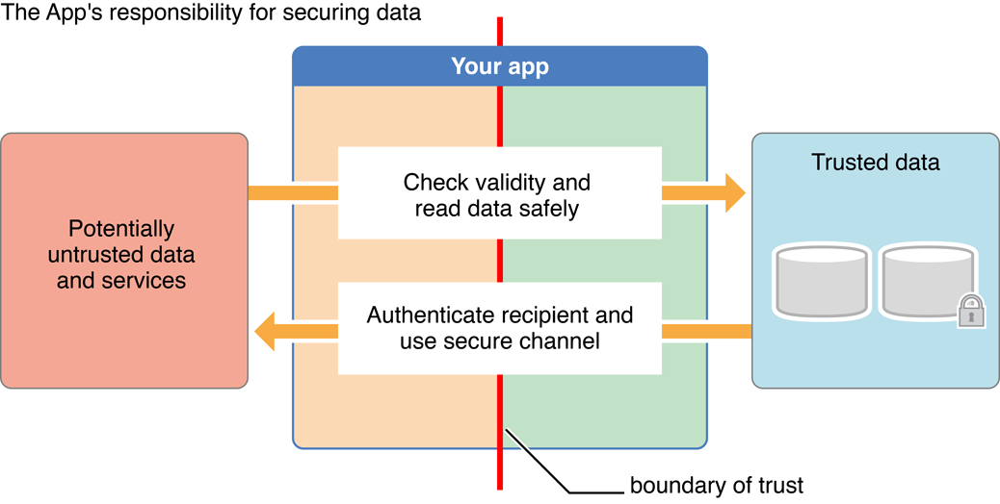

> 导航：[总目录](../../../README.md) · [documentation](../../../_indexes/documentation.md)

[Next](Risk%20Assessment%20and%20Threat%20Modeling.md)

# About Software Security

In the cloud-enabled, highly networked world of modern computing, security is one of the most important facets of proper software engineering.

The most important thing to understand about security is that it is not a bullet point item. You cannot bolt it on at the end of the development process. You must consciously design security into your app or service from the very beginning, and make it a conscious part of the entire process from design through implementation, testing, and release.

At the application layer, security means being aware of how your code uses information and ensuring that it does so safely and responsibly. For example, it is your responsibility to:

- __Keep users’ personal data safe from prying eyes.__ Store the data in a secure way, and ensure that your software collects only the information that it requires.
- __Treat untrusted files and data with care.__ If your software accesses the Internet or reads files that might have previously been sent to someone over the Internet, your software must properly validate the data. If it does not, it might inadvertently provide a vector for attackers to access other personal data that may be stored on the user’s computer or other mobile device.
- __Protect data in transit.__ If your software transmits personal information over the Internet, you must do so in a safe and secure fashion to prevent unauthorized access to or modification of the data while in transit.
- __Verify the authenticity of data where possible.__ If your software provides access to or works with signed data, it should verify those signatures to ensure that the data has not been tampered with.

### Threat Models Help You Identify Areas of Risk

In the planning phase, you must determine the nature of the threats to your software and architect your code in such a way that maximizes security. To do this, you should build up a threat model that shows ways in which your software might be attacked.

### Secure Coding Techniques and OS Security Features Help You Mitigate Those Risks

At each phase of the development process, you must take steps to mitigate risks:

- __Avoid exploitable coding flaws.__ During the implementation phase, you must avoid using insecure coding techniques that can lead to arbitrary code injection, denial of service, or other incorrect behavior.
- __Update your risk model continuously.__ Throughout the development process, you should continue to perform regular risk assessments and update your threat model as the software evolves so that it accurately reflects your risk.
- __Don’t reinvent the wheel.__ When securing your software and its data, you should always take advantage of built-in security features rather than writing your own if at all possible. In particular, you may need to determine whether a user is legitimate or not, send messages to servers securely to protect the integrity and secrecy of data in transit, or store data securely on local disks to protect data at rest.

### Tools Can Help You Catch Coding Errors

In the testing phase, you should take advantage of static analyzers and other tools designed to help you find security vulnerabilities.

This document assumes that you have already read _[Mac Technology Overview](../../Mac%20OSX/Mac%20Technology%20Overview/About%20Developing%20for%20Mac.md#apple-f4xwc4dqnrsv64tfmyxwi33df52wszbpkridimbqgaytanrx)_, _iOS Technology Overview_, or both.

[Next](Risk%20Assessment%20and%20Threat%20Modeling.md)

