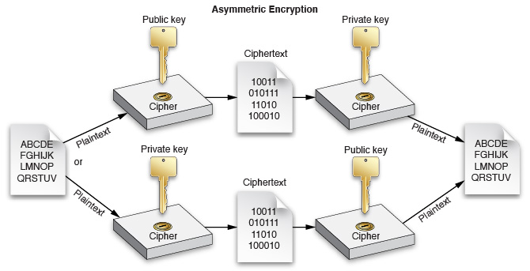
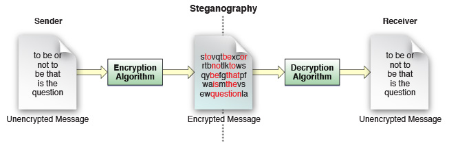

> 导航：[总目录](../../../README.md) · [documentation](../../../_indexes/documentation.md) · [Security Overview](About%20Software%20Security.md)


[Next](Security%20Server%20and%20Security%20Agent.md)[Previous](Authentication%20and%20Authorization.md)

# Cryptographic Services

Cryptographic services form the foundation of securing data in transit (secure communications) and data at rest (secure storage). Using sophisticated mathematics, they allow you to:

- Encrypt and decrypt data so that it cannot be understood by an outside observer
- Verify that data has not been modified since it was originally sent by hashing, signing, and verifying

This chapter describes these cryptographic techniques and briefly summarizes the technologies that macOS and iOS provide to help you use cryptography in your own application.

Encryption is a means of protecting data from interception by transforming it into a form that is not readable except by someone who knows how to transform it back.

Encryption is commonly used to protect data in transit and data at rest. When information must be sent across an untrusted communication channel, it is the responsibility of the two endpoints to use encryption to secure the communication. Similarly, when storing information on a local disk, an app may use encryption to ensure that the information is not readable by third parties even if the computer is stolen.

There are many different encryption techniques, called _ciphers_, that work in different ways and can serve different purposes. Ciphers generally work by combining the original information (the _cleartext_, or _plaintext_) with a second piece of information (a key) in some fashion to produce an encrypted form, called the _ciphertext_.

Modern encryption techniques can be grouped into three broad categories: symmetric encryption, asymmetric encryption, and steganography.

In symmetric encryption, a single key (usually a long string of random bytes) is used to mathematically transform a piece of information and is later used in reverse to retrieve the original information.


Symmetric encryption is often used for secure communication. However, because both endpoints must know the same secret key, symmetric encryption is not sufficient by itself.

In asymmetric encryption, two mathematically related keys are used to transform a piece of information. Information encrypted with one key can be decrypted only with the other key and vice versa. Generally speaking, one of these keys (the private key) is kept secret, and the other key (the public key) is made broadly available. For this reason, asymmetric encryption is also called _public key cryptography_.



Asymmetric encryption is often used for establishing a shared communication channel. Because asymmetric encryption is computationally expensive, the two endpoints often use asymmetric encryption to exchange a symmetric key, and then use a much faster symmetric encryption algorithm for encrypting and decrypting the actual data.

Asymmetric encryption can also be used to establish trust. By encrypting information with your private key, someone else can read that information with your public key and be certain that it was encrypted by you.

Steganography means hiding information in less important bits of another piece of information.



Steganography is commonly used for storing copyright information into photographs in such a way that is largely indistinguishable from noise unless you know how to look for it.

Steganography can also be used for storing encrypted volumes underneath other encrypted or unencrypted volumes (either by using the unused blocks or by taking advantage of error correction in subtle ways).

A hash value, or hash, is a small piece of data derived from a larger piece of data that can serve as a proxy for that larger piece of data. In cryptography, hashes are used when verifying the authenticity of a piece of data. Cryptographic hashing algorithms are essentially a form of (extremely) lossy data compression, but they are specifically designed so that two similar pieces of data are unlikely to hash to the same value.

For example, two schoolchildren frequently passed notes back and forth while deciding when to walk home together. One day, a bully intercepted the note and arranged for Bob to arrive ten minutes early so that he could steal Bob’s lunch money. To ensure that their messages were not modified in the future, they devised a scheme in which they computed the remainder after dividing the number of letters in the message by the sum of their ages, then wrote that many dots in the corner of the message. By counting the number of letters, they could (crudely) detect certain modifications to each other’s messages.

This is, of course, a contrived example. A simple remainder is a _very_ weak hashing algorithm. With good hashing algorithms, collisions are unlikely if you make small changes to a piece of data. This tamper-resistant nature of good hashes makes them a key component in code signing, message signing, and various other tamper detection schemes.

At a high level, hashing is also similar to checksumming (a technique for detecting and correcting errors in transmitted data). However, the goals of these techniques are very different, so the algorithms used are also very different. Checksums are usually designed to allow detection and repair of a single change or a small number of changes. By contrast, cryptographic hashes must reliably detect a large number of changes to a single piece of data but need not tell you how the data changed.

For example, the following command in the shell demonstrates a common hashing algorithm:

```
$ echo "This is a test.  This is only a test." | shasum
7679a5fb1320e69f4550c84560fc6ef10ace4550  -
```

macOS provides a number of C language APIs for performing hashing. These are described further in the documents cited at the end of this chapter.

A signature is a way to prove the authenticity of a message, or to verify the identity of a server, user, or other entity.

In olden days, people sometimes stamped envelopes with a wax seal. This seal not only proved who sent the message but also proved that no one had opened the message and potentially modified it while in transit.

Modern signing achieves many of the same benefits through mathematics. In addition to the data itself, signing and verifying require two pieces of information: the appropriate half of a public-private key pair and a digital certificate.

The sender computes a hash of the message and encrypts it with the private key. The recipient also computes a hash and then uses the corresponding public key to decrypt the sender’s hash and compares the hashes. If they are the same, the data was not modified in transit, and you can safely trust that the data was sent by the owner of that key.

The sender’s digital certificate is a collection of data that contains a public key and other identifying information, at the sender’s discretion, such as a person’s name, a company name, a domain name, and a postal address. The purpose of the certificate is to tie a public key to a particular person. If you trust the certificate, you also trust that messages signed by the sender’s private key were sent by that person.

To provide a means of determining the legitimacy of a certificate, the sender’s certificate is signed by someone else, whose certificate is in turn signed by someone else, and so on, forming a chain of trust to a certificate that the recipient inherently trusts, called an _anchor certificate_. This certificate may be a root certificate—a self-signed certificate that represents a known certificate authority and thus the root of the tree of certificates originating from that authority—or it may be any arbitrary certificate that the user or application developer has explicitly designated as a trusted anchor.

Because the recipient trusts the anchor certificate, the recipient knows that the certificate is valid and, thus, that the sender is who he or she claims to be. The degree to which the recipient trusts a certificate is defined by two factors:

- Each certificate can contain one or more _certificate extensions_ that describe how the certificate can be used. For example, a certificate that is trusted for signing email messages might not be trusted for signing executable code.
- The _trust policy_ allows you to trust certificates that would otherwise be untrusted and vice versa.

A certificate can also be used for authentication. By signing a nonce (a randomly generated challenge string created specifically for this purpose), a user or server can prove that he, she, or it is in possession of the private key associated with that certificate. If that certificate is considered trusted (by evaluating its chain of trust), then the certificate and signed nonce prove that the user or server must be who he, she, or it claims to be.

macOS and iOS provide a number of technologies for secure storage. Of these, the three most commonly used technologies are keychains, FileVault, and data protection.

In concept, a keychain is similar to a physical key ring in that it is a place where keys and other similarly small pieces of data can be stored for later use in performing cryptographic tasks, but the similarity ends there. With a physical key ring, the owner can take the key and use it to unlock something. With a keychain, apps usually do not access the actual key data itself, so they do not risk exposing the keys even if compromised. Instead, they use a unique identifier to identify those keys, and the actual encryption is performed in a separate process called the Security Server (described later in this document).

Thus, a keychain is in some ways more like a heavily armed security guard in full body armor who carries a key ring. You can ask that guard to unlock a door for you if you are authorized to enter, but you usually can’t unlock the door yourself.

macOS also includes a utility that allows users to store and read the data in the keychain, called _Keychain Access_. This utility is described in more detail later, in Keychain Access.

In macOS, FileVault uses encryption to provide encrypted storage for the user’s files. When FileVault is enabled, the disk is decrypted only after an authorized user logs in. (Note that prior to OS X 10.7, FileVault protected only a user’s home directory.)

FileVault and its configuration UI are described in more detail later, in End-User Security Features.

iOS provides APIs that allow an app to make files accessible only while the device is unlocked to protect their contents from prying eyes. With data protection, files are stored in encrypted form and are decrypted only after the user enters his or her passcode.

For apps that run in the background, there are also settings that allow the file to remain available until the user shuts down the device.

For a more detailed conceptual overview of authentication and authorization in macOS, read _[Cryptographic Services Guide](../Cryptographic%20Services%20Guide/About%20Cryptographic%20Services.md#apple-f4xwc4dqnrsv64tfmyxwi33df52wszbpkridimbqgeytcnzs)_.

You can also learn about other Apple and third-party security books in [Other Security Resources](Other%20Security%20Resources.md#apple-f4xwc4dqnrsv64tfmyxwi33df52wszbpkridgmbqgaydsnzwfvbuqnznknltc).

[Next](Security%20Server%20and%20Security%20Agent.md)[Previous](Authentication%20and%20Authorization.md)

