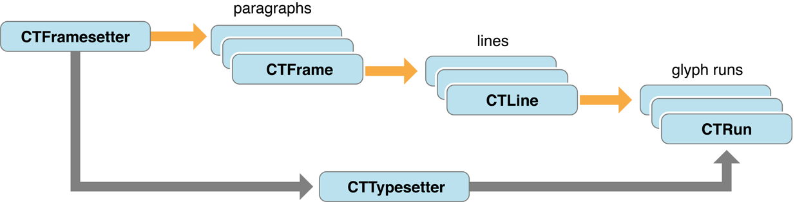

> 导航：[总目录](../../../README.md) · [documentation](../../../_indexes/documentation.md)

[Next](Core%20Text%20Overview.md)

# About Core Text

Core Text is an advanced, low-level technology for laying out text and handling fonts. The Core Text API, introduced in Mac OS X v10.5 and iOS 3.2, is accessible from all OS X and iOS environments.

Core Text is for apps that need a low-level text-handling technology correlating with the Core Graphics framework (Quartz). If you work directly with Quartz and you need to draw some text, use Core Text. If, for example, you have your own page layout engine—you have some text and you know where it needs to go in your view—you can use Core Text to generate the glyphs and position them relative to each other with all the features of fine typesetting, such as kerning, ligatures, line-breaking, hyphenation, and justification.

### Core Text Lays Out Text

Core Text generates glyphs (from character codes and font data) and positions them relative to each other in glyph runs. It breaks glyph runs into lines, and it assembles lines into multiline frames (such as paragraphs). Core Text also provides glyph- and layout-related data, such as glyph locations and measurement of lines and frames. It handles character attributes and paragraph styles, including various types of tab styles and positioning.

### You Can Manage Fonts With Core Text

The Core Text font API provides fonts, font collections, font descriptors, and easy access to font data. It also provides support for multiple master fonts, font variations, font cascading, and font linking. Core Text provides an alternative to Quartz for loading your own fonts into the current process, that is, font activation.

To make good use of this document, you should have an understanding of text systems and issues, and you should know how to use Core Foundation opaque types. For information about Core Foundation, see _[Core Foundation Design Concepts](../../Core%20Foundation/Core%20Foundation%20Design%20Concepts/Introduction%20to%20Core%20Foundation%20Design%20Concepts.md#apple-f4xwc4dqnrsv64tfmyxwi33df52wszbpgeydambqgezde2i)_.

In addition to this document, there are several that cover more specific aspects of Core Text or describe the software services used by Core Text.

- _[Core Text Reference Collection](https://developer.apple.com/documentation/coretext)_ provides complete reference information for the Core Text layout and font API.
- _[CoreTextPageViewer](../../../samplecode/CoreTextPageViewer/CoreTextPageViewer.md#apple-f4xwc4dqnrsv64tfmyxwi33df52wszbpirkfgnbqgaytanrzhe)_ (in the iOS Developer Library) shows how to use Core Text to display large bodies of text.
- _[DownloadFont](../../../samplecode/DownloadFont/DownloadFont.md#apple-f4xwc4dqnrsv64tfmyxwi33df52wszbpirkfgnbqgaytgnbqgq)_ (in the iOS Developer Library) demonstrates how to download fonts on demand.
- _[CoreTextRTF](../../../samplecode/CoreTextRTF/CoreTextRTF.md#apple-f4xwc4dqnrsv64tfmyxwi33df52wszbpirkfgnbqgaydonzxgi)_ (in the Mac Developer Library) shows how to use Core Text to lay out and draw RTF content in a window of a Cocoa application.
- _[Drawing Along a Path Using Core Text with Cocoa](../../../samplecode/Drawing%20Along%20a%20Path%20Using%20Core%20Text%20with%20Cocoa/Drawing%20Along%20a%20Path%20Using%20Core%20Text%20with%20Cocoa.md#apple-f4xwc4dqnrsv64tfmyxwi33df52wszbpirkfgnbqgaydonzxge)_ (in the Mac Developer Library) shows how to use Core Text to lay out and draw glyphs along a curve.
- _[Core Foundation Design Concepts](../../Core%20Foundation/Core%20Foundation%20Design%20Concepts/Introduction%20to%20Core%20Foundation%20Design%20Concepts.md#apple-f4xwc4dqnrsv64tfmyxwi33df52wszbpgeydambqgezde2i)_ and _[Core Foundation Framework Reference](https://developer.apple.com/documentation/corefoundation)_ describe Core Foundation, a framework that provides abstractions for common data types and fundamental software services used by Core Text.

The following chapters (in the iOS Developer Library) describe Text Kit in iOS:

- [Drawing and Managing Text](https://developer.apple.com/library/archive/documentation/StringsTextFonts/Conceptual/TextAndWebiPhoneOS/CustomTextProcessing/CustomTextProcessing.html#//apple_ref/doc/uid/TP40009542-CH4) in _[Text Programming Guide for iOS](../Text%20Programming%20Guide%20for%20iOS/About%20Text%20Handling%20in%20iOS.md#apple-f4xwc4dqnrsv64tfmyxwi33df52wszbpkridimbqga4tknbs)_ describes the app-level text handling system in iOS.
- For information about typographic concepts relevant to Core Text and other text systems, see [Typographical Concepts](https://developer.apple.com/library/archive/documentation/StringsTextFonts/Conceptual/TextAndWebiPhoneOS/TypoFeatures/TextSystemFeatures.html#//apple_ref/doc/uid/TP40009542-CH6) in _[Text Programming Guide for iOS](../Text%20Programming%20Guide%20for%20iOS/About%20Text%20Handling%20in%20iOS.md#apple-f4xwc4dqnrsv64tfmyxwi33df52wszbpkridimbqga4tknbs)_.

The following documents (in the Mac Developer Library) provide entry points to the documentation describing the Cocoa text system in OS X:

- _[Cocoa Text Architecture Guide](../../Cocoa%20Text%20Architecture%20Guide/About%20the%20Cocoa%20Text%20System.md#apple-f4xwc4dqnrsv64tfmyxwi33df52wszbpkridimbqga4tinjz)_ gives an introduction to the Cocoa text system.
- _[Text Layout Programming Guide](../../Cocoa/Text%20Layout%20Programming%20Guide/Introduction%20to%20Text%20Layout%20Programming%20Guide.md#apple-f4xwc4dqnrsv64tfmyxwi33df52wszbpgeydambqge2tq2i)_ describes the Cocoa text layout engine.
[Next](Core%20Text%20Overview.md)

