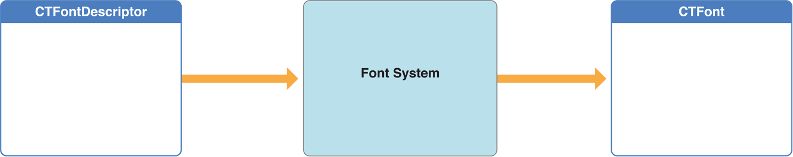

> 导航：[总目录](../../../README.md) · [documentation](../../../_indexes/documentation.md) · [Core Text Programming Guide](About%20Core%20Text.md)

[Next](Common%20Text%20Layout%20Operations.md)[Previous](About%20Core%20Text.md)

# Core Text Overview

Core Text is an advanced, low-level technology for laying out text and handling fonts. Core Text works directly with Core Graphics (CG), also known as Quartz, which is the high-speed graphics rendering engine that handles two-dimensional imaging at the lowest level in OS X and iOS.

Core Text mediates between text layout and font support provided by higher level frameworks and the low-level capabilities Quartz provides to all text and font frameworks. The Quartz framework acts upon glyphs and their positions. Core Text is aware of how characters map to fonts, and it factors in information about styles, font metrics, and other attributes before it calls into Quartz to render text. Quartz is the only way to get glyphs drawn at a fundamental level, and, because Core Text provides all data in a form directly usable by Quartz, the result is high-performance text rendering.

The Core Text API is nearly identical on iOS and OS X, although the OS X version provides a richer set of font management APIs, including mutable font collections. However, there are differences between UIKit and AppKit that you must consider when you port code between the platforms. For example, you must have a Quartz graphic context to render Core Text–generated glyphs, and you get a graphic context differently on each platform. The view you draw into in iOS is a `UIView` subclass in iOS and an `NSView` subclass in OS X. And you should be aware that a `CGRect` object is passed into the `UIView` [drawRect:](https://developer.apple.com/documentation/uikit/uiview/1622529-draw) method, while the OS X version of [drawRect:](https://developer.apple.com/documentation/appkit/nsview/1483686-draw) is passed an `NSRect` object. (You can use the [NSRectToCGRect](https://developer.apple.com/documentation/foundation/1391120-nsrecttocgrect) function in OS X to convert a passed-in `NSRect` object to a `CGRect` object required as a Core Text function parameter.)

The graphic context returned by the `UIView` function [UIGraphicsGetCurrentContext](https://developer.apple.com/documentation/uikit/1623918-uigraphicsgetcurrentcontext) is flipped relative to an unmodified Quartz graphic context (that is, the origin of the context returned by `UIView` is at the top-left corner), so you must re-flip the graphic context in iOS but not in OS X. See [Listing 2-1](Common%20Text%20Layout%20Operations.md#apple-f4xwc4dqnrsv64tfmyxwi33df52wszbpkridimbqga2tkmztfvbuqmjsfvjvooa) for a code example of this technique.

Core Text uses system data types and services wherever possible, and you use the same conventions that pertain to the other core frameworks in both OS X and iOS. For example, Core Text uses Core Foundation objects for many input and output parameters, so you can store them in Core Foundation collection classes. Other objects handled by Core Text such as `CGPath` objects are provided by the Core Graphics framework.

Many of the low level libraries in OS X and iOS are written in plain C for speed and simplicity. When working with Core Text, you use a set of C functions such as [CTFramesetterCreateWithAttributedString](https://developer.apple.com/documentation/coretext/1478568-ctframesettercreatewithattribute) and [CTFramesetterCreateFrame](https://developer.apple.com/documentation/coretext/1478564-ctframesettercreateframe) instead of Objective-C classes and methods.

The Core Text layout engine often works with attributed strings (`CFAttributedStringRef`) and graphics paths (`CGPathRef`). An attributed-string object encapsulates a string backing the displayed text and includes properties (or “attributes”) that define stylistic aspects of the characters in the string—for example, font and color. The typesetting mechanism in Core Text uses the information in the attributed string to perform character-to-glyph conversion.

The graphics path defines the shape of a frame of text. In OS X v10.7 and iOS 3.2 and later, the path can be non-rectangular.

The CFAttributedString reference type, `CFAttributedStringRef`, is toll-free bridged with its Foundation counterpart, `NSAttributedString`. This means that the Core Foundation type is interchangeable in function or method calls with the bridged Foundation object. Therefore, in a method where you see an `NSAttributedString *` parameter, you can pass in a `CFAttributedStringRef`, and in a function where you see a `CFAttributedStringRef` parameter, you can pass in an `NSAttributedString` instance. (You may need to cast one type to the other to suppress compiler warnings.) This also applies to concrete subclasses of `NSAttributedString`.

The attributes are key-value pairs that define style characteristics of the characters in the string, which are grouped in ranges that share the same attributes. The attributes themselves are passed into attributed strings, and retrieved from them, using CFDictionary objects. To apply a style to a glyph run (CTRun object), create a CFDictionary object to hold the attributes you want to apply, then create an attributed string, passing the dictionary as a parameter. Or, you can apply attributes to an already existing CFMutableAttributedString object. Although `CFDictionaryRef` and `NSDictionary` are toll-free bridged, the individual attribute objects stored in the dictionary may not be.

Core Text objects at runtime form a hierarchy, as shown in [Figure 1-1](#apple-f4xwc4dqnrsv64tfmyxwi33df52wszbpkridimbqga2tkmztfvbuqmznknlti). At the top of this hierarchy is the framesetter object (`CTFramesetterRef`). With an attributed string and a graphics path as input, a framesetter generates one or more frames of text (`CTFrameRef`). Each CTFrame object represents a paragraph.

__Figure 1-1__  Architecture of the Core Text layout engine

!

To generate frames, the framesetter calls a typesetter object (`CTTypesetterRef`). As it lays text out in a frame, the framesetter applies paragraph styles to it, including such attributes as alignment, tab stops, line spacing, indentation, and line-breaking mode. The typesetter converts the characters in the attributed string to glyphs and fits those glyphs into the lines that fill a text frame.

Each CTFrame object contains the paragraph’s line (CTLine) objects. Each line object represents a line of text. A CTFrame object may contain just a single long CTLine object or it might contain a set of lines. Line objects are created by the typesetter during a framesetting operation and, like frames, can draw themselves directly into a graphics context.

Each CTLine object contains an array of glyph run (CTRun) objects. A glyph run is a set of consecutive glyphs that share the same attributes and direction. The typesetter creates glyph runs as it produces lines from character strings, attributes, and font objects. This means that a line is constructed of one or more glyphs runs. Glyph runs can draw themselves into a graphic context, if desired, although most clients have no need to interact directly with glyph runs.

Fonts provide assistance in laying out glyphs relative to one another and are used to establish the current font when drawing in a graphics context. The Core Text font opaque type, CTFont, is a specific font instance that encapsulates a lot of information. Its reference type, `CTFontRef`, is toll-free bridged with `UIFont` in iOS and `NSFont` in OS X. When you create a CTFont object, you typically specify (or use a default) point size and transformation matrix, which gives the font instance specific characteristics. You can then query the font object for many kinds of information about the font at that particular point size, such as character-to-glyph mapping, encodings, font metric data, and glyph data, among other things. Font metrics are parameters such as ascent, descent, leading, cap height, x-height, and so on. Glyph data includes parameters such as bounding rectangles and glyph advances.

Core Text font objects are immutable, so they can be used simultaneously by multiple operations, work queues, or threads. There are many ways to create font objects. The preferred method is from a font descriptor using [CTFontCreateWithFontDescriptor](https://developer.apple.com/documentation/coretext/1509056-ctfontcreatewithfontdescriptor). You can also use a number of conversion APIs, depending on what you have to start with. For example, you can use the PostScript name of the typeface ([CTFontCreateWithName](https://developer.apple.com/documentation/coretext/1509153-ctfontcreatewithname)) or a Core Graphics font reference ([CTFontCreateWithGraphicsFont](https://developer.apple.com/documentation/coretext/1508745-ctfontcreatewithgraphicsfont)). There’s also [CTFontCreateUIFontForLanguage](https://developer.apple.com/documentation/coretext/1511312-ctfontcreateuifontforlanguage), which creates a reference for the user-interface font for the application in the localization you’re using.

Core Text font references provide a sophisticated, automatic font-substitution mechanism called font cascading, which picks an appropriate font to substitute for a missing font while taking font traits into account. Font cascading is based on cascade lists, which are arrays of ordered font descriptors. There is a system default cascade list (which is polymorphic, based on the user's language setting and current font) and a font cascade list that is specified at font creation time. Using the information in the font descriptors, the cascading mechanism can match fonts according to style as well as matching characters. The [CTFontCreateForString](https://developer.apple.com/documentation/coretext/1509506-ctfontcreateforstring) function uses cascade lists to pick an appropriate font to encode a given string. To specify and retrieve font cascade lists, use the [kCTFontCascadeListAttribute](https://developer.apple.com/documentation/coretext/kctfontcascadelistattribute) property.

Font descriptors, represented by the CTFontDescriptor opaque type, provide a mechanism for describing a font completely from a dictionary of attributes, and an easy-to-use font-matching facility for building new fonts. You can make a font object from a font descriptor, you can get a descriptor from a font object, and you can change a descriptor and use it to make a new font object. You can partially describe a font by creating a font descriptor with, for example, just a family name or weight, and then can find all the fonts on the system that match the given trait. The `CTFontDescriptorRef` type is toll-free bridged to `UIFontDescriptor` in iOS and `NSFontDescriptor` in OS X.

Instead of dealing with a complex transformation matrix, you can instead create a dictionary of font attributes that include such properties as PostScript name, font family and style, and traits (for example, bold or italic) as a CTFontDescriptor object. You can use the font descriptor to create a CTFont object. Font descriptors can be serialized and stored in a document to provide persistence for fonts. Figure 1-2 illustrates the font system using a font descriptor to create a specific font instance.

__Figure 1-2__  Creating a font from a font descriptor

You can think of font descriptors as queries into the font system. You can create a font descriptor with an incomplete specification, that is, with one or just a few values in the attribute dictionary, and the system will choose the most appropriate font from those available. For example, if you make a query using a descriptor for the name of family with the standard faces (normal, bold, italic, bold italic), not specifying any traits would match all faces in the family, but if you specify a traits dictionary with a `kCTFontTraitsAttribute` of `kCTFontTraitBold`, the results are further narrowed from the whole family to its members satisfying the bold trait. The system can give you a complete list of font descriptors matching your query via [CTFontDescriptorCreateMatchingFontDescriptors](https://developer.apple.com/documentation/coretext/1508794-ctfontdescriptorcreatematchingfo).

In iOS 6.0 and later, apps can download on demand available fonts that are not installed using the `CTFontDescriptorMatchFontDescriptorsWithProgressHandler` function. Fonts downloaded this way are not installed permanently, and the system may remove them under certain circumstances. Fonts available for downloading are listed in as “Additional Information” in [iOS 6: Font list](http://support.apple.com/kb/HT5484) and [iOS 7: Font list](http://support.apple.com/kb/HT5878). _[DownloadFont](../../../samplecode/DownloadFont/DownloadFont.md#apple-f4xwc4dqnrsv64tfmyxwi33df52wszbpirkfgnbqgaytgnbqgq)_ (in the iOS Developer Library) demonstrates the download technique. Downloading fonts on demand is unnecessary in OS X because all available fonts are installed with the system.

Font collections are groups of font descriptors taken as a single object. A font collection is represented by the CTFontCollection opaque type. Font collections provide the capabilities of font enumeration, access to global and custom font collections, and access to the font descriptors comprising the collection. You can, for example, create a font collection of all the fonts available in the system by calling [CTFontCollectionCreateFromAvailableFonts](https://developer.apple.com/documentation/coretext/1509907-ctfontcollectioncreatefromavaila), and you can use the collection to obtain an array of all of the member font descriptors.

[Next](Common%20Text%20Layout%20Operations.md)[Previous](About%20Core%20Text.md)

