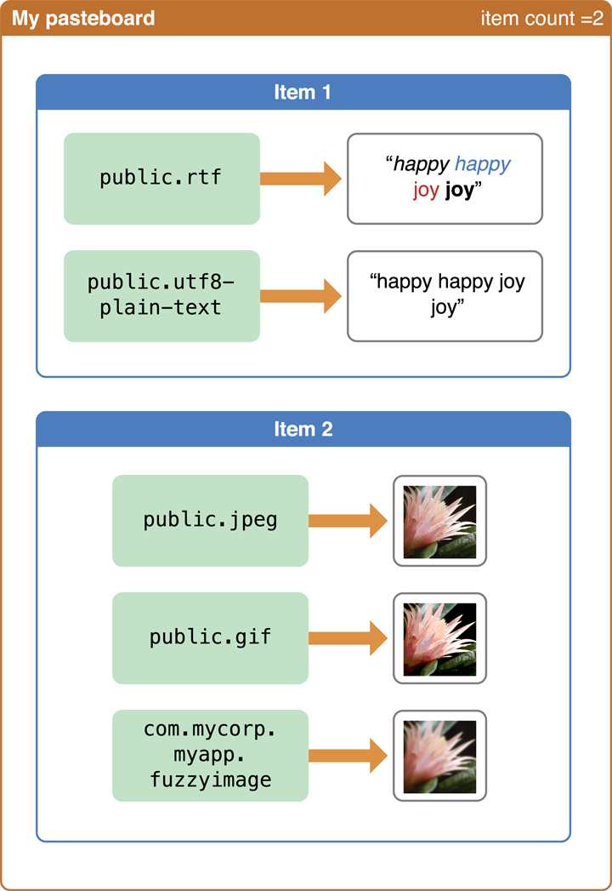

> 导航：[总目录](../../../README.md) · [documentation](../../../_indexes/documentation.md) · [Text Programming Guide for iOS](About%20Text%20Handling%20in%20iOS.md)


[Next](Custom%20Views%20for%20Data%20Input.md)[Previous](https://developer.apple.com/library/archive/documentation/StringsTextFonts/Conceptual/TextAndWebiPhoneOS/KeyboardManagement/KeyboardManagement.html)

# Copy, Cut, and Paste Operations

Users can copy text, images, or other data in one app and paste that data to another location within the same app or in a different app. You can, for example, copy a person’s address in an email message and paste it into the appropriate field in the Contacts app. The UIKit [framework](https://developer.apple.com/library/archive/documentation/General/Conceptual/DevPedia-CocoaCore/Framework.html#//apple_ref/doc/uid/TP40008195-CH56) implements copy-cut-paste in the [UITextView](https://developer.apple.com/documentation/uikit/uitextview), and [UITextField](https://developer.apple.com/documentation/uikit/uitextfield) classes. If you want this behavior in your own apps, you can either use objects of these classes or implement copy-cut-paste yourself.

The following sections describe the programmatic interfaces of the UIKit that you use for copy, cut, and paste operations and explain how they are used.

Several classes and an [informal protocol](https://developer.apple.com/library/archive/documentation/General/Conceptual/DevPedia-CocoaCore/Protocol.html#//apple_ref/doc/uid/TP40008195-CH45) of the UIKit framework give you the methods and mechanisms you need to implement copy, cut, and paste operations in your app:

- The [UIPasteboard](https://developer.apple.com/documentation/uikit/uipasteboard) class provides pasteboards: protected areas for sharing data within an app or between apps. The class offers methods for writing and reading items of data to and from a pasteboard.
- The [UIMenuController](https://developer.apple.com/documentation/uikit/uimenucontroller) class displays an edit menu above or below the selection to be copied, cut, or pasted into. The default commands of the edit menu are (potentially) Copy, Cut, Paste, Select, and Select All. You can also add custom menu items to the edit menu (see [Adding Custom Items to the Edit Menu](Displaying%20and%20Managing%20the%20Edit%20Menu.md#apple-f4xwc4dqnrsv64tfmyxwi33df52wszbpkridimbqga4tknbsfvbuqmjtfvjvomq)).
- The [UIResponder](https://developer.apple.com/documentation/uikit/uiresponder) class declares the method [canPerformAction:withSender:](https://developer.apple.com/documentation/uikit/uiresponder/1621105-canperformaction). Responder classes can implement this method to show and remove commands of the edit menu based on the current context.
- The `UIResponderStandardEditActions` informal protocol declares the interface for handling copy, cut, paste, select, and select-all commands. When users tap one of the commands in the edit menu, the corresponding `UIResponderStandardEditActions` method is invoked.

A pasteboard is a standardized mechanism for exchanging data within apps or between apps. The most familiar use for pasteboards is handling copy, cut, and paste operations:

- When a user selects data in an app and chooses the Copy (or Cut) menu command, the selected data is placed onto a pasteboard.
- When the user chooses the Paste menu command (either in the same or a different app), the data on a pasteboard is copied to the current app from the pasteboard.

In iOS, a pasteboard is also used to support Find operations. Additionally, you may use pasteboards to transfer data between apps using custom URL schemes instead of copy, cut, and paste commands; see Updating Your Info.plist Settings for information about this technique.

Regardless of the operation, the basic tasks you perform with a pasteboard object are to write data to a pasteboard and to read data from a pasteboard. Although these tasks are conceptually simple, they mask a number of important details. The main complexity is that there may be a number of ways to represent data, and this complexity leads to considerations of efficiency. These and other issues are discussed in the following sections.

Pasteboards may be public or private. Public pasteboards are called _system pasteboards_; private pasteboards are created by apps, and hence are called _app pasteboards_. Pasteboards must have unique names. `UIPasteboard` defines two system pasteboards, each with its own name and purpose:

- `UIPasteboardNameGeneral` is for cut, copy, and paste operations involving a wide range of data types. You can obtain a [singleton](https://developer.apple.com/library/archive/documentation/General/Conceptual/DevPedia-CocoaCore/Singleton.html#//apple_ref/doc/uid/TP40008195-CH49) object representing the General pasteboard by invoking the [generalPasteboard](https://developer.apple.com/documentation/uikit/uipasteboard/1622106-generalpasteboard) class method.
- `UIPasteboardNameFind` is for search operations. The string currently typed by the user in the search bar ([UISearchBar](https://developer.apple.com/documentation/uikit/uisearchbar)) is written to this pasteboard, and thus can be shared between apps. You can obtain an object representing the Find pasteboard by calling the [pasteboardWithName:create:](https://developer.apple.com/documentation/uikit/uipasteboard/1622074-pasteboardwithname) [class method](https://developer.apple.com/library/archive/documentation/General/Conceptual/DevPedia-CocoaCore/ClassMethod.html#//apple_ref/doc/uid/TP40008195-CH8), passing in `UIPasteboardNameFind` for the name.

Typically you use one of the system-defined pasteboards, but if necessary you can create your own app pasteboard using [pasteboardWithName:create:](https://developer.apple.com/documentation/uikit/uipasteboard/1622074-pasteboardwithname) If you invoke [pasteboardWithUniqueName](https://developer.apple.com/documentation/uikit/uipasteboard/1622087-withuniquename), `UIPasteboard` gives you a uniquely-named app pasteboard. You can discover the name of a pasteboard through its [name](https://developer.apple.com/documentation/uikit/uipasteboard/1622083-name) [property](https://developer.apple.com/library/archive/documentation/General/Conceptual/DevPedia-CocoaCore/DeclaredProperty.html#//apple_ref/doc/uid/TP40008195-CH13).

Pasteboards can be persistent. When a pasteboard is persistent, it continues to exist past app terminations and across system reboots. System pasteboards are persistent. Although app pasteboards by default are not persistent, an app can mark them as persistent by setting the [persistent](https://developer.apple.com/documentation/uikit/uipasteboard/1622096-setpersistent) property to `YES`. App pasteboards that are not persistent only last until the owning (creating) app quits. A persistent app pasteboard is removed when the app that created it is uninstalled.

The object that last put data onto the pasteboard is referred to as the pasteboard _owner_. Each piece of data placed onto a pasteboard is considered a pasteboard _item_. The pasteboard can hold single or multiple items. Apps can place or retrieve as many items as they wish. For example, say a user selection in a view contains both text and an image. The pasteboard lets you copy the text and the image to the pasteboard as separate items. An app reading multiple items from a pasteboard can choose to take only those items that it supports (the text, but not the image, for example).

Pasteboard operations are often carried out between two different apps. Neither app is required to know about the other, including the kinds of data it can handle. To maximize the potential for sharing, a pasteboard can hold multiple _representations_ of the same pasteboard item. For example, a rich text editor might provide HTML, PDF, and plain-text representations of the copied data. An item on a pasteboard includes all representations of that data item that the app can provide.

Each representation of a pasteboard item is typically identified by a Unique Type Identifier (UTI). (A UTI is simply a string that uniquely identifies a particular data type.) The UTI provides a common means to identify data types. If you have a custom data type you wish to support, you must create a unique identifier for it. For this, you could use reverse-DNS notation for your representation-type string to ensure uniqueness; for example, a custom representation type could be `com.myCompany.myApp.myType`. For more information on UTIs, see _[Uniform Type Identifiers Overview](../../File%20Management/Uniform%20Type%20Identifiers%20Overview/Introduction%20to%20Uniform%20Type%20Identifiers%20Overview.md#apple-f4xwc4dqnrsv64tfmyxwi33df52wszbpkridimbqgaytgmjz)_.

For example, suppose an app supported selection of rich text and images. It may want to place on a pasteboard both rich text and Unicode versions of a text selection and different representations of an image selection. Each representation of each item is stored with its own data, as shown in Figure 5-1.

__Figure 5-1__  Pasteboard items and representations



In general, to maximize the potential for sharing, pasteboard items should include as many different representations as possible.

A pasteboard reader must find the data type that best suits its capabilities (if any). Typically, this means selecting the richest type available. For example, a text editor might provide HTML (rich text) and plain-text representations of copied text data. An app that supports rich text should retrieve the HTML representation and an app that only supports plain text should retrieve the plain-text version.

The change count is a per-pasteboard variable that increments every time the contents of the pasteboard changes—specifically, when items are added, modified, or removed. By examining the change count (through the [changeCount](https://developer.apple.com/documentation/uikit/uipasteboard/1622103-changecount) property), an app can determine whether the current data in the pasteboard is the same as the data it last received. Every time the change count is incremented, the pasteboard sends a notification to interested observers.

If you are going to copy, cut, or paste something, you first must select it. (A paste operation often operates on an empty selection such a caret, indicating a position within a collection of items.) After selecting an item—and visually indicating the selection—you should display the edit menu. The edit menu is a system menu that can potentially have the following commands in it: Copy, Cut, Paste, Select, and Select All. The edit menu points at the selection. When the user taps a menu item, the appropriate `UIResponderStandardEditActions` method implementation (such as `cut:` or `paste:`) is invoked.

For more about selections and to learn how to display and manage the edit menu, see [Managing the Selection and the Edit Menu](Displaying%20and%20Managing%20the%20Edit%20Menu.md#apple-f4xwc4dqnrsv64tfmyxwi33df52wszbpkridimbqga4tknbsfvbuqmjtfvjvomy).

When users tap the Copy or Cut command of the edit menu, the system invokes the `copy:` or `cut:` method (respectively) of the responder object that implements it. Usually the first responder—your custom view—implements these methods, but if the first responder doesn’t implement them, the message travels up the responder chain in the usual fashion. Note that the `UIResponderStandardEditActions` [informal protocol](https://developer.apple.com/library/archive/documentation/General/Conceptual/DevPedia-CocoaCore/Protocol.html#//apple_ref/doc/uid/TP40008195-CH45) declares these methods.

In response to a `copy:` or `cut:` message, you write the object or data represented by the selection to the pasteboard in as many different representations as you can. This operation involves the following steps (which assume a single pasteboard item):

1. From the selection, identify or obtain the object or the binary data corresponding to the object.

   Binary data must be encapsulated in an [NSData](https://developer.apple.com/library/archive/documentation/LegacyTechnologies/WebObjects/WebObjects_3.5/Reference/Frameworks/ObjC/Foundation/Classes/NSDataClassCluster/Description.html#//apple_ref/occ/cl/NSData) [object](https://developer.apple.com/library/archive/documentation/General/Conceptual/DevPedia-CocoaCore/ValueObject.html#//apple_ref/doc/uid/TP40008195-CH51). If you’re going to write another type of object to the pasteboard, it must be a [property-list object](https://developer.apple.com/library/archive/documentation/General/Conceptual/DevPedia-CocoaCore/PropertyList.html#//apple_ref/doc/uid/TP40008195-CH44)—that is, an object of one of the following classes: [NSString](https://developer.apple.com/library/archive/documentation/LegacyTechnologies/WebObjects/WebObjects_3.5/Reference/Frameworks/ObjC/Foundation/Classes/NSStringClassCluster/Description.html#//apple_ref/occ/cl/NSString), [NSArray](https://developer.apple.com/library/archive/documentation/LegacyTechnologies/WebObjects/WebObjects_3.5/Reference/Frameworks/ObjC/Foundation/Classes/NSArrayClassCluster/Description.html#//apple_ref/occ/cl/NSArray), [NSDictionary](https://developer.apple.com/library/archive/documentation/LegacyTechnologies/WebObjects/WebObjects_3.5/Reference/Frameworks/ObjC/Foundation/Classes/NSDictionaryClassClstr/Description.html#//apple_ref/occ/cl/NSDictionary), [NSDate](https://developer.apple.com/library/archive/documentation/LegacyTechnologies/WebObjects/WebObjects_3.5/Reference/Frameworks/ObjC/Foundation/Classes/NSDateClassCluster/Description.html#//apple_ref/occ/cl/NSDate), [NSNumber](https://developer.apple.com/library/archive/documentation/LegacyTechnologies/WebObjects/WebObjects_3.5/Reference/Frameworks/ObjC/Foundation/Classes/NSNumber/Description.html#//apple_ref/occ/cl/NSNumber), or [NSURL](https://developer.apple.com/documentation/foundation/nsurl). (For more on property-list objects, see _[Property List Programming Guide](../../Cocoa/Property%20List%20Programming%20Guide/Introduction%20to%20Property%20Lists.md#apple-f4xwc4dqnrsv64tfmyxwi33df52wszbpgeydambqga2dq2i)_.)
2. If possible, generate one or more other representations of the object or data.

   For example, if in the previous step you created a [UIImage](https://developer.apple.com/documentation/uikit/uiimage) object representing a selected image, you could use the [UIImageJPEGRepresentation](https://developer.apple.com/documentation/uikit/1624115-uiimagejpegrepresentation) and [UIImagePNGRepresentation](https://developer.apple.com/documentation/uikit/1624096-uiimagepngrepresentation) functions to convert the image to a different representation.
3. Obtain a pasteboard object.

   In many cases, this is the general pasteboard, which you can get through the [generalPasteboard](https://developer.apple.com/documentation/uikit/uipasteboard/1622106-generalpasteboard) [class method](https://developer.apple.com/library/archive/documentation/General/Conceptual/DevPedia-CocoaCore/ClassMethod.html#//apple_ref/doc/uid/TP40008195-CH8).
4. Assign a suitable UTI for each representation of data written to the pasteboard item.

   See [Pasteboard Concepts](#apple-f4xwc4dqnrsv64tfmyxwi33df52wszbpkridimbqga4tknbsfvbuqmjrfvjvomrr) for a discussion of this subject.
5. Write the data to the first pasteboard item for each representation type:

   - To write a data object, send a [setData:forPasteboardType:](https://developer.apple.com/documentation/uikit/uipasteboard/1622075-setdata) message to the pasteboard object.
   - To write a property-list object, send a [setValue:forPasteboardType:](https://developer.apple.com/documentation/uikit/uipasteboard/1622079-setvalue) message to the pasteboard object.
6. If the command is Cut (`cut:` method), remove the object represented by the selection from the app’s [data model](https://developer.apple.com/library/archive/documentation/General/Conceptual/DevPedia-CocoaCore/ModelObject.html#//apple_ref/doc/uid/TP40008195-CH31) and update your view.

Listing 5-1 shows implementations of the `copy:` and `cut:` methods. The `cut:` method invokes the `copy:` method and then removes the selected object from the view and the data model. Note that the `copy:` method archives a [custom object](https://developer.apple.com/library/archive/documentation/General/Conceptual/DevPedia-CocoaCore/ClassDefinition.html#//apple_ref/doc/uid/TP40008195-CH6) to obtain an `NSData` object that it can pass to the pasteboard in `setData:forPasteboardType:`.

__Listing 5-1__  Copying and cutting operations

```objc
- (void)copy:(id)sender {
    UIPasteboard *gpBoard = [UIPasteboard generalPasteboard];
    ColorTile *theTile = [self colorTileForOrigin:currentSelection];
    if (theTile) {
        NSData *tileData = [NSKeyedArchiver archivedDataWithRootObject:theTile];
        if (tileData)
            [gpBoard setData:tileData forPasteboardType:ColorTileUTI];
    }
}

- (void)cut:(id)sender {
    [self copy:sender];
    ColorTile *theTile = [self colorTileForOrigin:currentSelection];

    if (theTile) {
        CGPoint tilePoint = theTile.tileOrigin;
        [tiles removeObject:theTile];
        CGRect tileRect = [self rectFromOrigin:tilePoint inset:TILE_INSET];
        [self setNeedsDisplayInRect:tileRect];
     }
}
```


When users tap the Paste command of the edit menu, the system invokes the `paste:` method of the responder object that implements it. Usually the first responder—your custom view—implements this method, but if the first responder doesn’t implement it, the message travel up the responder in the usual fashion. The `paste:` method is declared by the `UIResponderStandardEditActions` [informal protocol](https://developer.apple.com/library/archive/documentation/General/Conceptual/DevPedia-CocoaCore/Protocol.html#//apple_ref/doc/uid/TP40008195-CH45).

In response to a `paste:` message, you read an object from the pasteboard in a representation that your app supports. Then you add the pasted object to the app’s [data model](https://developer.apple.com/library/archive/documentation/General/Conceptual/DevPedia-CocoaCore/ModelObject.html#//apple_ref/doc/uid/TP40008195-CH31) and display the new object in the view in the user-indicated location. This operation involves the following steps (which assume a single pasteboard item):

1. Obtain a pasteboard object.

   In many cases, this is the general pasteboard, which you can get through the [generalPasteboard](https://developer.apple.com/documentation/uikit/uipasteboard/1622106-generalpasteboard) [class method](https://developer.apple.com/library/archive/documentation/General/Conceptual/DevPedia-CocoaCore/ClassMethod.html#//apple_ref/doc/uid/TP40008195-CH8).
2. Verify that the first pasteboard item contains data in a representation that your app can handle by calling the [containsPasteboardTypes:](https://developer.apple.com/documentation/uikit/uipasteboard/1622070-containspasteboardtypes) method or the [pasteboardTypes](https://developer.apple.com/documentation/uikit/uipasteboard/1622077-types) method and then examining the returned array of types.

   Note that you should have already performed this step in your implementation of [canPerformAction:withSender:](https://developer.apple.com/documentation/uikit/uiresponder/1621105-canperformaction).
3. If the first item of the pasteboard contains data that the app can handle, call one of the following methods to read it:

   - [dataForPasteboardType:](https://developer.apple.com/documentation/uikit/uipasteboard/1622093-data) if the data to be read is encapsulated in an [NSData](https://developer.apple.com/library/archive/documentation/LegacyTechnologies/WebObjects/WebObjects_3.5/Reference/Frameworks/ObjC/Foundation/Classes/NSDataClassCluster/Description.html#//apple_ref/occ/cl/NSData) [object](https://developer.apple.com/library/archive/documentation/General/Conceptual/DevPedia-CocoaCore/ValueObject.html#//apple_ref/doc/uid/TP40008195-CH51).
   - [valueForPasteboardType:](https://developer.apple.com/documentation/uikit/uipasteboard/1622099-valueforpasteboardtype) if the data to be read is encapsulated in a [property-list object](https://developer.apple.com/library/archive/documentation/General/Conceptual/DevPedia-CocoaCore/PropertyList.html#//apple_ref/doc/uid/TP40008195-CH44) (see [Copying and Cutting the Selection](#apple-f4xwc4dqnrsv64tfmyxwi33df52wszbpkridimbqga4tknbsfvbuqmjrfvjvomrs)).
4. Add the object to the app’s data model.
5. Display a representation of the object in the user interface at the location specified by the user.

Listing 5-2 is an example of an implementation of the `paste:` method. It does the reverse of the combined `cut:` and `copy:` methods. The custom view first sees whether the general pasteboard holds its custom representation of data; if it does, it then reads the data from the pasteboard, adds it to the app’s data model, and marks part of itself—the current selection—for redrawing.

__Listing 5-2__  Pasting data to a selection

```objc
- (void)paste:(id)sender {
    UIPasteboard *gpBoard = [UIPasteboard generalPasteboard];
    NSArray *pbType = [NSArray arrayWithObject:ColorTileUTI];
    ColorTile *theTile = [self colorTileForOrigin:currentSelection];
    if (theTile == nil && [gpBoard containsPasteboardTypes:pbType]) {
        NSData *tileData = [gpBoard dataForPasteboardType:ColorTileUTI];
        ColorTile *theTile = (ColorTile *)[NSKeyedUnarchiver unarchiveObjectWithData:tileData];
        if (theTile) {
            theTile.tileOrigin = self.currentSelection;
            [tiles addObject:theTile];
            CGRect tileRect = [self rectFromOrigin:currentSelection inset:TILE_INSET];
            [self setNeedsDisplayInRect:tileRect];
        }
    }
}
```


When your implementation of the `cut:`, `copy:` or `paste:` command returns, the edit menu is automatically hidden. You can programmatically keep it visible if you want. For more information, see [Dismissing the Edit Menu](Displaying%20and%20Managing%20the%20Edit%20Menu.md#apple-f4xwc4dqnrsv64tfmyxwi33df52wszbpkridimbqga4tknbsfvbuqmjtfvjvomjq)

[Next](Custom%20Views%20for%20Data%20Input.md)[Previous](https://developer.apple.com/library/archive/documentation/StringsTextFonts/Conceptual/TextAndWebiPhoneOS/KeyboardManagement/KeyboardManagement.html)

