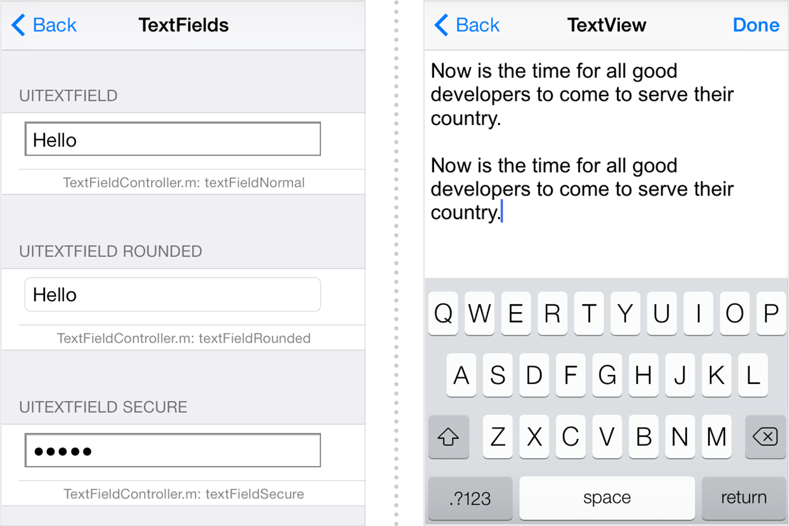

> 导航：[总目录](../../../README.md) · [documentation](../../../_indexes/documentation.md) · [Text Programming Guide for iOS](About%20Text%20Handling%20in%20iOS.md)

[Next](Typographical%20Concepts.md)[Previous](About%20Text%20Handling%20in%20iOS.md)

# Displaying Text Content in iOS

The text system in iOS provides a tremendous amount of power while still being very simple to use. The UIKit [framework](https://developer.apple.com/library/archive/documentation/General/Conceptual/DevPedia-CocoaCore/Framework.html#//apple_ref/doc/uid/TP40008195-CH56) includes several high-level classes for managing the display and input of text. UIKit also includes a class for displaying HTML, CSS, and JavaScript-based web content.

Text objects display styled, formatted text in a range of fonts, styles, and sizes. The UIKit framework provides three primary classes for displaying this text content in an app’s user interface:

- [UILabel](https://developer.apple.com/documentation/uikit/uilabel) defines a __label__, which displays a static text string.
- [UITextField](https://developer.apple.com/documentation/uikit/uitextfield) defines a __text field__, which displays a single line of editable text.
- [UITextView](https://developer.apple.com/documentation/uikit/uitextview) defines a __text view__, which displays multiple lines of editable text.

Although these classes actually can support the display of arbitrary amounts of text, labels and text fields are intended to be used for relatively small amounts of text, typically a single line. Text views, on the other hand, are meant to display large amounts of text.

Text view objects, created from the `UITextView` class, display text formatted into paragraphs, columns, and pages, with all the characteristics of fine typesetting, such as kerning, ligatures, sophisticated line-breaking, and justification. These typographic services are supplied to `UITextView` through an underlying technology called Text Kit, a powerful layout engine that is both easy to use and extensible. See [Using Text Kit to Draw and Manage Text](Using%20Text%20Kit%20to%20Draw%20and%20Manage%20Text.md#apple-f4xwc4dqnrsv64tfmyxwi33df52wszbpkridimbqga4tknbsfvbuqnbnknltc) for more information about Text Kit.

Figure 1-1 shows examples of the primary text objects as they appear on screen. The image on the left shows several different styles of text fields while the image on the right shows a single text view. The callouts displayed on the background are `UILabel` objects embedded inside the table cells used to display the different views. (These examples were taken from the _[UIKit Catalog (iOS): Creating and Customizing UIKit Controls](https://developer.apple.com/library/archive/samplecode/UICatalog/Introduction/Intro.html#//apple_ref/doc/uid/DTS40007710)_ sample app, which demonstrates many of the views and controls available in UIKit.)

__Figure 1-1__  Text classes in the UICatalog app

When working with editable text fields and text views, you should always provide a [delegate](https://developer.apple.com/library/archive/documentation/General/Conceptual/DevPedia-CocoaCore/Delegation.html#//apple_ref/doc/uid/TP40008195-CH14) object to manage the editing session. Text views send several different [notifications](https://developer.apple.com/library/archive/documentation/General/Conceptual/DevPedia-CocoaCore/Notification.html#//apple_ref/doc/uid/TP40008195-CH35) to the delegate to let them know when editing begins, when it ends, and to give them a chance to override some editing actions. For example, the delegate can decide if the current text contains a valid value and prevent the editing session from ending if it does not. When editing does finally end, you also use the delegate to get the resulting text value and update your app’s data model.

Because there are slight differences in their intended usage, the delegate methods for each text view are slightly different. A delegate that supports the `UITextField` class implements the methods of the [UITextFieldDelegate](https://developer.apple.com/documentation/uikit/uitextfielddelegate) [protocol](https://developer.apple.com/library/archive/documentation/General/Conceptual/DevPedia-CocoaCore/Protocol.html#//apple_ref/doc/uid/TP40008195-CH45). Similarly, a delegate that supports the `UITextView` class implements the methods of the [UITextViewDelegate](https://developer.apple.com/documentation/uikit/uitextviewdelegate) protocol. In both cases, you are not required to implement any of the protocol methods, but if you do not, the text field or view is not as useful.

[Managing Text Fields and Text Views](Managing%20Text%20Fields%20and%20Text%20Views.md#apple-f4xwc4dqnrsv64tfmyxwi33df52wszbpkridimbqga4tknbsfvbuqmjqfvjvomi) describes the sequence of delegation messages for both text fields and text views and discusses various tasks performed by the delegates of these objects. For more information about the methods of the `UITextFieldDelegate` and `UITextViewDelegate` protocols, see _[UITextFieldDelegate Protocol Reference](https://developer.apple.com/documentation/uikit/uitextfielddelegate)_ and _[UITextViewDelegate Protocol Reference](https://developer.apple.com/documentation/uikit/uitextviewdelegate)_.

A web view object displays web-based content. It is an instance of the [WKWebView](https://developer.apple.com/documentation/webkit/wkwebview) class that enables you to integrate what is essentially a miniature web browser into your app’s user interface. The [WKWebView](https://developer.apple.com/documentation/webkit/wkwebview) class makes full use of the same web technologies used to implement Safari in iOS, including full support for HTML, CSS, and JavaScript content. The class also supports many of the built-in gestures that users are familiar with in Safari. For example, you can double-click and pinch to zoom in and out of the page and you can scroll around the page by dragging your finger.

In addition to displaying content, you can also use a web view object to gather input from the user through the use of web forms. Like the other text classes in UIKit, if you have an editable text field on a form in your web page, tapping that field brings up a keyboard so that the user can enter text. Because it is an integral part of the web experience, the web view itself manages the displaying and dismissing of the keyboard for you.

A web view provides information about when pages are loaded, and whether there were any load errors, through its associated [delegate](https://developer.apple.com/library/archive/documentation/General/Conceptual/DevPedia-CocoaCore/Delegation.html#//apple_ref/doc/uid/TP40008195-CH14) object. A web delegate is an object that implements one or more methods of the [WKUIDelegate](https://developer.apple.com/documentation/webkit/wkuidelegate) or [WKNavigationDelegate](https://developer.apple.com/documentation/webkit/wknavigationdelegate) [protocols](https://developer.apple.com/library/archive/documentation/General/Conceptual/DevPedia-CocoaCore/Protocol.html#//apple_ref/doc/uid/TP40008195-CH45). Your implementations of the delegate methods can respond to failures or perform other tasks related to the loading of a web page.

[Next](Typographical%20Concepts.md)[Previous](About%20Text%20Handling%20in%20iOS.md)

