> 导航：[总目录](../../../README.md) · [documentation](../../../_indexes/documentation.md) · [iSync Plug-in Maker User Guide](Introduction%20to%20iSync%20Plug-in%20Maker%20User%20Guide.md)

[Next](Testing%20Plug-ins.md)[Previous](Overview%20of%20Creating%20Plug-ins.md)

# Editing Plug-ins

This chapter describes how to edit and configure a plug-in.

First create a new document by launching iSync Plug-in Maker; an Untitled document window appears as show in Figure 2-1. If iSync Plug-in Maker is already running, choose New from the File menu. The File menu contains the typical menu items used to manipulate a document. For example, choose File > Save to save an iSync Plug-in Maker document.

By default the edit mode is selected. If not, click the Edit button on the toolbar to begin modifying the plug-in. You can return to the edit mode at any time during the process of developing a plug-in. For example, return to this mode after discovering bugs while testing.

Edit a plug-in by first selecting a category from the Settings outline view that appears on the left. The pane on the right displays the settings for the selected category. Fill in the form on the right to configure the group of settings. The following sections describe these settings in detail.

__Figure 2-1__  Edit mode

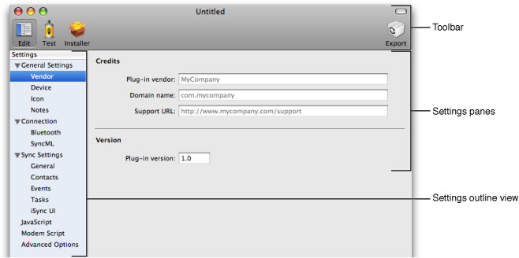

The settings in this category apply to all types of devices.

The Vendor pane contains settings pertaining to vendor information and versioning, as shown in Figure 2-2. The tables following the figure describe the Vendor settings and contain examples.

__Figure 2-2__  Vendor pane

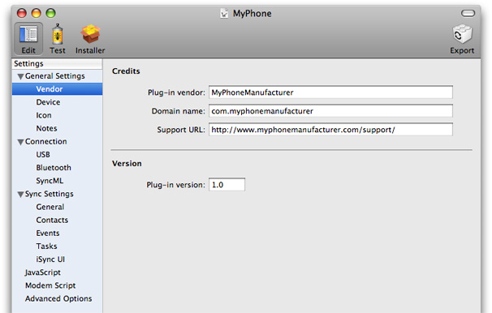

__Table 2-1__  Vendor > Credits settings

| Property | Discussion |
| Plug-in vendor | A human-readable name of the company that created this plug-in. |
| Domain name | A reverse-DNS style identifier for the company that created this plug-in—for example, `com.apple`. |
| Support URL | A URL for the company's support page—for example, `http://support.apple.com`. |

__Table 2-2__  Vendor > Version settings

| Property | Discussion |
| Plug-in version | Specifies the plug-in release version number. For example, this version number may appear in the Get Info window in the Finder. |

The Device pane contains settings that are specific to the device, as shown in Figure 2-3.

Connect a USB device to your computer or turn on a Bluetooth device and click the Get Device Info button at the bottom of this pane to automatically fill in some fields with information stored on the device. If you select a Bluetooth device that is not paired, iSync Plug-in Maker pairs the device to access the information. You may be prompted to enter a passkey on the phone and the computer to complete the paring process.

Typically, the GMM string in the AT Identification pane identifies the model and the GMI string identifies the manufacturer, but the device can return any string for these values. For example, the GMI string on Motorola phones might be “Motorola CE, Copyright 2000.“

The tables following the figure describe the Device settings.

__Figure 2-3__  Device pane

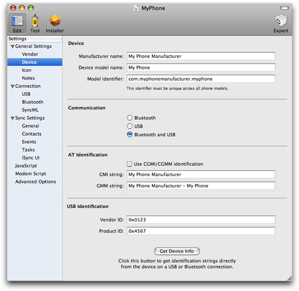

__Table 2-3__  Device > Device settings

| Property | Discussion |
| Manufacturer name | A human-readable name of the manufacturer of this device or class of devices. |
| Device model name | A human-readable name describing the model or models supported by this plug-in. |
| Model identifier | A reverse-DNS style identifier used by the device manufacturer. Typically, the model identifier is more precise than the manufacturer name and device model name—it may provide details such as a firmware revision. The string should contain the device manufacturer name, model name, and optionally other information following this format: `com.<device manufacturer>.<device model>.<revision number>`. |

__Table 2-4__  Device > Communication settings

| Property | Discussion |
| Communication | Specifies how the device communicates to the computer:   - Bluetooth  Device supports syncing over Bluetooth only. - USB  Device supports syncing over USB only. - Bluetooth and USB  Device supports syncing over both Bluetooth and USB. |

__Table 2-5__  Device > AT Identification settings

| Property | Discussion |
| Use CGMI/CGMM identification | Identify the device using CGMI and CGMM strings instead of GMI and GMM strings. |
| GMI string | Identifies the device's manufacturer. iSync chooses this plug-in if the GMI and GMM strings match the values returned by the device. |
| GMM string | Identifies the device's model. iSync chooses this plug-in if the GMI and GMM strings match the values returned by the device.  You can optionally specify multiple GMM strings using this format:   - [[`[[first_string][second_string][third_string]]`   For example, a Samsung-X820 plug-in may set this to `[[SGH-X820][SGH-X820E]]`. |

__Table 2-6__  Device > USB Identification settings

| Property | Discussion |
| Vendor ID | The USB device vendor identifier. Used to identify the device before sending GMI/GMM AT commands to get the specific model.  You can optionally specify multiple vendor identifiers using this format:   - [[`[[first_vendor][second_vendor][third_vendor]]` |
| Product ID | The USB device product identifier. Used to identify the device before sending GMI/GMM AT commands to get the specific model.  You can optionally specify multiple product identifiers using this format:   - [[`[[first_product][second_product][third_product]]`   For example, you may set this to `[[0x1234][0x2345][0x3456]]`. |

The Icon pane allows you to set icons that represent the device in the iSync user interface, as shown in Figure 2-4. Drop the image files with the corresponding resolution on the image views shown in Figure 2-4 to replace the generic device representations. Your icons should have transparent backgroundd and to support HiDPI screens, be available in all the resolutions that appear on this pane.

__Figure 2-4__  Icon pane

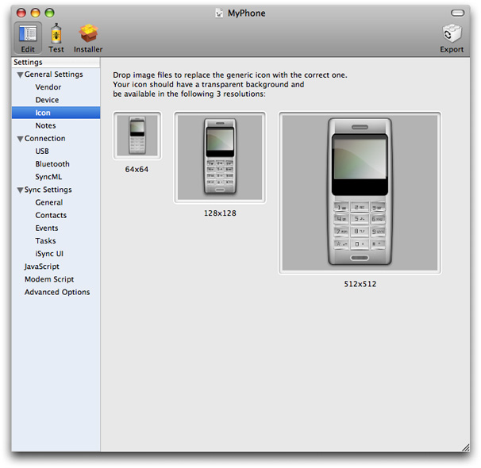

__Table 2-7__  Icon settings

| Property | Discussion |
| 64x64 | A 64x64 pixel wide icon used to represent the device in iSync. Change the icon by double-clicking the icon or dragging an image from a Finder window or the desktop to this box.  The icon should have a transparent background and will be resized (if larger or smaller) to 64x64.  This property is mandatory. |
| 128x128 | A 128x128 pixel wide icon used to represent the device in iSync. Change the icon by double-clicking the icon or dragging an image from a Finder window or the desktop to this box.  The icon should have a transparent background and will be resized (if larger or smaller) to 128x128 pixels.  This property is mandatory. |
| 512x512 | A 512x512 pixel wide icon used to represent the device in iSync. Change the icon by double-clicking the icon or dragging an image from a Finder window or the desktop to this box.  The icon should have a transparent background and will be resized (if larger or smaller) to 512x512 pixels.  This property is mandatory. |

The Notes pane provides a text box for you to insert notes about the plug-in, as shown in Figure 2-5. These notes are visible only in iSync Plug-in Maker—they are not included when exporting the plug-in.

__Figure 2-5__  Notes pane

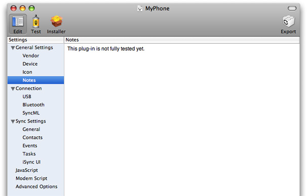

The USB and Bluetooth options in this section are appear if you specify that the device supports them in the Device pane.

The USB pane covers USB-specific connection settings, as shown in Figure 2-6. The tables following the figure describe the USB settings and discuss options.

__Figure 2-6__  USB pane

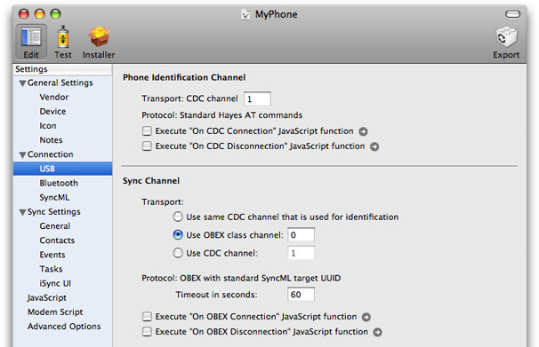

__Table 2-8__  USB > Phone Identification Channel settings

| Property | Discussion |
| Transport: CDC channel | Specifies the CDC channel used by USB messages. |
| Protocol | Specifies that the protocol used to identify the device is "Standard Hayes AT commands." |
| Execute "On CDC Connection" JavaScript function | Specifies a JavaScript function to execute before sending AT commands to the device. Typically, you use a connection function if the device needs to be sent specific AT commands before sending the AT identification commands (`AT+GMI/AT+GMM`).  Click the arrow to edit the function. See [JavaScript](#apple-f4xwc4dqnrsv64tfmyxwi33df52wszbpkridimbqgaztsmrrfvbuqmznknlte) for details. |
| Execute "On CDC Disconnection" JavaScript function | Specifies a JavaScript function to execute after sending AT commands to the device. You can use a disconnection function if you need to return a device to its original state.  Click the arrow to edit the function. See [JavaScript](#apple-f4xwc4dqnrsv64tfmyxwi33df52wszbpkridimbqgaztsmrrfvbuqmznknlte) for details. |

__Table 2-9__  USB > Sync Channel settings

| Property | Discussion |
| Transport | Specifies the channel used to sync over USB. Options are:   - Use the same CDC channel that is used for identification - Use specified OBEX class channel - Use specified CDC channel |
| Protocol | Specifies that the protocol used for syncing over USB is "OBEX with standard SyncML target UUID." |
| Timeout in seconds | Specifies the time in seconds that iSync waits between sending a message to the device and receiving a response. If the timeout expires, iSync aborts all operations and displays an error to the user. |
| Execute "On OBEX Connection" JavaScript function | Specifies a JavaScript function to execute before sending an OBEX connect command to the device. Typically, you use a connection function if you need to enable SyncML communication with a device.  Click the arrow to edit the function. See [JavaScript](#apple-f4xwc4dqnrsv64tfmyxwi33df52wszbpkridimbqgaztsmrrfvbuqmznknlte) for details. |
| Execute "On OBEX Disconnection" JavaScript function | Specifies a JavaScript function to execute after sending an OBEX disconnect command to the device. You can use a disconnection function if you need to return a device to its original state.  Click the arrow to edit the script. See [JavaScript](#apple-f4xwc4dqnrsv64tfmyxwi33df52wszbpkridimbqgaztsmrrfvbuqmznknlte) for details. |

The Bluetooth pane covers Bluetooth-specific connection settings, as shown in Figure 2-7. The tables following the figure describe the Bluetooth settings and discuss options.

__Figure 2-7__  Bluetooth pane

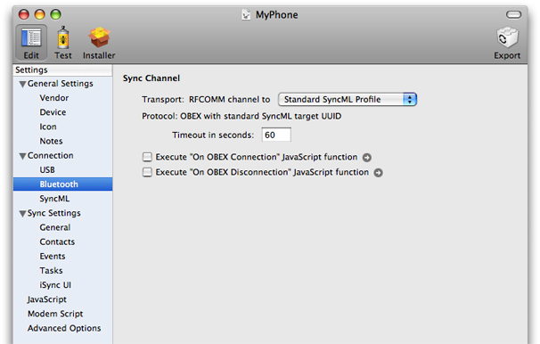

__Table 2-10__  Bluetooth > Sync Channel settings

| Property | Discussion |
| Transport | Specifies the RFCOMM channel used by Bluetooth messages. The options are:   - Standard SyncML Profile - Serial Profile |
| Protocol | Specifies that the protocol used for syncing over Bluetooth is "OBEX with standard SyncML target UUID." |
| Timeout in seconds | Specifies the time in seconds that iSync waits between sending a message to the device and receiving a response. If the timeout expires, iSync aborts all operations and displays an error to the user. |
| Execute "On OBEX Connection" JavaScript function | Specifies a JavaScript function to execute before sending an OBEX connect command to the device. Typically, you use a connection function if you need to enable SyncML communication with a device.  Click the arrow to edit the function. See [JavaScript](#apple-f4xwc4dqnrsv64tfmyxwi33df52wszbpkridimbqgaztsmrrfvbuqmznknlte) for details. |
| Execute "On OBEX Disconnection" JavaScript function | Specifies JavaScript function to execute after sending an OBEX disconnect command to the device. You can use a disconnection function if you need to return a device to its original state.  Click the arrow to edit the function. See [JavaScript](#apple-f4xwc4dqnrsv64tfmyxwi33df52wszbpkridimbqgaztsmrrfvbuqmznknlte) for details. |

This pane covers SyncML-specific settings, as shown in Figure 2-8. The tables following the figure describe the SyncML settings and discuss options.

__Figure 2-8__  SyncML pane

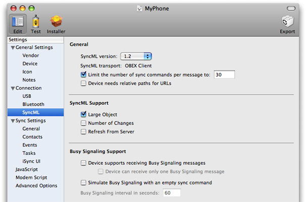

__Table 2-11__  SyncML > General settings

| Property | Discussion |
| SyncML version | Specifies the version of SyncML supported by the device. See _iSync SyncML Reference_ for details on SyncML support. |
| SyncML transport | Specifies that the SyncML transport mechanism is "OBEX Client." |
| Limit the number of sync commands per message to | Specifies the maximum number of commands allowed per SyncML message. |
| Device needs relative paths for URLs | The device requires relative rather than absolute URL paths. |

__Table 2-12__  SyncML > SyncML Support settings

| Property | Discussion |
| Large Object | Device supports the ability to send and receive objects that exceed the size limit of a single message by splitting the object into several messages. For example, a contact with a picture might exceed the size limit of a single message. |
| Number of Changes | Device tells iSync the total number of changes it has before syncing. This allows iSync to display a more accurate progress indicator—for example, displays a message that “x of y changes” are received. The information is also sent to the device. |
| Refresh From Server | If the device supports a Refresh From Server sync, then iSync resets as follows:   - The device removes all its records. - iSync sends all its records to the device.   During this sync mode, the device only pulls records—it does not send any changes to iSync.  If the device does not support refresh sync, then iSync resets as follows:   - iSync negotiates a slow sync with the device. - The device sends all its records to iSync. - iSync sends deletions for each record it receives. - iSync sends additions for all its records.   The reset takes much longer when the device does not support refresh sync. |

__Table 2-13__  SyncML > Busy Signaling Support settings

| Property | Discussion |
| Device supports receiving Busy Signaling messages | iSync sends Busy Signaling messages to the device when it is busy so the device does not timeout.  Typically, iSync needs to wait after pulling records from the device during the mingling phase because other applications may join the sync session—for example, .Mac might be syncing and have changes to push to the device. |
| Device can receive only one Busy Signaling message | Device supports only a single Busy Signaling message from iSync. iSync cannot request the device to wait more than once. |
| Simulate Busy Signaling with an empty sync command | iSync sends an empty sync command periodically when it is busy.  Select this option if the device does support Busy Signaling or only accepts a single Busy Signaling message. Otherwise, the device may timeout during a sync. |
| Busy Signaling interval in seconds | The time interval in seconds between the time iSync sends Busy Signaling messages or empty sync commands to simulate Busy Signaling. |

The Sync Settings category covers settings pertaining to iSync and syncing behavior such as the database, vCal/vCard support, and iSync user interface settings.

Read [Supported Properties](#apple-f4xwc4dqnrsv64tfmyxwi33df52wszbpkridimbqgaztsmrrfvbuqmznknltg) for how to edit the supported field settings on the Contacts, Events, and Tasks panes.

The General pane covers settings common to all syncing devices as shown in Figure 2-9. The options in this pane are discussed in the following tables.

__Figure 2-9__  General pane

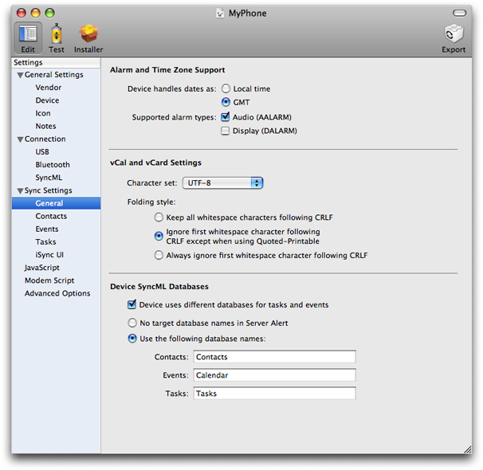

__Table 2-14__  General > Alarm and Time Zone Support settings

| Property | Discussion |
| Device handles dates as | Specifies the date formats supported by the device. The options are:   - Local time - GMT   For example, if the date is `May 5, 2004 10:05:00 AM` in iCal, with a `GMT+2` system time zone, and the device handles only local time, then iSync sends `20040505T1000500` to the device. If the device handles GMT, then iSync sends `20040505T080500Z` to the device. The “Z” in the format indicates GMT. |
| Supported alarm types | Specifies the alarm types supported by the device. The options are:   - Audio (AALARM) - Display (DALARM) |

__Table 2-15__  General > vCal and vCard settings

| Property | Discussion |
| Character set | Specifies the character set supported by the device in vCal and vCard records. The options are:   - UTF-7 - UTF-8 - ISO-8859-1 |
| Folding style | Specifies the format of property values that are folded on multiple lines. The options are:   - Keep all whitespace characters following CRLF  All the whitespace characters following a CRLF character sequence are part of the property value even if the property value is encoded in Quoted-Printable. (CRLF represents a character sequence where CR is Carriage Return and LF is Line Feed. Quoted-Printable is an encoding used when there are non-ASCII characters in a property value.) - Ignore first whitespace character following CRLF except when using Quoted-Printable  The first whitespace following a CRLF character sequence is not part of the property value and should be ignored except when the property value is encoded in Quoted-Printable. - Always ignore first whitespace character following CRLF  The first whitespace following a CRLF sequence is not part of the property value and must be ignored, even if the property value is encoded in Quoted-Printable. |

__Table 2-16__  General > Device SyncML Databases Settings

| Property | Discussion |
| Device uses different databases for tasks and events | iSync needs to know if a device stores tasks and events in separate databases, so it can properly sync all the relevant databases. |
| Databases Names | Select one of these database options:   - No target database names in Server Alert  No target database names should be included in the Server Alert message sent to the device. (Server Alert is the first SyncML message sent to the device that begins a sync session.) Passing the database names is optional.  Typically, you select this option if the user can change the database names on the device. - Use the following database names  Device requires database names in the Server Alert message. Typically, you select this option and enter alternative database names if the device uses different database names than iSync. |

The Contacts pane covers settings specific to the Contacts database, as shown in Figure 2-10. The options in the Contacts pane are discussed in the tables following the figure. Read [Supported Properties](#apple-f4xwc4dqnrsv64tfmyxwi33df52wszbpkridimbqgaztsmrrfvbuqmznknltg) for how to edit the Supported Properties section.

__Figure 2-10__  Contacts pane

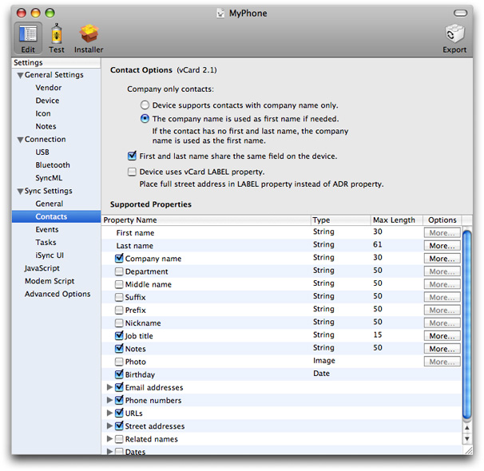

__Table 2-17__  Contacts > Contact Options settings

| Property | Discussion |
| Company only contacts | Select one of these company name options:   - Device supports contacts with company name only  Device properly displays contacts if they have a company name but no first and last name. - The company name is used as the first name if needed  iSync sends the company name as the first name so the contact is displayed correctly on the device. Select this option if the device doesn’t properly display contacts that have a company name but no first and last name. |
| First and last name share the same field on the device | Device doesn't use a separate field for the first and last name. |
| Device uses vCard LABEL property | iSync places the full Street Address in the vCard LABEL property instead of the ADR property. |

The Events pane covers settings specific to the Events database, as shown in Figure 2-11. The options in this pane are discussed in the tables following the figure. Read [Supported Properties](#apple-f4xwc4dqnrsv64tfmyxwi33df52wszbpkridimbqgaztsmrrfvbuqmznknltg) for how to configure supported properties.

__Figure 2-11__  Events pane

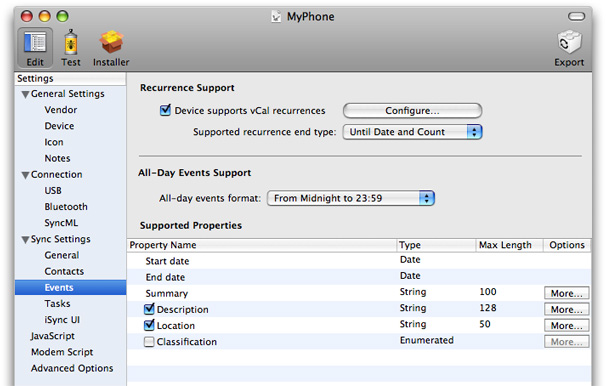

__Table 2-18__  Events > Recurrence Support settings

| Property | Discussion |
| Device supports vCal recurrences | Device supports recurrent events as defined by the vCal specification. If the device doesn’t support the entire specification, click the Configure button to set the recurrence options, which are shown in Figure 2-12 and explained below. |
| Supported recurrence end type | Options are:   - Until Date and Count - Until Date Only - Count Only |

__Table 2-19__  Events > All-Day Events Support settings

| Property | Discussion |
| All-day events format | All-day event format options are:   - OMA Formatting  For example, `DTSTART:20060521T000000` and `DTEND:20060521T240000` are formatted in OMA. - From Midnight to Midnight  For example, `DTSTART:20060521T000000` and `DTEND:20060522T000000` are formatted from midnight to midnight. - Use CATEGORIES Property  Tags all-day events with a specific property. If you select this format, the property value used to tag the events can be specified in the Advanced Options > Databases settings > Events database settings. - From Midnight to 23:59  For example, dates between `DTSTART:20060521T000000` and `DTEND:20060521T235900`. |

If the device supports recurrent events then select the "Device supports vCal recurrences" option in the Recurrence Support section of this pane. Then click the Configure button to set the recurrence options. A sheet appears as shown in Figure 2-12. Use this sheet to configure the details of what recurrence rules the device supports.

The table and layout on the recurrence sheet is similar to the Advanced Options pane. Select a row in the table to display a description of the option in the view at the bottom of this sheet. If a value is one of several options, select the appropriate option from the corresponding pop-up menu. Otherwise, double-click in a cell in the Value column and type in the value.

__Figure 2-12__  Recurrence sheet

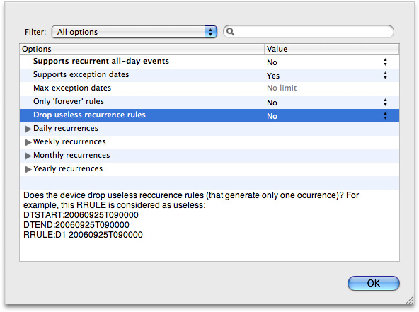

The Tasks pane covers settings specific to the Tasks database, as shown in Figure 2-13. The options in these panes are discussed in the tables following the figure. Read [Supported Properties](#apple-f4xwc4dqnrsv64tfmyxwi33df52wszbpkridimbqgaztsmrrfvbuqmznknltg) for how to configure supported properties.

__Figure 2-13__  Tasks pane

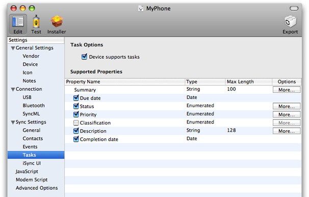

__Table 2-20__  Tasks > Task Options Settings

| Property | Discussion |
| Device supports tasks | Device supports tasks in addition to events in the Calendars schema. Tasks are the same as To Do items in vCal. |

Each of the schema panes—the Contacts, Events, and Tasks panes—contains a Supported Properties section at the bottom of the pane that allows you to turn on or off properties of records that you want to sync. You can also configure the length of string values and configure other property-specific options. Some of the options pertain to reformatting records that are pushed to the device. In summary, you can use the Supported Properties section to specify a subset of the standard Apple schemas that the device supports. Only the properties and values you specify in the Supported Properties section are synced to the device.

The Supported Properties section contains a table like the one shown in Figure 2-13. The Property Name column contains the names of the properties of each corresponding entity defined in an Apple schema. For example, “First name” and “Last name” are properties of the Contact entity in the Contacts schema. When you create a new iSync Plug-in Maker document, all of the properties are enabled representing a full-featured device. Deselect the properties you want to disable. Some properties are mandatory and therefore, cannot be disabled.

Some properties are relationships to other entities. For example, the “Street addresses” and “Related name” properties are to-many relationships from the Contact entity to the “Street Address” and “Related Name” entities respectively. Click the triangle to the left of an option to view the properties of a relationship. For example, click the “Street addresses” property in the Contacts pane to reveal and configure the City, State, and “Postal code” properties as shown in Figure 2-14.

__Figure 2-14__  Street addresses properties

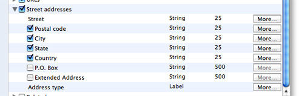

The Type column in the Supported Properties table displays the property type for each attribute—relationships do not have an attribute type. For example, an attribute type might be String, Date, or Image. If the type is Label, the attribute is one of several values, as in an Address Book label, such as “work”, “home”, or “other.“

The Max Length column displays the maximum length of a string field—specifically the maximum number of characters in a String value. Double-click the cell in this column to change the maximum number of characters supported by the device. iSync reformats records pushed to the device to fit in the specified string size.

Click the More button in the Options column to configure more details about a field. For example, click the More button for an attribute of type Label to select the possible labels the device supports. A More button is disabled if an attribute has no options or is not enabled. Relationships do not have a More button. The following sections describe the type-specific sheets that appear when you click the More button.

Figure 2-15 shows more details about a String attribute type. This sheet allows you to control the format of string attributes that are pushed to a device.

Select the “Allow all characters” option if there are no restrictions on the content of a string attribute.

Select “Remove forbidden characters” if you want selected characters removed from a string pushed to the device. If you select this option, enter the forbidden characters, without any separators, in the adjacent text field. For example, enter `;.,` to remove semicolons, periods, and commas from the string.

Select “Accept only allowed characters” if you want to limit the characters in a string to those entered in the adjacent text field.

Select “Use default value for empty attribute” if you want to specify an alternate string for an empty attribute. If this option is selected, enter the alternate string in the adjacent text field.

Click Done to apply your changes or Cancel to revert to the previous settings.

__Figure 2-15__  String More button sheet

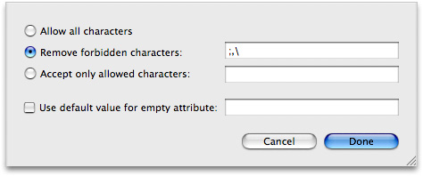

Figure 2-16 shows the labels of an attribute of type Label for the “Email address type” attribute of an Email Address entity. The table at the top of this sheet contains the supported Mac labels and corresponding vCard values.

You use this sheet to specify the supported labels and may limit the number of email addresses or phone numbers allowed on the device. Click a checkbox in the “Sync this type” column to disable or enable a label displayed in the “Mac value” column. Only records with enabled labels are synced to the device.

You can also use this sheet to change the mapping of Mac labels to vCard types—for example, vCard phone types such as `HOME`, `WORK`, `CELL`, and `FAX`. Change a mapping by double-clicking a cell in the “vCard value” column and typing in a vCard type. You can leave a vCard value blank if the device doesn’t support the Mac value and you want to sync the record without syncing the vCard type.

You can map multiple labels to a single vCard type as shown in Figure 2-16 where both the `work` and `other` labels are mapped to the `WORK` vCard type. When multiple labels are mapped to the same type, the order of the rows in this sheet determines the value that is used when transforming device records to computer records. For example, if a phone number is created on the device with a vCard value of `WORK`, it will be mapped to the computer label `work` because it appears before `other` in the table on the Label More button sheet. Drag and drop the rows in this table to change the order.

Use the controls below the table to limit the number of records in the corresponding to-many relationship—for example, limit the number of targets of the to-many relationships from Contact to Phone Number or Contact to Email Address. In other words, you can limit the number of phone numbers or email addresses per contact that are synced to the device. Select the Unlimited option if the device as no limits. Select the “Limit to” option and enter the number of records the device supports for the corresponding to-many relationship. Select the “One per type” option if the device only supports one record per vCard type.

Click Done to apply your changes or Cancel to revert to the previous settings.

__Figure 2-16__  Label More button sheet

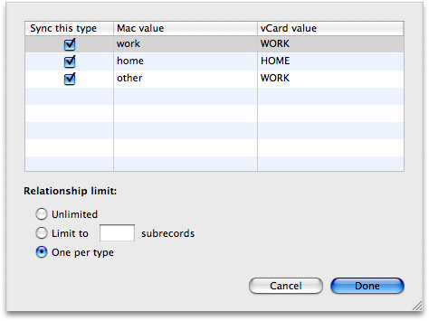

Figure 2-17 shows an Enumerated attribute type details sheet for the Tasks database Status field. The table at the top of this sheet behaves similar to the table at the top of the Label More button sheet, except that you can not disable Mac values.

Change a mapping from a Mac value to a vCal value by double-clicking a cell in the “vCard value” column and typing in a vCard value. You can leave a vCard value blank if the device doesn’t support the Mac value and you want to sync the record without syncing the vCard value. You can map multiple Mac values to the same vCal value. Drag and drop a row to change the search order for a Mac value when transforming vCal records to computer records.

Click Done to apply your changes or Cancel to revert to the previous settings.

__Figure 2-17__  Enumerated More button sheet

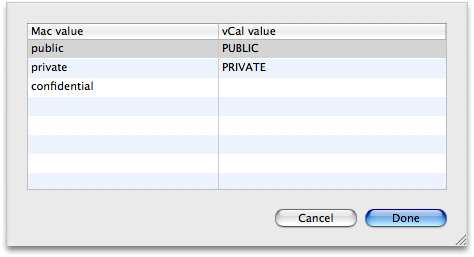

The iSync UI pane, shown in Figure 2-18, allow you to configure the user interface in iSync based on what the device supports. The user interface features are organized by schema. Currently, there are only Contacts and Events user interface options. Each of these settings corresponds to a control in the iSync user interface.

__Figure 2-18__  iSync UI pane

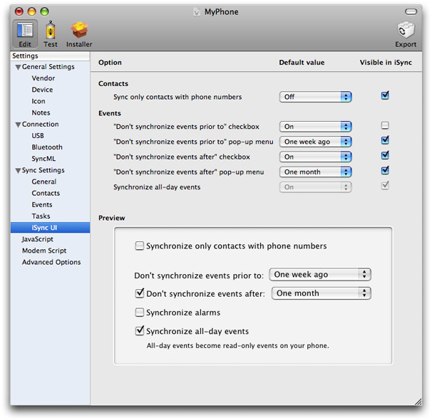

Use these settings to set whether an option is visible to the user in iSync and set its default value. All of the Contacts and Events controls on this pane correspond to a control on the More Options pane in iSync. A preview of all the options is provided at the bottom of this pane so you can see what the iSync user interface looks like. If an option is not visible, then iSync uses the default value for all records sent to the device. If an option is visible, the associated control displays the default value in the More Options pane in iSync.

Use the settings on this pane cautiously. The iSync user experience should not change too much from device to device. New plug-ins should show the same user interface controls as those shipped by Apple. Therefore, seriously consider removing or adding controls to iSync before doing so. If you remove a control, carefully choose a default value because the user can not change it after the plug-in ships.

The options in the Events section, described in Table 2-22, let you configure how events are synced to a device. The checkbox and pop-up menu settings allow you to filter events by a time interval. For example, if the device has limited capacity, you can filter the number of events synced to the device by a time interval. Set the default value of the "Don't synchronize events prior to" and the "Don't synchronize events after" checkboxes to On. Also, deselect Visible in iSync (located at the right side of the pane) for these options so the user can’t sync all events. Select the appropriate default interval values for the corresponding pop-up menus that range from one day to one month. Optionally, select Visible in iSync for the pop-up menu options if the user is allowed to change these settings.

__Table 2-21__  iSync UI > Contacts settings

| Property | Discussion |
| Sync only contacts with phone number | If the device does not support contacts without a phone number, you might set the default value to On and deselect the Visible in iSync checkbox. If the device does not display contacts without phone numbers, then you might set the default value to Off and deselect the Visible in iSync checkbox. This way, users are not bothered with options that are not supported by the device |

__Table 2-22__  iSync UI > Events Settings

| Property | Discussion |
| "Don't synchronize events prior to" checkbox | If you want to allow the number of events synced to a device to be filtered by a time interval, then set the default value for this option to On and select the Visible in iSync option. |
| "Don't synchronize events prior to" pop-up menu | Choose the default value for the start of the time interval used to filter events. Select Visible in iSync if the user is allowed to change the start date. |
| "Don't synchronize events after" checkbox | If you want to allow the number of events synced to a device to be filtered by a time interval, then set the default value for this option to On and select the Visible in iSync option. |
| "Don't synchronize events after" pop-up menu | Choose the default value for the end of the time interval used to filter events. Select Visible in iSync if the user is allowed to change the end date. |
| Synchronize all-day events | If the device does not display all-day events nicely, then set the default value for this option to Off. For example, some devices may display an all-day event as an event from 0:00 to 23:59 that may obscure other events on the same day.  Note that iSync always allows users to sync all-day events to a device. |

Click JavaScript in the outline view to optionally edit any of the JavaScript functions used to communicate with the device. The JavaScript pane is shown in Figure 2-19. These are the same JavaScript functions that you can access from the Connection > USB and Connection > Bluetooth panes. The table in the upper-left corner of the JavaScript pane contains groups of JavaScript functions. Use this table to navigate to the JavaScript function you want to edit. For example, reveal the contents of “USB functions” and select On OBEX Connection. The Run column in this table displays Yes if the JavaScript function is enabled, and No if it is disabled.

__Figure 2-19__  JavaScript pane

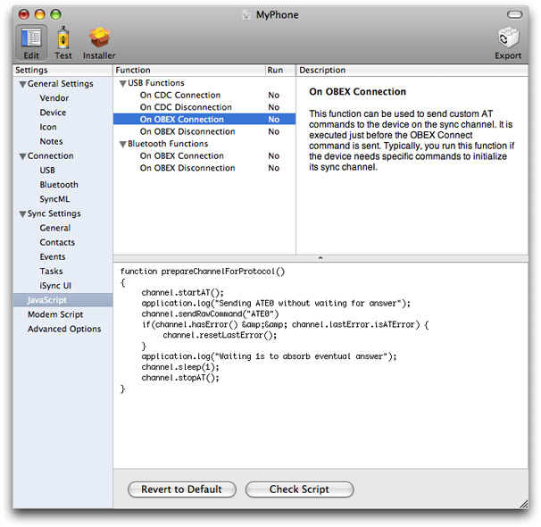

The Description table in the upper-right corner of the JavaScript pane displays a brief description of the JavaScript function. The description states what the JavaScript function does and when it is executed.

The text box at the bottom of the JavaScript pane displays the selected JavaScript function. Use this text box to edit the JavaScript function. The behavior of this editor is similar to that of the TextEdit application. Just click anywhere in the text box to begin typing. Read _iSync JavaScript Reference_ for how to write iSync JavaScript functions.

Click the Revert to Default button at the bottom of the pane if you want to revert to the system default settings—this action deletes your changes. Click the Check Syntax button to correct any syntactical errors in your JavaScript code.

A modem script is used to communicate with and control the device as a modem for the purpose of connecting to the Internet. Modem scripts are written using the Communication Command Language (CCL) scripting language. Use the Modem Script pane shown in Figure 2-20 to configure modem options and write a CCL script. Table 2-23 and Table 2-24 describe the various settings on this pane to configure the connection and carrier. Table 2-25 describes how to import and edit a modem script.

Read _[CCL Modem Scripting Guide](../../Hardware%20Drivers/CCL%20Modem%20Scripting%20Guide/Introduction%20to%20CCL%20Modem%20Scripting%20Guide.md#apple-f4xwc4dqnrsv64tfmyxwi33df52wszbpkridimbqga2tinru)_ for details on CCL.

__Figure 2-20__  Modem Script pane

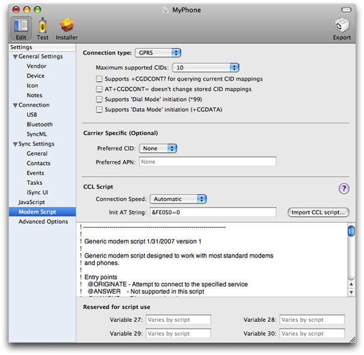

__Table 2-23__  Modem Script > Connection settings

| Property | Description |
| Connection type | Choose either Dialup or GPRS from the “Connection type” pop-up menu. If you choose Dialup, the user supplies a phone number to the script. If you choose GPRS, the user supplies an APN and CID to the script. If this information is known in advance, a GPRS modem script bundle can store a default APN and CID so the user doesn't have to provide them. |
| Maximum supported CIDs | Choose the maximum number of context identifiers (CIDs) supported by the device from the “Maximum supported CIDs” pop-up menu. |
| Supports `+CGDCONT?` for querying current CID mappings | Select this option if the device supports the `+CGDCONT?` AT command for querying CID mappings. |
| `AT+CGDCONT=` doesn’t change stored CID mappings | Select this option if the `+CGDCONT=` AT command doesn’t change stored CID mappings.  Some GPRS devices overwrite internal CID mappings when a GPRS connection is configured. The use of arbitrary CIDs with such devices may overwrite important APN information stored in the device. |
| Supports ‘Dial Mode’ initiation (\*99) | Select this option if the device allows GPRS connections to be initiated using the escape sequence `*99`, followed by a CID identifier or `#` for the default CID configuration. |
| Supports ‘Data Mode’ initiation (+CGDATA) | Select this option if the device allows GPRS connections to be initiated using the `+CGDATA` AT command. |

__Table 2-24__  Modem Script > Carrier Specific (Optional)

| Property | Description |
| Preferred CID | If the service plan is known and APN information for Internet connectivity is stored in the device, accessible by a particular CID, specify that CID here. This setting is also useful for devices that overwrite stored CID information. In this case, a CID that is likely to be "empty" can be specified to prevent overwriting APN information in the device. The preferred CID is the default CID in the user interface for this script, although the user may change it. |
| Preferred APN | If the service plan is known in advance, enter the APN string used by a computer connecting to the Internet through the modem device. |

__Table 2-25__  Modem Script > CCL Script

| Property | Description |
| Connection Speed | Select Automatic or a connection speed from the Connection Speed pop-up menu. This string may be used by the script to control the speed of the connection. |
| Init AT String | Enter an AT command to initialize the device. |
| Import CCL script | Click “Import CCL script” to import and edit a CCL script in the text view below. Changes you make in the text view are saved with the plug-in, not the imported file. See _[CCL Modem Scripting Guide](../../Hardware%20Drivers/CCL%20Modem%20Scripting%20Guide/Introduction%20to%20CCL%20Modem%20Scripting%20Guide.md#apple-f4xwc4dqnrsv64tfmyxwi33df52wszbpkridimbqga2tinru)_ for details on writing this script. |
| Reserved for script use | Enter the values of the variables used by the CCL script into these text fields. Look for comments at the top of the script for which variables it uses, if any. How these variables are used depends of the script. Using the variables is optional. |

The Advanced Options pane, shown in Figure 2-21, contains additional options that are infrequently used. Use this pane to configure device-specific options. For example, use this pane to specify how a record is reformatted from an Apple record to a vCard or vCal property field used by the device. Use this pane if your device uses different vCard or vCal properties than the defaults.

The options in this pane are displayed in a table and organized in a way that is similar to key-value pairs in a property list. The property/option is listed in the Options column and the value is listed in the Value column. Use the Filter pop-up menu located above the table to filter the options by category. Use the search field to the right of the Filter menu to search for a specific option by name.

__Figure 2-21__  Advanced Options pane

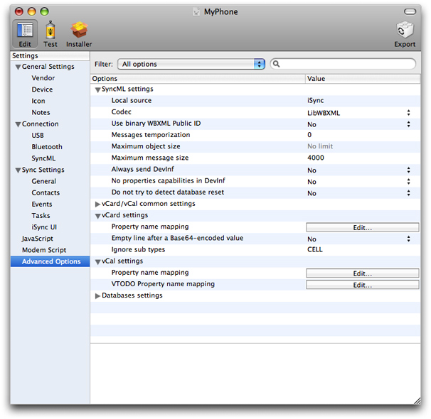

Select a row in the table to display a description of the option in the view at the bottom of this pane, as shown in Figure 2-22.

__Figure 2-22__  Advanced option descriptions

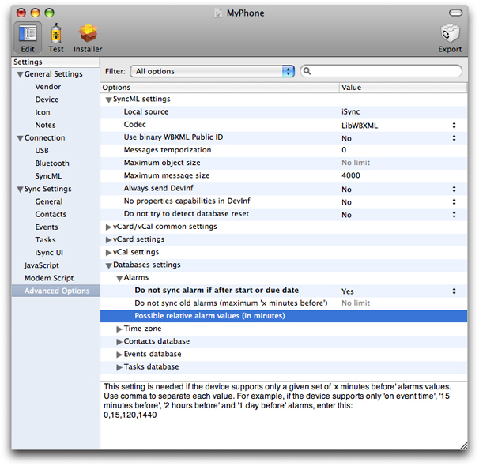

If a value is one of several options, select the appropriate option from the corresponding pop-up menu. Otherwise, double-click in a cell in the Value column and type in the value.

Some Value cells contain an Edit button. Click the Edit button to specify key-value pairs that map iSync property names to device property names. A sheet appears as shown in Figure 2-23. Click the plus button in the lower-left corner of sheet to add a key-value pair. Click in the “iSync property” column to enter the iSync property name that you are mapping. Click in the “Phone mapped property” column to enter the corresponding device property name.

__Figure 2-23__  Edit button sheet

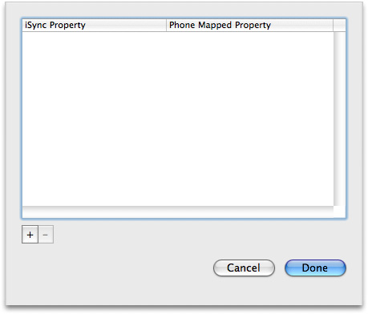

[Next](Testing%20Plug-ins.md)[Previous](Overview%20of%20Creating%20Plug-ins.md)

