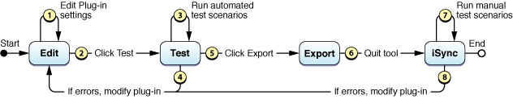
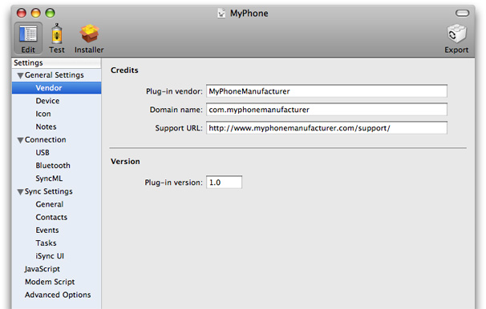
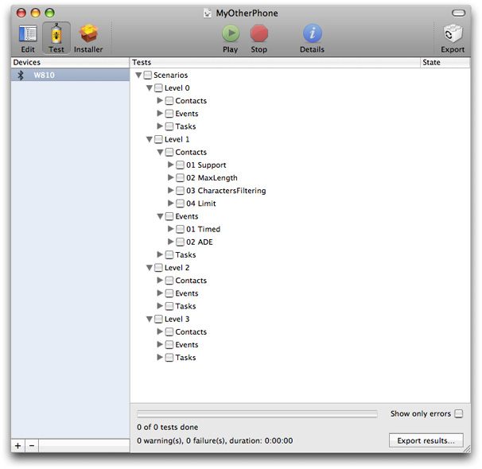
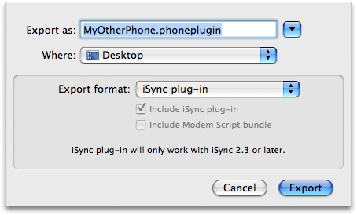

> 导航：[总目录](../../../README.md) · [documentation](../../../_indexes/documentation.md) · [iSync Plug-in Maker User Guide](Introduction%20to%20iSync%20Plug-in%20Maker%20User%20Guide.md)

[Next](Editing%20Plug-ins.md)[Previous](Introduction%20to%20iSync%20Plug-in%20Maker%20User%20Guide.md)

# Overview of Creating Plug-ins

You use iSync Plug-in Maker to build and test a plug-in, or just use iSync Plug-in Maker to test an existing plug-in. If you are building a plug-in, you create an iSync Plug-in Maker document and edit settings in it. For both new and existing plug-ins, you run a set of automated tests. When the plug-in passes all the automated tests, you export the plug-in to a package that can be loaded by iSync. Then you run a series of manual tests using Apple applications, the device, and iSync. If errors occur at any time during this process, return to the edit state to modify the plug-in and then test it again. The workflow for testing syncing between a device and iSync on a Macintosh computer is depicted in Figure 1-1.

__Figure 1-1__  Workflow for creating a plug-in

iSync Plug-in Maker is a document-based application—each document window represents a separate iSync Plug-in Maker document, and you can edit multiple documents simultaneously. Create a new plug-in by launching iSync Plug-in Maker. An Untitled document window appears. Edit and test the plug-in by following the steps below. When done, save the iSync Plug-in Maker document by choosing Save or Save As from the File menu. To create an iSync plug-in, export the document choosing the appropriate format.

1. Editing

   You begin editing by launching the iSync Plug-in Maker tool and clicking the Edit button in the toolbar shown in Figure 1-2. (The Edit mode is selected by default.) You use the outline view on the left to move among all the settings you need to configure a device. These device settings are described in detail in [Editing Plug-ins](Editing%20Plug-ins.md#apple-f4xwc4dqnrsv64tfmyxwi33df52wszbpkridimbqgaztsmrrfvbuqmznknltc).

   __Figure 1-2__  Editing plug-ins

   
2. Testing

   You begin testing by clicking the Test button in the toolbar as shown in Figure 1-3. You add your device and run a number of automated test scenarios. Your device needs to be connected to your computer to run these tests. The testing phase is covered in [Testing Plug-ins](Testing%20Plug-ins.md#apple-f4xwc4dqnrsv64tfmyxwi33df52wszbpkridimbqgaztsmrrfvbuqnjnknltc).

   __Figure 1-3__  Testing plug-ins

   
3. Exporting

   Once your plug-in passes all the automated tests, you export it by clicking the Export button in the toolbar as shown in [Figure 1-4](#apple-f4xwc4dqnrsv64tfmyxwi33df52wszbpkridimbqgaztsmrrfvbuqnbnknlti). How to export a plug-in and package options are covered in Exporting Plug-ins.

   __Figure 1-4__  Exporting plug-ins

   
4. Manual Testing

   Your plug-in is not complete unless it passes manual tests that involve using Apple applications and iSync to change and sync records on the computer.

   This document does not describe manual testing. Read _[iSync Manual Test Suite Guide](../../Apple%20Applications/iSync%20Manual%20Test%20Suite%20Guide/Introduction%20to%20iSync%20Manual%20Test%20Suite%20Guide.md#apple-f4xwc4dqnrsv64tfmyxwi33df52wszbpkridimbqga2diobu)_for detailed descriptions of the manual tests that you should run before shipping your plug-in.

[Next](Editing%20Plug-ins.md)[Previous](Introduction%20to%20iSync%20Plug-in%20Maker%20User%20Guide.md)

