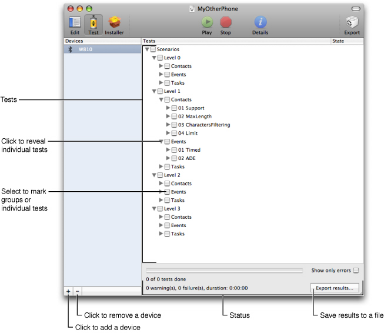
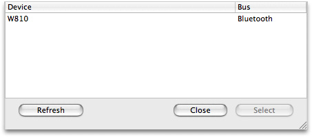
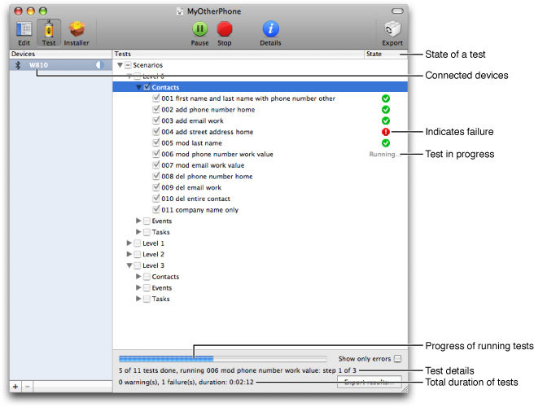
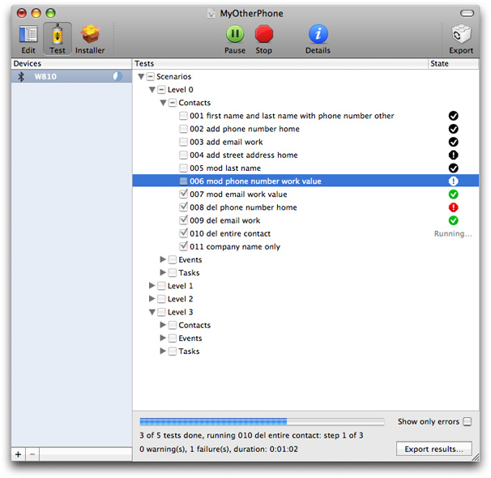
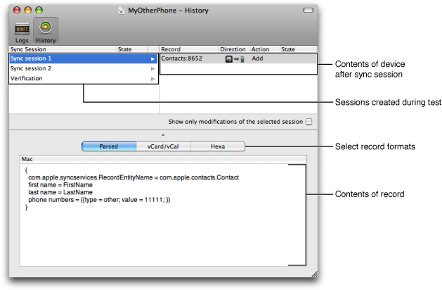
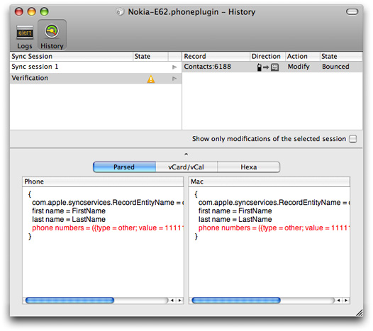
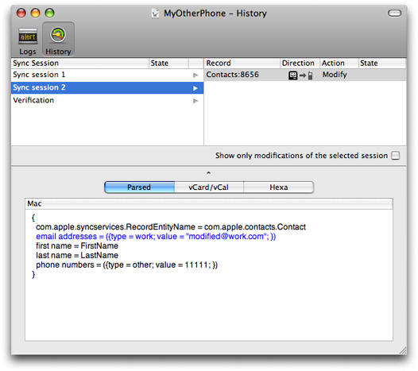
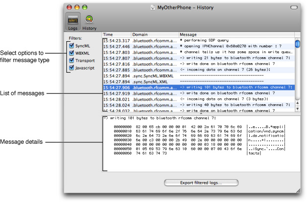
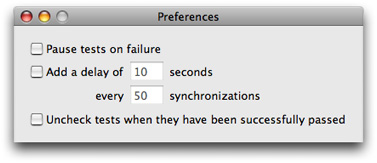

> 导航：[总目录](../../../README.md) · [documentation](../../../_indexes/documentation.md) · [iSync Plug-in Maker User Guide](Introduction%20to%20iSync%20Plug-in%20Maker%20User%20Guide.md)

[Next](Exporting%20Plug-ins.md)[Previous](Editing%20Plug-ins.md)

# Testing Plug-ins

Click the Test button on the toolbar to begin testing the plug-in using the automated tests scenarios provided by iSync Plug-in Maker.

If this is the first time you are using the device with the computer, you need to hook up the device to the computer for USB devices, or pair the device with the computer for Bluetooth devices now. Follow the instructions in Adding Devices to add a device to iSync Plug-in Maker before running the tests.

Once a device is added to iSync Plug-in Maker, the window changes to the testing mode, as shown in Figure 3-1. The column on the left of the window displays the added devices. The column on the right displays an outline view of the test scenarios. Note that you can return to the testing mode at any time during the process of developing your plug-in. For example, return to this mode after modifying a plug-in and before exporting.

__Figure 3-1__  Test mode

The first time you test a phone, you need to add the device to iSync Plug-in Maker as follows:

1. Click the plus button in the lower-left corner below the list of devices.

   A sheet appears with a list of devices that iSync Plug-in Maker detects, as show in Figure 3-2.

   __Figure 3-2__  Adding a device

   
2. Select the device from the list and click the Select button.

   The device should appear selected in the Devices column.

After adding the device, select it in the Devices list and select the scenario you want to run from the Tests outline view. Click a triangle to reveal the contents and select a test or groups of tests you want to run. For example, select Scenarios > Level 0 > Contacts to run the first-level tests using the Contacts database.

Follow these steps to run the tests:

1. Select the test or tests from the Tests outline view.
2. Click the Start button in the toolbar.

   A progress indicator appears below the Tests outline view as show in Figure 3-3. The status message below the progress indicator displays the test number and the total number of tests that will be run. It also displays the name of the test that is running.

   When the tests are done, the status message displays the number of bounces and failures, and the total duration of the tests.

   __Figure 3-3__  Running tests

   
3. If you want to temporarily stop a running test, click the Pause button.
4. Click the Resume button to continue a test that is paused.
5. If you want to stop all the selected tests from running, click the Stop button.

The Tests outline view also displays the status of individual tests in the State column. When a test is executing tests the word "Running" appears in the column. Other symbols may appear in this column indicating the success or failure of individual, and groups of tests as shown in Figure 3-4. For example, a green checkmark indicates success and a red exclamation mark indicates failure. Hold the mouse over a state icon to display a tooltip with more details. For example, a tooltip might explain where a test failed. Refer to Table 3-1 for the meaning of the icons that appear in this column.

Color is also used throughout the iSync Plug-in Maker user interface to indicate state. In general, green indicates success, yellow indicates warning, and red indicates failure. In some cases, black and white icons indicate a stall or old state. For example, if a test is successful and you modify the plug-in, the icon changes from green to black and white to indicate that the test needs to be rerun with the updated plug-in.

If you want to show just the errors in the Tests outline view, select the “Show only errors” option at the bottom of the outline view. Click the “Export results” button if you want to save the test results to a file.

Read [Troubleshooting](#apple-f4xwc4dqnrsv64tfmyxwi33df52wszbpkridimbqgaztsmrrfvbuqnjnknlte) for information on debugging failed tests.

__Figure 3-4__  Example of test states

__Table 3-1__  Test states

| Text/Icon | Description |
| Running | The test is in progress. |
| ../art/tr_ok.jpg | The test is successful. |
| ../art/tr_warn_slowsync.jpg | The test is successful—ran without any errors—but the device requested a slow sync during one of the sync sessions. Read Troubleshooting for how to diagnose problems. |
| ../art/tr_warn_alert.jpg | The test completed but with some errors—for example, records were bounced, forgotten, or refused. Read Troubleshooting for how to diagnose problems. |
| ../art/tr_warn_error.jpg | The test failed. Read Troubleshooting for how to diagnose problems. |
| ../art/tr_warn_ok_black.jpg | Same as ../art/tr_ok.jpg except the test was run using an earlier version of the iSync Plug-in Maker document. Rerun this test before exporting the plug-in. |
| ../art/tr_warn_slowsync_black.jpg | Same as ../art/tr_warn_slowsync.jpg except the test was run using an earlier version of the iSync Plug-in Maker document. Rerun this test before exporting the plug-in. |
| ../art/tr_warn_alert_black.jpg | Same as ../art/tr_warn_alert.jpg except the test was run using an earlier version of the iSync Plug-in Maker document. Rerun this test before exporting the plug-in. |
| ../art/tr_warn_error_black.jpg | Same as ../art/tr_warn_error.jpg except the test was run using an earlier version of the iSync Plug-in Maker document. Rerun this test before exporting the plug-in. |

iSync Plug-in Maker provides extensive debugging support when tests fail. You can see the details of each test run by examining individual sync sessions or by displaying a log of every message sent to and from the device.

Select a test and click the Details button in the toolbar to open the Details window (or click an icon in the State column). The Details window contains a toolbar allowing you to switch between the History and Logs panes. Which pane to most useful depends on the state of the test. If the state of a test is pass or bounce, then use the History pane to help locate the problem. If the state of the test is failed, then use the Logs pane to display the sequence of messages.

Click the History button in the toolbar of the Details window to display information about each sync session that was created when running the tests, as shown in Figure 3-5.

__Figure 3-5__  History pane

Each test may involve several sync sessions, which are listed in a table located in the upper left of the History pane. The Sync Session column contains the names of the sync sessions. Typically, the first sync session deletes all records on the device before sending modifications. The following sessions add, modify, or delete records, and the last session verifies all records on the device. The last sync session is called Verification and appears at the end of the table.

The State column displays an icon that indicates a problem during the sync session. It is considered a problem if a device requests a slow sync because it is much slower than a fast sync. The value in the State column is blank if no problems occur. For example, a warning icon is displayed if the sync is refused, forgotten, or bounced, and a slow icon is displayed if the device slow synced. Table 3-2 describes the different states that might appear in this column.

Select a session in the sync session table to see the modifications pushed to the device from the beginning of the test to the end of the selected session. The modifications are displayed in a table located in the upper right of the History pane. Select the “Show only modifications of the selected session” option if you want to see just the modifications during the selected session.

__Table 3-2__  Sync session states

| Icon | Description |
| ../art/tr_warn_slowsync.jpg | The sync session finished without errors but the device requested a slow sync. Display the tooltip for more details. Read Logs Pane for how to diagnose this problem—specifically, examine the sequence of SyncML messages. |
| ../art/tr_warn_alert.jpg | The sync session finished with some errors—for example, records were bounced, forgotten, or refused. Display the tooltip for more details. Read Logs Pane for how to diagnose this problem. |
| ../art/tr_warn_error.jpg | The device requested all the records for no reason or cancelled the sync session. This typically indicates that records on the device are corrupted. Read Logs Pane for how to diagnose this problem. |

The table on the right displays all the records in the selected sync session. The Record column in this table displays the record identifier—for example, the schema name followed by a colon and a unique number for a record.

The Direction column indicates whether the modification was pushed or pulled. Table 3-3 describes the meaning of the different icons that might appear in this column.

__Table 3-3__  Record Directions

| Icon | Description |
| ../art/tr_dir_tophone.jpg | Record was pushed to the device. |
| ../art/tr_dir_tomac.jpg | Record was pulled from the device. |

The Action column indicates the type of change—for example, Add, Modify, or Delete.

The State column displays the state of the modification on the device—for example, Refused, Forgotten, Bounced, or Resent, as described in Table 3-4. The value in the State column is blank if the modification is accepted.

__Table 3-4__  Record states

| Text | Description |
| Refused | A record modification is refused if the device refuses it through an appropriate SyncML status. This indicates that the record cannot be stored on the device—for example, it might contain unsupported properties. Change the sync settings to avoid generating unsupported records. |
| Forgotten | A record modification is forgotten if the device does not acknowledge it. This usually indicates that the device cannot handle a record and should have refused it. |
| Bounced | A record is bounced if a modification sent to the device alters the date on the computer. This is an error because records should not be modified by the device while running the automated tests.  Typically, this happens if iSync sends a modification to the device with a string property value that exceeds the limits of the device. Consequently, the device truncates the string when storing the record. On a subsequent sync, the truncated version of the record is sent to iSync. Change the sync settings so that iSync reformats records appropriately. |
| Resent | A record is resent if iSync pulls a record from the device that it doesn’t expect. Typically, this occurs when you manually modify a record on the device while running a test. |

When you select a record in the record table, the details are displayed in the pane below. Use the segmented control below the tables to see the record details as either a parsed Sync Services change object (displayed as a key-value dictionary), a vCard/vCal object, or a hexadecimal representation.

For example, Figure 3-6 shows two records that were bounced. If you select a bounced record, the record details show the contents of the record on the device as compared with the contents on the computer.

__Figure 3-6__  Bounced record

Color is used in the Parsed record view to indicate the type of action. For example, Figure 3-7 shows a modified record where blue text is used to indicate the fields that changed. Table 3-5 describes the meaning of the different colors used in the History pane.

__Figure 3-7__  Modified record

__Table 3-5__  Colored records and fields

| Color | Description |
| Blue | Indicates properties of a record that changed |
| Red | Indicates a bounced record |
| Grey | Indicates a deleted record |

Click the Logs button in the toolbar in the Details window to display every message sent to and from the device, as shown in Figure 3-8. Use the Filters checkboxes on the left to selectively turn on/off different types of messages. The types of messages are SyncML, WBXML, Transport, and JavaScript messages, where Transport includes both USB and Bluetooth messages.

A table appears on the right side of the Logs pane listing every message. The columns in this table display the time the message was sent, the domain or type of message, and part of the message content. Select a message in the table to see the complete message content displayed in the lower pane.

Click the “Export filtered logs” button at the bottom of the pane to save the selected messages to a file. For example, to save SyncML messages to a file, select only SyncML in the Filters pane, and click the “Export filtered logs” button.

__Figure 3-8__  Logs pane

There are several application preferences you can set to change the behavior of the testing phase. Choose iSync Plug-in Maker > Preferences to open the Preferences window as shown in Figure 3-9.

Select "Pause tests on failure" if you want iSync Plug-in Maker to automatically pause when an error occurs. For example, choose this option if you need to reboot a device when an error occurs that corrupted the data on that device. After a test is paused, click the Resume button in the toolbar to continue running the test.

Select "Add a delay of" if you want to pause for a period of time between sync sessions. For example, if you want to pause for `10` seconds after every sync session, select "Add a delay of", enter `10` in the seconds text field, and enter `1` in the synchronizations text field.

Select the “Uncheck tests when they have been successfully passed” if you want to incrementally test the plug-in; otherwise, you need to deselect successful tests before selecting and running the next set of tests.

__Figure 3-9__  Testing preferences

[Next](Exporting%20Plug-ins.md)[Previous](Editing%20Plug-ins.md)

