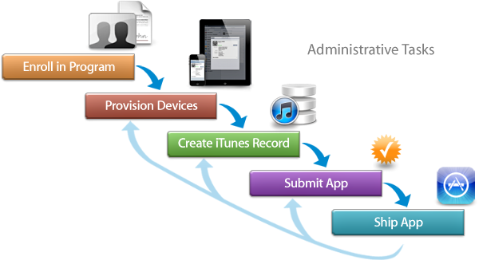

> 导航：[总目录](../../../README.md) · [documentation](../../../_indexes/documentation.md)

[Next](Enrolling%20in%20the%20iOS%20Developer%20Program.md)

# About Your First App Store Submission

This tutorial teaches you the process of provisioning devices and submitting your iOS app to the App Store. (You can start some of these tasks as soon as you are ready to run your app on a device.) You learn this process best using your own Xcode project. But if you created a HelloWorld project in another tutorial, it will work well, too.

Most of your development time is spent on coding tasks. But to develop for the App Store, you must also perform administrative tasks, using Xcode and other tools, throughout the lifetime of your app. The App Store is a curated store, which means that only Apple-approved apps are available for purchase. Apple does this to provide the best experience possible for our users. For example, apps that are sold on the App Store must not crash or exhibit other major bugs.

Apple provides the tools you need to develop, test, and submit your iOS app to the App Store. To run an app on a device, the device needs to be provisioned for development and later provisioned for testing. You also need to provide information about your app that the App Store displays to customers and upload screenshots. Then you submit the app to Apple for approval. After the app is approved, you set a date when the app should appear in the App Store, as well as its price. Finally, you use Apple’s tools to monitor the sales of the app, customer reviews, and crash reports. Then you repeat the entire process again to submit updates to your app.

If you use certain technologies—such as iCloud storage or In-App Purchase—there are additional configuration and administrative tasks to perform. There are also tasks you perform to manage a team of developers. This tutorial doesn’t cover these additional tasks.

This tutorial teaches you the process of testing an iOS app on a device, and submitting it to the App Store. You can use the same HelloWorld app you created in _[Start Developing iOS Apps Today (Retired)](https://developer.apple.com/library/archive/referencelibrary/GettingStarted/RoadMapiOS-Legacy/index.html#//apple_ref/doc/uid/TP40011343)_ or you can follow the steps using your own app. This tutorial is about the _process_, not about how you design your user interface or write your code.

### Enroll in the Program

Before you can access any of the tools that you need to run your app on a device or begin the submission process, you must join the iOS Developer Program as either an individual or a company.

### Provision Devices

The first step after creating a working app is to run it on a device. Xcode simplifies this process by creating default signing certificates and provisioning profiles for you.

### Create an App Record in iTunes Connect

Before you can submit an app for approval, you need to provide information to set up your iTunes Connect account. iTunes Connect is the marketing and business tool you use to check the status of your contracts, set up tax and banking information, obtain sales and finance reports, manage developers on your team, and manage metadata about your app. At a minimum, you need to create an app record and complete forms to validate and submit your app.

### Submit the App

Submitting your app to the App Store is a multistep process involving several tools. First, create a distribution provisioning profile using the Certificates, Identifiers & Profiles section of Member Center. Then create an archive, validate it, and submit it to the App Store using Xcode. When your app is approved, set the date when the app will be available to customers using iTunes Connect. Finally, respond to user issues after you ship your first version.

### Solve Problems and Choose Your Next Steps

As you complete the tasks in this tutorial, you may encounter problems that you don’t know how to solve. In this book, you’ll learn some troubleshooting steps that every developer should know about provisioning devices.

After you finish this tutorial, consider using some of the specialized technologies—for example, iCloud storage and push notifications—that require additional configuration and provisioning. And if your development team grows, you need to learn how to manage your team.

To benefit from this tutorial, you should read and work through the tutorial in _[Start Developing iOS Apps Today (Retired)](https://developer.apple.com/library/archive/referencelibrary/GettingStarted/RoadMapiOS-Legacy/index.html#//apple_ref/doc/uid/TP40011343)_ to learn the basics of app development before reading this tutorial. This tutorial uses the HelloWorld app you created in _[Start Developing iOS Apps Today (Retired)](https://developer.apple.com/library/archive/referencelibrary/GettingStarted/RoadMapiOS-Legacy/index.html#//apple_ref/doc/uid/TP40011343)_, but you can use your own app to follow along.

Provisioning your devices and submitting your app to the App Store is more complicated if you have a team of developers and use specialized technologies, such as iCloud storage and push notifications. There are also numerous administrative tasks not covered in this tutorial that you need to perform to market and maintain your app on the App Store. Your app also needs to follow the guidelines in order to be approved by Apple. Read these books next:

- To learn more about using Xcode to provision your devices and submit your app, see _App Distribution Guide_.
- To learn more about using iTunes Connect to manage your app, see _iTunes Connect Developer Guide_.
- To learn more about the user interface guidelines and to get your app approved, see _iOS Human Interface Guidelines_ and _[App Store Review Guidelines](https://developer.apple.com/appstore/resources/approval/guidelines.html)_.
[Next](Enrolling%20in%20the%20iOS%20Developer%20Program.md)

