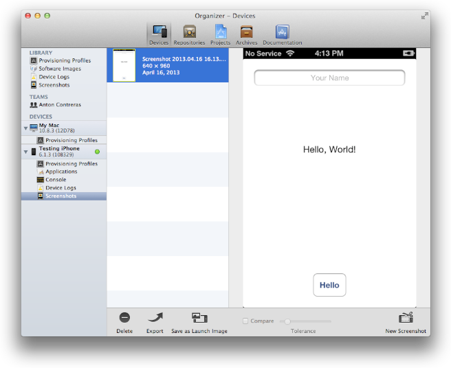
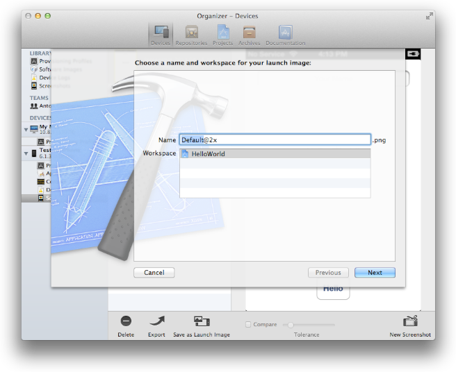
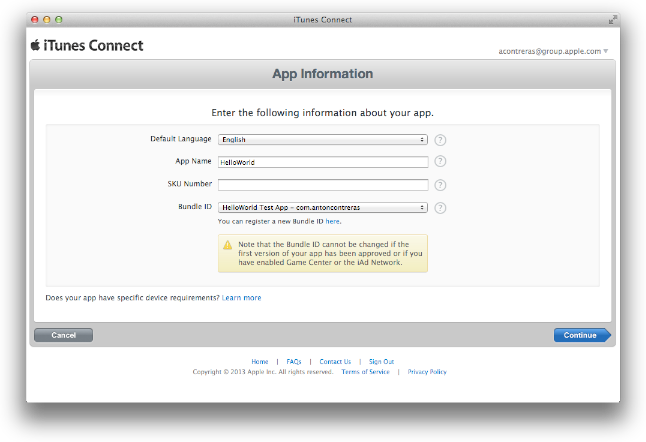
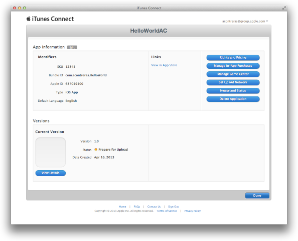
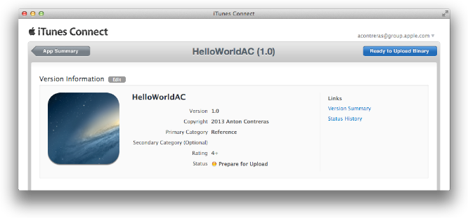

> 导航：[总目录](../../../README.md) · [documentation](../../../_indexes/documentation.md) · [App Store Submission Tutorial](About%20Your%20First%20App%20Store%20Submission.md)

[Next](Submitting%20Your%20App.md)[Previous](Testing%20Your%20App%20on%20Many%20Devices%20and%20iOS%20Versions.md)

# Creating Your App Record in iTunes Connect

When an app is sold in the App Store, the store displays a lot of information about the app, including its name, a description, an icon, screenshots, and contact information for your company. To provide that information, you sign in to iTunes Connect, create a record for the app, and complete some forms. In this chapter you learn how to go through this process.

When you create an iTunes Connect app record, an assistant guides you through the process and asks detailed questions about your company and app. For example, you need an official company name that iTunes Store displays for your app, a support email address, and a support URL. You also need some screenshots of your app ready for upload. Some of this information is entered once and cannot be changed later. Other information can be changed up until you submit the first version of your app. Always refer to the online help for the latest information and instructions on using iTunes Connect.

Before you begin, make sure that you have these assets ready to enter into the forms:

- The date when you want to ship your app (you can set the latest date allowed and change it later)
- A brief description of your app that iTunes displays to customers
- An app icon (512 x 512 pixels) ready for upload
- At least one screenshot of your app ready for upload
- An internal version number for your submission
- A bundle ID that you’ve set to match your App ID

Before you can create the actual iTunes Connect app record, you need to accomplish three main tasks using Xcode:

1. Capture screenshots.
2. Set the launch image.
3. Set your bundle ID.

Using Xcode, you can capture screenshots of your app on a device and save the images on your desktop to upload to iTunes Connect later and use as a launch image.

To capture a screenshot on your device

1. Connect the device to your Mac.
2. In Xcode, run your app on the device (as described in [To launch the app on the device](Provisioning%20Your%20Devices%20for%20Development.md#apple-f4xwc4dqnrsv64tfmyxwi33df52wszbpkridimbqgeytgnzvfvbuqnbnknlts)).
3. Configure the app on the device to show the features you want in the screenshot.
4. In Xcode, open the Devices organizer.
5. In the Devices section, click the disclosure triangle next to the iOS device.
6. Select Screenshots.
7. Click New Screenshot in the lower-right corner.

   

To save a PNG file of a screenshot, drag the screenshot from Xcode to the desktop. Or, move the screenshots to a folder so that you can keep them all in one place.

Besides capturing screenshots, you should set a launch image that acts as a placeholder for your app’s user interface at launch time. Do this at the same time that you capture screenshots for iTunes Connect.

To set your launch image

1. In the Xcode Devices organizer, select the screenshot in the Screenshots folder of the Library section.
2. Select “Save as Launch Image.”
3. Specify the name of the image and the target app, and click Next.

   

After performing these steps, the corresponding launch image is set in the Summary pane in Xcode. For example, if the screenshot was captured on an iPhone 5, the screenshot now appears in the Summary pane as the Retina (4-inch) launch image in iPhone/iPod Deployment Info.

The record in iTunes Connect also includes a field for a bundle ID; the value you place in this field must exactly match the bundle ID for the app. The app name and version you enter in iTunes Connect must also match the Xcode project configuration.

You set the bundle ID for your app when you create your Xcode project, but you can also look it up in the project target Summary section. For your convenience, the bundle ID defaults to a reverse domain name using the company identifier followed by the product name that you entered when you created your Xcode project—for example, `com.charlestaylor.HelloWorld`, where `com.charlestaylor` is the company identifier and `HelloWorld` is the product name. The bundle ID is actually set in the `Info.plist` file of your Xcode project and can be changed to any identifier that follows the RFC 1034 specification.

The bundle ID that you enter in iTunes Connect cannot be changed after the first version of your app is approved or after you enabled some specialized technologies, such as iCloud storage or push notifications. Therefore, you should pick the final bundle ID for your app now.

To set your bundle ID in the Info.plist file

1. In the Xcode project navigator, select the project.
2. Select your target in the Targets section, in the second column, to display the project editor.
3. Click the Info tab.
4. Enter the bundle ID in the Value column of the “Bundle identifier” row.

Next, you create the actual iTunes Connect app record and complete some forms. After you finish this process the status of your app is “Prepare for Download.” You need to answer additional questions about export compliance before the status changes to “Waiting for Upload.” The app record status needs to be at least “Waiting for Upload” to submit your app to the App Store.

To create an iTunes Connect app record

1. Sign in to iTunes Connect (described in [To go to iTunes Connect](Enrolling%20in%20the%20iOS%20Developer%20Program.md#apple-f4xwc4dqnrsv64tfmyxwi33df52wszbpkridimbqgeytgnzvfvbuqmrnknlti)).
2. Select Manage Your Applications.
3. Click Add New App.

   
4. Complete the forms by inserting your app’s information.
5. Click Done.

   
To complete the export compliance question

1. In iTunes Connect, select Manage Your Applications.
2. Select your app.
3. Click View Details.

   
4. Click “Ready to Upload Binary.”
5. Answer the Export Compliance question, and click Save.
6. Click Continue.

   The status of the app should change to “Waiting for Upload.”

In this chapter you learned how to create a record for your app in iTunes Connect and then enter some of your app’s assets into the forms that iTunes asks you to complete.

[Next](Submitting%20Your%20App.md)[Previous](Testing%20Your%20App%20on%20Many%20Devices%20and%20iOS%20Versions.md)

