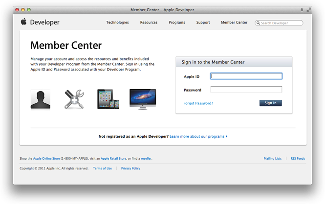
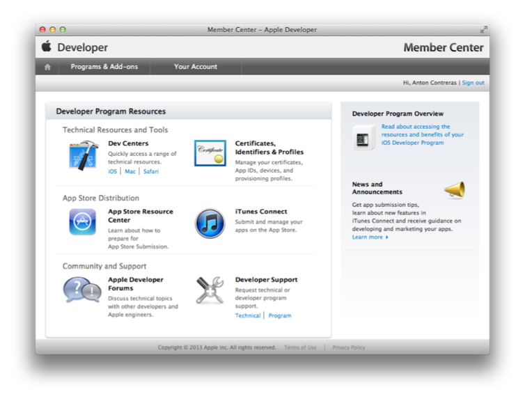
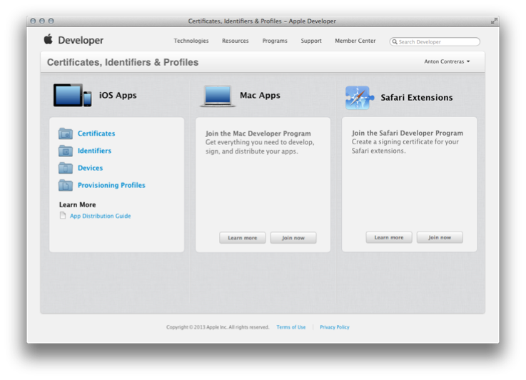

> 导航：[总目录](../../../README.md) · [documentation](../../../_indexes/documentation.md) · [App Store Submission Tutorial](About%20Your%20First%20App%20Store%20Submission.md)

[Next](Provisioning%20Your%20Devices%20for%20Development.md)[Previous](About%20Your%20First%20App%20Store%20Submission.md)

# Enrolling in the iOS Developer Program

To develop for the App Store, first join the iOS Developer Program. The program provides all the resources and tools to manage your account and to begin testing your app on a device. Enroll now.

During enrollment, you'll be asked for basic personal information, including your legal name and address. If you’re enrolling as a company/organization, you'll need to provide few more things, like your legal entity name and DUNS number, as part of the verification process. Once your information is verified, you'll review license agreements, purchase your program on the Apple Online Store, and receive details on how to activate your membership.

You can always can add more Apple Developer Program memberships to your account. For example, you can first join the iOS Developer Program, and later add the Mac Developer Program and the Safari Developer Program.

You administer your account with these iOS Developer Program web tools:

- __Member Center.__ The tool to manage developer program accounts, register App IDs and devices, create signing certificates, and create provisioning profiles. [Member Center](https://developer.apple.com/membercenter) is also a gateway to other resources and tools, including iTunes Connect.
- __iTunes Connect.__ The marketing and business tool used to check the status of your contracts, set up tax and banking information, obtain sales and finance reports, and manage metadata about your app.

To enroll in the iOS Developer Program, go to [Apple Developer Program Enrollment](https://developer.apple.com/programs/start/standard/) and follow the steps on the website.

When you enroll in an Apple Developer Program or are invited to join a team, you receive a series of emails. For example, if you need to register as an Apple developer, Apple sends you an email requesting that your confirm your email address. Be sure to read and follow the instructions in these emails promptly to streamline the enrollment process.

After you have successfully enrolled in the iOS Developer Program, you can follow the rest of the steps in this tutorial. You can perform some of the iOS provisioning profile administrative tasks using Xcode and return to the web tools as needed.

To follow the steps in this tutorial, you need to know how to log in to Member Center and find the web tools.

To sign in to Member Center

1. Open a browser and go to [http://developer.apple.com](https://developer.apple.com/).
2. Select Member Center in the toolbar.
3. Enter your Apple ID and password and click Sign In.

   
To access Certificates, Identifiers & Profiles

1. Sign in to [Member Center](https://developer.apple.com/membercenter).
2. Click the icon or text next to Certificates, Identifiers & Profiles under “Technical Resources and Tools.”

   
3. Click Provisioning Profiles under iOS Apps.

   
To go to iTunes Connect

1. Sign in to [Member Center](https://developer.apple.com/membercenter).
2. Click the icon or text next to iTunes Connect under “App Store Distribution”.
3. Enter your Apple ID and Password and click Sign In.

You learned how to enroll in an Apple Developer Program and how to access Member Center and iTunes Connect. You’ll use these resources throughout the development process to manage your account assets.

[Next](Provisioning%20Your%20Devices%20for%20Development.md)[Previous](About%20Your%20First%20App%20Store%20Submission.md)

