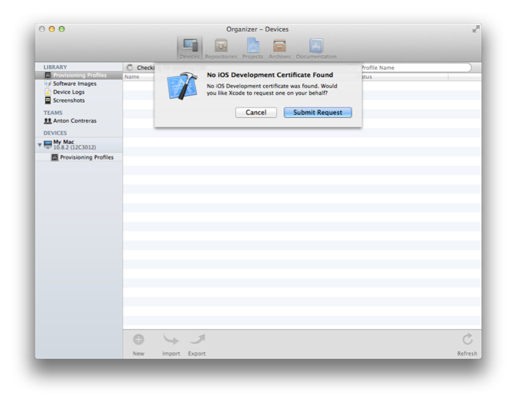
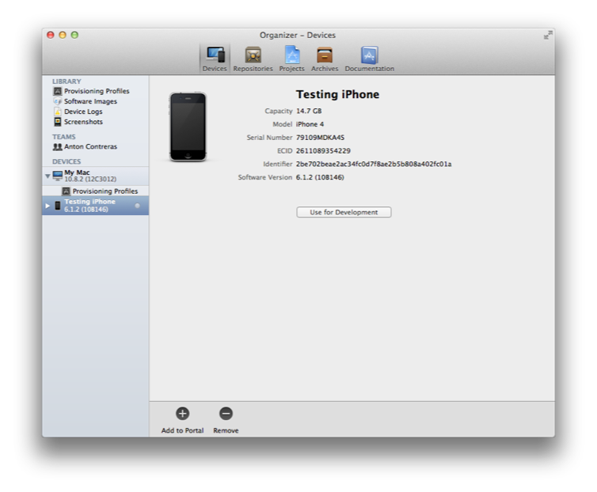
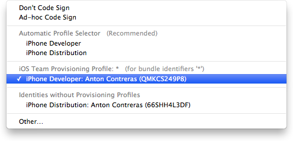
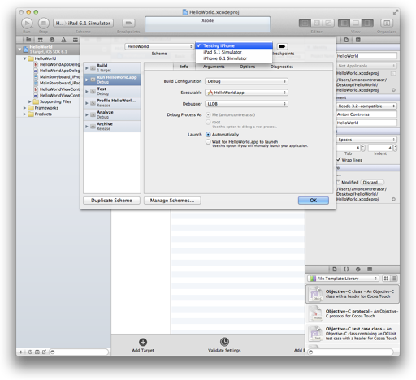

> 导航：[总目录](../../../README.md) · [documentation](../../../_indexes/documentation.md) · [App Store Submission Tutorial](About%20Your%20First%20App%20Store%20Submission.md)

[Next](Testing%20Your%20App%20on%20Many%20Devices%20and%20iOS%20Versions.md)[Previous](Enrolling%20in%20the%20iOS%20Developer%20Program.md)

# Provisioning Your Devices for Development

Although you can test an app you’re developing in iOS Simulator, you can’t effectively test all aspects of your app without testing it on a device. To run your app on an iOS device during development, it must be connected to your Mac, enabled for development, and recognized by Apple. You do this by providing some information about the app, yourself, and the device. You create a type of signing certificate, called a _development certificate_, to identify yourself. All of this information is incorporated into a development provisioning profile that is installed and that allows the app to launch on the device.

The easiest way to provision your devices for development is with Xcode. You can sign in to your account and view all the provisioning profiles and signing certificates for your account. Xcode provides a default iOS Team Provisioning Profile and iOS Wildcard App ID for you. Xcode automatically updates this provisioning profile when new development certificates or device IDs are added to your account. The iOS Team Provisioning Profile uses the iOS Wildcard App ID that matches all apps developed by you or your team. The iOS Team Provisioning Profile allows you to begin running the app on a device immediately. However, if you use iCloud storage, push notifications, In-App Purchase, or Game Center, you need to create a specialized provisioning profile, as described in _App Distribution Guide_.

To run your app on a device, you will perform these tasks in the tutorial steps that follow:

1. Request a development certificate.
2. Add your device to the portal.
3. Code sign your app.
4. Launch your app on the device.

When you refresh the provisioning profiles, Xcode creates your signing certificates. Xcode creates both development and distribution certificates on your behalf and automatically adds them to your keychain. A distribution certificate is needed later for testing and submitting your app to the App Store.

To request your development certificate in Xcode

1. Choose Window > Organizer.
2. Click Devices.
3. In the Library section, select Provisioning Profiles.
4. Click the Refresh button at the bottom of the window.
5. Enter your user name and password and click Log in.

   After you sign in to your account, a prompt appears, asking whether Xcode should request your development certificate.

   
6. Click the Submit Request button.

   The development certificate is added to your keychain and later added to the iOS Team Provisioning Profile.

   More prompts may appear, asking whether Xcode should request other types of certificates. Click the Submit Request button for each prompt that appears.
7. If a prompt appears at the end of the refresh process, asking whether you want to export your developer profile, click Export.

   The private keys for your certificates are stored in your keychain, and the public keys are stored in the portal. Therefore, you can’t move to another Mac or user account and refresh your provisioning profiles and certificates in Xcode to restore your certificates. Instead, you should back up your certificates after you create them and then import them from another Mac if you are missing private keys in your keychain.
8. Enter a filename and password, and click Save.

   Because the file contains your digital identity, which can be used to sign apps in your name, it is encrypted and password protected. (You will need the password later to import your digital assets to another system.)

The first time you add a device, Xcode creates the iOS Team Provisioning Profile and automatically installs it on the device. You simply connect your iOS device to your Mac and click the “Use for Development” button to add the device to the iOS Team Provisioning Profile.

To provision your device

1. Connect your device to your Mac.
2. Open the Devices organizer (Window > Organizer > Devices).
3. In the Devices section, select your iOS device.
4. Click the “Use for Development” button.

   The first time you add a device ID to your account, Xcode creates the iOS Team Provisioning Profile using the iOS Wildcard App ID, your development certificate, and the device ID. The iOS Team Provisioning Profile is also installed on your iOS device.

   If the device was used for development in the past, the “Use for Development” button may not appear. If this happens, click “Add to Portal” at the bottom of the screen instead.

   

When you build the app, you code sign it with the signing certificate contained in the provisioning profile you want to use. A menu item appears (in the Code Signing Identity Build setting pop-up menu) for each provisioning profile your development certificate belongs to. The default setting is iPhone Developer in the Automatic Profile Selector menu, which matches your iOS Team Provisioning Profile developer certificate. If you previously changed this build setting or created other provisioning profiles that use your developer certificate, set the Code Signing Identity to your developer certificate contained in the iOS Team Provisioning Profile.

To set the code signing identity to your iOS Team Provisioning Profile development certificate

1. Select the project.
2. Click Build Settings.
3. Click All.
4. Type `Code Signing` in the search field in the Build Settings pane of the project editor.
5. From the Code Signing Identity pop-up menu, in the iOS Team Provisioning Profile section, choose the certificate that begins with “iPhone Developer:” followed by your name.

   

After you provision your device for development, you can tell Xcode to launch the app on the device. You do this by changing the _run destination_ setting in the Scheme pop-up menu before you build the app.

To launch the app on the device

1. Choose Product > Scheme > Edit Scheme to open the scheme editor.
2. Select your device from the Destination pop-up menu.

   When you connect an iOS device with a valid provisioning profile into your Mac, its name appears as an option in the destination Scheme pop-up menu.

   
3. Click OK to close the scheme editor.
4. Click the Run button.

   When the app is built, it is signed. If a prompt appears asking whether code sign can sign the app using a key in your keychain, click Allow or Always Allow.

In this chapter you learned how to request a development certificate using Xcode, and how to provision your device for development so that Xcode could launch the app on the device you’ve chosen. You also code signed your app with the signing certificate contained in the provisioning profile.

[Next](Testing%20Your%20App%20on%20Many%20Devices%20and%20iOS%20Versions.md)[Previous](Enrolling%20in%20the%20iOS%20Developer%20Program.md)

