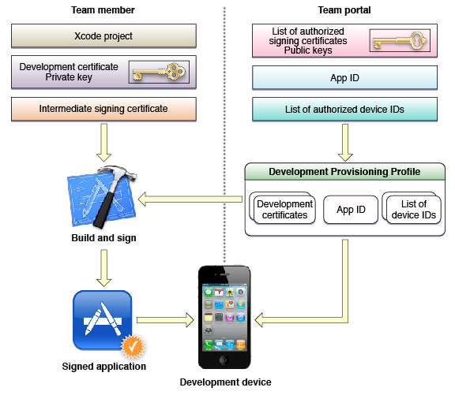
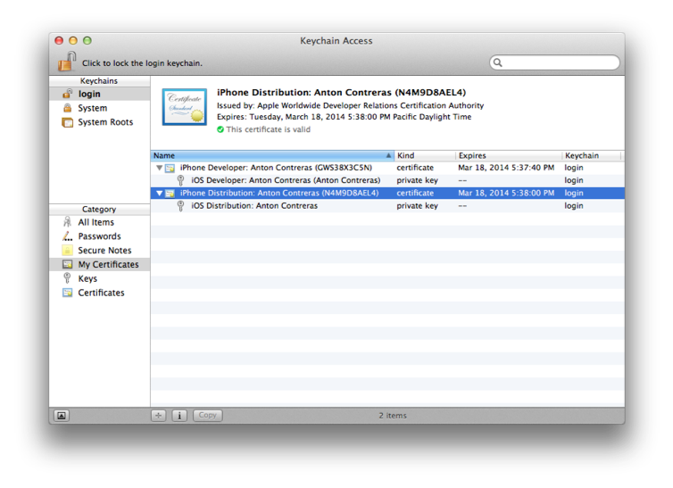
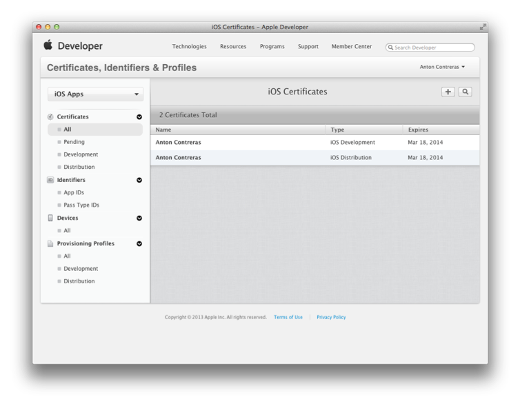

> 导航：[总目录](../../../README.md) · [documentation](../../../_indexes/documentation.md) · [App Store Submission Tutorial](About%20Your%20First%20App%20Store%20Submission.md)

[Next](Next%20Steps.md)[Previous](Submitting%20Your%20App.md)

# Review and Troubleshooting

This tutorial has taught you how to provision your devices for development and testing, and how to prepare your app for distribution. Because provisioning and code signing are complicated, all the pieces need to be in the right place for you to run your app on a device and distribute it successfully. If you inadvertently change your app configuration, a key in your keychain, or an iOS provisioning profile asset, provisioning may fail. Fortunately, there are some common problems that are easy to fix.

For a complete discussion of troubleshooting, read iOS Development: Troubleshooting.

A provisioning profile allows an app to run on a device. A provisioning profile resides in Certificates, Identifiers & Profiles within Member Center and is downloaded by Xcode and eventually installed on a device. Development and ad hoc provisioning profiles are conceptually similar. A development provisioning profile is used by the team to test the app during development and contains a list of development certificates, an [App ID](https://developer.apple.com/library/archive/documentation/General/Conceptual/DevPedia-CocoaCore/AppID.html#//apple_ref/doc/uid/TP40008195-CH64), and list of device IDs. An ad hoc provisioning profile allows outside testers to run the app on specific devices and contains a single distribution certificate, an App ID, and a list of device IDs. Both development and ad hoc provisioning profiles are installed on a device. If the configuration of the signed app matches the provisioning profile installed on the device, the app launches on the device.

When you create a development or distribution certificate on your Mac, the private key is stored in your keychain and the public key is stored in the portal. These certificates are issued by Apple and validated by an intermediate signing certificate, called _Apple Worldwide Developer Relations Certification Authority_, which is added to your System keychain when you install Xcode.

If you use a specialized technology that requires an explicit App ID, you need to register that App ID using Certificates, Identifiers & Profiles within Member Center. The App ID you create needs to match the bundle ID set in the Xcode project. The bundle ID is contained in the signed app that is installed on the device, and it is compared with the App ID in the provisioning profile at launch time. If the bundle ID matches the App ID, the app launches.

New devices that you add using Xcode are automatically added to the default iOS Team Provisioning Profile but are not automatically added to specialized provisioning profiles. If you use a specialized provisioning profile, update the provisioning profile using Certificates, Identifiers & Profiles within Member Center and refresh it in Xcode to run your app on a new device.

After you request a development or distribution certificate using Xcode and it is approved, the certificate is installed in your login keychain. In Xcode, code signing fails if these certificates are not valid. If you accidentally removed the intermediate signing certificate, you can retrieve it from Certificates, Identifiers & Profiles within Member Center and install it again. First, you should verify the state of your certificates using Keychain Access.

To verify your certificates using Keychain Access

1. Launch Keychain Access, located in the `/Applications/Utilities` folder.
2. In the Category sidebar, select Certificates.
3. In the window’s search field, enter `iPhone`.

   Two certificates beginning with the text “iPhone” should appear. The name of the development certificate begins with the text “iPhone Developer:” and the distribution certificate begins with the text “iPhone Distribution:” followed by your name. Each certificate should have a disclosure triangle next to the name.

   You should remove other certificates beginning with “iPhone” that do not have a disclosure triangle. These certificates may appear if the associated private key is accidentally deleted from Keychain Access.

   
4. Click the disclosure triangle next to the name of the certificates to reveal the private keys.

   The private key is stored in your keychain, and the public key is stored in the portal.
5. Select each certificate separately.

   The pane above should display a green circle containing a checkmark, and the text next to the circle should read “This certificate is valid.”

To use your certificates, you must have the correct intermediate certificate installed in your keychain.

To install the intermediate certificate

1. Sign in to the Certificates, Identifiers & Profiles within [Member Center](https://developer.apple.com/membercenter).
2. Click Certificates under iOS Apps.
3. Click the certificate that needs to be installed.

   
4. Click the Download button.
5. Double-click the certificate file to install it in your system keychain.

Because a signing certificate public key is stored on the portal and the private key is stored in your login keychain, you can’t refresh your provisioning profiles and certificates in Xcode to replace a missing private key. Instead, you export your digital identities after they are first created as a backup or if you want to develop on another Mac. The exported file is password protected. You should not share this file or the password with others. Later, you can import your digital identities to repair your keychain or import them to another Mac you want to use for development.

When you refreshed your provisioning profiles and created your development and distribution certificates for the first time, Xcode displayed a prompt asking whether you wanted to save your developer profile. If you did not choose the export option then, export your digital assets now.

To export your code signing certificates and provisioning profiles

1. In the Devices organizer, select a team from the Team section.
2. Click Export.
3. Enter a filename and password.
4. Click Save.

   The file saved has a `.developerprofile` extension.

If you move to another development system, you need to import your digital identities to the new system.

To import your code signing certificates and provisioning profiles

1. In the Devices organizer, select a team from the Team section.

   If the Team section doesn’t appear, refresh your provisioning profiles before continuing, as described in [To request your development certificate in Xcode](Provisioning%20Your%20Devices%20for%20Development.md#apple-f4xwc4dqnrsv64tfmyxwi33df52wszbpkridimbqgeytgnzvfvbuqnbnknltg).
2. Click Import.
3. Select the developer profile file you want to import.
4. Enter the password for the file.
5. Click Open.

   The code signing certificates contained in the file are added to Xcode and to your keychain. The provisioning profiles are added to Xcode.

When you distribute an ad hoc provisioning profile and installer package to testers, even though testers may successfully install the app on their device, it may not launch. One reason may be that the iOS App Target settings do not match the device and installed iOS version. Verify that the iOS App target settings, in the Summary pane in Xcode, are correct. For example, if the Devices pop-up menu is set to iPad, your app won’t launch on an iPhone. If you want to support all types of devices, choose Universal from this pop-up menu. If your Deployment Target is set to the most recent iOS version, your app may not run on older devices.

[Next](Next%20Steps.md)[Previous](Submitting%20Your%20App.md)

