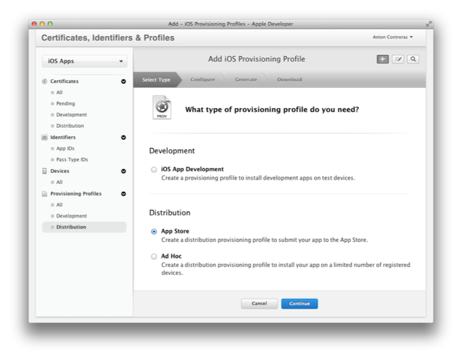
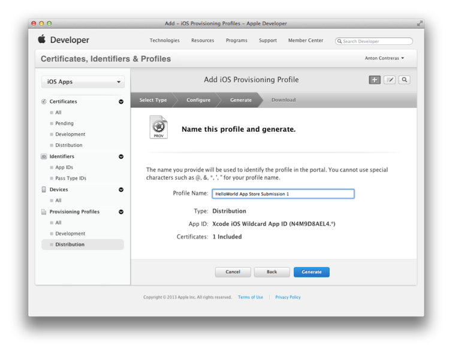
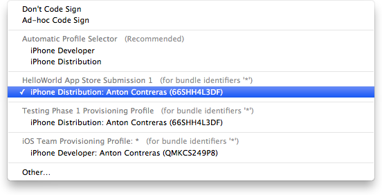
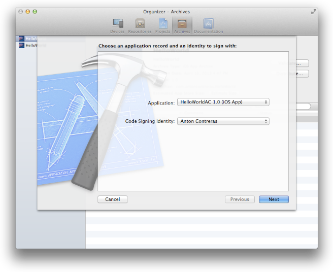
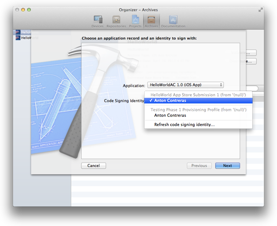
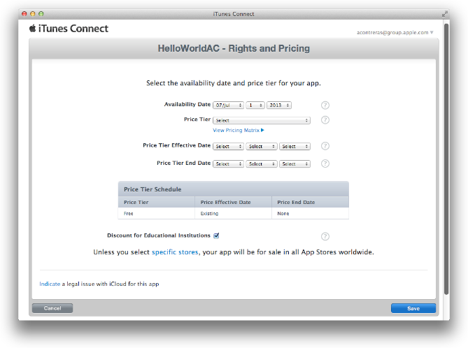

> 导航：[总目录](../../../README.md) · [documentation](../../../_indexes/documentation.md) · [App Store Submission Tutorial](About%20Your%20First%20App%20Store%20Submission.md)

[Next](Review%20and%20Troubleshooting.md)[Previous](Creating%20Your%20App%20Record%20in%20iTunes%20Connect.md)

# Submitting Your App

Submitting your app to the App Store is a multistep process involving several tools. First, create a distribution provisioning profile using Member Center. Then create an archive, validate it, and submit it to the App Store using Xcode. When your app is approved, set the date when your app will be available to customers using iTunes Connect. Finally, respond to user issues after you ship your first version.

Before starting, you should have the distribution certificate you created in [Testing Your App on Many Devices and iOS Versions](Testing%20Your%20App%20on%20Many%20Devices%20and%20iOS%20Versions.md#apple-f4xwc4dqnrsv64tfmyxwi33df52wszbpkridimbqgeytgnzvfvbuqnjnknltc) and the status of your iTunes Connect app record should be “Waiting for Upload” or later, as described in [Creating Your App Record in iTunes Connect](Creating%20Your%20App%20Record%20in%20iTunes%20Connect.md#apple-f4xwc4dqnrsv64tfmyxwi33df52wszbpkridimbqgeytgnzvfvbuqnrnknltc).

Now, create a distribution provisioning profile using Member Center.

When the app is ready for publication, you create a distribution provisioning profile by selecting App Store as the method of distribution. The steps are similar to creating an ad hoc provisioning profile for testing except that you select an App ID only. You do not select any signing certificates or device IDs.

To create a distribution provisioning profile

1. Access Certificates, Identifiers & Profiles in [Member Center](https://developer.apple.com/membercenter).
2. Select Provisioning Profiles under iOS Apps.
3. Select the Distribution tab.
4. Click the plus button (+).
5. Select App Store as the distribution method, and click Continue.

   
6. Choose Xcode iOS Wildcard App ID as the App ID, and click Continue.
7. Confirm that your distribution certificate is displayed, and click Continue.
8. Enter a profile name, and click Generate.

   
9. Click Done.

When the app is ready for submission, use Xcode to create and validate an archive. It’s recommended that you use the version of your app that you built for testing (in [Testing Your App on Many Devices and iOS Versions](Testing%20Your%20App%20on%20Many%20Devices%20and%20iOS%20Versions.md#apple-f4xwc4dqnrsv64tfmyxwi33df52wszbpkridimbqgeytgnzvfvbuqnjnknltc)) if it exhibited no problems during testing and if it is the version of the app you want to ship. Otherwise, you may inadvertently submit an untested version of your app.

The archive that you submit must be signed with your distribution certificate contained in the distribution provisioning profile you created in [Create a Distribution Provisioning Profile](#apple-f4xwc4dqnrsv64tfmyxwi33df52wszbpkridimbqgeytgnzvfvbuqnznknlte). You download the distribution provisioning profile from Certificates, Identifiers & Profiles in Member Center and import it into Xcode. Then you can sign the archive using your distribution certificate.

Before you can submit the archive to the App Store, it must pass validation tests. The validation process performs an automated check against the app in the archive and against the information you provided in your iTunes Connect record. If problems are found during validation, you need to fix them before continuing. At this stage in the development process, it’s good practice to periodically validate your archive to identify these types of problems early.

To download the distribution provisioning profile

1. Access Certificates, Identifiers & Profiles in [Member Center](https://developer.apple.com/membercenter).
2. Select Provisioning Profiles under iOS Apps.
3. Select Distribution under Provisioning Profiles.
4. Select the distribution provisioning profile you want to download.
5. Click the Download button.

   A file with the provisioning profile name and the `.mobileprovision` extension appears in your Downloads folder.

Next, import the distribution provisioning profile using Xcode.

To import the distribution provisioning profile

1. In Xcode, choose Window > Organizer.
2. Click Devices.
3. Select Provisioning Profiles.
4. Drag the provisioning profile with the `.mobileprovision` extension to the Devices organizer.

   After Xcode imports the distribution provisioning profile, it should appear in the Devices organizer.

Next, set the code signing identity. The app is then code signed when you create as archive.

To set the code signing identity to your distribution certificate

1. In the Xcode project editor, select the project.
2. Click Build Settings.
3. Click All.
4. Type `Code Signing` in the search field in the Build Settings pane of the project editor.
5. From the Code Signing Identity pop-up menu, in the distribution provisioning profile section, choose the certificate that begins with “iPhone Distribution:” followed by your name.

   

Next, create an archive. Archives allow you to build your app, and store it in a bundle managed by Xcode.

To create the archive

1. Select the Xcode project window.
2. Choose iOS Device from the scheme toolbar menu.
3. Choose Product > Archive.

   The Archives organizer appears and displays the new archive.
To validate the archive

1. In the Archives organizer, select the archive.
2. Click the Validate button.
3. Enter your iTunes Connect credentials, and click Next.
4. Select the app you want to share and the appropriate signing identity, and click Next.

   
5. Review validation issues found, if any, and click Finish.

You need to fix any validation issues, create a new archive, and validate it again. You cannot proceed until the archive passes the validation tests.

Submitting your app to the App Store is a multistep process, too. First, you transmit the archive to Apple, then Apple approves your app, and then you set a ship date before it actually appears on the App Store.

Only after passing validation tests can you submit your app to the App Store. In fact, Xcode validates your archive again during the submission process.

To submit the archive to the App Store

1. In the Archives organizer, select the archive.
2. Click the Distribute button.
3. Select “Submit to the iOS App Store,” and click Next.

   
4. Enter your iTunes Connect credentials, and click Next.
5. Select the app you want to share and the appropriate signing identity, and click Next.

   Xcode runs the validation tests again. If issues are found, click Cancel and fix them before continuing.

   
6. Enter a filename and location for the App Store package, and click Save.

Xcode transmits the archive to Apple, where it is examined to determine whether it conforms to the app guidelines. If the app is rejected, correct the problems that were brought up during app approval and resubmit it. Before you submit the app, read _iOS Human Interface Guidelines_ and _[App Store Review Guidelines](https://developer.apple.com/appstore/resources/approval/guidelines.html)_ to avoid problems.

Use iTunes Connect to set a date when the app is available on the App Store. For example, you can choose a date that immediately releases the app to the App Store after it is approved, or you can set a date for sometime in the future. Using a later availability date allows you to arrange other marketing activities around the launch of your app.

To set the availability date

1. Sign in to iTunes Connect.
2. Select Manage Your Applications.
3. Select your app in the iOS App Recent Activity section.
4. Click Rights and Pricing.
5. Choose a date from the Availability Date pop-up menus.

   
6. Optionally, edit the other fields on this form.
7. Click Save.

Changes you make to Rights and Pricing go live immediately (expect 24 hours for a full refresh of the changes on the App Store).

After you submit the app to the App Store, you need to manage the app records and maintain the app throughout its lifetime. After the app is available on the App Store, you need to monitor your app, respond to user issues, and submit updates as needed.

__Pay attention to how users perceive the app.__ Customer ratings and reviews on the App Store can have a big effect on the success of the app; if users run into problems, work quickly to determine the bug and submit a new version of the app through the approval process.

__Investigate iTunes Connect data.__ iTunes Connect provides data to help you determine how successful the app is, including sales and financial reports, customer reviews, and crash logs submitted to Apple by users. Crash logs are particularly important, because they represent significant problems that users are seeing in the app. Make investigating these reports a high priority.

Except for low-memory crash logs, all crash logs contain stack traces for each thread at the time of termination. To view a crash log, open it in the Xcode Organizer. As long as your Mac has the archive corresponding to the version of the app that generated the crash log, Xcode automatically resolves any addresses in the crash log with the actual classes and functions in the app.

In this chapter you learned how to use various tools to prepare and submit your app to the App Store. You first created a distribution provisioning profile in Member Center. You then created an archive, validated it, and submitted it to the App Store using Xcode.

[Next](Review%20and%20Troubleshooting.md)[Previous](Creating%20Your%20App%20Record%20in%20iTunes%20Connect.md)

