> 导航：[总目录](../../../README.md) · [documentation](../../../_indexes/documentation.md) · [App Store Submission Tutorial](About%20Your%20First%20App%20Store%20Submission.md)

[Next](Creating%20Your%20App%20Record%20in%20iTunes%20Connect.md)[Previous](Provisioning%20Your%20Devices%20for%20Development.md)

# Testing Your App on Many Devices and iOS Versions

You should plan for rigorously testing the app on a variety of devices and iOS versions. It’s not sufficient to test the app using only iOS Simulator and a device provisioned for development. A simulator doesn’t run all threads that run on devices, and launching apps on devices using Xcode disables some of the watchdog timers. At a minimum, test the app on all the devices you have available. Ideally, test the app on all the devices and iOS versions you intend to support. For example, if you have a game that’s intended to run only on iPhone and iPod touch, test it on those devices and not on iPad.

To test your app on a variety of devices and iOS versions, create a special distribution provisioning profile, called an _ad hoc provisioning profile_, and send it, along with the app, to testers. An ad hoc provisioning profile doesn’t require that testers be enrolled in an Apple Developer Program, be added to your team, create signing certificates, or use Xcode to run your app. Instead, app testers simply install the app and the ad hoc provisioning profile on their device to launch the app. You can then collect and analyze crash reports or logs from these testers to resolve problems before you ship your app.

Testing your app consists of these tasks:

1. Configure your app for distribution.
2. Test your app locally.
3. Register all the testing unit device IDs.
4. Create an ad hoc provisioning profile.
5. Create an iOS App Store Package.
6. Install the ad hoc provisioning profile and app on test devices.
7. Send crash reports to developers.

Most of the settings you need to configure your app for distribution and submission to the App Store are located in the target’s Summary pane in Xcode. The default values for these settings are sufficient to start developing an app, but before distributing it, you should change some of those values. For example, test versions of your app should contain artwork that iTunes uses to identify your app on the device. Otherwise, when testers add your app to their iTunes library, iTunes uses generic artwork to represent it. Later, you’ll need iTunes artwork to pass validation tests before you submit your app to the App Store. So now is a good time to add the iTunes artwork to your Xcode project and set other distribution options. Later, you’ll set more values for submission to the App Store.

For an iPhone app, these deployment settings are located in the project editor pane’s Summary tab in iPhone/iPod Deployment Info.

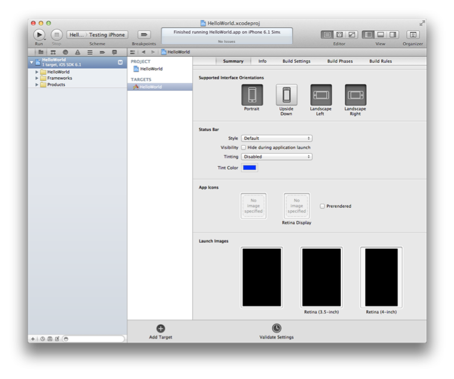

First, set the device orientations your app supports by selecting the Portrait, Upside Down, Landscape Left, and Landscape Right icons as appropriate. In the HelloWorld app project, select all the orientations.

App icons are nice to have for testing but are required later to submit to the App Store (because you need to set the app icons to pass validation tests). However, launch images—the images iOS displays to the user while your app is launching on the device—are optional. At a minimum, create two versions of your app icons—non-Retina 57 x 57 pixels and Retina 114 x 114 pixels—and drag them to the corresponding wells in the Summary tab. If your app supports the iPad, create a 72 x 72 pixels version of your app icon and drag it to the corresponding well in the Summary tab.

To add an app icon

1. In the project navigator, select your project.
2. Select your target in the Targets section of the second sidebar.
3. Select the Summary tab.
4. Drag the icon file to the appropriate App Icons image well.

Before you distribute your app for testing, you should finish configuring and testing your app locally. You need to set the target devices and iOS versions that you intend to support. For example, if you want to test your app on both iPhone and iPad devices, set the target devices to Universal. Set the target iOS version as well, and be sure to test your app on the corresponding simulators and devices before creating the archive. For example, if you use storyboards, your minimum iOS version is 5.0. The selection of simulators changes depending on the values you set.

In this tutorial, you will set the HelloWorld target devices to Universal, and the deployment target to 6.1. Then you will test HelloWorld in the iPad 6.0 Simulator and iPhone 6.0 Simulator. If you have corresponding iOS devices, connect them to your Mac and run the app on them, too.

To set the device families you want to support

1. In the project navigator, select the project.
2. From the target list in the project editor, select the target that builds your app, and click Summary.
3. From the Devices pop-up menu, choose iPhone, iPad, or (to target both device types) Universal. For the HelloWorld project, select Universal.

   The scheme toolbar menu changes to include the devices you have selected.

   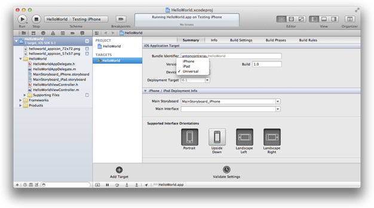

The deployment target setting specifies the lowest operating-system version that your app will run on. For example, the lowest available setting for iPad apps is iOS 4.3.

To set the deployment target

1. In the project navigator, select the project.
2. From the target list in the project editor, select the target that builds your app, and click Summary.
3. From the Deployment Target pop-up menu, choose the minimum iOS release you want to target. For the HelloWorld project, choose 6.1.

   The scheme toolbar menu changes to include the iOS releases you selected.

   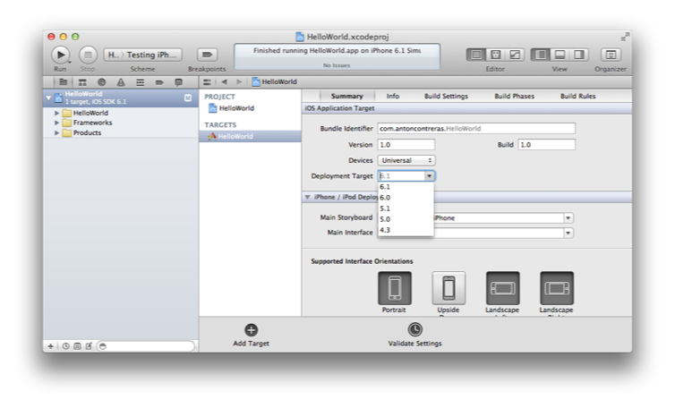

You should also test your app in iOS Simulator using Instruments and other tools before distributing your app.

To test your app in iOS Simulator

1. Choose a simulated device from the scheme toolbar menu.

   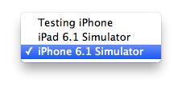
2. Choose Product > Run.

Before you can create an ad hoc provisioning profile, you need to collect device IDs from testers and add them to the iOS Provisioning Portal.

Testers can get their device ID using iTunes. (They do not need to install Xcode to do this.) Send these instructions to testers, and ask them to send their device IDs to you.

To simulate a person testing your app, use a device and Mac that you are not using for development to get the device ID. Then follow the steps to add the device ID to the portal.

To get a device ID using iTunes

1. Launch iTunes.
2. Connect your device to your Mac.
3. Click your device on the top-right corner of iTunes.
4. In the Summary pane, click the Serial Number label.

   The label Serial Number changes to Identifier and displays the device ID.

   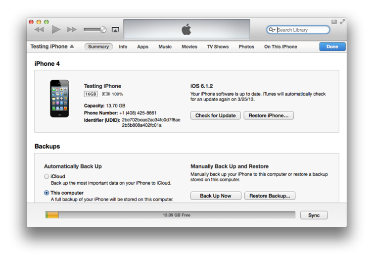
5. To copy the device ID, Control-click the device ID and select Copy Identifier (UDID).

Next, you need to collect device IDs from testers and add the devices to Member Center.

To add a tester’s device ID

1. Access Certificates, Identifiers & Profiles from [Member Center](https://developer.apple.com/membercenter).
2. Click All listed under Devices.
3. Click the plus button (+).
4. Enter a device name and the device ID.

   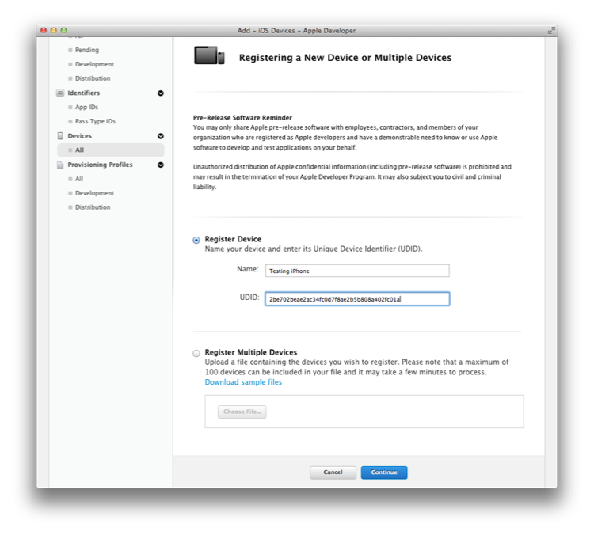
5. Click Continue.

Using the iOS Provisioning Portal, you create an ad hoc provisioning profile containing your App ID and the device IDs.

To create an ad hoc provisioning profile

1. Access Certificates, Identifiers & Profiles within [Member Center](https://developer.apple.com/membercenter).
2. Select Provisioning Profiles under iOS.
3. Select Distribution under Provisioning Profiles.
4. Click the plus button (+) in the upper-right corner.
5. Select Ad Hoc as the distribution method, then click Continue.

   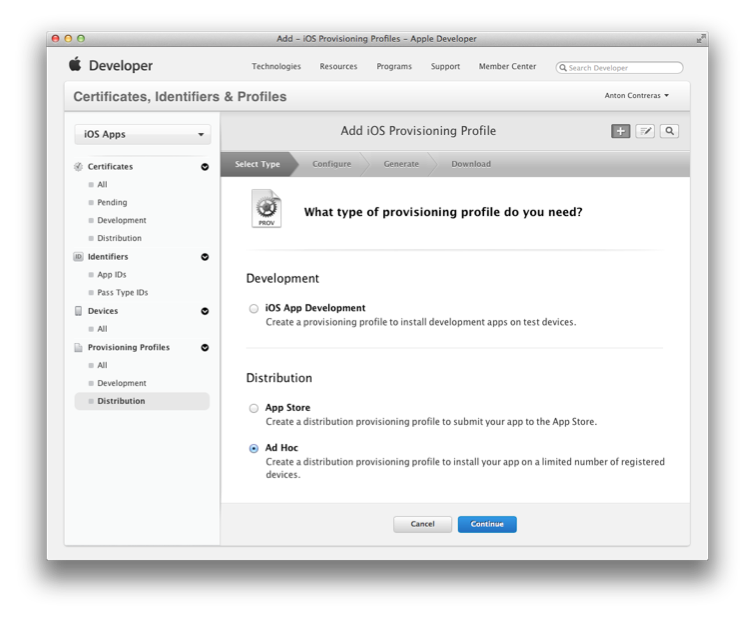
6. Select Xcode iOS Wildcard App ID as the App ID, and click Continue.
7. Confirm that your distribution certificate is displayed, and click Continue.
8. Select the devices you want to be able to run the app on, and click Continue.
9. Enter a profile name, and click Generate.

   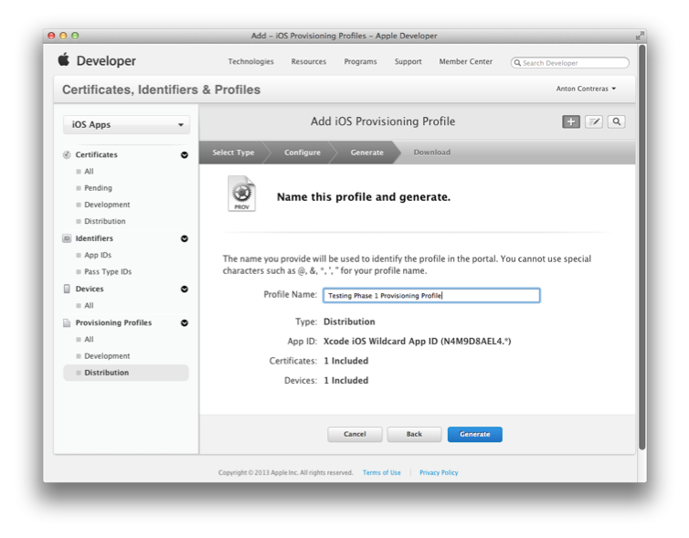
10. Click Done.

When the app is ready to be tested, use Xcode to create an archive and generate an iOS App Store Package (a file with a `.ipa` filename extension).

To create an archive

1. Select the Xcode project window.
2. Choose iOS Device or your device name from the scheme toolbar menu.

   You cannot create an archive of a simulator build. If an iOS device is connected, the iOS Device menu item appears when you disconnect it.
3. Choose Product > Archive.

   After Xcode creates the archive, the Archives organizer appears and displays the new archive.

   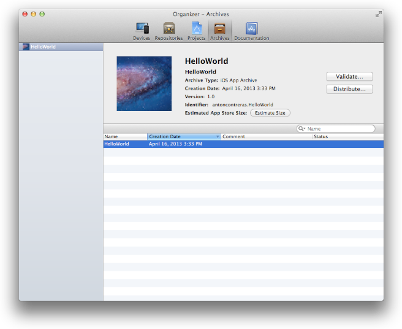
To create an iOS App Store Package for testing on devices

1. In the Archives organizer, select the archive.
2. Click the Distribute button.
3. Select “Save for Enterprise or Ad-Hoc Deployment,” and click Next.

   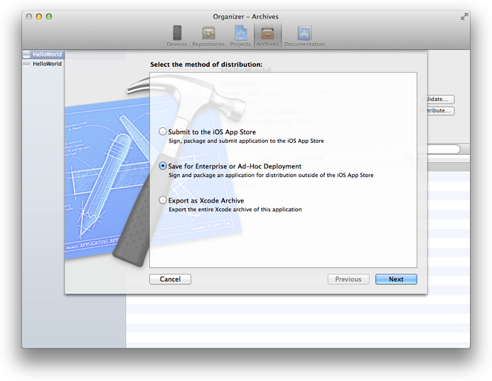
4. Choose your distribution certificate (the one contained in your ad hoc provisioning profile) from the Code Signing Identity pop-up menu, and click Next.

   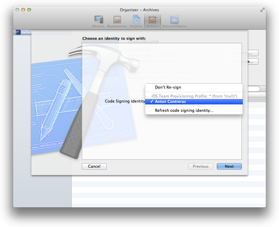
5. Enter a filename and location for the App Store package, and click Save.

   The file will have a `.ipa` extension

Finally, download the ad hoc provisioning profile from iOS Provisioning Portal and give it to testers, along with the IPA file. Testers will use iTunes to install the provisioning profile and the app on their device. When the app crashes on a device, iOS creates a record of that event. The next time the tester connects the iOS device to iTunes, iTunes downloads those records (known as _crash logs_) to the tester’s Mac. Testers should send these crash logs to you.

To download the ad hoc provisioning profile

1. Access Certificates, Identifiers & Profiles from [Member Center](https://developer.apple.com/membercenter).
2. Select Provisioning Profiles under iOS.
3. Select Distribution under Provisioning Profiles.
4. Select the distribution provisioning profile to be downloaded.

   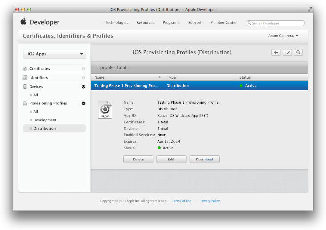
5. Click the Download button.

   A file with the provisioning profile name and the `.mobileprovision` extension appears in your Downloads folder.

After you send the application and ad hoc provisioning profile to testers, they perform the following tasks on their devices. Send these instructions to testers.

To install the app on a device

1. Connect the testing device to a Mac running iTunes.
2. In the Finder, drag the provisioning profile (the file with the `.mobileprovision` extension) to the iTunes icon in the Dock.
3. Double-click the app archive (the file with the `.ipa` extension).

   The app appears in the iTunes app list.

   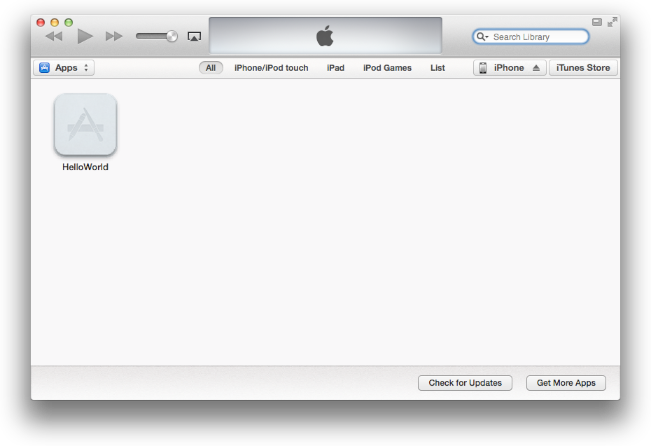
4. Click your device in the upper-right corner of iTunes.
5. Select the Apps tab.
6. Click Sync Apps and HelloWorld.
7. Click the Apply button to sync the device.

   The app and the provisioning profile are uploaded to the device so that the user can start testing.

It’s difficult to simulate a crash using the HelloWorld app, but when you distribute your own app for testing, know that it may crash on test devices and that you’ll want the crash reports. Send these instructions to testers, along with the ad hoc provisioning profile and app package.

To send crash reports to developers

1. Connect the testing device to a Mac running iTunes.

   iTunes downloads the crash reports to your Mac.
2. In the Finder, choose Go > Go to Folder.
3. Enter `~/Library/Logs/CrashReporter/MobileDevice`.
4. Open the folder identified by your device’s name.
5. Select the crash logs named after the app you’re testing.
6. Choose Finder > Services > Mail > Send File.
7. In the New Message window, enter the developer’s address in the To field and appropriate text in the Subject field.
8. Choose Message > Send.
9. (Optional) Delete the crash reports you sent in order to avoid sending duplicate reports later.

In this chapter you learned the Xcode preparatory steps for testing your app on a variety of devices and iOS versions. You then created a special distribution provisioning profile-the ad hoc provisioning profile—containing your App ID and the device IDs. This profile allows developers to install your app and run it without needing to go through Xcode. Finally, you leaned how to use iTunes to collect and handle the crash reports submitted by testers.

[Next](Creating%20Your%20App%20Record%20in%20iTunes%20Connect.md)[Previous](Provisioning%20Your%20Devices%20for%20Development.md)

