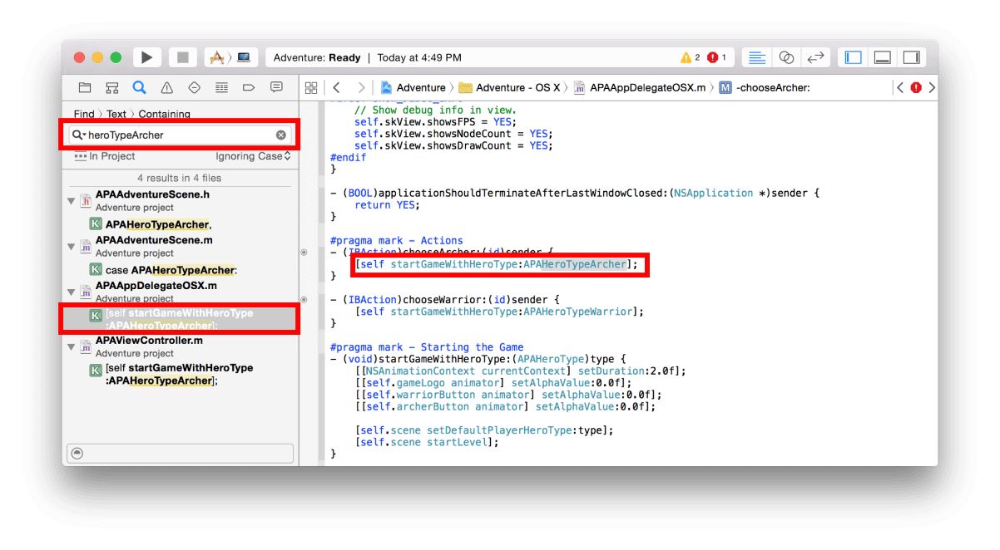

> 导航：[总目录](../../../README.md) · [documentation](../../../_indexes/documentation.md) · [Xcode Overview](index.md)

[Next](AccessingResourcesandInspectingElements.md)[Previous](NavigatingYourWorkspace.md)

## Editing Your Files

Most development work in Xcode occurs in the editor area, the main area that is always visible within the workspace window. The editors you use most often are:

- __Source editor.__ Write and edit source code.
- __Interface Builder.__ Graphically create and edit user interface files.
- __Project editor.__ View and edit how your apps should be built, such as by specifying build options, target architectures, and app entitlements.

When you select a file from the content area of a navigator, Xcode opens the file in an appropriate editor. In the screenshot, the file `iPhoneStoryboard.storyboard` is selected in the project navigator, and the file is open in Interface Builder. Interface Builder is showing both the outline view on the left and the canvas on the right. For more information, see [Building a User Interface](UsingInterfaceBuilder.md#apple-f4xwc4dqnrsv64tfmyxwi33df52wszbpkridimbqgeydemjvfvbuqnjnknltc). (The optional utilities and debug areas are hidden to maximize space for the navigator and editor.)

The following screenshot shows a number of search results appearing in the find navigator’s content area. One of the results is selected, and its text string appears in the source editor. Find also searches for symbols and other text in Interface Builder.

### Configuring the Editor Area

Configure the editor area for a given task with the editor configuration buttons on the right side of the toolbar:

- （原归档配图获取待重试：`XC_O_editor_buttons_standard_2x.png`）__Standard editor.__ Fills the editor area with the contents of the selected file.
- （原归档配图获取待重试：`XC_O_editor_buttons_assistant_2x.png`）__Assistant editor.__ Presents a separate editor pane with content logically related to content in the standard editor pane. You can also change the content.
- （原归档配图获取待重试：`XC_O_editor_buttons_version_2x.png`）__Version editor.__ Shows the differences between the selected file in one pane and another version of that same file in a second pane. This editor works only when your project is under source control.

This screenshot shows an implementation file, `APAAdventureScene.m`, open in the standard editor pane. The three optional workspace areas—navigator, debugger, and utilities—are hidden to maximize the editor’s content display. Within the source code editor, the assistant pane displays the implementation file’s associated header file, `APAAdventureScene.h`.

（原归档配图获取待重试：`XC_O_EditArea_2x.png`）

### Using the Jump Bar

Every editor or assistant editor pane includes a jump bar—an interactive, hierarchical mechanism for navigating directly to items at any level in your project. The configuration and behavior of the jump bar is customized for its context. The basic jump bar configuration includes three components:

- The related items menu (（原归档配图获取待重试：`XC_O_jumpbar_related_button_2x.png`）) offers additional selections relevant in the current context, such as recently opened files or the interface (`.h`) file for an implementation (`.m`) file you are editing.
- Previous and Next buttons (（原归档配图获取待重试：`XC_O_jumpbar_next_prev_buttons_2x.png`）) allow you to step back and forth through your navigation history.
- The jump bar allows you to change what is shown in the editor or assistant editor pane by navigating to a new item. It is made up of one or more segments depending on what part of the path you click.

Click a segment in the jump bar to see a pop-up menu of related items. For example, if the segment identifies the name of the project, you use the jump bar to navigate to and open any file within the project. If the segment identifies the name of a folder, you can use the jump bar to open a file within the folder. If the segment identifies the name of a source file, you use the jump bar to show and select a symbol within the currently open file.

（原归档配图获取待重试：`XC_O_JumpbarShortcutWithCallouts_2x.png`）

[Navigating Your Workspace](NavigatingYourWorkspace.md#apple-f4xwc4dqnrsv64tfmyxwi33df52wszbpkridimbqgeydemjvfvbuqmrwfvjvomi)

[Accessing Resources and Inspecting Elements](AccessingResourcesandInspectingElements.md#apple-f4xwc4dqnrsv64tfmyxwi33df52wszbpkridimbqgeydemjvfvbuqmryfvjvomi)

Copyright © 2018 Apple Inc. All rights reserved.
[Terms of Use](http://www.apple.com/legal/terms/site.html) |
[Privacy Policy](http://www.apple.com/privacy/) |
[Updated: 2016-10-27](RevisionHistory.md#apple-f4xwc4dqnrsv64tfmyxwi33df52wszbpkridimbqgeydemjvfvbuqmrsfvjvomi)

[Next](AccessingResourcesandInspectingElements.md)[Previous](NavigatingYourWorkspace.md)
