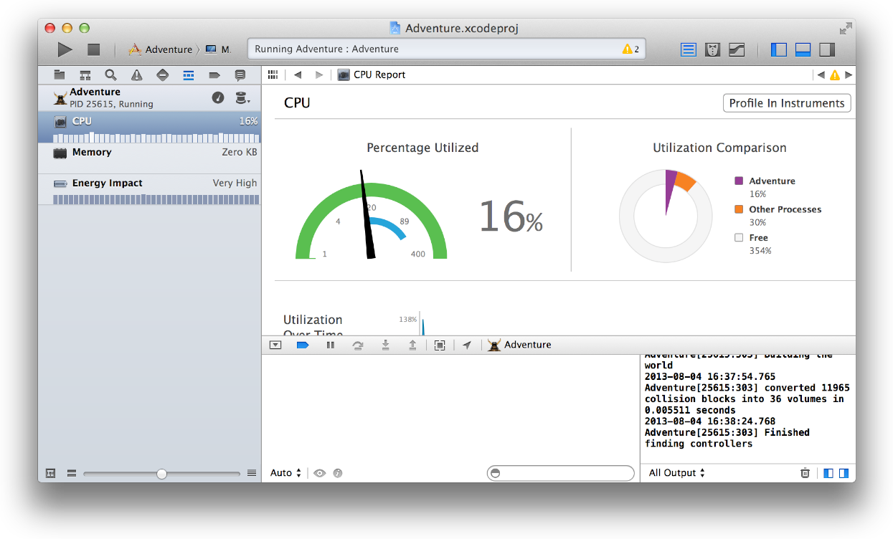

> 导航：[总目录](../../../README.md) · [documentation](../../../_indexes/documentation.md) · [Xcode Overview](index.md)

[Next](MeasuringPerformance.md)[Previous](ExaminingtheViewHierarchy.md)

## Examining System Impact

The debug navigator displays gauges that provide insight into how your app is performing. For example, the CPU gauge shows a readout of your app’s CPU usage, making it easy to spot unexpected spikes. Depending on the capabilities of your app and the characteristics of its destination, gauges can report your app’s impact on memory, iCloud, OpenGL ES, energy, and the CPU.

（原归档配图获取待重试：`DebugGauges_2x.png`）

To see a full report, click a gauge in the debug area. To perform a deeper analysis of your app’s performance, click the Profile in Instruments button.

For problem areas, the energy report offers a preliminary diagnosis of what may be plaguing your app.

（原归档配图获取待重试：`EnergyReport_2x.png`）

For more help, see Using Debug Gauges.

[Examining the View Hierarchy](ExaminingtheViewHierarchy.md#apple-f4xwc4dqnrsv64tfmyxwi33df52wszbpkridimbqgeydemjvfvbuqnjyfvjvomi)

[Measuring Performance](MeasuringPerformance.md#apple-f4xwc4dqnrsv64tfmyxwi33df52wszbpkridimbqgeydemjvfvbuqnrqfvjvomi)

Copyright © 2018 Apple Inc. All rights reserved.
[Terms of Use](http://www.apple.com/legal/terms/site.html) |
[Privacy Policy](http://www.apple.com/privacy/) |
[Updated: 2016-10-27](RevisionHistory.md#apple-f4xwc4dqnrsv64tfmyxwi33df52wszbpkridimbqgeydemjvfvbuqmrsfvjvomi)

[Next](MeasuringPerformance.md)[Previous](ExaminingtheViewHierarchy.md)
