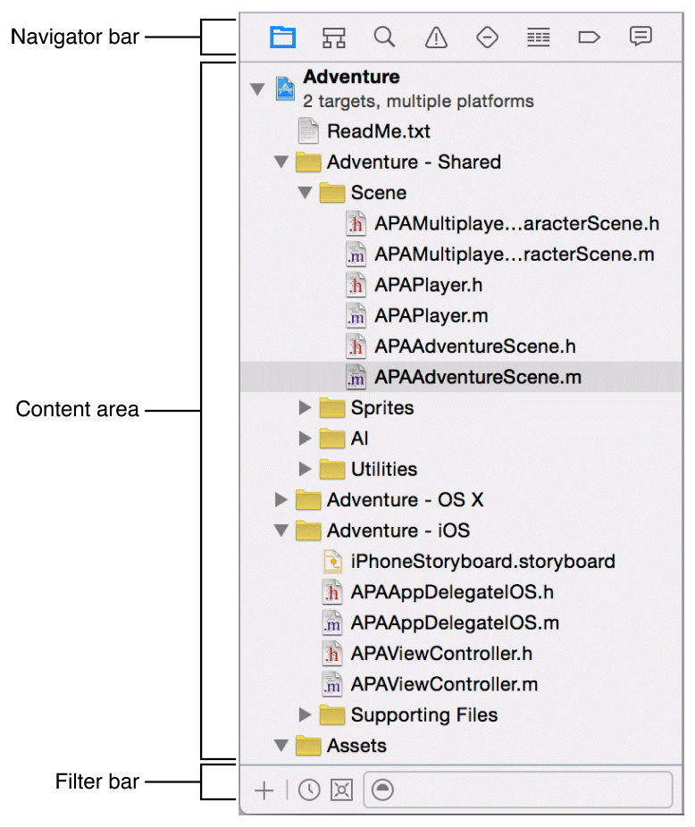

> 导航：[总目录](../../../README.md) · [documentation](../../../_indexes/documentation.md) · [Xcode Overview](index.md)

[Next](EditingYourFiles.md)[Previous](TheWorkspaceWindow.md)

## Navigating Your Workspace

Access files, symbols, unit tests, diagnostics, and other facets of your project from the navigator area. In the __navigator bar,__ you choose the navigator suited to your task. The __content area__ of each navigator gives you access to relevant portions of your project, and each navigator’s __filter bar__ allows you to restrict the content that is displayed.

Choose from these options in the navigator bar:

- __Project navigator.__ Add, delete, group, and otherwise manage files in your project, or choose a file to view or edit its contents in the editor area.
- __Symbol navigator.__ Browse the symbols in your project as a list or hierarchy. Buttons on the left of the filter bar let you limit the shown symbols to a combination of only classes and protocols, only symbols in your project, or only containers.
- __Find navigator.__ Use search options and filters to quickly find any string within your project.
- __Issue navigator.__ View issues such as diagnostics, warnings, and errors found when opening, analyzing, and building your project.
- __Test navigator.__ Create, manage, run, and review unit tests.
- __Debug navigator.__ Examine the running threads and associated stack information at a specified point or time during program execution.
- __Breakpoint navigator.__ Fine-tune breakpoints by specifying characteristics such as triggering conditions.
- __Report navigator.__ View the history of your build, run, debug, continuous integration, and source control tasks.

Typing text in the filter bar text input field shows only the items in the content area containing the search term. Most navigators show buttons on the left side of the filter bar used to further restrict what content is shown. Some filter bars have an Add button (+) on the left that you use to add an element to the content area. The button on the left of the filter bar in the report navigator (（原归档配图获取待重试：`XC_O_filter_bot_button_2x.png`）) is used for interacting with bots. Using bots from the report navigator is covered in more detail in [Manage and Monitor Bots from the Report Navigator](../../IDEs/Xcode%20Server%20and%20Continuous%20Integration%20Guide/view_integration_results.md#apple-f4xwc4dqnrsv64tfmyxwi33df52wszbpkridimbqgezteojsfvbuqna).

Select files in the content area to view or edit them.

[Workspace Window Overview](TheWorkspaceWindow.md#apple-f4xwc4dqnrsv64tfmyxwi33df52wszbpkridimbqgeydemjvfvbuqmrvfvjvomi)

[Editing Your Files](EditingYourFiles.md#apple-f4xwc4dqnrsv64tfmyxwi33df52wszbpkridimbqgeydemjvfvbuqmrxfvjvomi)

Copyright © 2018 Apple Inc. All rights reserved.
[Terms of Use](http://www.apple.com/legal/terms/site.html) |
[Privacy Policy](http://www.apple.com/privacy/) |
[Updated: 2016-10-27](RevisionHistory.md#apple-f4xwc4dqnrsv64tfmyxwi33df52wszbpkridimbqgeydemjvfvbuqmrsfvjvomi)

[Next](EditingYourFiles.md)[Previous](TheWorkspaceWindow.md)
