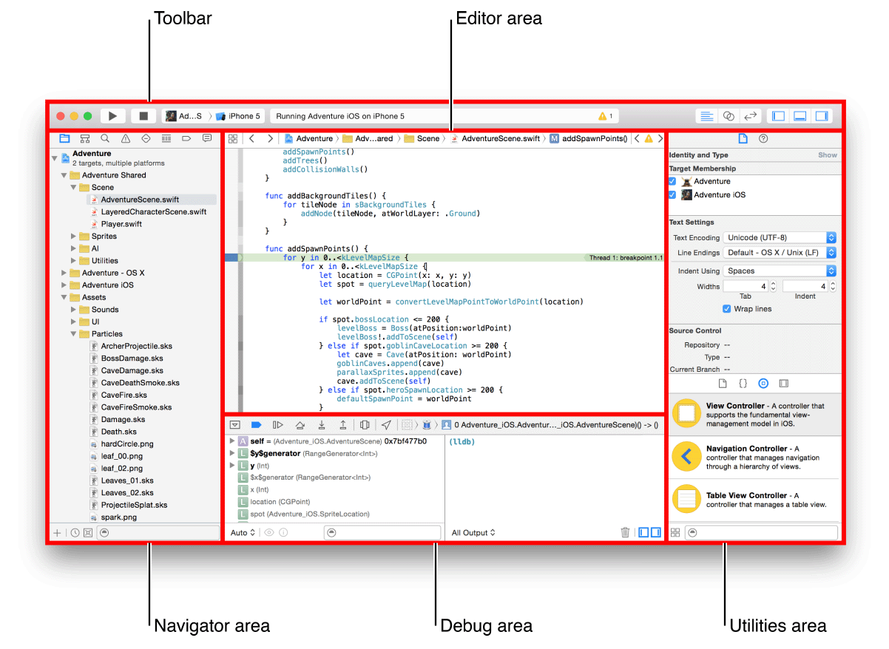

> 导航：[总目录](../../../README.md) · [documentation](../../../_indexes/documentation.md) · [Xcode Overview](index.md)

[Next](NavigatingYourWorkspace.md)[Previous](GettingXcode.md)

## Workspace Window Overview

Perform your core development tasks in the Xcode workspace window, your primary interface for creating and managing projects. A project is the main unit of development in Xcode. It includes all the elements needed to build your app, framework, plug-in, or other software product. It also maintains the relationships between those elements. For more details on projects, see [Working with Projects](CreatingProjects.md#apple-f4xwc4dqnrsv64tfmyxwi33df52wszbpkridimbqgeydemjvfvbuqmzrfvjvomi).

The workspace window automatically adapts itself to the task at hand, and you can further configure the window to fit your work style. You can open as many workspace windows as you need.

The components of the workspace window are shown in the following figure.

The workspace window always includes the _editor area_. When you select a file in your project, its contents appear in the editor area, where Xcode opens the file in an appropriate editor. For example, in the figure above, the editor area contains `AdventureScene.swift`, a swift code file that is selected in the navigator area on the left of the workspace window.

The workspace window displays up to three optional areas used in performing different tasks in the development life cycle. Hiding areas not in use can help you focus on your current task. You can hide or show these optional areas by using the workspace configuration buttons on the far right side of the toolbar:

-   Show and hide the __navigator area__. Use this area for navigating all facets of your project, including files, symbols, breakpoints, build issues, tests, breakpoints, and build reports. You can also search for any string in your project.
-   Show and hide the __debug area__. Use this area for viewing variables, interacting with the debugger console, and controlling the execution of your app.
-   Show and hide the __utilities area__. Use this area to inspect or modify attributes of files, graphical user interface elements, sprites, and other elements in your project. Also use it to access a library of ready-made resources. See [Accessing Resources and Inspecting Elements](AccessingResourcesandInspectingElements.md#apple-f4xwc4dqnrsv64tfmyxwi33df52wszbpkridimbqgeydemjvfvbuqmryfvjvomi).

[Getting Xcode](GettingXcode.md#apple-f4xwc4dqnrsv64tfmyxwi33df52wszbpkridimbqgeydemjvfvbuqmrtfvjvomi)

[Navigating Your Workspace](NavigatingYourWorkspace.md#apple-f4xwc4dqnrsv64tfmyxwi33df52wszbpkridimbqgeydemjvfvbuqmrwfvjvomi)

Copyright © 2018 Apple Inc. All rights reserved.
[Terms of Use](http://www.apple.com/legal/terms/site.html) |
[Privacy Policy](http://www.apple.com/privacy/) |
[Updated: 2016-10-27](RevisionHistory.md#apple-f4xwc4dqnrsv64tfmyxwi33df52wszbpkridimbqgeydemjvfvbuqmrsfvjvomi)

[Next](NavigatingYourWorkspace.md)[Previous](GettingXcode.md)
