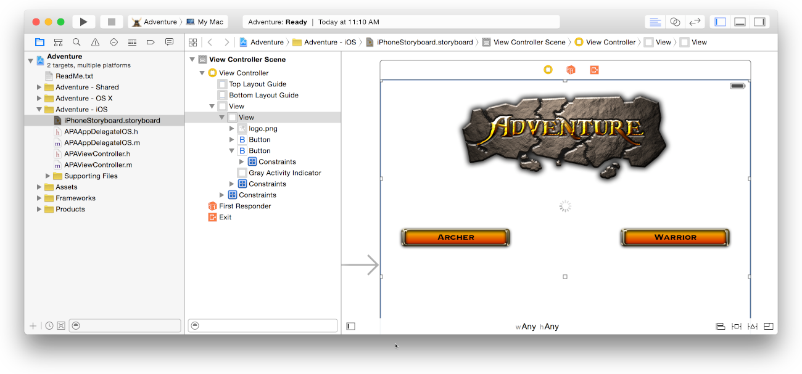
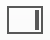

> 导航：[总目录](../../../README.md) · [documentation](../../../_indexes/documentation.md) · [Xcode Overview](index.md)

[Next](DesigningwithStoryboards.md)[Previous](FindingEditorHelp.md)

## Using Interface Builder

You create your app’s user interface in Interface Builder. Select a user interface file in the project navigator, and the file’s contents open in Interface Builder in the editor area of the workspace window. A user interface file has the filename extension `.storyboard` or `.xib`. A xib file usually specifies one view controller or menu bar. A storyboard specifies a set of view controllers and segues between those controllers. Unlike a xib, a storyboard can contain many view controllers and the transitions between them. Default user interface files are supplied by Xcode when you create new projects from its built-in templates.

The contents of `.xib` and `.storyboard` files are stored by Xcode in XML format. At build time, Xcode compiles your `.xib` and `.storyboard` files into binary files known as _nibs_. At runtime, nibs are loaded and instantiated to create new views.

To add user interface elements, drag objects from the utilities area onto the Interface Builder canvas, where you arrange the elements, set their attributes, and establish connections between them and the code in your source files. As you lay out your app’s user interface elements in Interface Builder, you can write the code that implements their behavior in the assistant editor.

（原归档配图未能恢复：`StoryboardIB_2x.png`）

For more detail on the process of building a user interface and creating and configuring interface builder files, see [Xcode Help](https://help.apple.com/xcode).

### Parts of Interface Builder

Interface Builder has two major areas: the dock (on the left) and the canvas (on the right). The dock lists the objects contained in the user interface file. The canvas is where you lay out these objects in your app’s user interface.

（原归档配图获取待重试：`DockAndCanvas_2x.png`）

The _outline view_ in the dock shows all the objects nested inside higher-level objects.

（原归档配图获取待重试：`OutlineView_2x.png`）

For xib files, you can display the high-level objects in an _icon view_ instead of the outline view by clicking the Hide and Show Document Outline control on the lower left of the Interface Builder canvas (（原归档配图获取待重试：`DockViewControl_2x.png`）).

（原归档配图获取待重试：`IconDock_2x.png`）

In storyboard files, the top level items in the outline view correspond to top level view controllers, or scenes, on the canvas. Storyboard files do not show an icon view when the outline view is hidden. Each scene on the storyboard has a dock that shows a high-level object view as shown below. Starting from the left, the items in the icon view correspond to the scene, the first responder in the scene, and the exit segue for that scene. You can add your own views to the scene dock in addition to those you add to the body of the view controller. For more information on scenes, see [Designing with Storyboards](DesigningwithStoryboards.md#apple-f4xwc4dqnrsv64tfmyxwi33df52wszbpkridimbqgeydemjvfvbuqnbtfvjvomi).

（原归档配图获取待重试：`SceneDock_2x.png`）

### Adding Interface Objects

To add an object to your app’s user interface, open the utilities area for the workspace window by clicking  (one of the workspace configuration buttons in the toolbar). Select the Object library from the library pane by clicking the Object button （原归档配图未能恢复：`XC_O_library_objects_button_2x.png`） in the library bar. Click the icon representing the object, and then drag it from the library to the outline view in the dock, onto the canvas, or into the view controller’s dock. Views dragged into the dock are only opened by segues or by API calls when the app is running. The screenshot shows dragging a view controller onto the canvas.

（原归档配图获取待重试：`SB_H_add_scene_2x.png`）

As you add objects to Interface Builder, you resize them by their handles and reposition them by dragging. As you move items, dashed blue lines help you align and position the item within the view.

Above the library bar in the utilities area are the Interface Builder inspectors. You use these inspectors to specify some of the interface objects’ appearance and behavior. In the screenshot below, the Attributes Inspector button(（原归档配图获取待重试：`AttributesInspectorSelected_2x.png`）) is used to specify the button type Custom.

（原归档配图获取待重试：`ArcherButton_2x.png`）

For more help with adding objects and other items, see [Xcode Help](https://help.apple.com/xcode).

### Finding and Replacing Strings

You can find and replace strings in storyboards and xib files using the built-in find commands. This includes finding symbols and strings in user interface elements. Project wide searches include xib and storyboard files.

For more information on how to search in Interface Builder, see Find and Replace Strings.

[Finding Editor Help](FindingEditorHelp.md#apple-f4xwc4dqnrsv64tfmyxwi33df52wszbpkridimbqgeydemjvfvbuqnbqfvjvomi)

[Designing with Storyboards](DesigningwithStoryboards.md#apple-f4xwc4dqnrsv64tfmyxwi33df52wszbpkridimbqgeydemjvfvbuqnbtfvjvomi)

Copyright © 2018 Apple Inc. All rights reserved.
[Terms of Use](http://www.apple.com/legal/terms/site.html) |
[Privacy Policy](http://www.apple.com/privacy/) |
[Updated: 2016-10-27](RevisionHistory.md#apple-f4xwc4dqnrsv64tfmyxwi33df52wszbpkridimbqgeydemjvfvbuqmrsfvjvomi)

[Next](DesigningwithStoryboards.md)[Previous](FindingEditorHelp.md)
