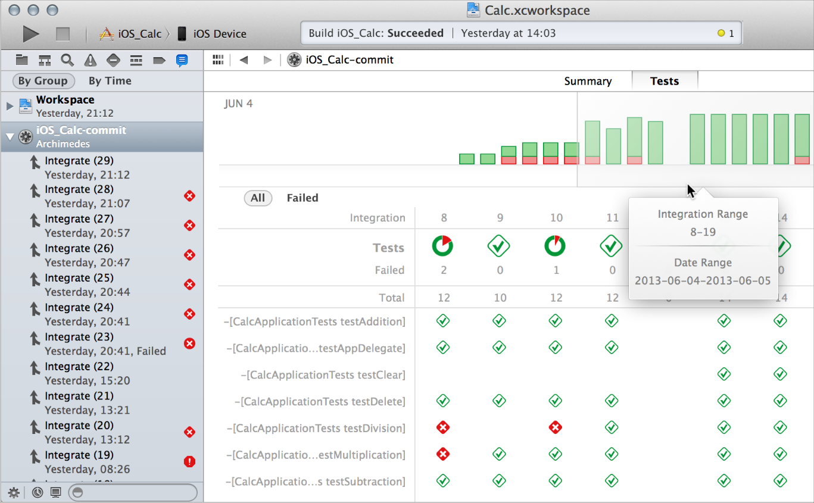
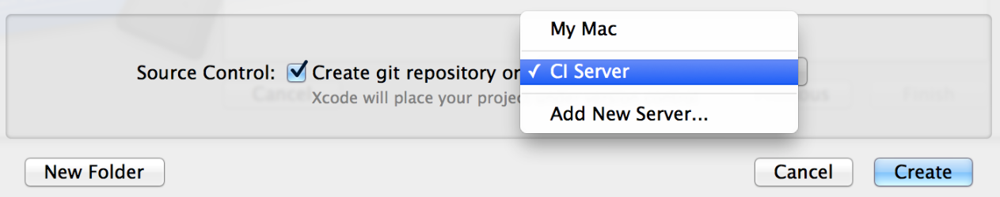
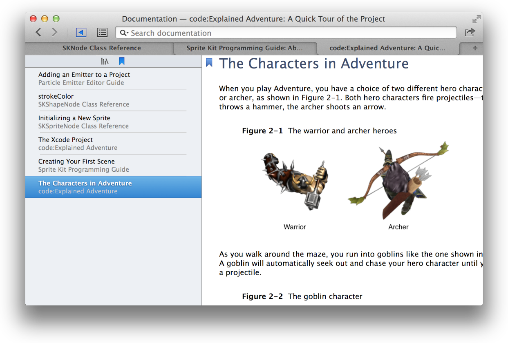

> 导航：[总目录](../../../README.md) · [documentation](../../../_indexes/documentation.md)

[Next](GettingXcode.md)

## At a Glance

> [!NOTE]
>
> This document may not represent best practices for current development. Links to downloads and other resources may no longer be valid.
>
> The latest information is now available in Xcode Help. To access it:
>
> - In Xcode, choose Help > Xcode Help, or open the Xcode Help website

Xcode is Apple’s integrated development environment (IDE) that you use to build apps for Apple products including the iPad, iPhone, Apple Watch, and Mac. Xcode provides tools to manage your entire development workflow—from creating your app, to testing, optimizing, and submitting it to the App Store.

（原归档配图获取待重试：`XcodeIcon_2x.png`）

### Single-Window Interface

The Xcode interface integrates code editing, user interface design, asset management, testing, and debugging within a single workspace window. The window reconfigures its content as you work. For example, select a file in one area, and an appropriate editor opens in another area. Select a symbol or user interface object, and its documentation appears in a nearby pane.

You can focus on a task by displaying only what you need, such as only your source code or only your user interface layout. Or you can work with your code and UI layout side by side. You can further customize your environment by opening multiple windows and multiple tabs per window.

（原归档配图获取待重试：`XC_O_WrkspaceWindow_nocallout_2x.png`）
> [!NOTE]
>
> [Workspace Window Overview](TheWorkspaceWindow.md#apple-f4xwc4dqnrsv64tfmyxwi33df52wszbpkridimbqgeydemjvfvbuqmrvfvjvomi), [Working with Projects](CreatingProjects.md#apple-f4xwc4dqnrsv64tfmyxwi33df52wszbpkridimbqgeydemjvfvbuqmzrfvjvomi).

### Assisted Source Code Editing

Whether you are using Swift, Objective-C, C, C++, or a mix, Xcode checks your source code as you type it. When Xcode notices a mistake, the source code editor highlights the error and when possible, offers to fix it. Xcode speeds up your typing with intelligent code completion. Reduce your typing further with ready-to-use code snippets and source file templates, either the ones provided or ones you add. With Swift, playgrounds let you experiment with code without building and running your app. For more information on playgrounds, see Playground Help.

You can easily configure the source editor to display multiple views of the same file or to view multiple related files at once. Search-and-replace and refactoring operations help you make extensive changes to your code quickly and safely. With these and other capabilities, Xcode makes it easier for you to write better code faster than you thought possible.

（原归档配图获取待重试：`CodeFolding_2x.png`）
> [!NOTE]
>
> [Writing Code](AddingandOpeningFiles.md#apple-f4xwc4dqnrsv64tfmyxwi33df52wszbpkridimbqgeydemjvfvbuqnbnknltc).

### Graphical UI Design

Interface Builder is a visual design editor that’s integrated into Xcode. Use Interface Builder to create the user interfaces of your iOS, watchOS, or OS X apps by assembling windows, views, controls, menus, and other elements from a library of configurable objects, or from ones you create. Use storyboards to specify the flow of your app and the transitions between scenes. Then graphically connect the objects and transitions to your implementation code.

（原归档配图获取待重试：`StoryboardIB_2x.png`）

With the Auto Layout feature, define constraints for your objects so that they automatically adjust to screen size, window size, and localization. With size classes, tune your mobile UI for any combination of screen size and orientation: customizing Auto Layout constraints, adding or removing views, and even changing the font.

（原归档配图获取待重试：`SC_H_preview_2x.png`）

The asset catalog in Xcode helps you manage graphics and data files for your app. Graphics include the many images you’ll use for your app’s user interface—items such as icons, custom artwork, sprites, and launch images for iOS devices.

（原归档配图获取待重试：`ACR_Xcode_Asset_Catalog_2x.png`）

With the particle emitter editor in Xcode, you can enhance your iOS or Mac game by adding animation effects that involve moving particles such as snow, sparks, and smoke. The SceneKit editor helps you work with scenes created in 3D authoring tools and exported as digital asset exchange (DAE) files.

（原归档配图获取待重试：`LeafParticles_2x.png`）
> [!NOTE]
>
> [Using Interface Builder](UsingInterfaceBuilder.md#apple-f4xwc4dqnrsv64tfmyxwi33df52wszbpkridimbqgeydemjvfvbuqnbsfvjvomi) and [Adding Assets](AddingImages.md#apple-f4xwc4dqnrsv64tfmyxwi33df52wszbpkridimbqgeydemjvfvbuqnbrfvjvomi).

### Integrated Debugging

When Xcode launches your app in debug mode, it immediately starts a debugging session. If you are running an iOS or watchOS app, Xcode launches it either in Simulator or on a device connected to your Mac. If you are running an OS X app, Xcode launches it directly on your Mac.

（原归档配图获取待重试：`AdventureLaunchediPhone_2x.png`）

You can debug your app directly within the source editor. View the contents of an object by moving your pointer over a variable name, and then use Quick Look to inspect a particular value. The debug area and the debug navigator let you carefully control the execution of your app while you examine the code. For finer control, the console gives command line access to the debugger.

（原归档配图获取待重试：`XC_O_debug_overview_2x.png`）

Debug gauges display your app’s resource consumption to help you identify problems before your users do.

> [!NOTE]
>
> [Building Your App](BuildingYourApp.md#apple-f4xwc4dqnrsv64tfmyxwi33df52wszbpkridimbqgeydemjvfvbuqnjtfvjvomi) and [Using the Debugger](UsingtheDebugger.md#apple-f4xwc4dqnrsv64tfmyxwi33df52wszbpkridimbqgeydemjvfvbuqnjxfvjvomi).

### Testing and Continuous Integrations

To help you build a better app, Xcode includes a testing framework for functional, performance, and user interface testing. You write the tests and use the test navigator to run those tests and see the results. Test code functionality with unit tests and see your current code coverage. Performance tests make sure important parts of your app don’t leave the user waiting. Automate testing of your user experience to make sure changes in one place don’t break things in another. Set triggers for running tests on a regular basis so you catch regression bugs in code and in performance.

Run your tests in the test navigator, look at the results, and make any changes needed to pass the tests. You can use the Xcode service, available in OS X Server, to automate the execution of tests. From Xcode on your development Mac, you create _bots_ that run on a separate server to execute your unit tests either periodically or on every source code commit.

In addition to running unit tests, bots automatically perform static analysis on your code, build your app, and archive it for distribution to testers or the App Store. While performing these continuous integrations of your app, bots report build errors and warnings, static analyzer problems, and unit test failures.

> [!NOTE]
>
> [Testing](UnitTesting.md#apple-f4xwc4dqnrsv64tfmyxwi33df52wszbpkridimbqgeydemjvfvbuqojnknltc).

### Automatic Saves and Source Control Management

While you work, Xcode automatically saves changes to source and project files. This feature requires no configuration, because Xcode continuously tracks your changes and saves them. You can revert a file to a previous state with the Undo and Revert Document commands.

To keep track of changes at a fine-grained level, use the Xcode source control management features. Xcode supports two popular source control systems: Git and Subversion. You can access remote Git and Subversion source code repositories, and you can create local Git repositories. Using the Xcode service, available with OS X Server, you can host Git repositories on your own server.

> [!NOTE]
>
> [Managing Changes](UsingFileSaving.md#apple-f4xwc4dqnrsv64tfmyxwi33df52wszbpkridimbqgeydemjvfvbuqmjqfvjvomi).

### Integrated Documentation

While you’re coding, Xcode makes detailed technical information available at your fingertips. When you want it, Quick Help keeps concise API information always in view, and Xcode application help is always close at hand with step-by-step instructions for performing common Xcode tasks. Xcode includes extensive documentation for using Xcode, and it provides comprehensive SDK documentation, including programming guides, tutorials, sample code, detailed framework API references, and video presentations by Apple engineers. All of these resources are viewable from the Xcode documentation viewer. As updated documentation becomes available, it downloads automatically in the background.

> [!NOTE]
>
> [Learning More](GettingaHands-OnIntroduction.md#apple-f4xwc4dqnrsv64tfmyxwi33df52wszbpkridimbqgeydemjvfvbuqmjrfvjvomi).

### App Distribution to Testers and the App Store

Most of your development time is spent on coding tasks, but to develop for the App Store, you need to perform a number of administrative tasks throughout the lifetime of your app. In addition to Xcode, you’ll use the Member Center web tool to manage developer program accounts and entitlements, and you’ll use the iTunes Connect web tool to check the status of your contracts, set up tax and banking information, obtain sales and finance reports, and manage metadata about the app.

Xcode project configurations help prepare your app for TestFlight or for manual distribution to beta testers, and for submission to the App Store. Submitting your app is a multistep process that begins when you sign into iTunes Connect and supply necessary product information. In Xcode, you create an archive of your project and submit it to the store. When your app is approved, you use iTunes Connect to release it by setting the date. (If you are distributing your OS X app outside the store, you follow a slightly different process.)

> [!NOTE]
>
> _App Distribution Guide_.

[Getting Xcode](GettingXcode.md#apple-f4xwc4dqnrsv64tfmyxwi33df52wszbpkridimbqgeydemjvfvbuqmrtfvjvomi)

Copyright © 2018 Apple Inc. All rights reserved.
[Terms of Use](http://www.apple.com/legal/terms/site.html) |
[Privacy Policy](http://www.apple.com/privacy/) |
[Updated: 2016-10-27](RevisionHistory.md#apple-f4xwc4dqnrsv64tfmyxwi33df52wszbpkridimbqgeydemjvfvbuqmrsfvjvomi)

[Next](GettingXcode.md)
