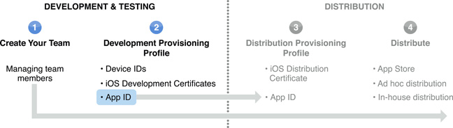
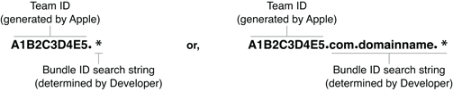
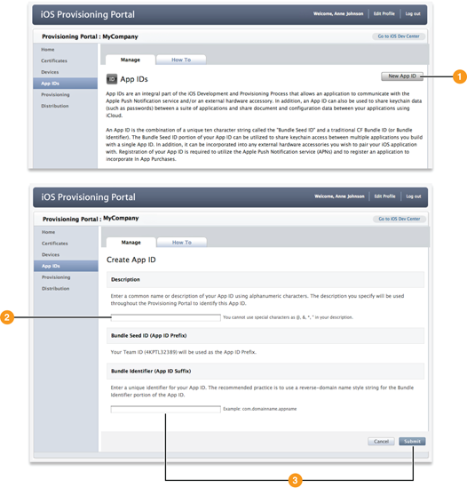

> 导航：[总目录](../../../README.md) · [documentation](../../../_indexes/documentation.md) · [iOS Team Administration Guide](About%20iOS%20Development%20Team%20Administration.md)

[Next](Creating%20and%20Downloading%20Development%20Provisioning%20Profiles.md)[Previous](Managing%20Development%20Certificates.md)

# Creating and Configuring App IDs

An [app ID](https://developer.apple.com/library/archive/documentation/General/Conceptual/DevPedia-CocoaCore/AppID.html#//apple_ref/doc/uid/TP40008195-CH64) is a string used to specify an app, or set of apps. An app ID’s primary use is to specify which apps are authorized to be signed and launched. You can configure an app ID to share data between apps and enable an app to use Apple Push Notification Service (APNS), In-App Purchase, iCloud, and Game Center.

An app ID has two parts: the team ID followed by the bundle ID search string. The team ID is a 10-character string generated by Apple. Each development team is assigned a unique team ID used to identify all your apps. The team ID allows you to share keychain data between apps. Apps with the same team ID can share data, such as usernames and passwords. A bundle ID search string is traditionally a reverse-domain-name style string. It’s the string you use in Xcode as the bundle ID.

__Figure 4-1__  The Two Parts of an App ID, the Team ID and the Bundle ID Search String.

!

There are two types of app IDs that can be created: wildcard app IDs and explicit app IDs. The bundle ID search string determines the type of the app ID. The following sections provide a brief review of the types of IDs. For a detailed explanation, see [Application Identifiers are Used to Match Applications to Services](../../General/Developing%20for%20the%20App%20Store/Creating%20a%20Project.md#apple-f4xwc4dqnrsv64tfmyxwi33df52wszbpkridimbqgeytcobwfvbuqnrnknltq).

A wildcard app ID allows you to use a single app ID to build and install multiple apps. However, wildcard app IDs can’t be used with APNS, In-App Purchase, iCloud, or Game Center. Use a wildcard app ID when getting started with development because it can simplify provisioning devices.

A wildcard app ID uses the asterisk character (\*) in the bundle ID search string. The asterisk must be the last character in the bundle ID search string, such as `com.domain.*` or just `*`. In the bundle identifier field in Xcode, developers can replace the asterisk with any string, as long as it matches the wildcard pattern. For example, the app ID `a1b2c3d4e5.com.domainname.*` matches the bundle ID `a1b2c3d4e5.com.domainname.myApp4`.

__Figure 4-2__  Examples of How to Format a Wildcard App ID.

For your convenience, Xcode creates a wildcard app ID, called _iOS Wildcard App ID_, that is set to `*`, and used by a development provisioning profile, called _iOS Team Provisioning Profile_, that it manages for you.

Use an explicit app ID if you want to use APNS, In-App Purchase, iCloud, and Game Center features. Because explicit app IDs match only one app, a separate ID and accompanying provisioning profile is required for each app.

An explicit app ID uses a reverse-domain-name string that exactly matches the bundle ID in Xcode.

Only team agents or admins can create app IDs.

To create an app ID

1. Navigate to the App IDs area of the [iOS Provisioning Portal](https://developer.apple.com/ios/manage/bundles/index.action) and click New App ID in the upper right.
2. Enter a name for the app ID under Description. This name is for your own use to identify the app ID.
3. Enter a bundle ID search string and click Submit.

After your app ID is generated, it is listed in the app IDs area of the iOS Provisioning Portal under the name you gave it.

To use Apple Push Notification Service (APNS), you need to configure your app ID and then create a new provisioning profile with the configured ID. To learn more about APNS, see Apple Push Notification Service.

To enable your app ID for APNS

1. Navigate to the app IDs area of the iOS Provisioning Portal. Any app IDs that are eligible for APNS have a yellow indicator light. Click Configure next to the app ID.

   Only explicit app IDs can be used; wildcard and duplicate app IDs are not eligible for APNS.
2. Select “Enable for Apple Push Notification Service” and then click Configure next to the appropriate SSL Certificate.

   A Client Authentication SSL Certificate is created for you.
3. Follow the instructions in the SSL Certificate Assistant. This procedure installs the private key and public SSL certificate on your notification server.

To use iCloud, you need to configure your app ID and then create a new provisioning profile with the configured ID. To learn more about using iCloud for your app, see [iCloud Storage](https://developer.apple.com/library/archive/documentation/iPhone/Conceptual/iPhoneOSProgrammingGuide/StrategiesforImplementingYourApp/StrategiesforImplementingYourApp.html#//apple_ref/doc/uid/TP40007072-CH5).

To enable your app ID for iCloud

1. Navigate to the app IDs area of the iOS Provisioning Portal. Any app IDs that are eligible for iCloud have a yellow indicator light. Click Configure next to the app ID.

   Only explicit app IDs can be used; wildcard and duplicate app IDs are not eligible for iCloud.
2. Select “Enable for iCloud” and then click Done.

In-App Purchase allows users to purchase extra content from within your app. Game Center is Apple’s social gaming network and allows you to implement features such as aliases, leaderboards, achievements, and matchmaking. To configure your app for In-App Purchase and Game Center, you need an explicit app ID. Explicit app IDs are automatically enabled for In-App Purchase and Game Center.

For more information about configuring your app for In-App Purchase and Game Center see [iTunes Connect](http://itunesconnect.apple.com/) and the [iTunes Connect Developer Guide](https://itunesconnect.apple.com/docs/iTunesConnect_DeveloperGuide.pdf).

As you develop, you might want to add features to your app. To support APNS, iCloud, In-App Purchase, or Game Center, you need an app signed with a provisioning profile that uses an explicit app ID. If you have an app that uses a wildcard app ID, you need to create a new app ID and then modify your provisioning profile.

To update your app ID:

1. Identify your app’s current bundle ID in Xcode or iTunes Connect.
2. Create a new app ID in the App IDs area of the iOS Provisioning Portal with your app’s bundle ID search string.
3. Enable your app ID for APNS or iCloud (see [Configuring Your App ID for Apple Push Notification Service](#apple-f4xwc4dqnrsv64tfmyxwi33df52wszbpkridimbqgeytcnjzfvbuqmjyfvjvomq) or [Configuring Your App ID for iCloud](#apple-f4xwc4dqnrsv64tfmyxwi33df52wszbpkridimbqgeytcnjzfvbuqmjyfvjvomy)). Explicit app IDs are automatically enabled for In-App Purchase and Game Center.
4. Modify your provisioning profile to use the new explicit app ID.

[Next](Creating%20and%20Downloading%20Development%20Provisioning%20Profiles.md)[Previous](Managing%20Development%20Certificates.md)

