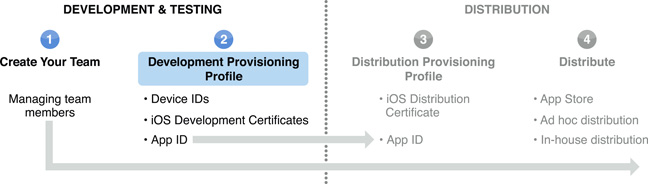

> 导航：[总目录](../../../README.md) · [documentation](../../../_indexes/documentation.md) · [iOS Team Administration Guide](About%20iOS%20Development%20Team%20Administration.md)

[Next](Managing%20a%20Distribution%20Certificate.md)[Previous](Creating%20and%20Configuring%20App%20IDs.md)

# Creating and Downloading Development Provisioning Profiles

To install an app on a device during development, you need three things: an app ID that identifies the set of apps it authorizes to run, a list of devices your team wants to use for testing, and a list of developers permitted to sign the app. These three things are bundled in a development provisioning profile. A development provisioning profile uniquely ties developers and devices to a development team. A provisioning profile is valid for one year. A device can be added to multiple provisioning profiles.

For your convenience, Xcode creates a wildcard app ID, called _iOS Wildcard App ID_, that matches all your apps. The first time you register a device in Xcode, Xcode creates a development provisioning profile, called _iOS Team Provisioning Profile_, that uses the iOS Wildcard App ID. Xcode automatically adds new developer certificates and registered device IDs to the iOS Team Provisioning Profile so you can use iOS Team Provisioning Profile for all apps that don’t require an explicit app ID.

Only team agents and admins can create development provisioning profiles.

[To create a development provisioning profile...](https://developer.apple.com/library/archive/recipes/ProvisioningPortal_Recipes/CreatingaDevelopmentProvisioningProfile/CreatingaDevelopmentProvisioningProfile.html#//apple_ref/doc/uid/TP40011211-CH2)

Each Provisioning Profile has one app ID associated with it. If you have multiple apps using Apple Push Notification Service (APNS), In-App Purchase, iCloud, or Game Center, create a separate development provisioning profile for each app. If you are installing multiple apps but you are not using those features, use a wildcard app ID.

[To download a provisioning profile...](https://developer.apple.com/library/archive/recipes/ProvisioningPortal_Recipes/DownloadingaProvisioningProfile/DownloadingaProvisioningProfile.html#//apple_ref/doc/uid/TP40011211-CH4)

If your development certificate is specified in the provisioning profile, it should show up automatically in the Devices organizer in Xcode after the provisioning profile is approved. If the provisioning profile isn’t in the Provisioning Profile list, click Refresh. For more information, including how to install a provisioning profile on your device, see Provisioning a Device for Development. In order to test an app, the development provisioning profile must be installed on both a Mac and the device.

To install the provisioning profile manually on your Mac, drag the file onto the Xcode, iTunes, or iPhone Configuration Utility app icon.

[Next](Managing%20a%20Distribution%20Certificate.md)[Previous](Creating%20and%20Configuring%20App%20IDs.md)

