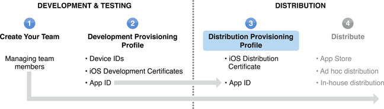

> 导航：[总目录](../../../README.md) · [documentation](../../../_indexes/documentation.md) · [iOS Team Administration Guide](About%20iOS%20Development%20Team%20Administration.md)

[Next](Distributing%20an%20App.md)[Previous](Managing%20a%20Distribution%20Certificate.md)

# Creating and Downloading a Distribution Provisioning Profile

To distribute an app, a team admin must create a distribution provisioning profile (this profile is different from a Development Provisioning Profile). The distribution provisioning profile consists of a name, a distribution certificate, and an app ID. The name is used only so that you can identify a provisioning profile. A provisioning profile is valid for one year.

Apps can be distributed either through the App Store with an iTunes Connect account or through ad hoc distribution. If you are enrolled in the Enterprise Program, you can also use in-house distribution. For more on distribution methods see [Distributing an App](Distributing%20an%20App.md#apple-f4xwc4dqnrsv64tfmyxwi33df52wszbpkridimbqgeytcnjzfvbuqmzrfvjvomi).

- To publish an app to the App Store, create a distribution provisioning profile specifying App Store as the distribution method.
- To use ad hoc distribution, create a distribution provisioning profile specifying Ad Hoc as the distribution method and include a list of up to 100 devices authorized to run the app.
- To use in-house distribution, create a provisioning profile specifying In-House as the distribution method.

[To create a distribution provisioning profile...](https://developer.apple.com/library/archive/recipes/ProvisioningPortal_Recipes/CreatingaDistributionProvisioningProfile/CreatingaDistributionProvisioningProfile.html#//apple_ref/doc/uid/TP40011211-CH3)

[To download a provisioning profile...](https://developer.apple.com/library/archive/recipes/ProvisioningPortal_Recipes/DownloadingaProvisioningProfile/DownloadingaProvisioningProfile.html#//apple_ref/doc/uid/TP40011211-CH4)

To install the provisioning profile on your Mac, drag the `.mobileprovision` file onto the Xcode, iPhone Configuration Utility, or iTunes icon in the Dock.

[Next](Distributing%20an%20App.md)[Previous](Managing%20a%20Distribution%20Certificate.md)

