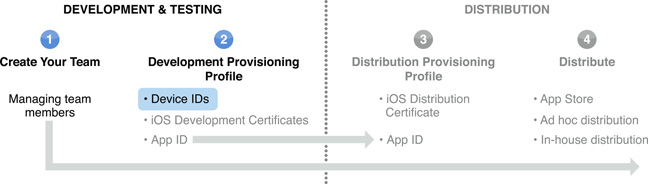

> 导航：[总目录](../../../README.md) · [documentation](../../../_indexes/documentation.md) · [iOS Team Administration Guide](About%20iOS%20Development%20Team%20Administration.md)

[Next](Managing%20Development%20Certificates.md)[Previous](Managing%20Your%20Team.md)

# Designating iOS Devices for Development and User Testing

The Devices section of the [iOS Provisioning Portal](https://developer.apple.com/ios/manage/devices/index.action) allows you, as a team admin, to add the iOS devices your team wants to use for development. Only team admins can add devices. A member who wants to add a device to the development team needs to send you the unique device ID (UDID). The device ID is a 40-character string that is tied to a single device.

To locate the device ID, connect the device to your computer, select the device in the Devices organizer in Xcode, and copy the identifier. A team member can send you this string by the most convenient method: email, IM, note, etc.

You can add up to 100 devices to your development team each membership year.

Before you can add a device to your team to use for development, you need the device ID.

[To add a device to your development team...](https://developer.apple.com/library/archive/recipes/ProvisioningPortal_Recipes/AddingaDeviceIDtoYourDevelopmentTeam/AddingaDeviceIDtoYourDevelopmentTeam.html#//apple_ref/doc/uid/TP40011211-CH1)

In order for a device to be used for development testing, it also needs to be marked as a development device. See Provisioning Your Device for Generic Development for more information.

Instead of adding devices one at a time, you can add multiple devices at once by uploading a `.deviceids` file or a text file.

To create a `.deviceids` file, use the [iPhone Configuration Utility](http://www.apple.com/support/iphone/enterprise/). Connect each device you want to register to your computer and the utility saves the information for each device in the Devices section of the Library list. Then, select the devices you want to upload and click Export in the toolbar. Specify the file Export type as Device UDIDs.

If you want to use a `.txt` file, create a tab-delimited file with one device ID and one device name in each row. The first row is ignored because it should contain only headers.

When you have your file, navigate to the Devices section of the iOS Provisioning Portal. Click Upload Devices and Choose File. Select the file you want to upload and submit it.

To remove a device from your development team, navigate to the Devices area of the iOS Provisioning Portal. Select the devices you want to remove and click Remove Selected.

Once a device is added, you can edit only the device name, not the device ID. To edit the name, navigate to the Devices area of the iOS Provisioning Portal. Under Actions, click Edit for the device you want to edit.

At the beginning of each new membership year (one year after your initial enrollment), team admins can restore the available device count to 100 devices. This option is presented to team admins when they first log in to the iOS Provisioning Portal at the beginning of a new year. Remove all devices you no longer want _before_ adding any new devices. Devices that are removed before adding the first new device for the year restores the device count; devices that are removed after do not.

[Next](Managing%20Development%20Certificates.md)[Previous](Managing%20Your%20Team.md)

