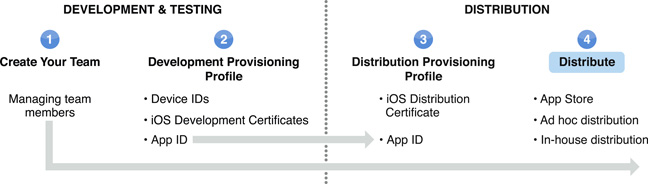

> 导航：[总目录](../../../README.md) · [documentation](../../../_indexes/documentation.md) · [iOS Team Administration Guide](About%20iOS%20Development%20Team%20Administration.md)

[Next](Document%20Revision%20History.md)[Previous](Creating%20and%20Downloading%20a%20Distribution%20Provisioning%20Profile.md)

# Distributing an App

If your development team is enrolled in the Standard Program, you can distribute your app in two ways. You can submit an app to the App Store or you can use ad hoc distribution to install the app on up to 100 devices for testing purposes.

Development teams enrolled in the Enterprise Program can also use in-house distribution.

Development teams enrolled in the University Program do not have the ability to distribute apps.

To distribute your app through the App Store, you need to:

1. [Download your team’s distribution provisioning profile](https://developer.apple.com/library/archive/recipes/ProvisioningPortal_Recipes/DownloadingaProvisioningProfile/DownloadingaProvisioningProfile.html#//apple_ref/doc/uid/TP40011211-CH4) from the iOS Provisioning Portal.
2. Create an [iTunes Connect](https://itunesconnect.apple.com/WebObjects/iTunesConnect.woa) account.

   When you register for iTunes Connect, make sure to use the same user name and password used for your iOS Developer Program account.
3. Prepare your app for submission, see Submitting Your Application for Publication on the App Store.

iOS developers enrolled in the Standard Program can also distribute an app outside of the App Store on up to 100 different devices for testing purposes only. To use ad hoc distribution, create an archive of your app, or have a teammate send you an iOS App Store Package (`.ipa`) of the archived app.

You distribute your app by providing the `.ipa` file for users to install on their devices. Because you select a valid ad hoc provisioning profile to archive the app, users don’t need to install the profile on their device, only the .`ipa` file. Users can use iTunes to install the app on their devices. If users want to use Xcode to install the app on their device, share the archive as an `.xcarchive` file package.

iOS developers enrolled in the Enterprise Program can distribute in-house without identifying individual devices or using the App Store. To distribute your app in-house, create an archive of your app, or have a teammate send you an archived app. Distribute your internal app using your company’s authorized software distribution mechanism. Because the app file can be installed on any iOS device, make sure you protect the distribution of this file. Members of your company can use iTunes, iPhone Configuration Utility, or Xcode to install the app on their devices.

[Next](Document%20Revision%20History.md)[Previous](Creating%20and%20Downloading%20a%20Distribution%20Provisioning%20Profile.md)

