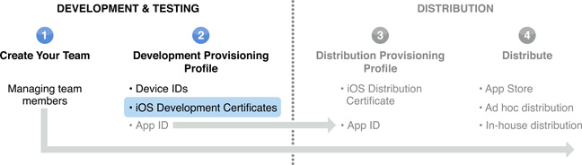

> 导航：[总目录](../../../README.md) · [documentation](../../../_indexes/documentation.md) · [iOS Team Administration Guide](About%20iOS%20Development%20Team%20Administration.md)

[Next](Creating%20and%20Configuring%20App%20IDs.md)[Previous](Designating%20iOS%20Devices%20for%20Development%20and%20User%20Testing.md)

# Managing Development Certificates

Each team member that wants to run an app on a device during development must have his or her own authorized development certificate. This certificate is used to [cryptographically sign an app](https://developer.apple.com/library/archive/documentation/General/Conceptual/DevPedia-CocoaCore/AppSigning.html#//apple_ref/doc/uid/TP40008195-CH63). An app must be signed before it can run on an iOS device. A team member can have only one active development certificate, but one certificate can be used in multiple apps.

Development certificates are not created until the team admin approves a certificate request. To learn how to request a development certificate using Xcode, see Provisioning a Device for Development. The development certificate a developer requests includes a copy of his or her public key. The private key is saved in the developer’s keychain when they make the certificate request. The public/private key pair and the development certificate are used to sign an app. A development certificate is restricted to development only and is valid for a limited time. The Apple Worldwide Developer Relations Certification Authority can also revoke a certificate before it expires.

As a team admin, you have the authority and responsibility to approve or reject all development certificate requests made by your team.

You are notified via email when a team member requests a certificate. To approve or reject the request, navigate to the Certificates area of the [iOS Provisioning Portal](https://developer.apple.com/ios/manage/certificates/team/index.action). Select the certificate and click either Reject Selected or Approve Selected. The member who submitted the request is notified via email. If the request is approved, the certificate is only available for download to the member who requested it.

Development certificates are valid for one year from date of issue. After a certificate expires, any apps that were signed with that certificate will no longer run on a device.

To continue development, the developer requests a new development certificate. To learn how to request a development certificate, see Provisioning a Device for Development.

[Next](Creating%20and%20Configuring%20App%20IDs.md)[Previous](Designating%20iOS%20Devices%20for%20Development%20and%20User%20Testing.md)

