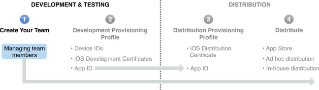

> 导航：[总目录](../../../README.md) · [documentation](../../../_indexes/documentation.md) · [iOS Team Administration Guide](About%20iOS%20Development%20Team%20Administration.md)

[Next](Designating%20iOS%20Devices%20for%20Development%20and%20User%20Testing.md)[Previous](About%20iOS%20Development%20Team%20Administration.md)

# Managing Your Team

If you have enrolled in the iOS Developer Program as an individual, you are the team agent. You have access to all iOS Provisioning Portal capabilities. However, as an individual, you cannot add any additional team members.

If you have enrolled as a company in the iOS Developer Program, you can set up a development team in the [Member Center](https://developer.apple.com/membercenter).

A development team consists of individuals with the following roles:

- __Team Agent__

  There is only one team agent per development team. This person is the original enrollee accepted into the iOS Developer Program. The team agent is the primary contact for the development team and is responsible for accepting all iOS Developer Program agreements. The agent has access to all iOS Provisioning Portal capabilities and has _all_ of the privileges of a team admin and a team member.
- __Team Admin__

  All teams with multiple members require at least two team admins, including the team agent. There is no maximum for the number of team admins. Team admins have all of the same privileges as team agents except for signing legal agreements. Team admins are also team members.
- __Team Member__

  A development team can have as many team members as necessary. Team members can request development certificates and download development provisioning profiles.

All individuals on a development team have the ability to test apps on iOS devices. For more information about development team roles, see [Understanding Membership Privileges](../../General/Developing%20for%20the%20App%20Store/Preparing%20the%20Development%20Team.md#apple-f4xwc4dqnrsv64tfmyxwi33df52wszbpkridimbqgeytcobwfvbuqnjnknlts).

To add team admins and members...

During the development process, you may need to remove people from your team. To remove a member of your team, select the person you want to remove from the All People list in Member Center. Click Delete.

To edit a team member's privileges...

If you need to change your name or address, contact [Apple Developer Support](https://developer.apple.com/contact/). If you need to designate a new team agent, the current team agent can request a change in the Member Center.

To designate a new team agent

1. After logging in the Member Center, click Your Account in the bar at the top.
2. Click Organization Profile in the sidebar.
3. Click Transfer Agent Role under Main Contact and click Continue.
4. Select a person from your team as the new team agent and click Continue.
5. After you agree to transfer your agent role, click I Agree, Continue. The new agent will receive an email to accept the transfer.

[Next](Designating%20iOS%20Devices%20for%20Development%20and%20User%20Testing.md)[Previous](About%20iOS%20Development%20Team%20Administration.md)

