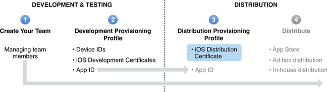

> 导航：[总目录](../../../README.md) · [documentation](../../../_indexes/documentation.md) · [iOS Team Administration Guide](About%20iOS%20Development%20Team%20Administration.md)

[Next](Creating%20and%20Downloading%20a%20Distribution%20Provisioning%20Profile.md)[Previous](Creating%20and%20Downloading%20Development%20Provisioning%20Profiles.md)

# Managing a Distribution Certificate

Before an app can be distributed, your team must have a valid distribution certificate linked to a distribution provisioning profile. Only team admins can create or install a distribution certificate. Each team can have only one active distribution certificate. The team admin can either use Xcode to create a distribution certificate or manually request and download one from iOS Provisioning Portal.

A team’s distribution certificate allows a developer to build an app for distribution. If your team wants to use another Mac to create a distribution build, you need to transfer a copy of the distribution certificate as described in, Safeguarding and Transferring Your Signing and Provisioning Assets.

You should use Xcode to create your distribution certificate. Xcode creates, downloads, and installs a development certificate, distribution certificate, and the iOS Team Provisioning Profile for you. Xcode can also restore missing certificates and renew expired certificates.

To create a distribution certificate

1. In Xcode, open the Devices organizer.
2. Select Provisioning Profiles in the Library section.
3. Click the Refresh button at the bottom of the window..
4. Enter your user name and password and click Log in.

   After you log in to your account, a prompt appears, asking whether Xcode should request your distribution certificate.
5. Click Submit Request.
6. If a prompt appears, at the end of the refresh process, asking if you want to export your developer profile, click Export.

Your request for a distribution certificate is automatically approved. The distribution certificate is added to your keychain and appears in Xcode. You can view, download, or revoke the distribution certificate in the iOS Provisioning Portal.

Although it is easier to use Xcode to create a distribution certificate, you can manually create a distribution certificate. If you do not have access to Xcode, generate a Certificate Signing Request (CSR) with Keychain Access, submit your request, and download the certificate from the iOS Provisioning Portal.

To generate a Certificate Signing Request manually

1. Open Keychain Access on your Mac (located in `Applications/Utilities`).
2. Open Preferences and click Certificates. Make sure both Online Certificate Status Protocol and Certificate Revocation List are set to Off.
3. Choose Keychain Access > Certificate Assistant > Request a Certificate From a Certificate Authority.
4. Enter your user email address and common name. Use the same address and name as you used to register in the iOS Developer Program. No CA Email Address is required.
5. Select the options “Saved to disk” and “Let me specify key pair information” and click Continue.
6. Specify a filename and click Save.
7. For the Key Size choose 2048 bits and for Algorithm choose RSA. Click Continue and the Certificate Assistant creates a CSR and saves the file to your specified location.

Creating a CSR generates a public and private key pair. The private key is stored in the login keychain.

1. Navigate to the Certificates area of the iOS Provisioning Portal and click the Distribution tab. Click Request Certificate.
2. Click Choose File, choose your CSR file, and click Submit.

After the CSR is approved, the certificate is listed under Current Distribution Certificate. If it doesn’t appear automatically, you may need to refresh the page.

1. Navigate to the Certificates area of the iOS Provisioning Portal and click the Distribution tab. Click Download next to the certificate.
2. In the Finder, double-click the downloaded `.cer` file to open Keychain Access and install your certificate in your default keychain (usually the login keychain).

A distribution certificate is valid for one year from date of issue. After it expires, you won’t be able sign and install apps on your devices although this will not affect any existing apps in the App Store.

To continue distribution, navigate to the Devices organizer in Xcode. Select the expired profile and click Renew Profile in the red bar at the top. This will renew your expired certificate and add it to the provisioning profile. After you get a new distribution certificate, you can submit new apps or app updates to the App Store.

If you are enrolled in the iOS Developer Enterprise Program, revoking your distribution certificate will make your app fail on any installed devices. Only revoke your certificate if your app or private key have been compromised. You can create a second distribution certificate six months before your existing certificate expires. The overlapping certificate allows you to continue to build and distribute your app once your first certificate expires.

[Next](Creating%20and%20Downloading%20a%20Distribution%20Provisioning%20Profile.md)[Previous](Creating%20and%20Downloading%20Development%20Provisioning%20Profiles.md)

