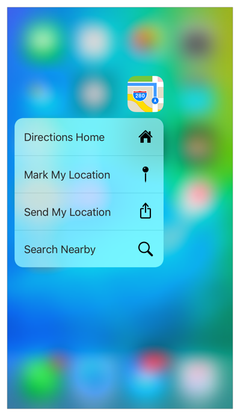
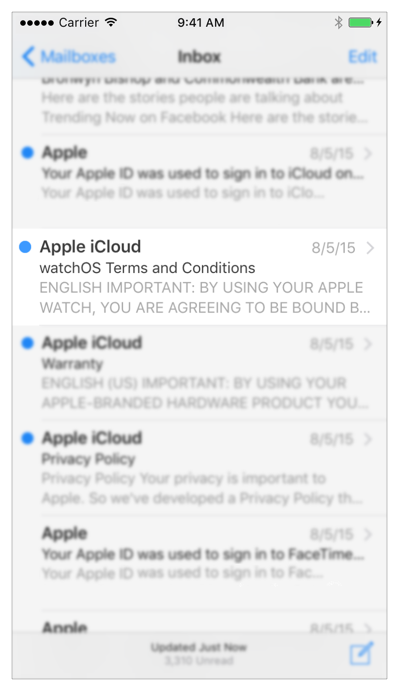
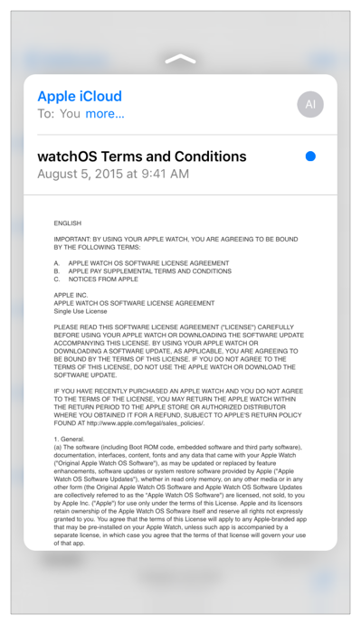
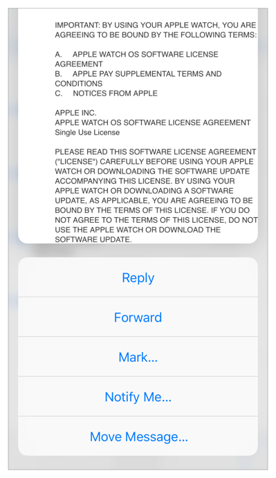

> 导航：[总目录](../../../README.md) · [documentation](../../../_indexes/documentation.md)

## Getting Started with 3D Touch

With iOS 9, new iPhone models add a third dimension to the user interface.

- A user can now press your Home screen icon to immediately access functionality provided by your app.
- Within your app, a user can now press views to see previews of additional content and gain accelerated access to features.

To dive right in with sample code, download the following Xcode projects:

- _[ApplicationShortcuts: Using UIApplicationShortcutItems](https://developer.apple.com/library/archive/samplecode/ApplicationShortcuts/Introduction/Intro.html#//apple_ref/doc/uid/TP40016545)_, which demonstrates Home screen static and dynamic quick actions
- _[ViewControllerPreviews: Using the UIViewController previewing APIs](../../../samplecode/ViewControllerPreviews-%20Using%20the%20UIViewController%20previewing%20APIs/ViewControllerPreviews-%20Using%20the%20UIViewController%20previewing%20APIs.md#apple-f4xwc4dqnrsv64tfmyxwi33df52wszbpkridimbqge3dknbw)_, which demonstrates peek (preview) and pop (commit), as well as peek quick actions
- _[TouchCanvas: Using UITouch efficiently and effectively](https://developer.apple.com/library/archive/samplecode/TouchCanvas/Introduction/Intro.html#//apple_ref/doc/uid/TP40016561)_, which demonstrates the new force properties in the [UITouch](https://developer.apple.com/documentation/uikit/uitouch) class

Before you begin adoption, be sure to read 3D Touch in _iOS Human Interface Guidelines_.

### Home Screen Quick Actions

A user has always been able to tap an app icon to launch it, or touch and hold any app to edit the Home screen. Now, by pressing an app icon on an iPhone 6s or iPhone 6s Plus, the user obtains a set of _quick actions_. When the user selects a quick action, your app activates or launches and your app delegate object receives the quick action message.

The best quick actions anticipate and accelerate a user’s interaction with your app. The iOS 9 SDK offers APIs that let you define static or dynamic quick actions, available to users with new iPhone models.

- Define __static quick actions__ in your app’s `Info.plist` file in the [UIApplicationShortcutItems](../../General/Information%20Property%20List%20Key%20Reference/iOS%20Keys.md#apple-f4xwc4dqnrsv64tfmyxwi33df52wszbpkridimbqga4tenjsfvjvomzw) array.
- Define __dynamic quick actions__ with the [UIApplicationShortcutItem](https://developer.apple.com/documentation/uikit/uiapplicationshortcutitem) class and associated APIs. Add your dynamic quick actions to your app’s shared [UIApplication](https://developer.apple.com/documentation/uikit/uiapplication) object using the new [shortcutItems](https://developer.apple.com/documentation/uikit/uiapplication/1623033-shortcutitems) property.

Both types of quick action can display up to two lines of text along with an optional icon.

### Peek and Pop

You can now enable the view controllers in your app (instances of the [UIViewController](https://developer.apple.com/documentation/uikit/uiviewcontroller) class) to respond to user presses of various intensities. As the user presses more deeply, interaction proceeds through three phases:

1. Indication that content preview is available
2. Display of the preview—known as a _peek_—with options to act on it directly—known as _peek quick actions_
3. Optional navigation to the view shown in the preview—known as a _pop_

When you employ peek and pop, the system determines the pressures at which one phase transitions to the next. The user can tune the transitions in Settings > General > Accessibility > 3D Touch.

__Indication of peek availability__

With a light press, surrounding content blurs to tell the user a preview of additional content—the _peek_—is available.

__Peek__

Press a bit more deeply and the view transitions to show the peek, a view which you typically configure to display more content—as the Mail app does here.

If the user ends the touch at this point, the peek disappears and the app returns to its state before the interaction started.

Alternatively at this point, the user can press deeper still on the peek itself to navigate, using the system-provided pop transition, to the view being previewed as a peek: The pop view then fills your app’s root view and displays a button to navigate back to where the interaction began. (This final phase—display of the pop view—is not shown here.)

__Peek quick actions__

If instead of ending the touch, the user swipes the peek upward, the system shows the peek quick actions you’ve associated with the peek.

Each peek quick action is a deep link into your app. With a peek’s quick actions visible, the user can end the touch and the peek remains onscreen. This allows the user to tap a quick action, invoking the associated deep link.

You can also enable peek and pop for links in web views, as described in [Web View Peek and Pop](3DTouchAPIs.md#apple-f4xwc4dqnrsv64tfmyxwi33df52wszbpkridimbqge3dknbtfvbuqnbnknltk).

### Force Properties

In iOS 9, the [UITouch](https://developer.apple.com/documentation/uikit/uitouch) class has two new properties to support custom implementation of 3D Touch in your app: [force](https://developer.apple.com/documentation/uikit/uitouch/1618110-force) and [maximumPossibleForce](https://developer.apple.com/documentation/uikit/uitouch/1618121-maximumpossibleforce). For the first time on iOS devices, these properties let you detect and respond to touch pressure in the [UIEvent](https://developer.apple.com/documentation/uikit/uievent) objects your app receives.

The force of a touch has a high dynamic range, available as a floating point value to your app.

### Accessibility and Human Interface Guidelines for 3D Touch

To ensure that all your users can access your app’s features, branch your code depending on whether 3D Touch is available. See [Checking for 3D Touch Availability](3DTouchAPIs.md#apple-f4xwc4dqnrsv64tfmyxwi33df52wszbpkridimbqge3dknbtfvbuqnbnknlte).

> [!NOTE]
> 

When 3D Touch is available, take advantage of its capabilities. When it is not available, provide alternatives such as by employing touch and hold.

3D Touch features support VoiceOver. To learn about VoiceOver, read _[Accessibility Programming Guide for iOS](../Accessibility%20Programming%20Guide%20for%20iOS/Introduction.md#apple-f4xwc4dqnrsv64tfmyxwi33df52wszbpkridimbqga4doobv)_.

For important guidance on the new features available with 3D Touch, read 3D Touch in _iOS Human Interface Guidelines_.

### Development Environment

Xcode 7 supports 3D Touch development. All the debugging features of Xcode are available for implementing the new features. Starting with Xcode 7.1 you can configure 3D Touch segues using Interface Builder as described in Adding 3D Touch Segues.

> [!NOTE]
> 

Be sure to test your app with 3D Touch both enabled and disabled, ensuring that all features are available to all users. On a 3D Touch device, you can disable 3D Touch in Settings > General > Accessibility > 3D Touch.

[3D Touch APIs](3DTouchAPIs.md#apple-f4xwc4dqnrsv64tfmyxwi33df52wszbpkridimbqge3dknbtfvbuqnbnknltc)
