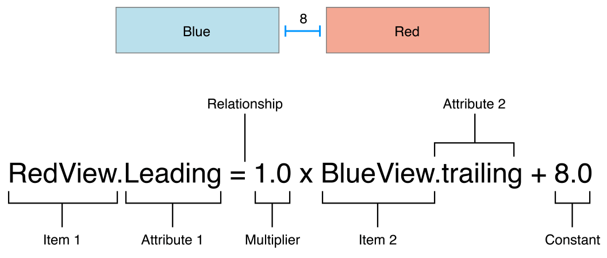
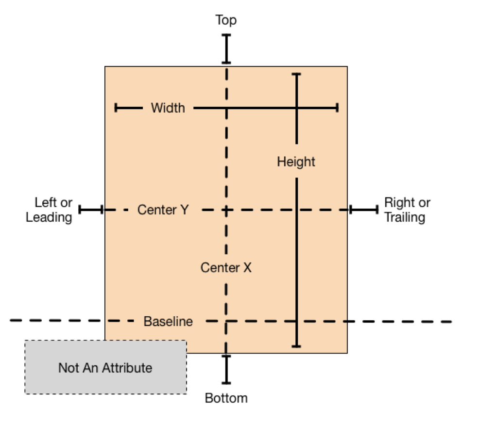
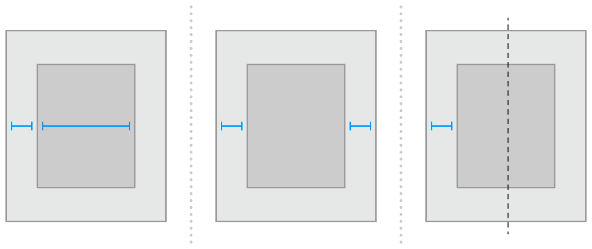
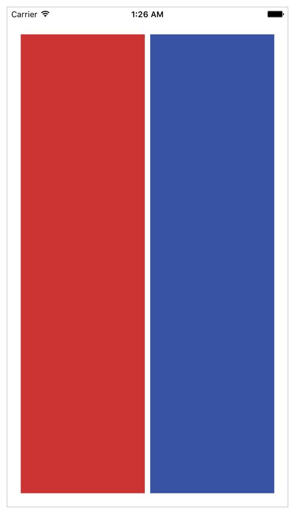
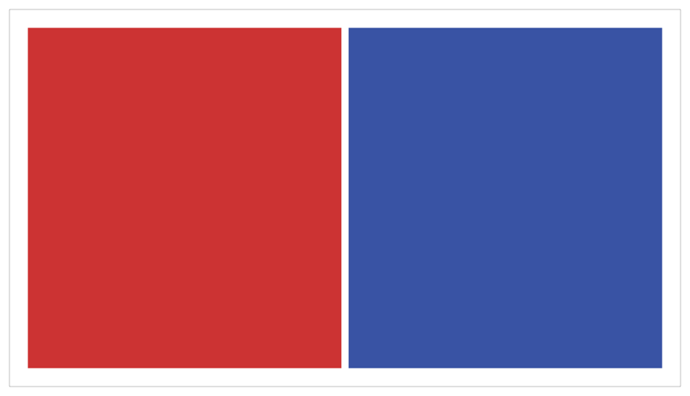
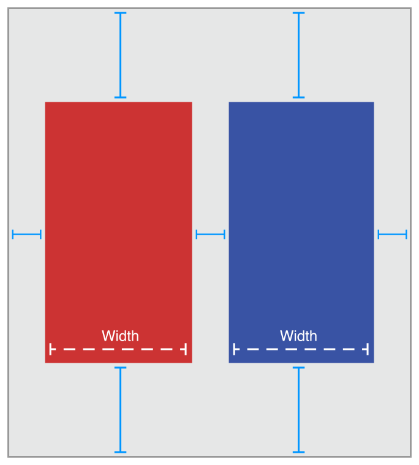
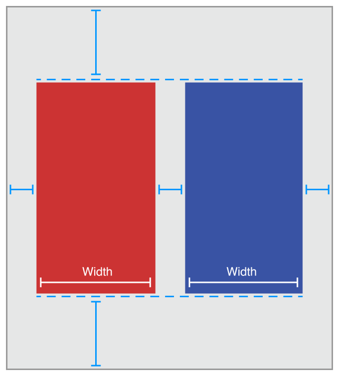
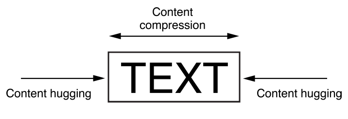

> 导航：[总目录](../../../README.md) · [documentation](../../../_indexes/documentation.md) · [Auto Layout Guide](index.md)

## Anatomy of a Constraint

The layout of your view hierarchy is defined as a series of linear equations. Each constraint represents a single equation. Your goal is to declare a series of equations that has one and only one possible solution.

A sample equation is shown below.

This constraint states that the red view’s leading edge must be 8.0 points after the blue view’s trailing edge. Its equation has a number of parts:

- __Item 1__. The first item in the equation—in this case, the red view. The item must be either a view or a layout guide.
- __Attribute 1__. The attribute to be constrained on the first item—in this case, the red view’s leading edge.
- __Relationship__. The relationship between the left and right sides. The relationship can have one of three values: equal, greater than or equal, or less than or equal. In this case, the left and right side are equal.
- __Multiplier__. The value of attribute 2 is multiplied by this floating point number. In this case, the multiplier is `1.0`.
- __Item 2__. The second item in the equation—in this case, the blue view. Unlike the first item, this can be left blank.
- __Attribute 2__. The attribute to be constrained on the second item—in this case, the blue view’s trailing edge. If the second item is left blank, this must be `Not an Attribute`.
- __Constant__. A constant, floating-point offset—in this case, `8.0`. This value is added to the value of attribute 2.

Most constraints define a relationship between two items in our user interface. These items can represent either views or layout guides. Constraints can also define the relationship between two different attributes of a single item, for example, setting an aspect ratio between an item’s height and width. You can also assign constant values to an item’s height or width. When working with constant values, the second item is left blank, the second attribute is set to `Not An Attribute`, and the multiplier is set to `0.0`.

### Auto Layout Attributes

In Auto Layout, the attributes define a feature that can be constrained. In general, this includes the four edges (leading, trailing, top, and bottom), as well as the height, width, and vertical and horizontal centers. Text items also have one or more baseline attributes.

For the complete list of attributes, see the [NSLayoutAttribute](https://developer.apple.com/documentation/uikit/nslayoutattribute) enum.

> [!NOTE]
> 

### Sample Equations

The wide range of parameters and attributes available to these equations lets you create many different types of constraints. You can define the space between views, align the edge of views, define the relative size of two views, or even define a view’s aspect ratio. However, not all attributes are compatible.

There are two basic types of attributes. Size attributes (for example, Height and Width) and location attributes (for example, Leading, Left, and Top). Size attributes are used to specify how large an item is, without any indication of its location. Location attributes are used to specify the location of an item relative to something else. However, they carry no indication of the item’s size.

With these differences in mind, the following rules apply:

- You cannot constrain a size attribute to a location attribute.
- You cannot assign constant values to location attributes.
- You cannot use a nonidentity multiplier (a value other than 1.0) with location attributes.
- For location attributes, you cannot constrain vertical attributes to horizontal attributes.
- For location attributes, you cannot constrain Leading or Trailing attributes to Left or Right attributes.

For example, setting an item’s Top to the constant value 20.0 has no meaning without additional context. You must always define an item’s location attributes in relation to other items, for example, 20.0 points below the superview’s Top. However, setting an item’s Height to 20.0 is perfectly valid. For more information, see [Interpreting Values](#apple-f4xwc4dqnrsv64tfmyxwi33df52wszbpkridimbqgeydqnjtfvbuqojnknltemq).

Listing 3-1 shows sample equations for a variety of common constraints.

> [!NOTE]
> 

__Listing 3-1__Sample equations for common constraints

1. `// Setting a constant height`
2. `View.height = 0.0 * NotAnAttribute + 40.0`
4. `// Setting a fixed distance between two buttons`
5. `Button_2.leading = 1.0 * Button_1.trailing + 8.0`
7. `// Aligning the leading edge of two buttons`
8. `Button_1.leading = 1.0 * Button_2.leading + 0.0`
10. `// Give two buttons the same width`
11. `Button_1.width = 1.0 * Button_2.width + 0.0`
13. `// Center a view in its superview`
14. `View.centerX = 1.0 * Superview.centerX + 0.0`
15. `View.centerY = 1.0 * Superview.centerY + 0.0`
17. `// Give a view a constant aspect ratio`
18. `View.height = 2.0 * View.width + 0.0`

### Equality, Not Assignment

It’s important to note that the equations shown in Note represent equality, not assignment.

When Auto Layout solves these equations, it does not just assign the value of the right side to the left. Instead, it calculates the value for both attribute 1 and attribute 2 that makes the relationship true. This means we can often freely reorder the items in the equation. For example, the equations in Listing 3-2 are identical to their counterparts in Note.

__Listing 3-2__Inverted equations

1. `// Setting a fixed distance between two buttons`
2. `Button_1.trailing = 1.0 * Button_2.leading - 8.0`
4. `// Aligning the leading edge of two buttons`
5. `Button_2.leading = 1.0 * Button_1.leading + 0.0`
7. `// Give two buttons the same width`
8. `Button_2.width = 1.0 * Button.width + 0.0`
10. `// Center a view in its superview`
11. `Superview.centerX = 1.0 * View.centerX + 0.0`
12. `Superview.centerY = 1.0 * View.centerY + 0.0`
14. `// Give a view a constant aspect ratio`
15. `View.width = 0.5 * View.height + 0.0`

> [!NOTE]
> 

You will find that Auto Layout frequently provides multiple ways to solve the same problem. Ideally, you should choose the solution that most clearly describes your intent. However, different developers will undoubtedly disagree about which solution is best. Here, being consistent is better than being right. You will experience fewer problems in the long run if you choose an approach and always stick with it. For example, this guide uses the following rules of thumb:

1. Whole number multipliers are favored over fractional multipliers.
2. Positive constants are favored over negative constants.
3. Wherever possible, views should appear in layout order: leading to trailing, top to bottom.

### Creating Nonambiguous, Satisfiable Layouts

When using Auto Layout, the goal is to provide a series of equations that have one and only one possible solution. Ambiguous constraints have more than one possible solution. Unsatisfiable constraints don’t have valid solutions.

In general, the constraints must define both the size and the position of each view. Assuming the superview’s size is already set (for example, the root view of a scene in iOS), a nonambiguous, satisfiable layout requires two constraints per view per dimension (not counting the superview). However, you have a wide range of options when it comes to choosing which constraints you want to use. For example, the following three layouts all produce nonambiguous, satisfiable layouts (only the horizontal constraints are shown):

- The first layout constrains the view’s leading edge relative to its superview’s leading edge. It also gives the view a fixed width. The position of the trailing edge can then be calculated based on the superview’s size and the other constraints.
- The second layout constrains the view’s leading edge relative to its superview’s leading edge. It also constrains the view’s trailing edge relative to the superview’s trailing edge. The view’s width can then be calculated based on the superview’s size and the other constraints.
- The third layout constrains the view’s leading edge relative to its superview’s leading edge. It also center aligns the view and superview. Both the width and trailing edge’s position can then be calculated based on the superview’s size and the other constraints.

Notice that each layout has one view and two horizontal constraints. In each case, the constraints fully define both the width and the horizontal position of the view. That means all of the layouts produce a nonambiguous, satisfiable layout along the horizontal axis. However, these layouts are not equally useful. Consider what happens when the superview’s width changes.

In the first layout, the view’s width does not change. Most of the time, this is not what you want. In fact, as a general rule, you should avoid assigning constant sizes to views. Auto Layout is designed to create layouts that dynamically adapt to their environment. Whenever you give a view a fixed size, you short circuiting that ability.

It may not be obvious, but the second and third layouts produce identical behaviors: They both maintain a fixed margin between the view and its superview as the superview’s width changes. However, they are not necessarily equal. In general, the second example is easier to understand, but the third example may be more useful, especially when you are center aligning a number of items. As always, choose the best approach for your particular layout.

Now consider something a little more complicated. Imagine you want to display two views, side by side, on an iPhone. You want to make sure that they have a nice margin on all sides and that they always have the same width. They should also correctly resize as the device rotates.

The following illustrations show the views, in portrait and landscape orientation:

So what should these constraints look like? The following illustration shows one straightforward solution:

The above solution uses the following constraints:

1. `// Vertical Constraints`
2. `Red.top = 1.0 * Superview.top + 20.0`
3. `Superview.bottom = 1.0 * Red.bottom + 20.0`
4. `Blue.top = 1.0 * Superview.top + 20.0`
5. `Superview.bottom = 1.0 * Blue.bottom + 20.0`
7. `// Horizontal Constraints`
8. `Red.leading = 1.0 * Superview.leading + 20.0`
9. `Blue.leading = 1.0 * Red.trailing + 8.0`
10. `Superview.trailing = 1.0 * Blue.trailing + 20.0`
11. `Red.width = 1.0 * Blue.width + 0.0`

Following the earlier rule of thumb, this layout has two views, four horizontal constraints, and four vertical constraints. While this isn’t an infallible guide, it is a quick indication that you’re on the right track. More importantly, the constraints uniquely specify both the size and the location of both of the views, producing a nonambiguous, satisfiable layout. Remove any of these constraints, and the layout becomes ambiguous. Add additional constraints, and you risk introducing conflicts.

Still, this is not the only possible solution. Here is an equally valid approach:

Instead of pinning the top and bottom of the blue box to its superview, you align the top of the blue box with the top of the red box. Similarly, you align the bottom of the blue box with the bottom of the red box. The constraints are shown below.

1. `// Vertical Constraints`
2. `Red.top = 1.0 * Superview.top + 20.0`
3. `Superview.bottom = 1.0 * Red.bottom + 20.0`
4. `Red.top = 1.0 * Blue.top + 0.0`
5. `Red.bottom = 1.0 * Blue.bottom + 0.0`
7. `//Horizontal Constraints`
8. `Red.leading = 1.0 * Superview.leading + 20.0`
9. `Blue.leading = 1.0 * Red.trailing + 8.0`
10. `Superview.trailing = 1.0 * Blue.trailing + 20.0`
11. `Red.width = 1.0 * Blue.width + 0.0`

The example still has two views, four horizontal constraints, and four vertical constraints. It still produces a nonambiguous, satisfiable layout.

> [!NOTE]
> 

### Constraint Inequalities

So far, all of the samples have shown constraints as equalities, but this is only part of the story. Constraints can represent inequalities as well. Specifically, the constraint’s relationship can be equal to, greater than or equal to, or less than or equal to.

For example, you can use constraints to define the minimum or maximum size for a view (Listing 3-3).

__Listing 3-3__Assigning a minimum and maximum size

1. `// Setting the minimum width`
2. `View.width >= 0.0 * NotAnAttribute + 40.0`
4. `// Setting the maximum width`
5. `View.width <= 0.0 * NotAnAttribute + 280.0`

As soon as you start using inequalities, the two constraints per view per dimension rule breaks down. You can always replace a single equality relationship with two inequalities. In Listing 3-4, the single equal relationship and the pair of inequalities produce the same behavior.

__Listing 3-4__Replacing a single equal relationship with two inequalities

1. `// A single equal relationship`
2. `Blue.leading = 1.0 * Red.trailing + 8.0`
4. `// Can be replaced with two inequality relationships`
5. `Blue.leading >= 1.0 * Red.trailing + 8.0`
6. `Blue.leading <= 1.0 * Red.trailing + 8.0`

The inverse is not always true, because two inequalities are not always equivalent to a single equals relationship. For example, the inequalities in [Listing 3-3](#apple-f4xwc4dqnrsv64tfmyxwi33df52wszbpkridimbqgeydqnjtfvbuqojnknltcma) limit the range of possible values for the view’s width—but by themselves, they do not define the width. You still need additional horizontal constraints to define the view’s position and size within this range.

### Constraint Priorities

By default, all constraints are required. Auto Layout must calculate a solution that satisfies all the constraints. If it cannot, there is an error. Auto Layout prints information about the unsatisfiable constraints to the console, and chooses one of the constraints to break. It then recalculates the solution without the broken constraint. For more information, see [Unsatisfiable Layouts](ConflictingLayouts.md#apple-f4xwc4dqnrsv64tfmyxwi33df52wszbpkridimbqgeydqnjtfvbuqmjzfvjvomi).

You can also create optional constraints. All constraints have a priority between 1 and 1000. Constraints with a priority of 1000 are required. All other constraints are optional.

When calculating solutions, Auto Layout attempts to satisfy all the constraints in priority order from highest to lowest. If it cannot satisfy an optional constraint, that constraint is skipped and it continues on to the next constraint.

Even if an optional constraint cannot be satisfied, it can still influence the layout. If there is any ambiguity in the layout after skipping the constraint, the system selects the solution that comes closest to the constraint. In this way, unsatisfied optional constraints act as a force pulling views towards them.

Optional constraints and inequalities often work hand-in-hand. For example, in [Listing 3-4](#apple-f4xwc4dqnrsv64tfmyxwi33df52wszbpkridimbqgeydqnjtfvbuqojnknlts) you can provide different priorities for the two inequalities. The greater-than-or-equal relationship could be required (priority of 1000), and the less-than-or-equal relationship has a lower priority (priority 250). This means that the blue view cannot be closer than 8.0 points from the red. However, other constraints could pull it farther away. Still, the optional constraint pulls the blue view towards the red view, ensuring that it is as close as possible to the 8.0-point spacing, given the other constraints in the layout.

> [!NOTE]
> 

### Intrinsic Content Size

So far, all of the examples have used constraints to define both the view’s position and its size. However, some views have a natural size given their current content. This is referred to as their _intrinsic content size_. For example, a button’s intrinsic content size is the size of its title plus a small margin.

Not all views have an intrinsic content size. For views that do, the intrinsic content size can define the view’s height, its width, or both. Some examples are listed in Table 3-1.

__Table 3-1__Intrinsic content size for common controls

| View | Intrinsic content size |
| --- | --- |
| UIView and NSView | No intrinsic content size. |
| Sliders | Defines only the width (iOS).  Defines the width, the height, or both—depending on the slider’s type (OS X). |
| Labels, buttons, switches, and text fields | Defines both the height and the width. |
| Text views and image views | Intrinsic content size can vary. |

The intrinsic content size is based on the view’s current content. A label or button’s intrinsic content size is based on the amount of text shown and the font used. For other views, the intrinsic content size is even more complex. For example, an empty image view does not have an intrinsic content size. As soon as you add an image, though, its intrinsic content size is set to the image’s size.

A text view’s intrinsic content size varies depending on the content, on whether or not it has scrolling enabled, and on the other constraints applied to the view. For example, with scrolling enabled, the view does not have an intrinsic content size. With scrolling disabled, by default the view’s intrinsic content size is calculated based on the size of the text without any line wrapping. For example, if there are no returns in the text, it calculates the height and width needed to layout the content as a single line of text. If you add constraints to specify the view’s width, the intrinsic content size defines the height required to display the text given its width.

Auto Layout represents a view’s intrinsic content size using a pair of constraints for each dimension. The content hugging pulls the view inward so that it fits snugly around the content. The compression resistance pushes the view outward so that it does not clip the content.

These constraints are defined using the inequalities shown in Listing 3-5. Here, the `IntrinsicHeight` and `IntrinsicWidth` constants represent the height and width values from the view’s intrinsic content size.

__Listing 3-5__Compression-Resistance and Content-Hugging equations

1. `// Compression Resistance`
2. `View.height >= 0.0 * NotAnAttribute + IntrinsicHeight`
3. `View.width >= 0.0 * NotAnAttribute + IntrinsicWidth`
5. `// Content Hugging`
6. `View.height <= 0.0 * NotAnAttribute + IntrinsicHeight`
7. `View.width <= 0.0 * NotAnAttribute + IntrinsicWidth`

Each of these constraints can have its own priority. By default, views use a 250 priority for their content hugging, and a 750 priority for their compression resistance. Therefore, it’s easier to stretch a view than it is to shrink it. For most controls, this is the desired behavior. For example, you can safely stretch a button larger than its intrinsic content size; however, if you shrink it, its content may become clipped. Note that Interface Builder may occasionally modify these priorities to help prevent ties. For more information, see [Setting Content-Hugging and Compression-Resistance Priorities](WorkingwithConstraintsinInterfaceBuidler.md#apple-f4xwc4dqnrsv64tfmyxwi33df52wszbpkridimbqgeydqnjtfvbuqmjqfvjvomq).

Whenever possible, use the view’s intrinsic content size in your layout. It lets your layout dynamically adapt as the view’s content changes. It also reduces the number of constraints you need to create a nonambiguous, nonconflicting layout, but you will need to manage the view’s content-hugging and compression-resistance (CHCR) priorities. Here are some guidelines for handling intrinsic content sizes:

- When stretching a series of views to fill a space, if all the views have an identical content-hugging priority, the layout is ambiguous. Auto Layout doesn’t know which view should be stretched.

  A common example is a label and text field pair. Typically, you want the text field to stretch to fill the extra space while the label remains at its intrinsic content size. To ensure this, make sure the text field’s horizontal content-hugging priority is lower than the label’s.

  In fact, this example is so common that Interface Builder automatically handles it for you, setting the content-hugging priority for all labels to 251. If you are programmatically creating the layout, you need to modify the content-hugging priority yourself.
- Odd and unexpected layouts often occur when views with invisible backgrounds (like buttons or labels) are accidentally stretched beyond their intrinsic content size. The actual problem may not be obvious, because the text simply appears in the wrong location. To prevent unwanted stretching, increase the content-hugging priority.
- Baseline constraints work only with views that are at their intrinsic content height. If a view is vertically stretched or compressed, the baseline constraints no longer align properly.
- Some views, like switches, should always be displayed at their intrinsic content size. Increase their CHCR priorities as needed to prevent stretching or compressing.
- Avoid giving views required CHCR priorities. It’s usually better for a view to be the wrong size than for it to accidentally create a conflict. If a view should always be its intrinsic content size, consider using a very high priority (999) instead. This approach generally keeps the view from being stretched or compressed but still provides an emergency pressure valve, just in case your view is displayed in an environment that is bigger or smaller than you expected.

### Intrinsic Content Size Versus Fitting Size

The intrinsic content size acts as an input to Auto Layout. When a view has an intrinsic content size, the system generates constraints to represent that size and the constraints are used to calculate the layout.

The fitting size, on the other hand, is an output from the Auto Layout engine. It is the size calculated for a view based on the view’s constraints. If the view lays out its subviews using Auto Layout, then the system may be able to calculate a fitting size for the view based on its content.

The stack view is a good example. Barring any other constraints, the system calculates the stack view’s size based on its content and attributes. In many ways, the stack view acts as if it had an intrinsic content size: You can create a valid layout using only a single vertical and a single horizontal constraint to define its position. But its size is calculated by Auto Layout—it is not an input into Auto Layout. Setting the stack view’s CHCR priorities has no effect, because the stack view does not have an intrinsic content size.

If you need to adjust the stack view’s fitting size relative to items outside the stack view, either create explicit constraints to capture those relationships or modify the CHCR priorities of the stack’s contents relative to the items outside the stack.

### Interpreting Values

Values in Auto Layout are always in points. However, the exact meaning of these measurements can vary depending on the attributes involved and the view’s layout direction.

| Auto Layout Attributes | Value | Notes |
| --- | --- | --- |
| image: ../Art/ALGuide_Height.pdfHeight  image: ../Art/ALGuide_Width.pdfWidth | The size of the view. | These attributes can be assigned constant values or combined with other Height and Width attributes. These values cannot be negative. |
| image: ../Art/ALGuide_TopToSuper.pdfTop  image: ../Art/ALGuide_BottomToSuper.pdfBottom  image: ../Art/ALGuide_AlignMiddle.pdfBaseline | The values increase as you move down the screen. | These attributes can be combined only with Center Y, Top, Bottom, and Baseline attributes. |
| image: ../Art/ALGuide_LeftToSuper.pdfLeading  image: ../Art/ALGuide_RightToSuper.pdfTrailing | The values increase as you move towards the trailing edge. For a left-to-right layout directions, the values increase as you move to the right. For a right-to-left layout direction, the values increase as you move left. | These attributes can be combined only with Leading, Trailing, or Center X attributes. |
| image: ../Art/ALGuide_LeftToSuper.pdfLeft  image: ../Art/ALGuide_RightToSuper.pdfRight | The values increase as you move to the right. | These attributes can be combined only with Left, Right, and Center X attributes.  Avoid using Left and Right attributes. Use Leading and Trailing instead. This allows the layout to adapt to the view’s reading direction.  By default the reading direction is determined based on the current language set by the user. However, you can override this where necessary. In iOS, set the [semanticContentAttribute](https://developer.apple.com/documentation/uikit/uiview/1622461-semanticcontentattribute) property on the view holding the constraint (the nearest common ancestor of all views affected by the constraint) to specify whether the content’s layout should be flipped when switching between left-to-right and right-to-left languages. |
| image: ../Art/ALGuide_AlignCenter.pdfCenter X  image: ../Art/ALGuide_AlignMiddle.pdfCenter Y | The interpretation is based on the other attribute in the equation. | Center X can be combined with Center X, Leading, Trailing, Right, and Left attributes.  Center Y can be combined with Center Y, Top, Bottom, and Baseline attributes. |

[Auto Layout Without Constraints](AutoLayoutWithoutConstraints.md#apple-f4xwc4dqnrsv64tfmyxwi33df52wszbpkridimbqgeydqnjtfvbuqobnknltc)

[Working with Constraints in Interface Builder](WorkingwithConstraintsinInterfaceBuidler.md#apple-f4xwc4dqnrsv64tfmyxwi33df52wszbpkridimbqgeydqnjtfvbuqmjqfvjvomi)
