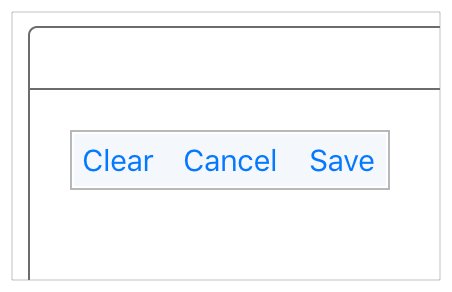
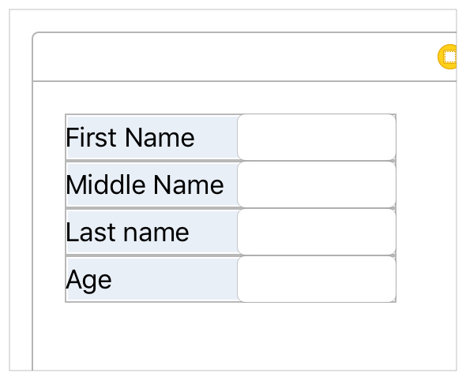

> 导航：[总目录](../../../README.md) · [documentation](../../../_indexes/documentation.md) · [Auto Layout Guide](index.md)

## Auto Layout Without Constraints

Stack views provide an easy way to leverage the power of Auto Layout without introducing the complexity of constraints. A single stack view defines a row or column of user interface elements. The stack view arranges these elements based on its properties.

- [axis](https://developer.apple.com/documentation/uikit/uistackview/1616223-axis): ([UIStackView](https://developer.apple.com/documentation/uikit/uistackview) only) defines the stack view’s orientation, either vertical or horizontal.
- [orientation](https://developer.apple.com/documentation/appkit/nsstackview/1488950-orientation): ([NSStackView](https://developer.apple.com/documentation/appkit/nsstackview) only) defines the stack view’s orientation, either vertical or horizontal.
- [distribution](https://developer.apple.com/documentation/uikit/uistackview/1616233-distribution): defines the layout of the views along the axis.
- [alignment](https://developer.apple.com/documentation/uikit/uistackview/1616243-alignment): defines the layout of the views perpendicular to the stack view’s axis.
- [spacing](https://developer.apple.com/documentation/uikit/uistackview/1616225-spacing): defines the space between adjacent views.

To use a stack view, in Interface Builder drag either a vertical or horizontal stack view onto the canvas. Then drag out the content and drop it into the stack.

If an object has an intrinsic content size, it appears in the stack at that size. If it does not have an intrinsic content size, Interface Builder provides a default size. You can resize the object, and Interface Builder adds constraints to maintain its size.

To further fine-tune the layout, you can modify the stack view’s properties using the Attributes inspector. For example, the following example uses an 8-point spacing and a Fills Equally distribution.

The stack view also bases its layout on the arranged views’ content-hugging and compression-resistance priorities. You can modify these using the Size inspector.

> [!NOTE]
> 

Additionally, you can nest stack views inside other stack views to build more complex layouts.

In general, use stack views to manage as much of your layout as possible. Resort to creating constraints only when you cannot achieve your goals with stack views alone.

For more information on using stack views, see _[UIStackView Class Reference](https://developer.apple.com/documentation/uikit/uistackview)_ or _[NSStackView Class Reference](https://developer.apple.com/documentation/appkit/nsstackview)_.

> [!NOTE]
> 

[Understanding Auto Layout](index.md#apple-f4xwc4dqnrsv64tfmyxwi33df52wszbpkridimbqgeydqnjtfvbuqnznknltc)

[Anatomy of a Constraint](AnatomyofaConstraint.md#apple-f4xwc4dqnrsv64tfmyxwi33df52wszbpkridimbqgeydqnjtfvbuqojnknltc)
